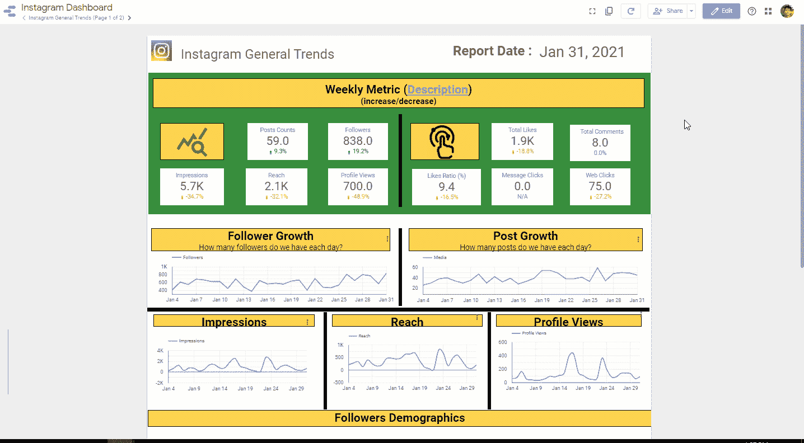
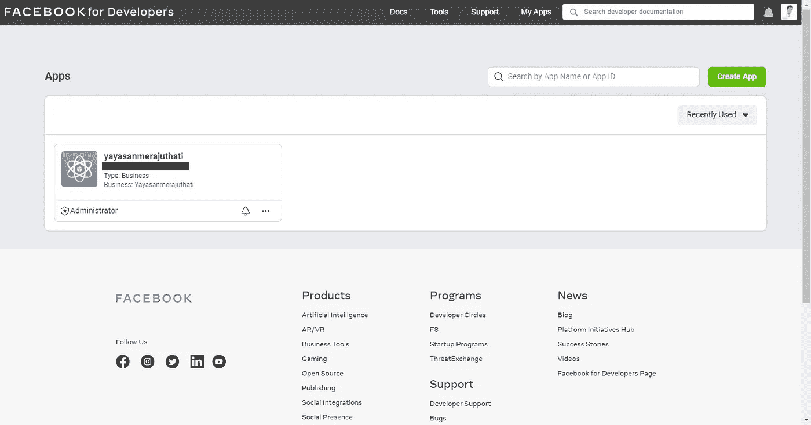
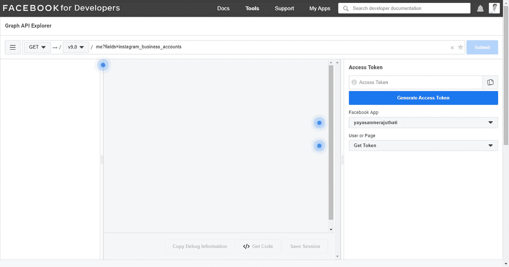
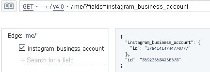
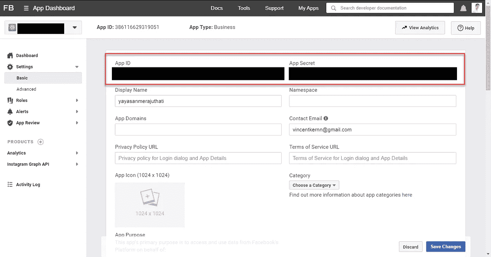
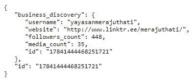
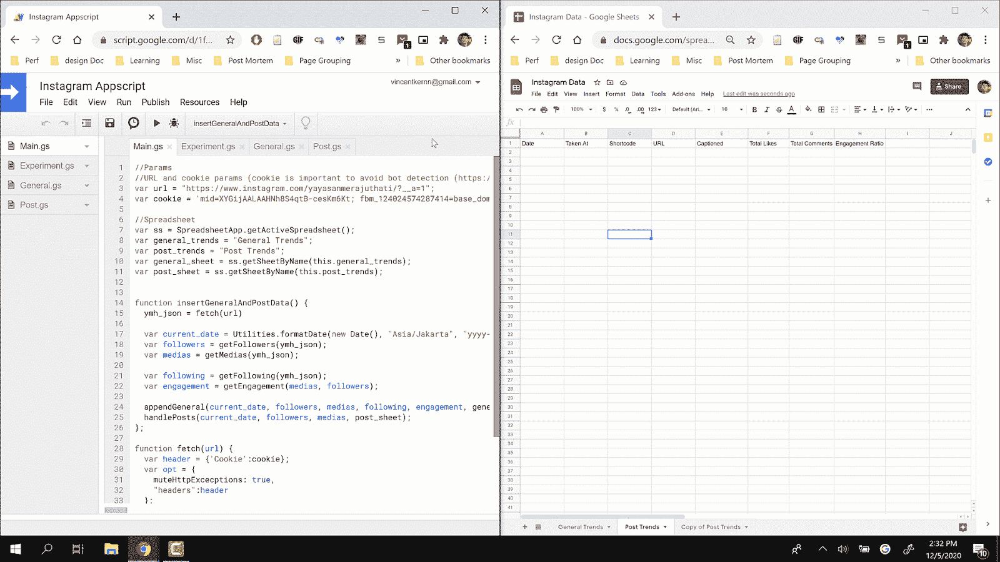

# 为 Instagram Business 访问脸书 API

> 原文：<https://towardsdatascience.com/accessing-facebook-api-for-instagram-business-568cfe3efb77?source=collection_archive---------19----------------------->

## 供个人使用的社交媒体分析技巧

## 为企业可靠提取 Instagram 数据的经验


来源( [unsplash](https://unsplash.com/photos/i_xVfNtQjwI) )

> *我的追随者增长一直停滞不前。为什么？*
> 
> *我该怎么做才能吸引我的追随者？*
> 
> 节选自我之前的帖子( ***“建立你的 Instagram 业务的最快分析”*** )

# 问题陈述

假设你是一个开了一家花店的企业主。为了宣传您的新企业，您激动地注册了 Instagram 企业帐户。

仅仅一个月，你的追随者就增加到了 200 人。你确信你的帖子非常吸引人。所以你推动自己创造更多的内容，期待类似的增长。

但到了下一季度，你并没有获得你预期的高增长。看起来你不再推送吸引人的内容了。

那么问题是什么呢？你会怎么解决？你将如何有效地与你的追随者互动？

> *进入 Instagram Analytics*

# Instagram 抓取的限制

上周，我重点介绍了一个方法，使用一个简单的 REST 调用快速抓取 Instagram 数据。除了会遇到一些限制之外，这种方法工作得很好:

1.  无法从与趋势相关的帖子或故事中获取数据。
2.  缺少其他关键指标数据，如展示次数和覆盖范围。

如果你想对 Instagram 数据进行更彻底的分析，我建议你使用 [Instagram Graph API](https://developers.facebook.com/docs/instagram-api/guides/business-discovery) [访问 Instagram 数据并利用你的商业账户。](https://developers.facebook.com/docs/instagram-api/guides/business-discovery)

> Instagram Graph API 允许 [Instagram 专业人士](https://help.instagram.com/502981923235522?fbclid=IwAR2OQQ-lc5ByPuLgdHafXBKJr9sw4EImf_pOoB8y1la4LCqUcYa4Llfi0mg)——企业和创作者——使用你的应用管理他们在 Instagram 上的存在。该 API 可用于获取和发布他们的媒体，管理和回复他们媒体上的评论，识别他们被其他 Instagram 用户@提及的媒体，查找带标签的媒体，以及获取关于其他 Instagram 企业和创作者的基本元数据和指标。— [脸书文件](https://developers.facebook.com/docs/instagram-api/)



这些数据将用于创建 Instagram 仪表盘；[更多背景信息](/the-quickest-analytics-to-build-your-instagram-business-b7b3c5d68056)(来源作者。)

# 什么是 Instagram 商业账户？

> Instagram 商业帐户将您的 Instagram 帐户转变为品牌帐户，以了解故事、帖子和关注者。— [商务 Instagram](https://business.instagram.com/getting-started)

**转换成企业账户有几个好处:**

1.  实时访问您帖子的绩效指标
2.  包括描述性配置文件字段，如位置和移动电话。
3.  在 ***【品牌】*** 下从 Instagram 推荐中获取促销。

注册过程很简单。I[n 插入您的业务详情](https://www.facebook.com/business/learn/lessons/a-beginners-guide-to-instagram-for-business)并在获得批准后登录。

# 使用脸书 API 访问您的 Instagram 数据

## 创建您的开发者帐户



在指定数据之前，您需要在[脸书开发者 API](https://developers.facebook.com/?no_redirect=1) 中注册并创建一个开发者账户。

这允许 Instagram 验证您的应用程序并建立连接以使用他们的数据服务。请遵循脸书指南中关于如何注册开发者账户[的说明。](https://developers.facebook.com/docs/development/create-an-app)

## 查找您的业务 ID 和令牌



你可以在[脸书图形 API 浏览器](https://developers.facebook.com/tools/explorer/)中找到你所有的 API 访问控制。

在浏览器中，点击 ***“生成访问令牌”*** 并运行以下查询以获取您的脸书业务 ID。

```
me?fields=instagram_business_accounts
```



接收 Instagram 商业帐户 ID

> 注意:此令牌是短期的，将在一天内到期。您需要按照下面的说明来生成长期访问令牌。

# 获取长期访问令牌

运行以下代码以访问长期访问令牌

```
https://graph.facebook.com/v9.0/oauth/access_token?grant_type=fb_exchange_token&client_id=<**client_id**>&client_secret=<**client_secret**>&fb_exchange_token=<**Short_lived_token**>Sample LONG lived token generated(modified for privacy): EAAPLSSSSSSSSSSSSSSSSSSSSSSSSSSSSSSSSSSSSSSSSSSSSSSSSSSSSSSSSSSSSSSSSSSSbeaXRGRcBpBQBvVmVf725TxZAFrkU4l1abDNCsZAJIhzobkXHH1mxwCSpZAAoE9uyfTFvIKu6vpRkxDwZBzXtZBd5XXNxDZCoaZCd2W34tHr7RvM
```

**这里注意，你需要包括 3 个参数:**

*   **client_id** :你的应用标识符。你可以很容易地在你的 FB 开发者应用设置的基本设置中找到它
*   **client_secret** :你的应用认证的秘密令牌。你可以很容易地在你的 FB 开发者应用设置的基本设置中找到它
*   **短命令牌**:您在上一步中使用[脸书图形 API 浏览器](https://developers.facebook.com/tools/explorer/)生成的令牌



在那里你可以找到你的客户 ID 和客户秘密(来源于作者)

# 请求脸书图表数据

一旦我们有了所有这些信息，我们就可以运行基本的 POST/GET 请求，正如在 [Instagram Graph API](https://developers.facebook.com/docs/instagram-api/) 中提到的

最好开始的服务是**insta gram Graph business discovery API**。请随意复制这个 Google [电子表格](https://docs.google.com/spreadsheets/d/19AEpRBlKnfo7B34JQzj2qWLp2RsCZTSfEEyR8QmFNkw/edit#gid=44552427)并检查 Google Appscript 代码。

## **用户趋势数据:**

```
[https://graph.facebook.com/{business_id}?fields=business_discovery.username(instagram_id){username,website,followers_count,media_count}&access_token=](https://graph.facebook.com/17841444468251721?fields=business_discovery.username(yayasanmerajuthati){username,website,followers_count,media_count}&access_token=EAAPLSLMjcEoBAJbrqs9m3nPhwUaLMwiHmQ4zYKU7jsiB325KNS0H3KE8VK9fq1CHpgLDZCLDbeaXRGRcBpBQBvVmVf725TxZAFrkU4l1abDNCsZAJIhzobkXHH1mxwCSpZAAoE9uyfTFvIKu6vpRkxDwZBzXtZBd5XXNxDZCoaZCd2W34tHr7RvM)[{](https://graph.facebook.com/v9.0/18151326238114763/insights?metric=engagement,impressions,reach,saved,video_views&access_token=EAAPLSLMjcEoBAJbrqs9m3nPhwUaLMwiHmQ4zYKU7jsiB325KNS0H3KE8VK9fq1CHpgLDZCLDbeaXRGRcBpBQBvVmVf725TxZAFrkU4l1abDNCsZAJIhzobkXHH1mxwCSpZAAoE9uyfTFvIKu6vpRkxDwZBzXtZBd5XXNxDZCoaZCd2W34tHr7RvM)access_token}**Parameters:
business_id**: the business ID from Instagram Explorer
**instagram_id**: the instagram account (check the instagram account URL or your business profile)
**access_token**: short lived or long lived token which you generate
```

一旦您替换了参数并运行它，您将收到 JSON 字符串，您可以进一步解析和分解它的路径组件:



访问 Instagram 业务发现 API

# 我应该知道的其他请求是什么？

## **发布趋势数据:**

**目的:**提取所有帖子趋势，包括喜欢和评论

```
[https://graph.facebook.com/](https://graph.facebook.com/17841444468251721?fields=business_discovery.username(yayasanmerajuthati){media.limit(100000){caption,timestamp,permalink,comments_count,like_count}}&period=lifetime&access_token=EAAPLSLMjcEoBAJbrqs9m3nPhwUaLMwiHmQ4zYKU7jsiB325KNS0H3KE8VK9fq1CHpgLDZCLDbeaXRGRcBpBQBvVmVf725TxZAFrkU4l1abDNCsZAJIhzobkXHH1mxwCSpZAAoE9uyfTFvIKu6vpRkxDwZBzXtZBd5XXNxDZCoaZCd2W34tHr7RvM)[{business_id}](https://graph.facebook.com/17841444468251721?fields=business_discovery.username(yayasanmerajuthati){username,website,followers_count,media_count}&access_token=EAAPLSLMjcEoBAJbrqs9m3nPhwUaLMwiHmQ4zYKU7jsiB325KNS0H3KE8VK9fq1CHpgLDZCLDbeaXRGRcBpBQBvVmVf725TxZAFrkU4l1abDNCsZAJIhzobkXHH1mxwCSpZAAoE9uyfTFvIKu6vpRkxDwZBzXtZBd5XXNxDZCoaZCd2W34tHr7RvM)[?fields=business_discovery.username(](https://graph.facebook.com/17841444468251721?fields=business_discovery.username(yayasanmerajuthati){media.limit(100000){caption,timestamp,permalink,comments_count,like_count}}&period=lifetime&access_token=EAAPLSLMjcEoBAJbrqs9m3nPhwUaLMwiHmQ4zYKU7jsiB325KNS0H3KE8VK9fq1CHpgLDZCLDbeaXRGRcBpBQBvVmVf725TxZAFrkU4l1abDNCsZAJIhzobkXHH1mxwCSpZAAoE9uyfTFvIKu6vpRkxDwZBzXtZBd5XXNxDZCoaZCd2W34tHr7RvM)[instagram_id](https://graph.facebook.com/17841444468251721?fields=business_discovery.username(yayasanmerajuthati){username,website,followers_count,media_count}&access_token=EAAPLSLMjcEoBAJbrqs9m3nPhwUaLMwiHmQ4zYKU7jsiB325KNS0H3KE8VK9fq1CHpgLDZCLDbeaXRGRcBpBQBvVmVf725TxZAFrkU4l1abDNCsZAJIhzobkXHH1mxwCSpZAAoE9uyfTFvIKu6vpRkxDwZBzXtZBd5XXNxDZCoaZCd2W34tHr7RvM)[){media.limit(100000){caption,timestamp,permalink,comments_count,like_count}}&period=lifetime&access_token=](https://graph.facebook.com/17841444468251721?fields=business_discovery.username(yayasanmerajuthati){media.limit(100000){caption,timestamp,permalink,comments_count,like_count}}&period=lifetime&access_token=EAAPLSLMjcEoBAJbrqs9m3nPhwUaLMwiHmQ4zYKU7jsiB325KNS0H3KE8VK9fq1CHpgLDZCLDbeaXRGRcBpBQBvVmVf725TxZAFrkU4l1abDNCsZAJIhzobkXHH1mxwCSpZAAoE9uyfTFvIKu6vpRkxDwZBzXtZBd5XXNxDZCoaZCd2W34tHr7RvM)[{](https://graph.facebook.com/v9.0/18151326238114763/insights?metric=engagement,impressions,reach,saved,video_views&access_token=EAAPLSLMjcEoBAJbrqs9m3nPhwUaLMwiHmQ4zYKU7jsiB325KNS0H3KE8VK9fq1CHpgLDZCLDbeaXRGRcBpBQBvVmVf725TxZAFrkU4l1abDNCsZAJIhzobkXHH1mxwCSpZAAoE9uyfTFvIKu6vpRkxDwZBzXtZBd5XXNxDZCoaZCd2W34tHr7RvM)access_token}**Note:** You need to add media.limit(10000) to override the default limits and ensure that Facebook does not limit the number of the latest posts
```

## **每日趋势命令:**

**目的:**提取每日个人资料趋势(印象数、到达数、个人资料浏览量)

```
[https://graph.facebook.com/v9.0/](https://graph.facebook.com/v9.0/17841444468251721/insights?metric=impressions,follower_count,profile_views,reach,email_contacts,text_message_clicks,website_clicks&period=day&access_token=EAAPLSLMjcEoBAJbrqs9m3nPhwUaLMwiHmQ4zYKU7jsiB325KNS0H3KE8VK9fq1CHpgLDZCLDbeaXRGRcBpBQBvVmVf725TxZAFrkU4l1abDNCsZAJIhzobkXHH1mxwCSpZAAoE9uyfTFvIKu6vpRkxDwZBzXtZBd5XXNxDZCoaZCd2W34tHr7RvM)[{business_id}](https://graph.facebook.com/17841444468251721?fields=business_discovery.username(yayasanmerajuthati){username,website,followers_count,media_count}&access_token=EAAPLSLMjcEoBAJbrqs9m3nPhwUaLMwiHmQ4zYKU7jsiB325KNS0H3KE8VK9fq1CHpgLDZCLDbeaXRGRcBpBQBvVmVf725TxZAFrkU4l1abDNCsZAJIhzobkXHH1mxwCSpZAAoE9uyfTFvIKu6vpRkxDwZBzXtZBd5XXNxDZCoaZCd2W34tHr7RvM)[/insights?metric=impressions,follower_count,profile_views,reach,email_contacts,text_message_clicks,website_clicks&period=day&access_token=](https://graph.facebook.com/v9.0/17841444468251721/insights?metric=impressions,follower_count,profile_views,reach,email_contacts,text_message_clicks,website_clicks&period=day&access_token=EAAPLSLMjcEoBAJbrqs9m3nPhwUaLMwiHmQ4zYKU7jsiB325KNS0H3KE8VK9fq1CHpgLDZCLDbeaXRGRcBpBQBvVmVf725TxZAFrkU4l1abDNCsZAJIhzobkXHH1mxwCSpZAAoE9uyfTFvIKu6vpRkxDwZBzXtZBd5XXNxDZCoaZCd2W34tHr7RvM)[{](https://graph.facebook.com/v9.0/18151326238114763/insights?metric=engagement,impressions,reach,saved,video_views&access_token=EAAPLSLMjcEoBAJbrqs9m3nPhwUaLMwiHmQ4zYKU7jsiB325KNS0H3KE8VK9fq1CHpgLDZCLDbeaXRGRcBpBQBvVmVf725TxZAFrkU4l1abDNCsZAJIhzobkXHH1mxwCSpZAAoE9uyfTFvIKu6vpRkxDwZBzXtZBd5XXNxDZCoaZCd2W34tHr7RvM)access_token}
```

## **寿命趋势命令:**

**目的:**提取关注者的人口统计信息(年龄/城市/等)

```
[https://graph.facebook.com/v9.0/](https://graph.facebook.com/v9.0/17841444468251721/insights?metric=audience_country,audience_city,audience_gender_age&period=lifetime&access_token=EAAPLSLMjcEoBAJbrqs9m3nPhwUaLMwiHmQ4zYKU7jsiB325KNS0H3KE8VK9fq1CHpgLDZCLDbeaXRGRcBpBQBvVmVf725TxZAFrkU4l1abDNCsZAJIhzobkXHH1mxwCSpZAAoE9uyfTFvIKu6vpRkxDwZBzXtZBd5XXNxDZCoaZCd2W34tHr7RvM)[{business_id}](https://graph.facebook.com/17841444468251721?fields=business_discovery.username(yayasanmerajuthati){username,website,followers_count,media_count}&access_token=EAAPLSLMjcEoBAJbrqs9m3nPhwUaLMwiHmQ4zYKU7jsiB325KNS0H3KE8VK9fq1CHpgLDZCLDbeaXRGRcBpBQBvVmVf725TxZAFrkU4l1abDNCsZAJIhzobkXHH1mxwCSpZAAoE9uyfTFvIKu6vpRkxDwZBzXtZBd5XXNxDZCoaZCd2W34tHr7RvM)[/insights?metric=audience_country,audience_city,audience_gender_age&period=lifetime&access_token=](https://graph.facebook.com/v9.0/17841444468251721/insights?metric=audience_country,audience_city,audience_gender_age&period=lifetime&access_token=EAAPLSLMjcEoBAJbrqs9m3nPhwUaLMwiHmQ4zYKU7jsiB325KNS0H3KE8VK9fq1CHpgLDZCLDbeaXRGRcBpBQBvVmVf725TxZAFrkU4l1abDNCsZAJIhzobkXHH1mxwCSpZAAoE9uyfTFvIKu6vpRkxDwZBzXtZBd5XXNxDZCoaZCd2W34tHr7RvM)[{](https://graph.facebook.com/v9.0/18151326238114763/insights?metric=engagement,impressions,reach,saved,video_views&access_token=EAAPLSLMjcEoBAJbrqs9m3nPhwUaLMwiHmQ4zYKU7jsiB325KNS0H3KE8VK9fq1CHpgLDZCLDbeaXRGRcBpBQBvVmVf725TxZAFrkU4l1abDNCsZAJIhzobkXHH1mxwCSpZAAoE9uyfTFvIKu6vpRkxDwZBzXtZBd5XXNxDZCoaZCd2W34tHr7RvM)access_token}
```

## **帖子具体趋势**

**目的:**提取帖子信息(每个帖子的浏览量、影响范围和参与度)

```
[https://graph.facebook.com/v9.0/](https://graph.facebook.com/v9.0/18151326238114763/insights?metric=engagement,impressions,reach,saved,video_views&access_token=EAAPLSLMjcEoBAJbrqs9m3nPhwUaLMwiHmQ4zYKU7jsiB325KNS0H3KE8VK9fq1CHpgLDZCLDbeaXRGRcBpBQBvVmVf725TxZAFrkU4l1abDNCsZAJIhzobkXHH1mxwCSpZAAoE9uyfTFvIKu6vpRkxDwZBzXtZBd5XXNxDZCoaZCd2W34tHr7RvM)[{media_id}](https://graph.facebook.com/17841444468251721?fields=business_discovery.username(yayasanmerajuthati){username,website,followers_count,media_count}&access_token=EAAPLSLMjcEoBAJbrqs9m3nPhwUaLMwiHmQ4zYKU7jsiB325KNS0H3KE8VK9fq1CHpgLDZCLDbeaXRGRcBpBQBvVmVf725TxZAFrkU4l1abDNCsZAJIhzobkXHH1mxwCSpZAAoE9uyfTFvIKu6vpRkxDwZBzXtZBd5XXNxDZCoaZCd2W34tHr7RvM)[/insights?metric=engagement,impressions,reach,saved,video_views&access_token={](https://graph.facebook.com/v9.0/18151326238114763/insights?metric=engagement,impressions,reach,saved,video_views&access_token=EAAPLSLMjcEoBAJbrqs9m3nPhwUaLMwiHmQ4zYKU7jsiB325KNS0H3KE8VK9fq1CHpgLDZCLDbeaXRGRcBpBQBvVmVf725TxZAFrkU4l1abDNCsZAJIhzobkXHH1mxwCSpZAAoE9uyfTFvIKu6vpRkxDwZBzXtZBd5XXNxDZCoaZCd2W34tHr7RvM)access_token}**Parameter**:
*** media_id**: from the post trends call. For me, I would iterate through all medias that I have and generate the following JSON strings to store.
```

# 结论

在 Instagram 中提取数据是一种以可靠的方式获取数据的有益方式。通过以下方式每天刷新统计数据，可以节省您查看趋势的时间:

1.  与脸书图形 API 建立连接。
2.  运行简单脚本挖掘 Instagram。

正确完成后，您将能够[建立数据分析管道](/the-quickest-analytics-to-build-your-instagram-business-b7b3c5d68056)并按如下方式自动运行您的触发器。



自动化 Instagram 拉脚本(来源于作者)

然后，您可以自由地将 pulls 与任何仪表板工具(如 Google Data Studio)连接起来


> 恭喜你。您已成功免费获取您的 Instagram 数据。
> 
> 更多信息请参考我之前的[帖子](/the-quickest-analytics-to-build-your-instagram-business-b7b3c5d68056)。

# 来自作者的更多提示:

*   [建立 Instagram 业务的最快分析方法](/the-quickest-analytics-to-build-your-instagram-business-b7b3c5d68056)
*   [如何构建您的终极数据科学投资组合](/how-to-build-your-ultimate-data-science-portfolios-ea0414d79a72)
*   [如何在 10 分钟内搭建一个惊艳的互动仪表盘](/how-to-build-a-great-dashboard-ee0518c3d3f7)
*   [谷歌数据工作室的基础](/the-basic-of-google-data-studio-72081f247220)
*   [写作分析的隐藏宝石](/the-hidden-gems-of-writing-analytics-6db78fad5a51)

# 关于作者

我用 ML @ Google 对抗网络钓鱼。

我热爱我的工作是因为我使用先进的 ML 算法和 MLOps 来保护 Chrome、Gmail 和 Android 用户免受网络钓鱼攻击，这些攻击每周都可能窃取弱势群体的生活积蓄。

我也是一名面向数据科学媒体的作家，为全球 50 多万观众的有志 ML 和数据从业者提供指导。

最后，请通过 [LinkedIn](https://www.linkedin.com/in/vincenttatan/?originalSubdomain=sg) 、 [Medium](https://medium.com/@vincentkernn) 或 [Youtube 频道](https://www.youtube.com/channel/UCkdLA9vR9S_SbVKdfWuMyKg)联系我

索利·德奥·格洛丽亚