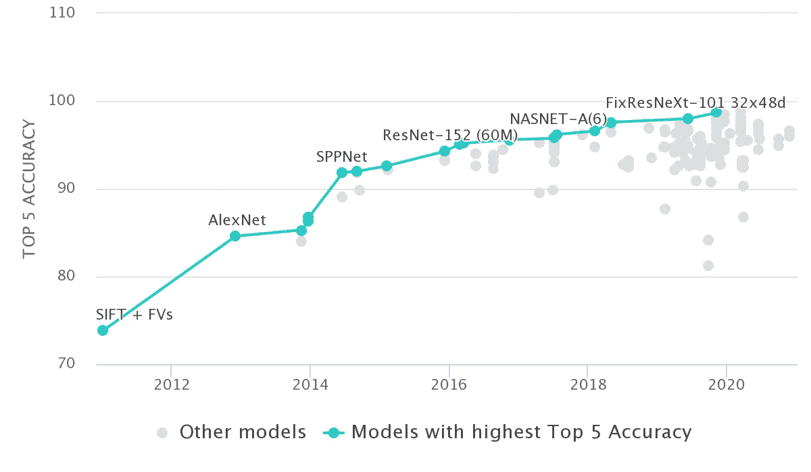
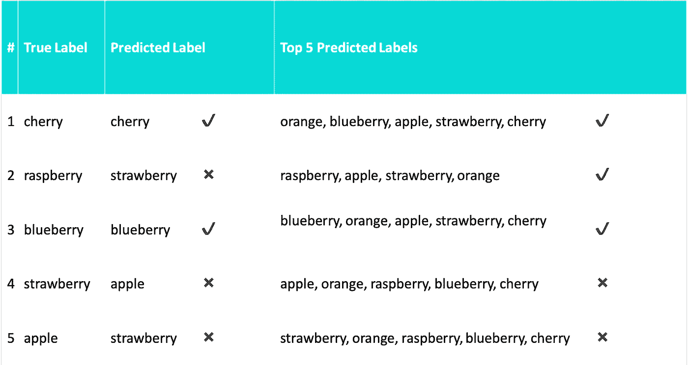

# 准确性和损失:关于前 1 名和前 5 名准确性需要知道的事情

> 原文：<https://towardsdatascience.com/accuracy-and-loss-things-to-know-about-the-top-1-and-top-5-accuracy-1d6beb8f6df3?source=collection_archive---------2----------------------->

## 数据科学

## 衡量我们模型的性能

作者图片

假设我们正在使用深度学习解决一个简单的分类问题。我们将图片(蓝莓)作为模型的输入，得到我们的预测结果(有概率)如下。

*   樱桃:0.35
*   覆盆子:0.25
*   蓝莓:0.2
*   草莓:0.1
*   苹果:0.06
*   橙色:0.04

你将如何评价你的模型？你知道前 1 名和前 5 名准确性之间的区别吗？

*   使用 top-1 精度，您将该输出计为`true`，因为它预测了一个樱桃。
*   使用前 5 名准确度，您将该输出计为`false`，因为蓝莓是前 5 名猜测之一。

我们在 5 幅图像上测试了该模型，得到了以下结果。

作者图片

给定这个例子，我们的模型正确地预测了 2 个图像，并且真实标签在前 5 个预测标签中出现了 3 次。

# 准确(性)

## 什么是准确性？

它是描述算法在分类任务上的准确性的度量之一。准确度是配对样本数除以样本数。

> 准确度=正确预测数/正确预测总数

例如:如果准确率达到 91%，这意味着 100 个例子中有 91 个是正确的。

# 最高精度

最高精度是常规精度，模型预测(概率最高的一个)必须完全是预期的答案。

> 它测量预测标签与单个目标标签匹配的示例的比例。

在我们的例子中，最高精度= 2/5 = 0.4。

# 前 5 名准确度

前 5 名准确性意味着我们模型的前 5 名最高概率答案中的任何一个与预期答案相匹配。

> 如果五个预测中的任何一个与目标标签匹配，它就认为分类是正确的。

在我们的例子中，前 5 名的准确度= 3/5 = 0.6。

今天，我们已经看到了前 1 名准确性和前 5 名准确性之间的差异。请记住:`with N >= K then Top-N Accuracy >= Top-K Accuracy`。换句话说，随着精度的提高，前 N 名的精度可以提高或保持不变。

很简单，对吧？