# Ace 系统面试—设计一个聊天应用程序

> 原文：<https://towardsdatascience.com/ace-the-system-interview-design-a-chat-application-3f34fd5b85d0?source=collection_archive---------0----------------------->

# 1.介绍

设计像 Slack 或 Messenger 这样的聊天应用程序一直是系统设计面试官最常问的问题之一。就我个人而言，到目前为止，我已经遇到过几次这样的问题。作为新毕业生 SDEa 的初级成员，我们擅长实现，但是设计整个系统本身就是一个挑战。在这篇文章中，我想与你分享我对 Slack 的设计，这是基于我收到的真实采访反馈以及与高级工程师的讨论。

## 1.1.要求

首先，我们必须弄清楚目标系统的确切需求。对于 Slack(或您使用的其他应用程序)，可以预期以下功能:

*   直接消息传递:两个用户可以互相聊天
*   群聊:用户可以参与群聊
*   加入/离开群组，(添加/删除对 Slack 不重要的朋友)
*   输入指示器:当输入时，接收者得到通知
*   用户状态:您是在线还是离线
*   当用户离线时，如果有新消息到达，尝试向用户的移动设备发送通知。

除了上述特性之外，该系统显然应该具有可伸缩性和高可用性。

## 1.2.交通量估计

我采访过的一些面试官不喜欢预先的粗略估计，因为统计数据是随意挑选的，准确的数字没有多大意义。在某种程度上，他们是对的。然而，我们确实需要一些粗略的数字来帮助我们做出关键的决定:

*   我们期待来自世界各地的数百万日活跃用户(DAU)。
*   平均来说，每条消息大约有几百个字符。每个人每天发送几百条信息。
*   有些团体只有几个人，有些团体有数百名成员

根据以上数字，我们可以得出以下结论:

*   可以肯定地说，我们需要一个全球分布的系统(为不同地区的用户服务)。用户将连接到不同的服务器。
*   后端数据库应该是可水平扩展的，因为每天都会保存大量的邮件(大约 100 GB)。
*   该系统的写入量很大，因为消息被写入数据库，但很少被读取(大多数消息是通过通知服务传递的，并保存在客户端的本地。我们将在后面看到原因)

# 2.高层设计

## 2.1.数据库设计

说到数据库设计，考虑应用程序的访问模式总是一个好主意。

**读取操作**

*   给定用户 A 和用户 B，检索特定时间戳之后的消息
*   给定组 G，检索某个时间戳之后的所有消息
*   给定组 G，查找所有成员 ID
*   给定用户 A，查找他/她加入的所有组

**写操作**

*   保存用户 A 和用户 B 之间的消息
*   保存 G 组中用户 A 的新消息
*   在组 G 中添加/删除用户 A

在我们的例子中，很明显，数据库主要用作键值存储。不需要复杂的关系操作，如 join。除了访问模式之外，请记住，数据库必须是水平可伸缩的，并且针对写入进行了调整。

在我们的例子中，我们可以使用 Cassandra 这样的 NoSQL 数据库或者 Postgres 这样的分片 SQL(如果您不关心关系或外键约束，SQL 也是非常可伸缩的)。在实践中，许多公司(如 Discord)使用 Cassandra，因为它容易扩展，更适合写繁重的工作(Cassandra 使用 LSTM，而不是 SQL 使用的 B+树)。关于更详细的讨论，我建议你参考这篇很棒的[帖子](https://tikv.github.io/deep-dive-tikv/key-value-engine/B-Tree-vs-Log-Structured-Merge-Tree.html)。

**模式**

在 Cassandra 中，记录由分区键分割。在每个节点上，具有相同分区键的记录按排序键排序。聊天表的设计最适合我们的访问模式。

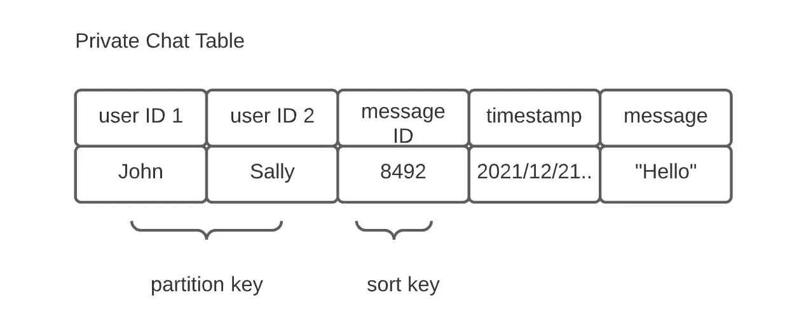

图一。私人聊天表，按作者分类

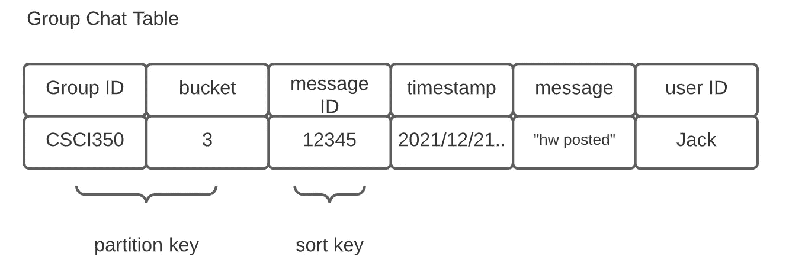

图二。群聊表，按作者分类

这里的一个关键观察是消息 ID 用于确定排序。消息 Id 是**而不是**全局唯一的，因为它的范围是由分区键决定的。系统永远不会只通过邮件 ID 来检索邮件。

然而，分布式数据库不太支持自动增量密钥生成。我们可以使用专门的密钥生成服务，例如 [Twitter 的雪花 ID](https://blog.twitter.com/engineering/en_us/a/2010/announcing-snowflake) ，或者简单地使用一个精确的时间戳作为消息 ID(是的，[时钟偏差可能会发生](https://cse.buffalo.edu/~stevko/courses/cse486/spring14/lectures/06-time.pdf)，但是一个组中/两个用户之间的消息量可能很小，通过仔细的时间同步可以忽略这一点)

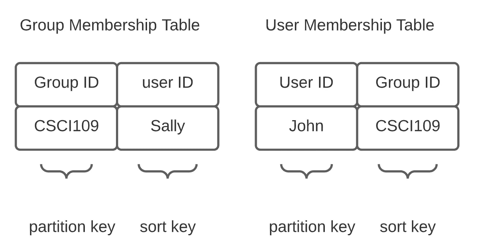

图 3。成员表，按作者分列

我们需要两个表来捕捉用户和组之间的关系。组成员表用于消息广播——我们需要确定谁收到了消息。用户成员表用于列出用户加入的所有组。我们可以使用带有二级索引的单个表，但是组 ID/用户 ID 的基数对于二级索引来说太大了。两个表的方法也不是没有问题——如果我们改变一个，另一个应该被修改以保持一致性，这需要分布式事务。

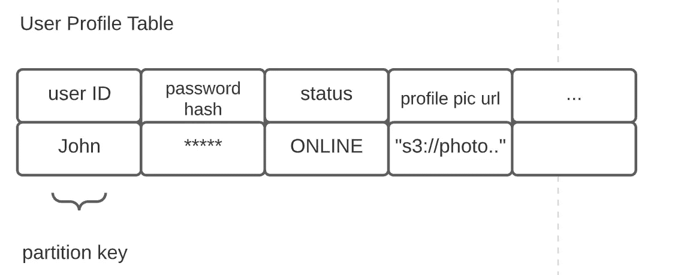

图 4。用户概况表，按作者分列

最后，用户配置文件表。它跟踪用户特定的数据，如个人资料图片位置和其他东西。

## 2.2.API 设计

在系统设计面试中，预先制定系统的 API 总是一个好主意。它有助于您将实现的功能形式化，并展示您的严谨思维。

我们系统的需求可以分解为以下 RPC 调用:

```
send_message(user_id, receiver_id, channel_type, message)
get_messages(user_id, user_id2, channel_type, earliest_message_id)
join_group(user_id, group_id)
leave_group(user_id, group_id)
get_all_group(user_id)
// ignore RPC for login/logout, ignore authentication token 
```

*   *channel_type* 字段用于区分私聊和群聊。
*   *receiver_id /user_id2* 可以是用户 id 或群组 id。
*   *earliest_message_id* 是客户端本地可用的最新消息。它被用作范围查询聊天表的排序关键字。

## 2.3.体系结构

最后，是时候进行建筑设计了！到目前为止，我们已经为应用程序打下了坚实的基础——数据库模式、RPC 调用。记住所有这些，我们可以继续写下系统中的组件列表。

*   **聊天服务**:每个在线用户在聊天服务中维护一个与 WebSocket 服务器的 WebSocket 连接。传出和传入的聊天消息在这里交换。
*   **Web 服务**:它处理除了 *send_message()之外的所有 RPC 调用。*用户使用该服务进行身份验证、加入/离开群组等。这里不需要 WebSocket，因为所有的调用都是客户端发起的，都是基于 HTTP 的。
*   **通知服务**:当用户离线时，消息被推送到外部手机厂商的通知服务器(例如[苹果的](https://developer.apple.com/documentation/usernotifications/setting_up_a_remote_notification_server))
*   **在线状态服务**:当用户输入或改变状态时，在线状态服务负责确定谁获得推送更新。
*   用户地图服务:我们的聊天服务是全球性的。我们需要跟踪用户会话主机的服务器 ID。

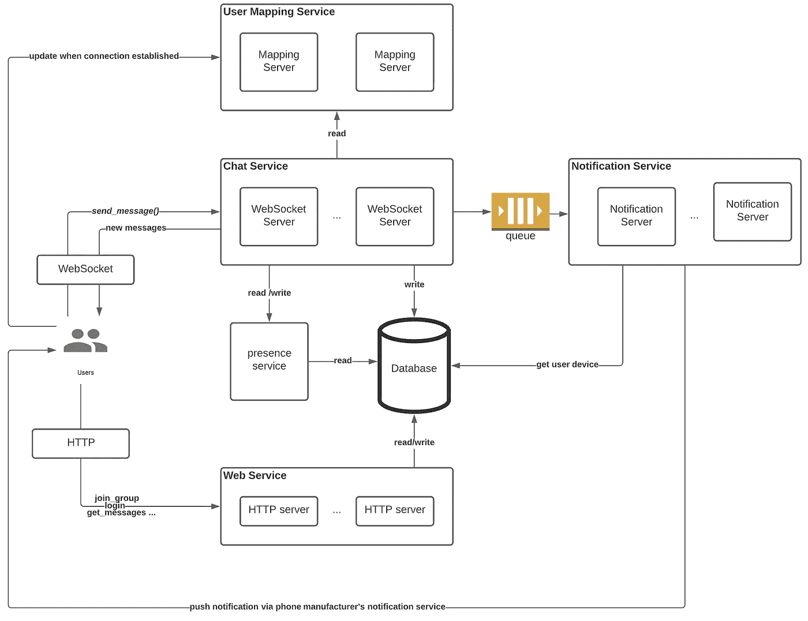

图 5。高层建筑，作者图

注意，图 5 中省略了 ID 生成服务。

## 2.4 数据流

**正常消息传递**

当用户发出一条消息时，它被传递到同一地区的 WebSocket 服务器。WebSocket 服务器会将消息写入数据库并确认客户端。如果接收者是另一个用户，她的 WebSocket 服务 ID 是通过调用用户映射服务获得的。一旦消息被转发到适当的服务器，接收者将通过 WebSocket 获得推送消息。

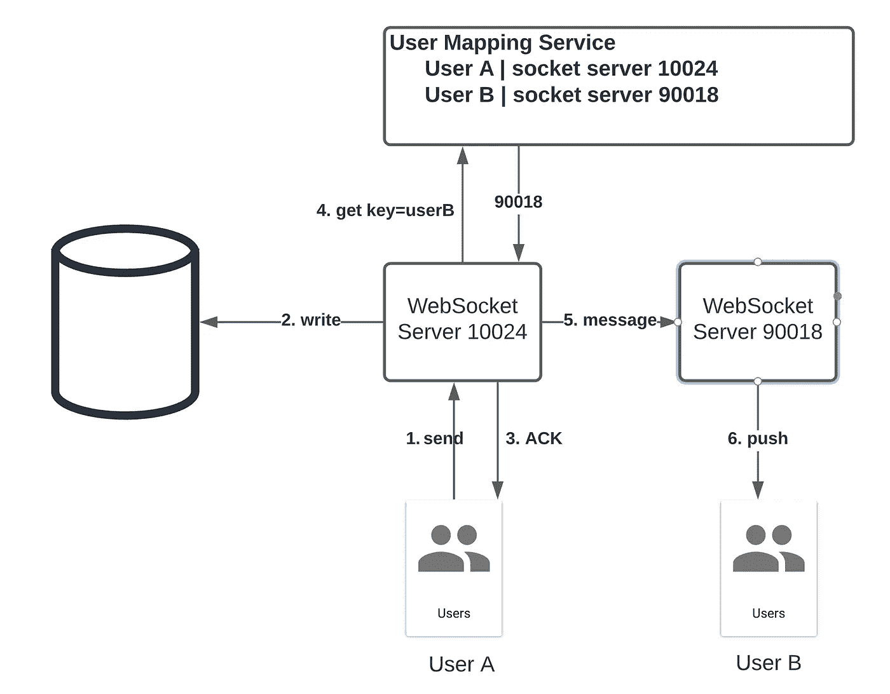

图 6。正常消息传递，按作者分类

**消息传递失败**

如果由于某种原因 WebSocket 被切断，用户无法联系到，所有消息将被重定向到通知服务，以便尽最大努力传递(不能保证传递，因为用户可能没有互联网连接)。

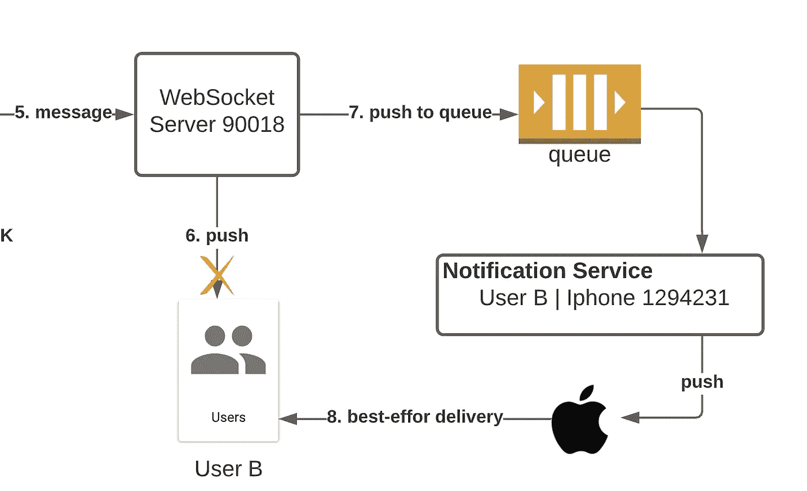

图 7。失败的消息传递，按作者统计

**历史赶超**

即使使用 duo 消息传递系统，客户端也可能永远收不到消息。因此，所有客户端在重新连接时/以固定的时间间隔请求网关服务以获得权威聊天历史记录是至关重要的。

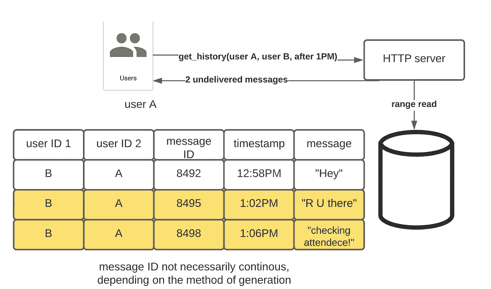

图 8。历史追赶，按作者分类

**群聊**

当用户参加群聊时，他的消息被广播给所有的群成员。给定一个组 ID，WebSocket 服务器查询数据库，将消息转发给其他服务器。

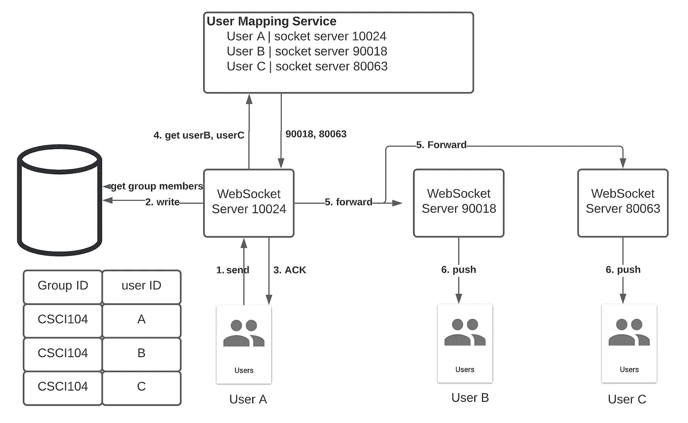

图 9。群聊，作者图

**存在检测**

当用户在应用程序中活跃时，Slack 等应用程序会通知其他用户你的状态。我们可以把这个信号作为一种特殊形式的群聊来处理。WebSocket 服务器不是查询数据库，而是联系呈现服务，呈现服务返回用于广播的联系人列表。因为通知曾经与用户聊天的每个人的成本非常高，所以存在服务运行某种算法(可能基于聊天频率、最近的交流等)来保持列表简短和精确。

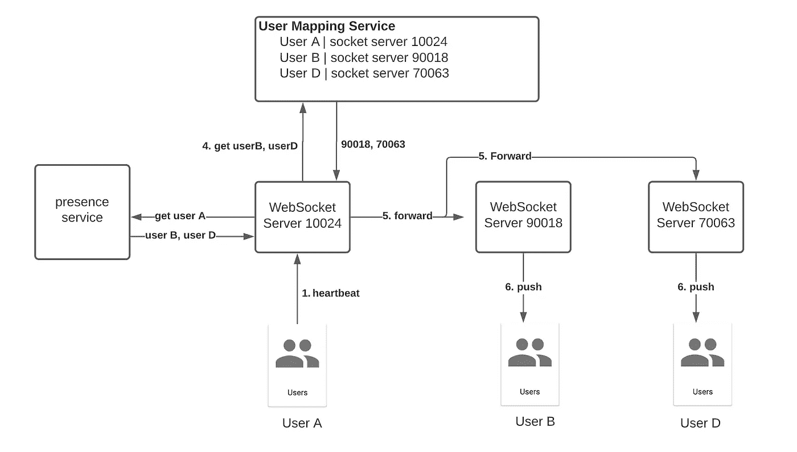

图 10。存在检测，按作者分类

对于不太频繁的联系，可以通过轮询存在服务而不是等待推送消息来获得用户的状态。

**打字指示**

逻辑上，打字指示信息和普通信息没有区别。我们可以以与私人聊天消息相同的方式传播打字指示消息(图 6)。

# 3.细节

到目前为止，我们已经建立了一个清晰的架构和具体的数据流，涵盖了所有的功能需求。然而，面试官会问你很多问题。在这一部分，我想谈谈面试官可能会问你的一些有趣的权衡。

## 3.1.Web 套接字服务器之间的通信

第一个问题是 web socket 服务器如何相互通信(图 6 中的步骤 5)。最简单的方法是对每条消息使用单独的同步 HTTP 调用。然而，出现了两个问题:

1.  没有消息排序:如果两个消息按顺序发送，那么第一个消息到达的时间可能会非常晚。在用户看来，在你刚刚阅读的最新消息上方会弹出一条未读消息，这是非常令人困惑的。
2.  每秒大量的请求:如果每条消息都通过单独的 HTTP 调用发送，那么入口流量可能会淹没 web socket 服务器。

一个可能的解决方案是使用队列作为中间件。每个服务器都有一个专用的传入队列，作为缓冲区并对消息进行排序。

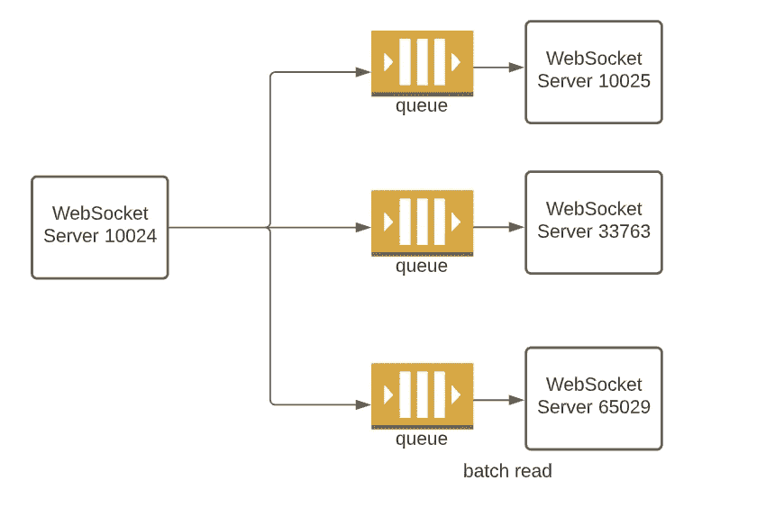

图 11。作为中间件的队列。按作者分列的数字

虽然看起来队列是一个更好的解决方案，但我认为它本身就是一个魔鬼:

*   对于 Slack 这样的大型应用，web socket 服务器有上万台。维护和扩展中间件是昂贵的，而且本身就是一个挑战。
*   如果消费者(web socket 服务器)关闭，我们不希望消息在队列中堆积，因为用户将重新连接到不同的服务器并启动历史记录。服务器总是来来去去，用它们创建/清除队列是很费力的。
*   如果消费者重新加入，我们应该如何处理队列中的陈旧消息？哪些消息要丢弃，哪些要处理？

在这里，我提出了第三种基于同步 HTTP 调用的方法:

为了解决排序问题，我们可以用一个 *prevMsgID* 字段来注释每条消息。接收者检查他的本地日志，并在发现不一致时启动历史记录。

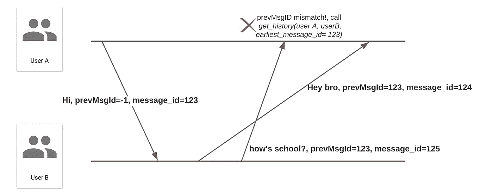

图 12。无序检测，按作者分类

为了减少服务器之间交换的消息数量，我们可以在 WebSocket 服务器上实现一些缓冲算法——发送累积的消息，比如说，大约 50 毫秒的随机偏移(防止每个人同时发送消息)。

## 3.2.处理群聊

目前的设计是广播所有的群组信息，而不管群组大小。如果组非常大，这种方法就不太适用。理论上，有两种处理群聊的方法——推和拉:

*   推送:消息被广播到其他 web 套接字服务器，然后这些服务器将消息推送到客户端
*   拉取:客户端向 HTTP 服务器发送请求，获取最新的消息。

推送的问题在于，它将一个外部请求(一条消息)转换成许多内部消息。这叫做写放大。如果群组很大并且很活跃，推送群组消息将占用大量带宽。

拉取的问题是一条消息被不同的客户端反复读取(读取放大)。采用这种方法肯定会使数据库不堪重负。

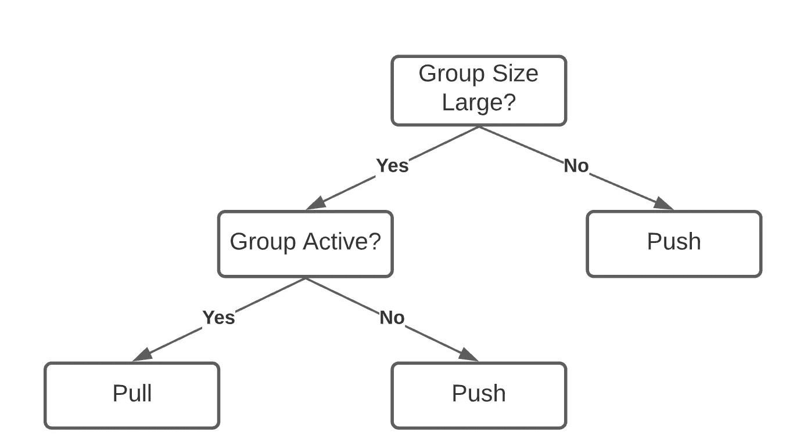

图 13。混合群聊处理，作者图

我的想法是，我们可以用上面的逻辑建立一个混合系统。对于较小的组或非活动组，可以进行推送，因为写入放大不会给服务器带来压力。对于非常活跃的大型组，客户端必须定期向 HTTP 服务器查询消息。

## 3.3.Web Socket 服务器和数据库

当 web socket 服务器收到消息时，它会被持久化到数据库中。最简单的方法是直接调用数据库。通过这种实现，数据库受到大约 100K RPS 流量的冲击，这需要大量的基础设施。

另一种方法是使用队列进行批量插入。当队列服务收到一个写请求时，web socket 服务器会依次确认客户端。在队列的另一端，一个专门的批处理编写器可以将数百条消息组合成一个请求，从而大大减少了 RPS。

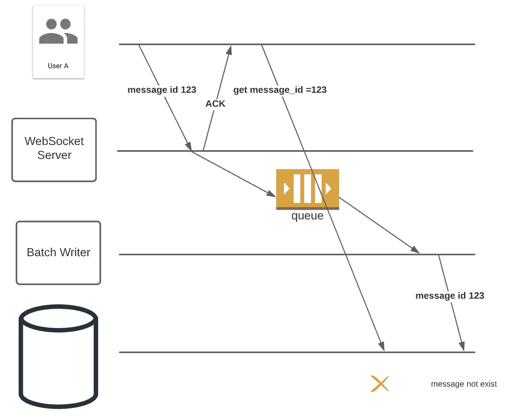

图 14。中间件的问题，按作者分类

但是，使用 Kafka 之类的队列确实会在服务器 ACK 和实际写入之间引入延迟。如果客户端在收到来自 web socket 服务器的 ACK 后立即查询 HTTP 服务器，则可能消息尚未写入。使用中间件，很难提供写后读的一致性，而这对于某些应用程序可能是重要的。

# 4.摘要

在本文中，我们提出了 Slack 的高级架构，定义了系统 API 和数据库模式。此外，当更仔细地检查系统时，我们探索了许多重要的权衡。在系统设计面试中，没有完美的答案。所有的解决方案都有缺陷，我们的工作是评估每一个方案，并选择最简单的一个满足所有要求。