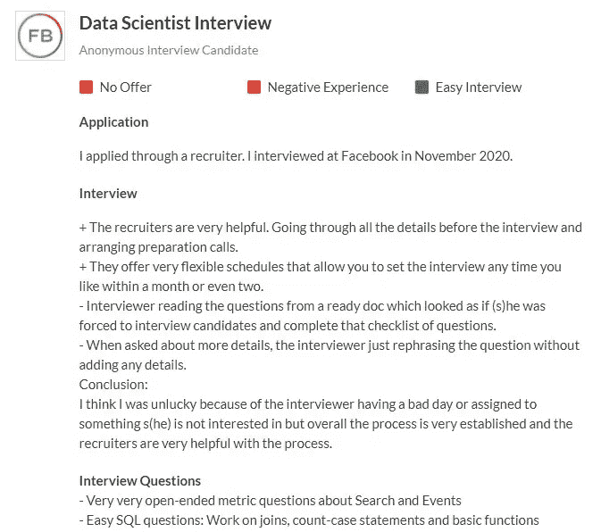
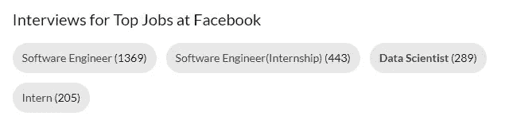

# 使用 Python 中的这个简单技巧赢得下一次面试

> 原文：<https://towardsdatascience.com/ace-your-next-interview-using-this-simple-trick-in-python-6994b2198c9f?source=collection_archive---------32----------------------->

## 借助几行代码，减少焦虑，自信地参加任何面试。

来自 Unsplash 的照片由[粘土银行](https://unsplash.com/photos/Hf8n0RUk7g0)

焦虑，不安，紧张，恶心。这些都是我在进入房间进行一次改变人生的面试之前感觉到的…我确信我不是唯一一个。

我相信每个人都讨厌面试，原因是你不知道面试会是什么样，你会被问到什么问题，而且这往往是你第一次看到招聘人员的脸。

不确定的事情太多了，这种不确定性会让你焦虑、不安、紧张，甚至反胃。

不要像这里的 BMO 一样焦虑

我是一个经常焦虑的人，因为我讨厌不确定性，我觉得我必须控制一切，因此我讨厌面试。

但实际上，我已经找到了一种方法，可以在面试中使用 python 中的几行代码收回一些控制权。

# 玻璃门

Glassdoor 是一个网站，现任和前任员工可以匿名评论公司。更进一步，这些员工可以讨论面试过程和他们被问到的问题。

看看这个帖子，它是由面试脸书数据科学家职位的人提交的。

你可以看到他们在 2020 年 11 月参加了面试，他们讨论了面试过程中的各种利弊以及我们感兴趣的问题，**他们被问到的问题**。

这只是脸书大学数百个数据科学家职位中的一个。Glassdoor 的伟大之处在于，你可以搜索任何公司的任何职位的确切职位。

通过分析特定公司的数百份特定职位的职位，我们可以找出面试中被问得最多的问题，从而消除一些不确定性。

显然，手动浏览数百个帖子是毫无意义的，所以为什么不让速度成倍增长的计算机来做呢？

# 让电脑来做脏活

这就是编码和 python 的威力所在，但实际上它是通过利用两个概念来工作的。

## 1.网页抓取

你知道吗，每当你在网上阅读时，你的阅读数据？对你来说，这可能只是几个词，但在后台，你在网上读到的一切都可以被拿走，被拆开，被操纵。

这就是网络抓取，通过编写一些代码，我们可以获取 Glassdoor 上与帖子相关的数据，并将它们放入 python。

网络抓取的好处是只需要几秒钟就可以收集到数百条数据。

## 2.自然语言处理

现在我已经用 python 写好了所有的帖子，我使用了一点(NLP)或自然语言处理。

这听起来很复杂，但我向你保证我所做的事情并不复杂，我会尽量解释清楚

简单来说，我所做的就是创建一个单词字典。

我写了一段代码，逐字逐句地检查我们从网上搜集的每个帖子的面试问题。然后，这些单词将被添加到字典中，并计算该特定单词出现的次数。

例如，在下面的段落中，单词 **confirmation** 出现了两次，所以计数为 2。

*(这是脸书问的一个实际面试问题)*

> 给定两个表，一个包含脸书发送确认消息的电话号码，另一个包含确认验证的电话号码，编写一个 SQL 查询来计算确认百分比。

通过创建单词词典，我们可以找出哪些单词和短语最常出现，从而确定哪些问题最有可能被问到。

让我给你看一个例子，这样你会有更好的想法。

# 脸书大学的数据科学家

假设我有一个脸书数据科学家的面试。我会去 Glassdoor 搜索职位和公司。

当我搜索它的时候，我可以看到有 289 个帖子是关于那些在脸书做了这个采访并且在 Glassdoor 上讨论了这个采访的人的。

我接下来要做的是运行我的 web 抓取代码，将这些帖子的面试问题导入 python。

一旦我收集了所有的问题，我会在我的字典里搜索所有的单词和短语。

最后，我列出了所有这些面试中最常用的词，我对最有可能被问到的问题有了一个很好的想法。

让我们来看看在脸书大学的数据科学家面试中最常用的 3 个单词和短语，这样你就可以知道这对你的面试有什么帮助了。

# 1.结构化查询语言

在我搜集的所有采访中，SQL 是出现频率最高的词。这可能意味着脸书非常重视他们的数据科学家职位对 SQL 的了解。

更进一步，当我查看包含 SQL 的具体问题时，大多数都是基于真实的脸书案例，就好像他们在告诉你这正是你在工作中要做的工作。

让我们看看在这些访谈中被问到的一些真实的 SQL 问题:

*   提供一个包含 user_id 和他们访问平台的日期的表，编写一个 SQL 查询，查找截至昨天连续访问平台时间最长的前 100 名用户。
*   给定两个表，一个包含脸书发送确认消息的电话号码，另一个包含确认验证的电话号码，编写一个 SQL 查询来计算确认百分比
*   给定一个包含不同类型的详细客户投诉单的表，使用 SQL 计算每种类型中已处理单的份额。

# 2.可能性

在所有的采访中，第二个最常出现的词是概率。这再次潜在地意味着脸书强调他们的数据科学家要知道概率。因此，回去读一些大学/学院的概率课本可能是个好主意。

这些访谈中提出的概率问题示例如下:

*   脸书雇佣了评级机构来给广告评级。80%是仔细评级，将 60%的广告评级为好，40%为坏，20%是懒惰评级，将 100%的广告评级为好。广告被评为好广告的概率有多大
*   三只蚂蚁坐在等边三角形的三个角上。每只蚂蚁随机选择一个方向，开始沿着三角形的边移动。没有蚂蚁相撞的概率是多少？
*   从一副洗好的 52 张牌中抽出一张不同颜色或形状的牌的概率是多少？

# 3.你如何决定一个产品的成功

这个短语是迄今为止被问到的最具体的重复出现的问题。SQL 和 Probability 出现得最多，但它们只是在不同问题中出现的单个单词。

“你如何决定一个产品的成功”这句话反复出现。

因此，如果你有机会面试脸书大学的数据科学家职位，得到这个问题的答案将对你最有利，因为你现在知道这个问题以前已经被别人问过多次了。

# 这会帮助你在面试中胜出吗…

老实说，运行我的代码并找出最常出现的问题并不能保证你得到一份工作，但这真的不是我写这段代码的原因。

正如我在介绍中所说的，我在面试时会非常焦虑，我相信你也一样。这种焦虑会一直存在，但是有办法减少它。

我发现通过了解和研究以前问的问题确实有助于减少我的焦虑，这就是我编写这个代码的原因。

所以如果我留给你什么的话，那就是面试对每个人来说都是可怕的，但是在这里或那里的小技巧的帮助下，我们可以鼓起勇气自信地去参加任何面试。

# 访问我在本文中使用的代码

如果你想获得我在这篇文章中描述的代码的完全清理和评论版本，你可以加入我的群 **"Clean Code Z"** ，通过加入你将获得我在所有文章和视频中使用的代码的清理版本。

感受感受加入这里: [**洁码 Z**](https://wondrous-originator-2391.ck.page/chris_zita)