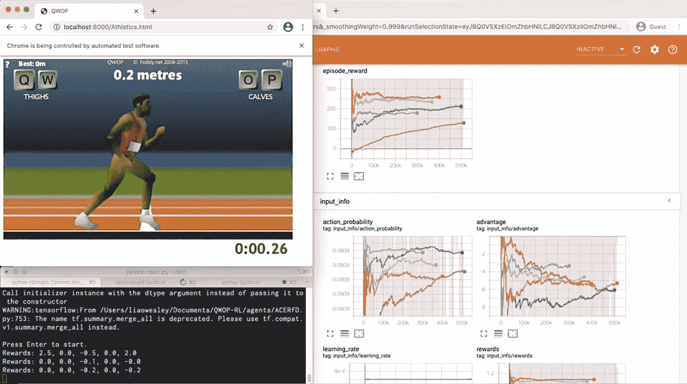
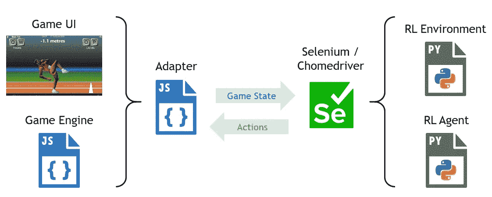
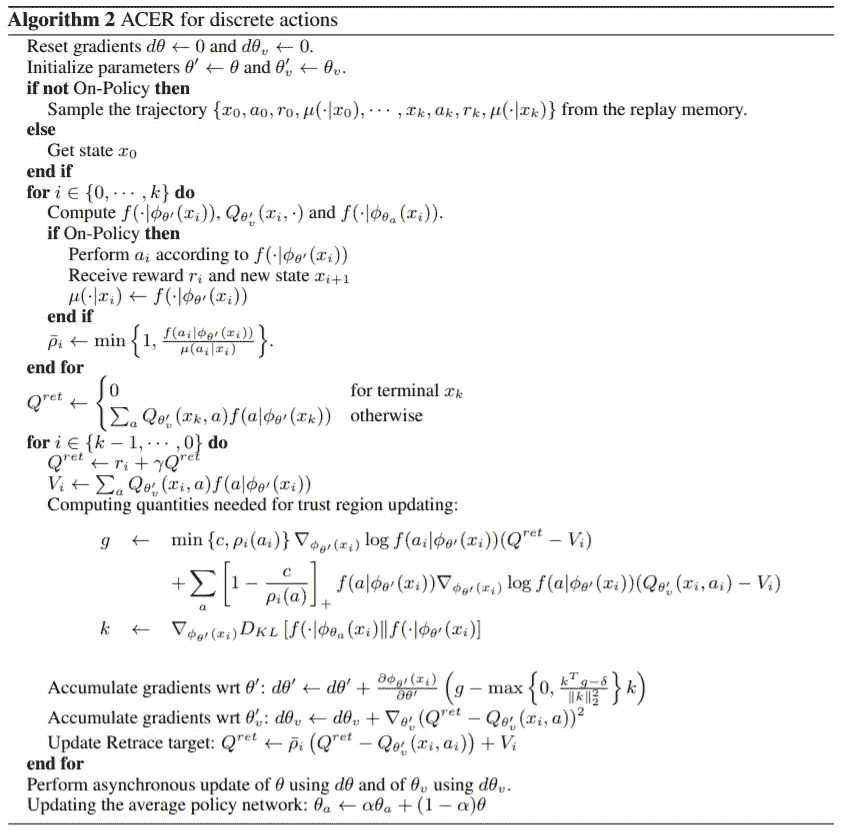
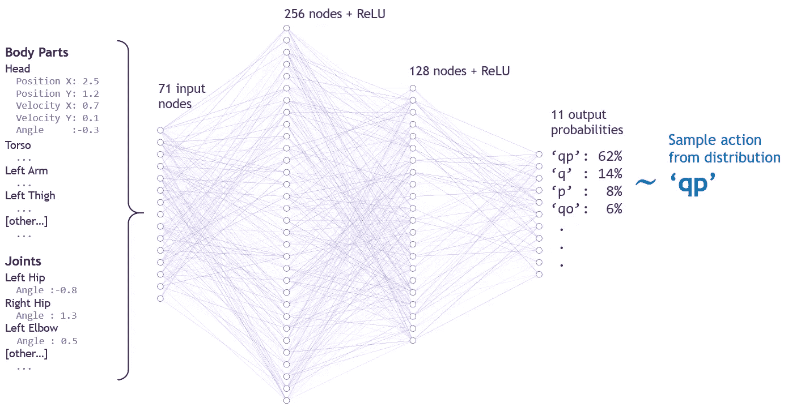
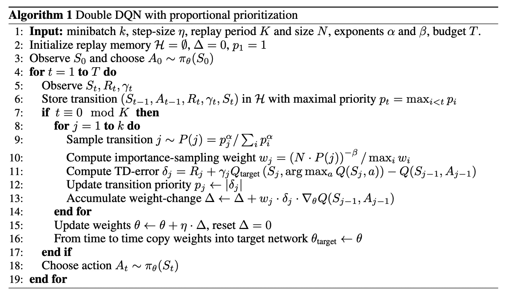
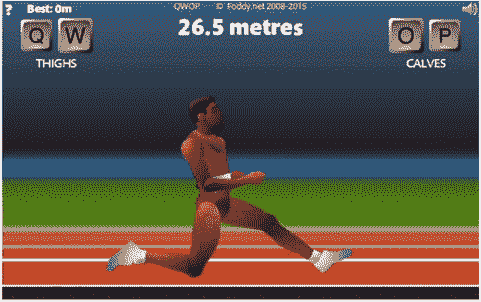
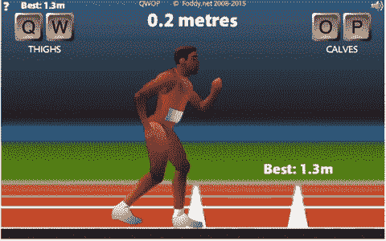
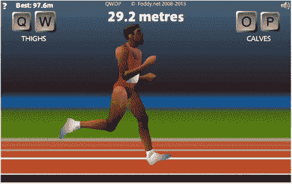
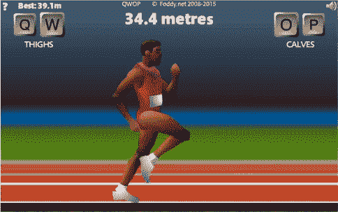

# 利用强化学习和模仿学习实现 QWOP 中的超人性能

> 原文：<https://towardsdatascience.com/achieving-human-level-performance-in-qwop-using-reinforcement-learning-and-imitation-learning-81b0a9bbac96?source=collection_archive---------13----------------------->

## [思想和理论](https://towardsdatascience.com/tagged/thoughts-and-theory)

## 这个游戏难度惊人，显示了人类运动的复杂性。

特工苦练！来自 [QWOP](http://www.foddy.net/Athletics.html) 的游戏。(图片由作者提供)

# 介绍

[QWOP](http://www.foddy.net/Athletics.html) 是一款简单的跑步游戏，玩家用 4 个按钮控制布娃娃的下半身关节。这个游戏难度惊人，显示了人类运动的复杂性。使用机器学习技术，我能够训练一个人工智能机器人像人一样跑，并达到 47 秒的完成时间，这是一项新的世界纪录。本文介绍了一般的方法以及培训过程。非常感谢 Kurodo ( [@cld_el](https://twitter.com/cld_el) )，世界顶级速度赛跑运动员之一，捐赠编码的比赛录音来帮助训练代理人。

# 环境

第一步是将 QWOP 连接到 AI 代理，以便它可以与游戏交互。为了检索游戏状态，我编写了一个 Javascript 适配器，从游戏引擎中提取关键变量，并使它们可以从外部访问。然后使用 Selenium 读取 Python 中的游戏变量，并将按键发送到浏览器。

环境设置。游戏截图来自 [QWOP](http://www.foddy.net/Athletics.html) 。(图片由作者提供)

接下来，游戏被包装在 OpenAI gym 风格的环境中，该环境定义了状态空间、动作空间和奖励函数。该状态包括每个身体部分和关节的位置、速度和角度。动作空间由 11 个可能的动作组成:4 个 QWOP 按钮中的每一个，6 个双按钮组合，以及没有按键。

# 方法

第一个代理的学习算法是带有经验回放的演员评论家(ACER)。这种强化学习算法结合了 A2C(Advantage Actor-critical)和重放缓冲器，用于策略上和策略外学习。这意味着代理不仅从最近的经验中学习，还从存储在内存中的旧经验中学习。这使得宏碁比其仅在保单上的同行更具样本效率(即学习速度更快)。

为了解决偏离策略估计器的不稳定性，它使用回描值估计、重要性权重截断和有效的信赖域策略优化。更多细节参考原论文。

*宏学习离散动作的步伪码。摘自* [*宏基论文*](https://arxiv.org/pdf/1611.01224.pdf) *。*

与大多数 RL 算法相比，ACER 相当复杂，所以我使用稳定基线实现，而不是自己编码。稳定的基线还提供了定制环境集成和预培训功能，这在后来被证明是非常有价值的。

底层神经网络由 256 个和 128 个节点的两个隐藏层组成，全部与 [ReLU](https://en.wikipedia.org/wiki/Rectifier_(neural_networks)) 激活完全连接。下图说明了网络如何吸收游戏状态并产生候选动作。

说明:强化学习代理神经网络架构。动作在训练期间被采样，但是在测试期间可以被确定。(图片由作者提供)

整个架构稍微复杂一点，包含更多网络输出，包括一个 *Q* 值估计器。

在代理的第二次迭代中，优先化的 DDQN⁷用于完善运行技术和优化速度。该算法将 DQN 与许多特征相结合，以稳定和加速偏离策略的学习。该代理使用与 ACER one 相同的网络结构和激活功能。

*优先级 DDQN 伪代码。摘自* [*每文*](https://arxiv.org/pdf/1511.05952.pdf) *。*

# 培养

## **初步试验**

我第一次尝试完全通过自我表演来训练代理人。我希望这个代理可以学习表演人类运动，就像 DeepMind 在穆乔科·environments⁴.中所做的那样然而，经过多次尝试后，我注意到它学会跑完 100 米的唯一方法是“擦膝盖”这与之前用机器学习解决 QWOP 的许多尝试是一致的。

AI 通过膝盖刮擦学习完成。从 [QWOP](http://www.foddy.net/Athletics.html) 重新编码。

代理根本没有发现步幅机制，而是学习最安全和最慢的方法到达终点线。

## 学习大步走

然后，我试着亲自向代理教授大步的概念。这类似于 DeepMind 在最初的 AlphaGo⁴中使用的方法，在自我游戏之前，代理首先被训练模仿顶级玩家。然而，当时我不认识任何顶级玩家，所以我试图自己学习这个游戏。不幸的是，我在这项运动中相当糟糕，经过一天的练习，我只能跑大约 28 米。

虽然我弹得很差，但我仍然像人类一样使用腿。我想也许代理人可以从那个机械师那里得到一些信号。所以我录了 50 集我平庸的戏，编码了，喂给经纪人。不出所料，结果相当糟糕——代理理解 stride 的*想法*,但不知道如何应用它。

艾试图模仿我的跨步动作。改编自 [QWOP](http://www.foddy.net/Athletics.html) 。

然后，我让代理自己训练，看看它是否能利用新技术。令我惊讶的是，它竟然学会了像人类一样大步行走和奔跑！经过 90 个小时的自我训练，它能够以不错的速度跑完比赛，并以 1 分 25 秒的成绩完成比赛，这是前 15 名的速度跑，但离冠军还差得很远。

AI 终于学会大步走了。改编自 [QWOP](http://www.foddy.net/Athletics.html) 。

这位经纪人并没有发现所有速度最快的跑步者都使用的一种特殊技术:向上和向前摆动双腿以创造额外的动力。我想向人工智能展示这一技术，但我自己肯定不够熟练来演示，所以我寻求帮助。

## 学习高级技术

Kurodo ( [@cld_el](https://twitter.com/cld_el) )是世界上最顶尖的 QWOP 速度赛跑运动员之一，他非常慷慨地录制并编码了 50 集他的比赛，供我的经纪人学习。我第一次尝试像以前一样进行有监督的预训练，但结果并不理想。代理不能立即利用数据，然后很快忘记/覆盖训练前的体验。

然后，我尝试将这种体验直接注入宏碁重放缓冲区，进行非政策学习。代理人的一半记忆是他玩过的游戏，另一半是 Kurodo 的经历。这种方法有点类似于从演示中进行深度 q 学习(DQfD)⁶，除了我们没有在开始时添加所有的演示，我们以与真实体验相同的速度添加演示。行为政策 *( |s)* 也必须包含在每次注射中。虽然这个方案没有什么理论基础，但效果却出奇的好。

艾学习高级摆腿技术。从 [QWOP](http://www.foddy.net/Athletics.html) 重新编码。

但是，代理的策略(操作)过一段时间后会变得不稳定，因为它无法使外部数据与其自己的策略完全一致。此时，我从它的内存中删除了专家数据，让它自己继续训练。最终的代理有如下的训练时间表:预训练，25 个小时自己，15 个小时用 Kurodo 的数据，另外 25 个小时自己。这个代理的最好记录是 1 米 8 秒，这是前 10 名的速度跑。

## 优化速度

现在代理掌握了正确的技术，我创建了一个新的代理，只是为了提高速度。我记录了宏碁代理的运行，并将其提供给一个新的优先 DDQN⁷代理。选择这种 DQN 变体是因为它的样本效率更高，因此可以快速优化宏碁已经学会的技术。

奖励函数也被修改了。以前它有一些惩罚措施，包括对躯干高度低、躯干垂直运动和膝盖过度弯曲的惩罚。当代理刚刚学习大步，这些有助于稳定其运行技术。但现在它知道如何大步前进，我把训练轮拿掉，让它纯粹为了前进速度而优化。

训练和测试的有效帧速率分别从之前的 9 提高到 18 和 25，这样代理可以做出更精确的动作。新代理首先接受宏碁 runs 的预培训，然后通过自学进行改进。它没有像宏碁那样用 Kurodo 的数据进行混合记忆训练。它总共接受了 40 个小时的训练，除了几分钟的预训练外，所有的训练都是自学。

# 结果

最终代理的最佳记录是 47.34 秒(见下图)，比人类的最佳记录( [48.34 秒](https://www.speedrun.com/qwop))还要快。随着这一点，QWOP 被添加到 AI 已经超越人类的游戏列表中。

47.34 秒的世界纪录。

# 链接

*   第一代理视频摘要:【https://youtu.be/-0WQnwNFqJM 
*   第二代理视频摘要:【https://youtu.be/82sTpO_EpEc 
*   Github 库:[https://github.com/Wesleyliao/QWOP-RL](https://github.com/Wesleyliao/QWOP-RL)

*文章于 3/6/21 更新，介绍新的 DQN 车型和世界纪录。*

# 参考

1.  QWOP (Foddy，2008)
    [http://www.foddy.net/Athletics.html](http://www.foddy.net/Athletics.html)
2.  样本高效影评人带经验回放(王等，2017)

3.  稳定基线(希尔等人，2018)
    [https://github.com/hill-a/stable-baselines](https://github.com/hill-a/stable-baselines)
4.  丰富环境中运动行为的出现(Heess 等人，2017)
    [https://arxiv.org/pdf/1707.02286.pdf](https://arxiv.org/pdf/1707.02286.pdf)
5.  用深度神经网络和树搜索掌握围棋游戏(Silver et al .，2016)
    [https://doi.org/10.1038/nature16961](https://doi.org/10.1038/nature16961)
6.  深度 Q-从示范中学习(Hester 等人，2017)[【https://arxiv.org/pdf/1704.03732.pdf ](https://arxiv.org/pdf/1704.03732.pdf)
7.  优先体验回放
    https://arxiv.org/pdf/1511.05952.pdf