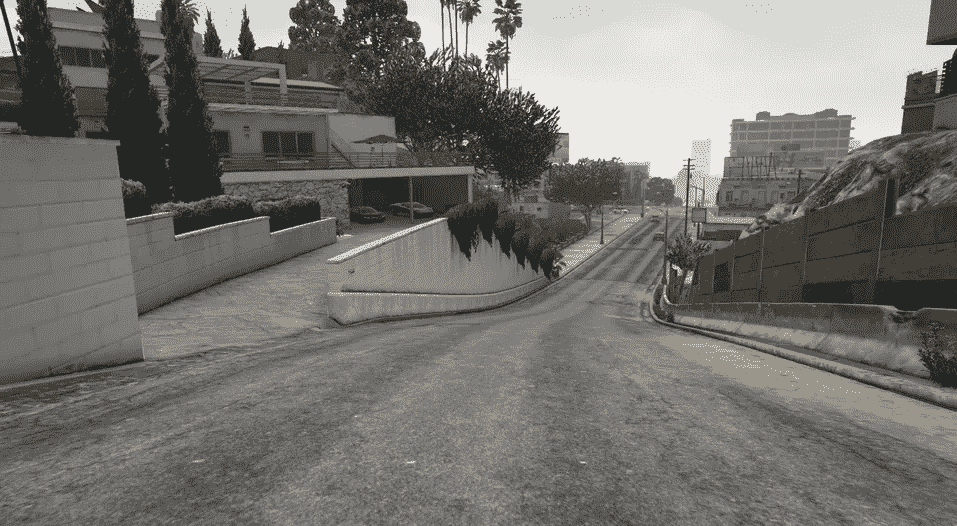
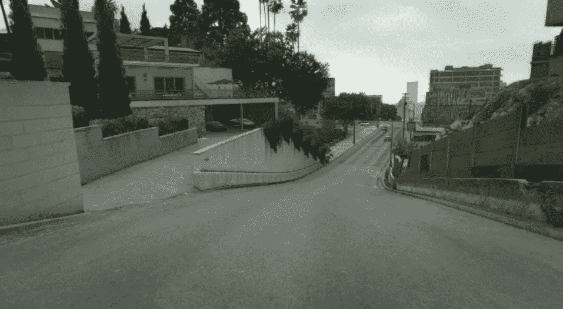
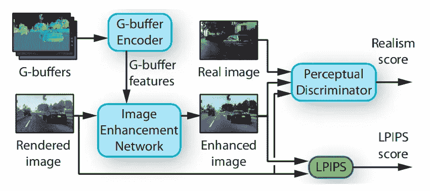

# 用神经网络实现真实感

> 原文：<https://towardsdatascience.com/achieving-photorealism-with-neural-networks-f80ded1b4cdb?source=collection_archive---------42----------------------->

## 使用来自 GTA V 的合成数据

在研究领域，特别是在处理图像时，人们对使用流行的游戏环境越来越感兴趣，例如用于实验的*侠盗猎车手(GTA)、*。有了今天的高质量图形，这些环境产生了与现实生活相似的合成图像，使研究人员能够测试他们解决复杂问题的方法，如[这个](http://Domain Adaptation for Traffic Density Estimation)，其数据集仍处于萌芽状态。

照片由 [Josue Michel](https://unsplash.com/@josuemichelphotography?utm_source=unsplash&utm_medium=referral&utm_content=creditCopyText) 在 [Unsplash](https://unsplash.com/s/photos/camera-old?utm_source=unsplash&utm_medium=referral&utm_content=creditCopyText) 上拍摄

为了进一步弥合这一差距，Vladlen Koltun 和他的团队在城里推出了一项新的工作，让合成图像更加逼真，他们称之为[增强真实感增强](https://intel-isl.github.io/PhotorealismEnhancement/)。我们看到 GTA V cityscape 的使用证明了该方法如何神奇地将游戏中的视频片段转换为看起来像是用 dash 相机拍摄的翻译。

让我们来看看增强剂的结果。下图是由游戏生成的原始合成图像。它确实有那种游戏合成的感觉。这是在没有任何增强器的情况下，从游戏引擎获得的渲染。虽然这仍然可以用作实验的测试场，但它不能保证在真实环境中重现结果。

来自 GTA V [1]的原始图像

现在让我们看看由增强剂流产生的一个。人们很容易把这个和真的混淆。它看起来确实比上一部有点沉闷，但却更加真实。

增强图像的真实感[1]

起初，这可能看起来像一个简单的策略，但它有很多内容，使这项工作非常新颖。

# **幕后**

从广义上讲，这种增强器是一种卷积神经网络(CNN ),它以所需的间隔生成增强帧。然后，它试图将原始帧转换成 [Cityscapes 数据集](https://www.cityscapes-dataset.com/news/)的样式，该数据集拥有 dash 相机记录的大量德国城市。

有趣的一点是，网络不只是使用完全渲染的图像(由游戏引擎)作为输入。游戏引擎产生了 G 缓冲区，这是一种中间缓冲区，提供场景的详细信息，如几何，材质和照明。如下图所示，除了渲染图像之外，增强网络还以多种比例使用这些辅助输入。

增强流程[1]

在将 G-buffer 信息传递到增强网络之前，有一个额外的编码器网络来完成编码。使用 [LPIPS loss，](https://ieeexplore.ieee.org/document/8578166)训练这两个网络，其保留了渲染图像的结构和感知辨别，以最大化增强图像的真实性。

基于输入的图像，该网络可以给汽车增加光泽，铺平道路，并做出其他类似的改变。这种方法获得的稳定性几乎没有任何伪影，这使得这种新方法成为所有现有方法中最好的，下面的视频中可以看到两者的比较。

[增强真实感增强](https://intel-isl.github.io/PhotorealismEnhancement/)

# 前方是什么

机器视觉研究的一个痛点是拥有一个为问题陈述量身定制的数据集。由于缺乏高质量的数据集，作者求助于标准数据集，这可能经常低估或少报工作的潜力。如上所述的策略可以引发一个新的维度，其中可以使用模拟环境(如游戏)基于需求生成模拟数据集。在赛场上运行任何新的基于视觉的自动驾驶算法之前，它可以在*增强型* GTA V 等模拟上快速运行，以找到缺陷并报告结果。因此，人们可以加快测试速度并创建您需要的数据集，这非常棒。在不久的将来，为许多这样的作品做好准备吧！

我希望你喜欢阅读斯蒂芬·里希特、哈桑·阿布·阿尔海贾和弗拉德伦·科尔顿的这篇文章。如果你对这个新策略的细节感兴趣，别忘了查看[全文](http://vladlen.info/papers/EPE.pdf)。要查看这项工作的更多对比结果，请点击此[链接](http://vladlen.info/papers/EPE.pdf)。

[1] Richter，Stephan R .，Hassan Abu AlHaija 和 Vladlen Koltun。“增强照片真实感增强。”arXiv 预印本 arXiv:2105.04619 (2021)