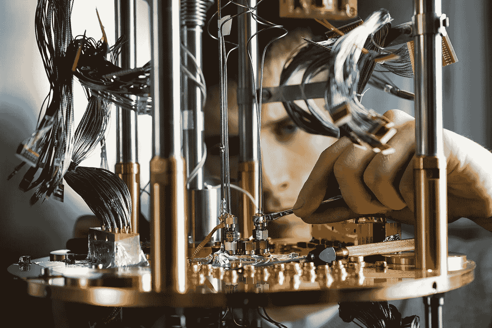
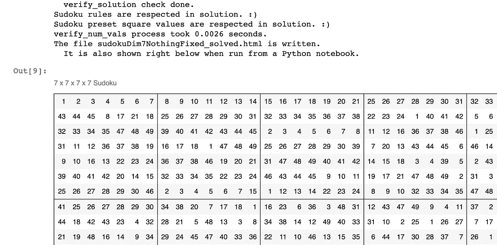
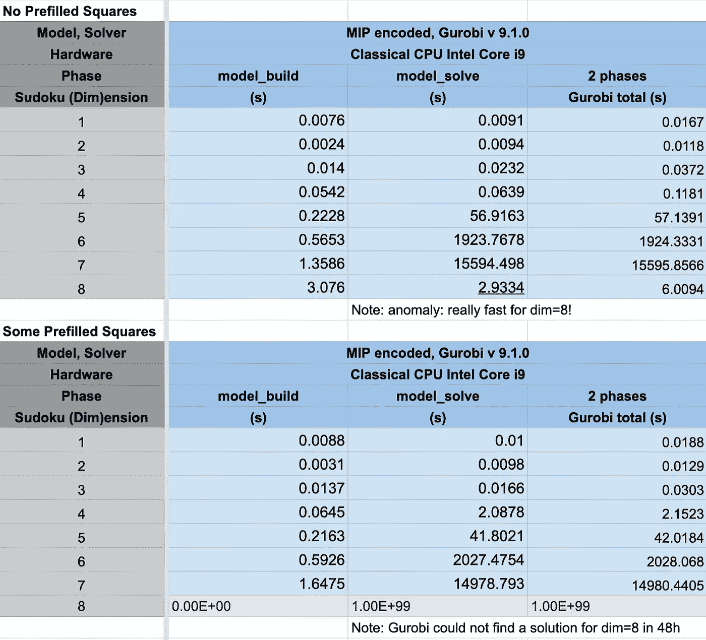
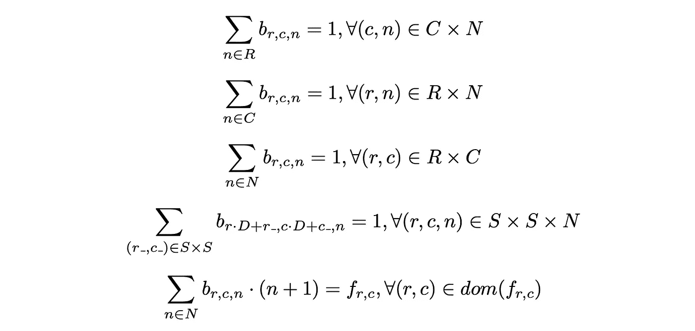
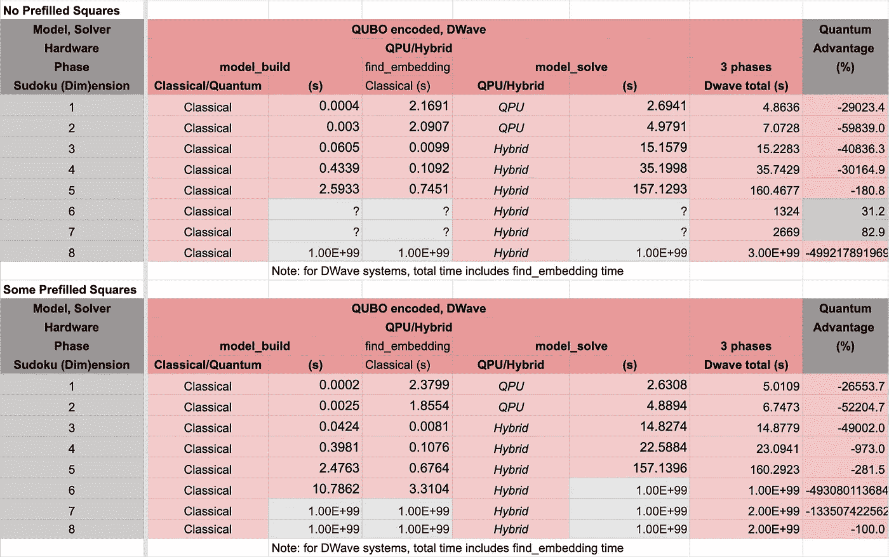
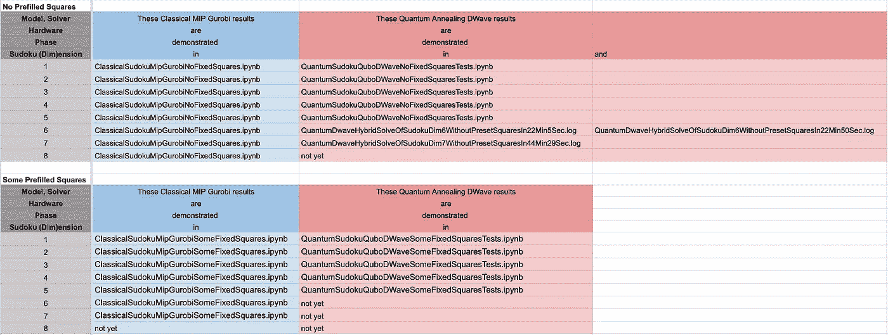
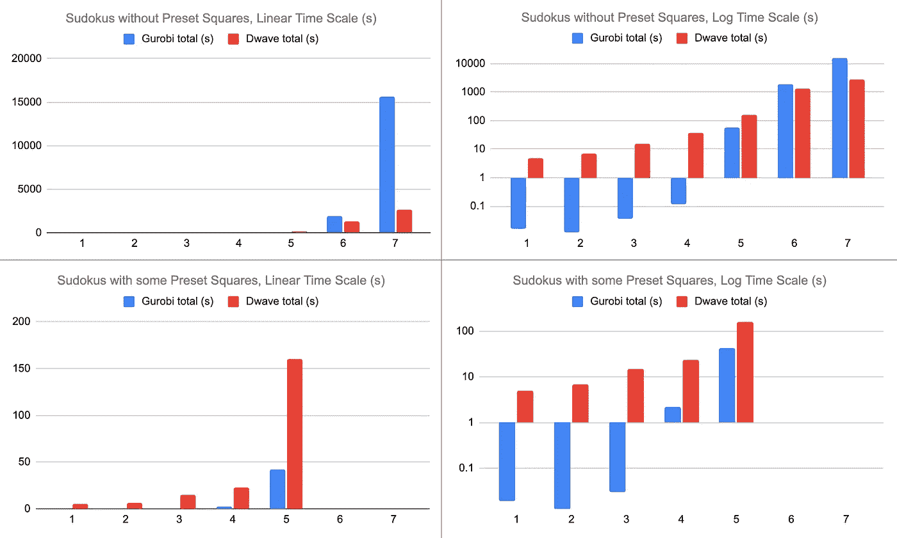

# 用 D-Wave 实现超级数独的量子优势

> 原文：<https://towardsdatascience.com/achieving-quantum-advantage-at-solving-super-sudokus-with-d-wave-a7d2ae97d534?source=collection_archive---------25----------------------->

## 数独，人类，经典和量子计算机



图 1:D 波退火量子计算机的中心部分，在这张图片中没有冷却到 15 mK。由 D-Wave 提供的媒体。

# 数独，人类，经典和量子计算机

数独是谜题[有些人喜欢手动解决](https://time.com/4078049/seizure-sudoku-puzzles/)。这是一个 9x9(或(3*3)*(3*3))的难题，在每个方块中，你应该填写从 1 到 9 的数字。每行和每列以及每个标记的 3×3 子方块只能包含 1 到 9 中的每个数字一次。

最训练有素的人通过反复试验，或者用计算机科学术语来说，通过回溯算法，在几分钟内解决 9x9 版本。

有些人更喜欢让计算机解决数独。然而，计算机发现传统的(3*3)*(3*3)数独简单得可笑。使用传统的混合整数规划方法，这些问题通常在大约 15 毫秒内解决。为了增加挑战，我们考虑了更大的(n * n)*(n * n)n > = 4、“超级”或“元”数独。当 n 变大时，(n*n)*(n*n)以快得多的速度变大。所以在 n 点，大约 6，7，8 台经典计算机开始挣扎，这意味着它们需要几个小时或几天来解决这样一个数独。



图二。一个 9*9 (=(3*3) * (3*3))的数独游戏是为人类设计的，让他们可以玩几分钟。在 15 毫秒的典型求解时间内，它对经典计算机来说没有挑战，所以我们大幅增加它们的规模，就像这个(7*7) * (7*7)超级数独，然后让经典和量子计算机工作来解决它们。

这是量子计算机可能表现更好的地方。

研究这个问题是本文的主题。

# 什么是量子计算？

多亏了量子现象(1) [*叠加*](https://en.wikipedia.org/wiki/Quantum_superposition) (不像经典比特在任何时候要么是 1 要么是 0，一个量子比特或者*量子比特*可以同时有两种状态(对，就是很奇怪！))和(2) [*纠缠*](https://en.wikipedia.org/wiki/Quantum_entanglement) (远距离的多个量子比特可以同时保证相同或相反的状态(‘幽灵般的远距离作用’爱因斯坦说，是的，又怪异了！))，量子计算机可以一次尝试多个潜在的解决方案，因此可以比经典计算机更快，因为经典计算机必须依次尝试每个解决方案。

量子计算理论到此为止。但是它已经在实践中得到证明了吗？你可以在这里阅读和[这里](https://pubsonline.informs.org/do/10.1287/LYTX.2021.06.02/full/)关于“*量子优势”*这个问题的答案更谦虚地称为“*量子优势*”仍然存在争议。

# 为什么是数独？

为了让经典计算机和量子计算机在一个具体的问题上进行比较，我们采用了数独难题，因为(1)它是最广为人知的优化问题,( 2)它很容易放大到任意大的和任意难的版本，因此无论是经典系统还是量子系统，如果存在优势，都可以放大到任意大的比例。

以自动化甚至最快的方式解决数独游戏，对于整个世界来说，尽管有很多严重的问题，看起来可能是徒劳的。然而，数独只是被称为“优化问题”(更具体地说，[混合整数规划](https://en.wikipedia.org/wiki/Integer_programming)或 *MIP* 问题)的一大类问题中的一个例子。在那个类中，存在更多实际相关的问题，像[供应链优化问题](https://en.wikipedia.org/wiki/Supply_chain_optimization)、[列车时刻表优化问题](https://www.sciencedirect.com/science/article/abs/pii/S0191261515002684)、[护士调度问题](https://en.wikipedia.org/wiki/Nurse_scheduling_problem)、[自动化能源市场交易问题](https://www.cired-repository.org/bitstream/handle/20.500.12455/327/CIRED%202019%20-%201158.pdf?isAllowed=y&sequence=1)等等。今天，在经典计算机上解决这些问题可能需要几个小时或几天的时间，因此妨碍了它们的实时应用，并且消耗大量的电力。一些人认为，很快，或者今天已经，量子计算机可以在解决这些问题时节省时间和精力。

现在让我们开始我们的挑战。

# 1.我们在经典电脑上解决了超级数独

如前所述，对于经典的 MIP 方法，随着 n 变大，求解时间迅速增加。使用的模型和我们获得的计算时间，在 2020 年 3 月的[这篇文章](https://henk-celcius.medium.com/supersudoku-b5f0419c220)中报告，对于[1，..7].我们重新做了实验，现在对[1，..8]，MIP 解算器 Gurobi 的更新版本为 v9.1.0。新体验的解算器时间如下表 1 所示。



表 1:我们在经典计算机上从 Gurobi MIP 模型实现中得到的每个数独案例的计算时间。1e99 代表还没有结果。模型构建时间很短。模型求解时间占优势。阶段时间是两者的总和，所以总持续时间。上半部分显示没有任何预填充方块的案例，而下半部分显示有一些预填充方块的案例。这些计算时间将与下表 2 中 D-Wave 量子退火机上的计算时间进行比较。我们在两个系统上运行了相同的案例。

表 1 的上半部分显示了没有任何方块具有预设值的数独。因此求解器具有最大的自由度，并且可以避免由于“特别难/容易的平方值选择”而导致的任何偶然的经典与量子偏差。

在 MIP 模型中，解算器必须决定 n⁶比特的 0 或 1 值，并且还必须注意满足 4 种类型的约束，其中每一种都出现 n⁴时间。(见下文的模型变量和约束将使这一点变得清楚。)这就是为什么 solve_model 列的时间随着 n 的增加而快速增加的原因。

表 1 的下半部分报告了相同大小的数独的计算时间，但是有些方块有预先填充的值。与上面没有预设值相比，这有时更难(例如，对于 n=6)，但有时更容易(例如，对于 n=7)，有时极其困难。是的，80 小时后还没有结果，而对于没有预先填充方块的情况，n=8 只需要 6s，没有报告错误！

# 2.我们在量子计算机上解决了超级数独

我们参加了 IBM 的量子计算课程和 D-Wave 的课程，D-Wave 的硬件(和软件)实现套件显然看起来最有前景，主要因素是 D-Wave 芯片使用[量子退火模型](https://en.wikipedia.org/wiki/Quantum_annealing#D-Wave_implementations)，包含多达 5000 个量子位，而 IBM、谷歌和其他使用[量子门模型](https://en.wikipedia.org/wiki/Quantum_logic_gate)的量子计算机大约为 50 到 60 个量子位。

然后，我们环顾四周，看是否有人在我们之前解决过元数独问题，有几个人解决过。

2.0 以前的工作与我们在这里的工作

2.0.1 来自 D-Wave 的在线代码:适用于大小为(3*3)*(3*3)的数独游戏

D-Wave 本身已经在[https://github.com/dwave-examples/sudoku](https://github.com/dwave-examples/sudoku)在线发布了代码。我们对此进行了测试，它正确地解决了提供的 [problem.txt](https://github.com/dwave-examples/sudoku/blob/master/problem.txt) 文件中给出的一个(3*3)*(3*3)数独案例。代码的编写方式依赖于参数 n，所以理论上可以求解任意(n*n)*(n*n)个数独。然而，当我们对 n > 3 进行测试时，它总是返回无效的解决方案。

2.0.2 文章解释了在大小为(2*2)*(2*2)的数独游戏上与经典模拟退火相比的量子优势

在[https://towardsdatascience . com/solving-sudoku-with-a-quantum-power-up-5b B4 f 64 f 3944](/solving-sudoku-with-a-quantum-power-up-5bb4f64f3944)上，Julian Hatski 描述了在 D-Wave 纯量子(因此 QPU，和非混合)机器上的量子退火如何比在(2*2)*(2*2)数独上的某个经典模拟退火算法快大约 5 倍。他和我们一样，体验到标准的(3*3)*(3*3)数独还不能自动嵌入 QPU。

2.0.3.展示 4x4 数独实验的文章

Eyan Fosythe 的这篇中型文章解释了如何用基于门模型的量子计算机来解决一个有 16 个方格的数独(因此是(2*2)*(2*2)个方格)。返回的解决方案并不总是有效的，并且由于基于该模型的量子计算机中缺乏更多的量子位，将它扩展到更大的数独目前是不可能的。Eyan 提到，具有 m 个未定方格的数独的经典复杂度是 O(N^m 阶，并且一个重要的理论结果是，量子计算[已经被证明](https://www.academia.edu/39751312/Solving_Sudoku_Game_Using_Quantum_Computation)的复杂度是 o 阶(log(n))，因此证明了指数加速。注意，它根本不依赖于 m！学术出版物[此处](https://www.academia.edu/39751312/Solving_Sudoku_Game_Using_Quantum_Computation)和[此处](https://epljournal.edpsciences.org/articles/epl/abs/2019/22/epl19934/epl19934.html)显示了最多 16 个方格的棋盘的相同实际结果。

2.0.4 本文:与 MIP Gurobi 求解时间相比，按比例增加并使用混合求解器

我们打算将 D-Wave 系统用于更大的数独游戏，最多可达(8*8)*(8*8)，并将求解时间与我们在使用混合整数规划(MIP)求解器的经典计算机上得到的结果进行比较。我们使用 [Gurobi](https://www.gurobi.com/) ，在我们的实验中，它是[解决这类问题](https://henk-celcius.medium.com/supersudoku-b5f0419c220)最快的可用解算器。可能有专门解决数独的算法比 Gurobi 更快得到结果，guro bi 的算法专门解决一般的 MIP 问题，但它们需要大量的开发时间。我们认为从以下观点来看，比较一个普通的量子解算器(用曲波模型)和一个普通的经典解算器(用 MIP 模型)是最公平的。

(1)经典 MIP 模型和量子曲波算法的*开发时间*差不多(如果用最新的带 add_variable，add_linear_constraint 的 D-Wave 海洋库)。

(2)使用的*财务成本*是相似的(传统的 1 PC，在 D-Wave 课程期间 10 分钟的“云”量子时间，课程费用为 700 美元)。

(3)所以如果上面的(1)和(2)是相似的，并且*求解时间*对于量子来说比经典更好，那么就有一个非常实际和具体的*量子优势*。

*2.1 将 MIP 约束转换为曲波的目标函数项:一般原则*

我们必须将数独 MIP 模型转换成其二次无约束二进制优化(曲波)等价模型形式，这是能够编程一个 [d-wave](https://www.dwavesys.com/) [量子退火](https://docs.dwavesys.com/docs/latest/c_gs_2.html)机器所需的格式。

执行转换代数

曲波格式只允许一个目标(函数)，不像 MIP 模型，不直接允许约束。通过众所周知的[拉格朗日乘数](https://en.wikipedia.org/wiki/Lagrange_multiplier)原理，约束条件可以转换成目标函数的形式。所以 a 说线性约束 f( **b** )=c，用**b**MIP 问题中一些二元变量的一个向量，转换成一个项𝜆 (f( **b** )-c)。当(f( **b** )-c)的最小化(因此，f( **b** )=c)比其他目标函数项的最小化更重要时，𝜆是一个权重，并且可以被选择为高于目标中其他项的值。

当 f( **b** )在 **b** 中的每个 b 中是线性的时，很容易求出表达式(f( **b** )-c)。为了节省时间、精力和避免错误，可以使用 [Wolfram Alpha](https://www.wolframalpha.com/) 来完成。例如，约束 b1+b2+b3=1 转换为(b1+b2+b3-1)，并且可以通过这个[链接](https://www.wolframalpha.com/input/?i=%28b1+%2B+b2+%2B+b3+-+1%29%5E2)由 WolframAlpha 展开。这将返回表达式的扩展形式:B1+B2+B3+2 B1 B2+2 B1 B3+2 B2 B3-2 B1-2 B2-2 B3+1。

现在，因为任何二进制值 b 的平方等于二进制变量 b 本身(因为 1 =1，0 =0)，我们可以将此简化为(2 B1 B2+2 B1 B3+2 B2 B3)+(-B1-B2-B3)+1，可以看到这个表达式由二进制变量交叉项中的二次项加上二进制变量中的线性项组成。

一般来说，注意，也可以将 f( **b** ) ≤ c 形式的不等式约束转换为 f(**b**)+c’* b’= c，其中 b’是新引入的二元变量，然后可以将其转换为目标函数项(f(**b**)+c’* b’-c)，该目标函数项可以类似于由线性项和叉积项组成的表达式来计算，然后转换为曲波问题

因此，MIP 问题中的任何线性约束都可以在其曲波形式的目标函数中转换成线性和二次项。

*2.1.2 构造曲波矩阵*

量子计算机需要矩阵形式的曲波。(这实际上类似于 MIP 求解器 API 早期的 MPS 格式。)如果 q 是在曲波问题中使用的量子比特的数量，则曲波矩阵的维数是 q*q。它的对角线包含线性项 bi 的系数，右上三角形包含项 bi bj 的系数，其中 i <j. fact="" one="" can="" also="" supply="" a="" symmetric="" matrix="" where="" the="" i="">j 个元素将在 D 波机器消耗它之前被加到 i</j.>

现在，随着对这种曲波矩阵编码的理解，基于曲波的量子退火计算机的物理工作如下。一般来说，自然界以及量子系统的物理学都力求最小的能量，这对应于最小化目标函数。正的曲波系数希望与该系数的二进制(+bi)或二进制乘积(+bi * bj)为零，因为整个目标表示编码系统的能量，并且将被最小化，而负的系数将使后面的(bi 或 bi * bj)为 1。比其他系数大的系数会比其他系数更努力地推动它们的项。同样地,( 1)单个项(形状为 bi，因此在对角线上)可以被上推或下推，交叉项(bi * bj，非对角线)(表示约束)可以被上推或下推，并且相关的重要性可以被“加权”。

更正式地说，下面表示目标函数的表达式被最小化。


量子退火机器的能量函数，也称为“哈密顿量”。这是“量子*自然*将为我们最小化的表达。bi 是量子比特(量子比特)，cii (ci)是对角线上的曲波元素，cij 是对角线外的曲波矩阵元素。因此,“c”系数构成了“量子程序”,“b”构成了量子比特硬件。

“I”是量子位索引的集合。所以#(I)是问题中的量子比特数，也就是 n⁶.bi 是量子位，其值必须确定。ci 和 cij 是固定系数。曲波矩阵由 ci 和 cij 常数组成，代表编码问题。

请记住，如上所述，MIP 问题中的 MIP 目标和每个约束被转换成一个表达式，该表达式对 cii 和 cij 值有贡献。对于每个表达式，可以选择权重。

可能会出现这样的问题，即对于每个约束，是否总能找到正确的权重，并且似乎已经证明情况并非如此。然而，在实践中，对于相当多的问题，似乎可以通过对这些权重进行一些实验来达到对所有约束的满足。对于没有预先填充方块的 n≤7 的数独游戏，我们发现这在所有约束的所有权重(拉格朗日参数值)都相等的情况下工作得很好。对于具有预先填充的正方形的情况，对于 QPU 上的[1，2]中的 n，我们必须将固定正方形满意度约束的权重设置为比所有其他约束的权重更高的数字，并且对于[3，..7]在混合 D-Wave 系统上。弄清楚这一点需要实验时间，而这是经典 MIP 求解器所不需要的，在经典 MIP 求解器中，约束不需要用户指定的权重。

*2.2 将 MIP 约束转换为曲波:数独应用的目标函数项*

总的来说，对于 MIP 模型，a #(R)行* #(C)列大小的数独要用 N =[1]中的#(N)个数来填充..#N]，其中#N=#R=#C 并且 D=#(S)其中 D =#N:



一个超级数独 MIP 模型，可以在经典计算机上由 Gurobi 等 MIP 求解器直接求解。它需要被转换成 D 波量子退火模型的曲波模型

前 3 个约束共同确保 N 中的每个数字在每行和每列只出现一次。第四个约束强制 N 中每个数字的唯一性，每个子正方形只出现一次。最后一个约束强加了每平方的预设值(如果有的话)。

对于子板约束，在标准数独中，D=3，S=[0，1，2]。

对于预设的正方形，f(r，c)是一个将一些(行，列)索引映射到正方形应该包含的值的函数。不是所有的行和方块都有预设值，因为这太容易解决了。dom(f(r，c))是 f 的定义域，所以我们有预设值的(r，c)对的集合。对于 quantum 版本，模型只包含二进制文件，最后一个约束被省略。用于填充正方形的整数值(n+1)是以经典方式在优化后计算的。

注意，这里 b 的索引仍然是相对简单的公式，因为行和列的偏移量为 0。

对于前 4 个约束，我们可以看到每种类型都有 n⁴(对于经典的 9*9 数独，n=3)，因为#(R)=#(C)=#(N)=#(S)*#(S)=n，例如对于第一种类型，我们有#(R)*#(C)=n *n 个约束。因此，除了方形预设约束，我们总共有 4 个 n⁴约束。

我们确实可以看到，利用 2.1 节所述的一般原理，上述所有约束都可以转化为曲波形式。

在以一种非常机械的方式应用了这些规则之后，我们得到了我们的曲波模型，下面的 Python 代码反映了这一点。我们相信，从代码的注释中可以清楚地看到上述应用于数独的过程。

2.3 构建曲波的 Python 代码

下面的代码包含了所有经典和量子解数的函数。

笔记本的开头定义了所有的函数，经典的和量子的。该笔记本包含在接下来的 4 个笔记本中，每个笔记本都运行一系列的数独测试。

参见[https://gist . github . com/PeterSels/0ef 625 b 0340598 FDE 4 F2 b 6 F3 A8 e 5d 6](https://gist.github.com/PeterSels/0ef625b0340598fde4f2f2b6f3a8e5d6)的完全可执行(和已执行)笔记本

所有执行的案例分为 4 类:(无/有预设方块)*(有 guro bi/有 D-Wave)。为了保持代码大小和执行时间小且模块化，我们通过命令%run QuantumSudokuLib.py 将这 4 种情况中的每一种放在一个单独的笔记本中，该笔记本包括上面的笔记本。

**(1)没有预先填充的方块，古典古罗比:**

第一次测试开始-4 的笔记本。

有关测试运行的完整要点，包括代码和测试结果输出，请参见[https://gist . github . com/PeterSels/139 f 8477133 c 4604 dcac 8399 e 231788 e](https://gist.github.com/PeterSels/139f8477133c4604dcac8399e231788e)。

我们可以运行[1，..8]这里做实验。

**(2)没有预先填充的方块，量子 D 波**

测试运行的笔记本要点见[https://gist . github . com/PeterSels/8364118 A8 F3 d 1275 a 69 eafe 290 ff 1d 96](https://gist.github.com/PeterSels/8364118a8f3d1275a69eafe290ff1d96)。

在这种情况下，我们可以对[1]中的 n 进行实验..5]，但不是重复我们之前运行的[6，7]实验中的 n。我们的量子时间用完了。

但是我们依赖 Python 代码的输出日志(在将它插入笔记本之前)。我们在这里引用这三个日志。如果有足够的时间，笔记本中的代码应该会重新生成类似的结果。

**我们的对数为 n=6，没有预设的方格，量子**

我们在 GitHub 上发布了整个日志[，这样你可以验证它是否正确。总结如下:](https://github.com/PeterSels/OnComputation/blob/master/QuantumSudoku/QuantumDwaveHybridSolveOfSudokuDim6WithoutPresetSquaresIn22Min5Sec.log)

```
(ocean) $ time python helper_functions.py sudokuDim6.json dwave
...
is_correct check done.
Sudoku correctly solved. :)
tests: ['solver'] done
real    22m4.531s
user    0m20.908s
sys     0m2.179s
(ocean) $
```

因此，从“实际 22m4.531s”中可以看出，对于 n=6，这花费了 22 分钟多一点。“数独正确解决了。:)”表示返回的解经过检查(在传统计算机上)并且确实有效。

我们又做了一次实验，n=6，在 22 分 50 秒内又得到了一个有效解。完整日志显示在 GitHub 的[中，包括摘要:](https://github.com/PeterSels/OnComputation/blob/master/QuantumSudoku/QuantumDwaveHybridSolveOfSudokuDim6WithoutPresetSquaresIn22Min50Sec.log)

```
(ocean) $ time python helper_functions.py sudokuDim6.json dwave
...
is_correct check done.
Sudoku correctly solved. :)
tests: ['solver'] done
real    22m20.279s
user    0m23.123s
sys     0m2.560s
(ocean) $
```

**我们的对数为 n=7，没有预设的方格，量子**

完整日志在 GitHub 的[这里，有摘要:](https://github.com/PeterSels/OnComputation/blob/master/QuantumSudoku/QuantumDwaveHybridSolveOfSudokuDim7WithoutPresetSquaresIn44Min29Sec.log)

```
(ocean) $ time python helper_functions.py sudokuDim7.json dwave
...
Sudoku correctly solved. :)
tests: ['solver'] done
real    44m28.992s
user    1m27.995s
sys     0m7.025s
(ocean) $
```

所以“真实的 44m28.992s”表示 n=7 用了 44 分半钟。“数独正确解决了。:)”表示返回的解经过检查(在传统计算机上)并且确实有效。

我们还有一个 n=8 的老实验。对于那一个，之后(只！)20 分 50 秒，我们收到了一个来自混合方法的无效数独解。请注意，这不是硬件或软件的错误，但 D-Wave 系统返回的(有时是多个)解是具有低能量的解，但它可能不总是具有绝对最低能量的解，因为量子采样的物理过程是一个*随机*(因此是非确定性的)过程。具有非绝对最小能量的解对应于这样一个解，其中一些*目标函数项*将*而非*完全*最小化(到零)*，对应于略微违反*的*约束*。*

解决无效解决方案这一问题的方法是在一次运行中多次读取或重新运行整个过程。然而，我们通过我们的 D-Wave 量子开发人员和培训时间预算来做到这一点。

**(3)一些预先填充的方块，古典古罗比:**

测试运行的笔记本要点见[https://gist . github . com/PeterSels/104002759 f 94 ea 45 C1 DD 8684d 98 f1 d 27](https://gist.github.com/PeterSels/104002759f94ea45c1dd8684d98f1d27)。

我们可以运行[1，..7]这里做实验。但是 n=8 的情况甚至在 80 小时后也没有给出结果。

**(4)一些预先填充的方块，量子 D 波**

测试运行的笔记本要点见[https://gist . github . com/PeterSels/ff 076 c 92 e 8d 006 a 95d 4605 ab 818 a 0 ef](https://gist.github.com/PeterSels/ff076c92e8d006ae95d4605ab818a0ef)。

我们可以在[1]中运行 n 个案例..5]，但是对于[6，7，8]中的 n，我们账户上的量子时间用完了。

2.4.在 D-Wave 系统上拟合/嵌入曲波

我们的 MIP 模型以及我们的量子曲波模型使用 n⁶ (qu)比特用于(n*n)*(n*n)个正方形的数独。这是因为对于每个方块，我们需要一个介于 1 和 n*n 之间的数字。因此，我们为 1 到 n*n 中的每个数字 N 构建一个完整的(n*n)*(n*n)数独平面，如果数字 N 被决定出现在最终数独中的那个位置，则该平面在特定的方块中保持布尔设置为真。因此，由于 4⁶ = 4096，一个具有 5000 个量子比特的 QPU 应该能够容纳一个大小为(4*4)*(4*4)的数独的所有 4096 个量子比特，当然还有一个大小为(3*3)*(3*3)的数独，这只需要 3⁶ = 729 个量子比特。然而，必须找到问题实例图在 D 波量子芯片图上的嵌入的函数似乎在这方面失败了，这就是为什么我们必须对 n≥3 使用 D 波混合方法。

我们量子数独实验的 2.5 个结果

与经典情况相同范围的数独大小的量子计算时间显示在下表的“D-Wave total (s)”列中。请注意“QPU”(对于纯量子处理单元，对于[1，2]中的 n)和 n≥3 的“混合”方法，其中问题被分解，然后映射到经典和量子计算机的组合。



表 2:我们在 D-Wave 的量子和混合系统上实现的 D-Wave 曲波模型中每个数独案例的计算时间。1e99 代表还没有结果。model_build 时间和 find_embedding 时间很短。模型求解时间占优势。三个阶段的时间是这三列的总和，因此是总持续时间。上半部分显示没有任何预填充方块的案例，而下半部分显示有一些预填充方块的案例。这些计算时间与上表 1 中在传统机器上运行 Gurobi 的时间进行了比较。我们办了同样的案子。

对于 n 的每个值，总 D 波时间是 model_build、find_embedding 和 model_solve 列的总和。最值得注意的是，当 n 值较低时，量子解算器较慢，而当 n ≥ 6 时，量子解算器变得较快。量子计算时间缩减从那里开始。在 n=6 时，我们的时间减少了 31.2%，在 n=7 时，时间减少了 82.9%，这是一个明显而巨大的*量子优势*。

我们报告了一些文件，您可以在下面的表 3 中验证我们获得的结果。



表 3:该表显示了实现它的每个案例的一个或多个文件。所有文件都可以在 GitHub 上找到并下载。

# 3.经典时间与量子时间的可视化

为了对比例有更好的感觉，我们把我们的结果放到下图的一些图表中。左边的两个图表在垂直轴上具有以秒为单位的线性时间，右边的一对图表在垂直轴上具有对数时间刻度。上半部分代表没有预设方块的数独，下半部分代表有预设方块的数独。蓝色表示经典 MIP Gurobi，红色表示量子/混合曲波 D 波。



图 3:对于每个数独案例，我们展示了经典(蓝色)和量子/混合(红色)之间的计算时间比较。在数独游戏中，上半部分没有预先填充的方块。下半部分预先填充了一些方块。左半部分在垂直轴上具有以秒为单位的线性时间。右半部分在垂直轴上有以秒为单位的时间记录。左上图中 dim=6 和 dim=7 的情况清楚地显示了 31%和 82%的时间节省，这表明实现了量子价值或量子优势。左下部分显示，对于预先填充方块的超级数独，我们还没有取得量子优势，但我们的帐户上缺乏足够的量子计算来完成 n=6 和 n=7 的情况。右半部分仅放在垂直对数刻度上，以便能够放大计算时间短的情况。

在左上角，因为时间是以秒为单位，所以比例保持不变。请注意，当从 n=6 到 n=7 时，变量的数量从 6⁶=46656 到 7⁶=117649 大约增加了 2.5 倍，约束的数量从 4 * 6⁴ =5184 增加到 4 * 7⁴=9604，大约增加了 1.8 倍。所以，不严格地说，我们可以说问题的 ***复杂度大致上升了一个因子***2.5 * 1.8 =***4.7***。

古罗比的求解时间从 6 的 1924 秒到 7 的 15596 秒，增加了 8.1 倍。因此，粗略地说，2 个问题的复杂性加倍导致 ***3 个在经典系统*** 上解决时间加倍。

D-Wave 的混合设置解决同样 2 倍问题复杂性的时间从 n=6 的 1324s 到 n=7 的 2669s，*所以几乎完全一样* ***只有 1 个*** ***在量子系统上解决时间加倍*** 。

右边的图表显示了对数刻度上的垂直轴，以便在较低的 n 下，在较低的时间内获得更高的分辨率。

注意，不管垂直刻度是以秒为单位还是以对数(秒)为单位，*水平轴*实际上是被高度压缩的*。实际上，考虑一下，如果我们将横轴放在基本问题复杂性方面，我们应该设置一个与#变量*#约束成比例的标度~ n⁶ * 4 n⁴，相当于 n ⁰.这将导致一个更加“宽而平”的曲线。*

注意，所报道的 D 波混合时间仍然具有经典计算成分，其可能仍然比它们的量子同胞成分随着 n 的增加而增加得更厉害。拥有一个纯量子设备，其中 n≥8 的数独可以快速嵌入，这将是*下一个可以实现的量子数独解决*的圣杯！

# 4.结论

对于超级/元数独问题，D-Wave *纯量子芯片*(称为量子处理单元或 QPU)今天拥有多达 5000 个量子位，可以嵌入 n=2 大小的小数独。但是，对于这些小问题，*还没有实现*的量子优势。

D-Wave *混合方法*在经典和量子芯片上分解问题，可以嵌入更大的问题(n≥3)，我们可以尝试的两个最大的问题，对于数独维度 6 和 7 *确实显示出显著的量子优势(分别为 31.2%和 82.9%)*。据我们所知，这是第一次在量子机器上演示元数独。

请注意，寻找问题图在表示量子芯片(或混合系统)的图上的“嵌入”(代码中的函数 find_embedding)是经典的，也需要时间，并且该时间随着大小 n 而增加。随着 n 的增加，希望混合方法的量子子系统不会上升太多或根本不会上升，并且经典时间分量不会支配总时间。

如果我们可以在 D-Wave 机器上安排额外的量子时间，我们就可以在目前的系统上再次尝试 n≥8 的数独。我们也很好奇，当经典的嵌入-寻找功能变得更好(更适合 QPU)时，以及当具有更多量子位的 D-Wave 芯片在不久的将来发布时，会发生什么。

*脚注:*

1.  像 Gurobi 这样的经典 MIP 解算器被构造成*确定性的*。这意味着，如果输入相同并且机器相同(或者等效地，内核数量、线程数量和操作系统相同)，它们将总是返回相同的答案(如果可行，则为解决方案)。这并不意味着在选择某个问题实例时，*好运气*或*坏运气*被排除。例如，在我们的模型上运行 Gurobi v9.1.0，对于一个大小为(8*8)*(8*8)的数独游戏，在没有任何预填充方块的情况下，我们发现它在 6 秒内全部解决，而没有预填充方块的(7*7)*(7*7)的较小情况需要 15596 秒。
2.  随着 n 的增加，O(n ⁰)比 O(exp(n))上升得更慢，但不管怎样，它上升得很快。

# 5.从你自己的电脑上运行量子 D 波机器…免费

本文中完整的 Python jupyter 笔记本都可以在 GitHub [这里](https://github.com/PeterSels/OnComputation/tree/master/QuantumSudoku)获得。 *pip install* 应该安装这里需要的所有库，因为它会查看包含所有需求的提供文件 *requirements.txt* 。然后，您可以通过调整*had _ guro bi*和*had _ dwave*来运行您自己的笔记本电脑，以适应您所拥有的软件和许可证。您可以[在 D-Wave](https://cloud.dwavesys.com/leap/signup/) 设置自己的免费 leap 账户。使用 [*pip 安装 gurobipy*](https://www.gurobi.com/documentation/9.1/quickstart_mac/cs_using_pip_to_install_gr.html) (包含在 *pip 安装*中)您可以安装一个版本的 Gurobi，它可以解决许多变量或约束的小问题。对于更大的，你需要一个许可证。

这 5 个笔记本 gists 包含所有代码，但也包含我们生成的所有交错输出，可从本文上面提到的链接获得。

最棒的是，你可以免费获得一分钟的 D-Wave 量子时间(考虑到小问题是在毫秒内解决的，这已经很多了)*，如果你[注册为开发者](https://www.dwavesys.com/build/getting-started/)并公开发布你的代码，比如在 GitHub 上发布，每个月更新*。

所以现在你可以避免因试图自己解决数独而患上[癫痫症](https://time.com/4078049/seizure-sudoku-puzzles/)。

彼得·塞尔斯和爱德华·穆里尔，2021 年 8 月 31 日星期二。

这里提到的 GitHub 上的所有代码和 gists 都是由本文作者创建的，所有测试都是由他们运行的。

完全披露:这篇文章不是由 D-Wave 赞助的，我们也没有收到 D-Wave 的任何付款。我们承认是他们技术的热情用户，因为他们使我们能够更快地解决大的计算挑战。

版权 2021 [逻辑上你的 BV](https://www.logicallyyours.com/) 。