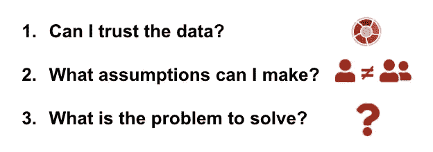
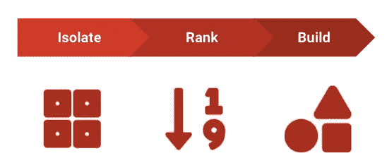
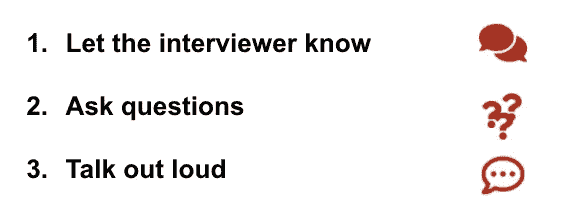

# 迎接 SQL 挑战

> 原文：<https://towardsdatascience.com/acing-the-sql-challenge-d8b8feb0a041?source=collection_archive---------4----------------------->

## 通过使用一个框架来帮助您解决技术难题，从而赢得下一次 DA 面试


照片由[戴恩·托普金](https://unsplash.com/@dtopkin1?utm_source=medium&utm_medium=referral)在 [Unsplash](https://unsplash.com?utm_source=medium&utm_medium=referral) 上拍摄

如果你是一名数据分析师，目前正在找工作，你可能需要准备技术面试，最常见的形式是 SQL 挑战。结构化查询语言(SQL)是数据分析的基础。它是与数据库通信的语言，有助于检索、清理和分析信息。因此，招聘委员会想知道候选人使用 SQL 查询数据库的舒适程度是很自然的。

在这篇文章中，我不会分享 SQL 挑战的*什么*(我需要知道什么？应该准备哪些问题？有哪些资源可以帮我准备？)而是如何思考:我应该如何思考这个问题？怎么分解？我如何向面试官传达潜在的挑战？有时候，有一个参考框架来处理困难的情况比重复经历困难的情况要好。这篇文章就是要给你一个参考框架。

好了，说够了，让我们开始吧！😄

# 我从哪里开始？

在进入问题之前，问自己以下问题:



作者图片

## 我能相信这些数据吗？

通常，数据集不会以一个整洁的小包的形式提供给分析人员——你会看到两次记录的电子邮件地址、大量的空值、拼写错误等。对数据表示怀疑。有重复的值吗？是否有信息缺失？我需要从最终输出中排除异常值吗？我是否应该对数据执行转换(例如，删除一系列数字中的破折号)？虽然在面试中清理数据不是你的工作，但是你要确保你有所有的拼图来解决你被问到的问题。不要假设你正在处理的数据是原始的。在现实生活中，从来都不是。

```
**--identifying duplicate values**SELECT column_name, COUNT(*)
FROM table_name
GROUP BY column_name
HAVING COUNT(*) > 1**--identifying blank values** SELECT column_name
FROM table_name
WHERE column_name IS NULL**/*transforming a column that contains 
SSN information (can be both a series
of digits only or a series of digits
and dashes)*/**
SELECT 
    ssn, 
    REPLACE(ssn, '-', '') AS transformed_ssn
FROM table_name
```

## **我应该做哪些假设？**

虽然数据争论是一个重要的步骤，但你可能有 30 到 60 分钟来解决这个挑战。考虑到时间限制，做出假设并继续前进是很重要的。确保明确传达你将做出的假设。如果你不确定自己的假设是否正确，可以问面试官你的思路是否正确。您不希望在分析过程中走得太远，却发现自己没有做出正确的假设(或者没有意识到这一点，结果与预期结果相差甚远)。

## **有什么问题需要解决？**

这就是你的大局。想想你试图解决的问题。虽然 SQL 挑战可能会要求您做 x 或 y，但您实际被要求做的是什么？同样，确保向面试官重述问题。这有助于两个原因:(1)你展示了你的沟通技巧；(2)确保你和面试官在同一条线上。

# 如何分解这个问题？

这就是面试的精髓(也可能是你为什么还在读这篇文章的原因！).您将花费大约三分之二的时间在这里，建立您的逻辑，分析数据并测试它，以确保它运行并返回预期的输出。*提醒一句:不要每 5 秒钟就按一次“运行”按钮，希望输出能帮助你解决问题。*真正坐下来解决问题，做自己的查询解释器，一行行地运行，了解每一步会发生什么。

这一步实际上取决于您被问到的问题，但是您可以使用以下框架来帮助您完成 SQL 挑战:**隔离，排名，构建**。



作者形象

## 孤立的

第一步是隔离解决难题所需的不同部分。一个困难的 SQL 挑战可能看起来令人望而生畏。这就是为什么将它分解成更小的单元很重要，这些单元更容易自己解决。为此，您需要查看问题并确定这些单位是什么。

## 军阶

下一部分是确定如何对每个要解决的单元进行优先排序。在把每一个都隔离成易于处理的小块之后，你应该先处理哪一个？为什么？一个要记住的小技巧:开始一般，结束具体。首先获取您需要的数据，然后进行聚合。

## 建设

最后一步是为您已经确定的每个单元构建逻辑。此时，您已经编写了伪代码，可能是一些 SQL 来探索数据并了解如何解决问题。现在是编写查询构建块的时候了。这就是您所有 SQL 知识派上用场的地方:CASE 语句、JOIN 类型、窗口函数、通用表表达式(cte)和子查询都是您可以随身携带的好工具。

# 我卡住了——我该如何继续？

您可能不知道如何继续。去过那里，做过那个。首先，放松。深呼吸。当面对复杂的问题时，一个失控的大脑不会有太大的好处。第二，记住面试是一次对话。面试官想知道当一个困难的情况摆在你面前时，你会有什么反应。你会坚持还是放弃？在寻求指导之前，您会寻求帮助还是试图自己解决问题？你的思维过程是什么？

如果您卡住了，以下是一些可以帮助您的提示:



作者形象

## 让面试官知道

确保让面试官知道你卡住了。告诉他们在哪里以及为什么。它会有所帮助，原因有几个:(1)您可能最终会回答自己的问题——沟通挑战可以帮助您识别一条您可能最初错过的重要信息，但它可以帮助您解决您正在处理的问题(2)您没有浪费时间茫然地盯着屏幕或白板(疫情时代之前！)不知道如何继续(3)你表现出谦逊和合作的意愿，这是你在任何角色中的关键品质。

## 提问

没有一个数据分析师能提供这项工作所需的所有答案和技术。阿达成功的一个重要因素是能够提出好的问题。在面试中，你想通过问一些澄清的问题来展示你的好奇心和解决问题的能力。你不会因此受到惩罚。然而，对你问的问题要有策略。如果你因为不知道 SELECT 语句的基本结构而陷入困境，你可能应该在参加面试之前复习一下基础知识。

## 大声说出来

解决挑战性问题的一种方法是大声说话。您可以使用淘汰过程来了解如何继续挑战。“我应该在桌面上进行自我加入吗？可能不会，我不需要用不同的方式从同一个表中获取相同的信息。使用 CTE 获取我需要的信息并加入其中怎么样？可能，但我没有说明我被要求做的两种聚合。”等等。这将有助于你缩小解决方案的范围，同时让面试官看到你是怎么想的，以及如果你仍然陷入困境，该给出什么样的提示。

# 结论

框架是一种很好的方式来组织您的思想，并指导您完成复杂的 SQL 挑战。要了解其他分析师如何处理 SQL 问题，您可以查看蒂娜·黄的 [SQL Sundays](https://www.youtube.com/playlist?list=PLVD3APpfd1tuXrXBWAntLx4tNaONro5dA) 播放列表。在 5 到 10 分钟的视频中，她逐步演示了如何解决 SQL 挑战。

虽然使用框架会有所帮助，但你仍然需要大量的练习才能在技术面试中胜出。以下是准备技术面试的绝佳资源:[“如何应对数据科学面试:SQL”](/how-to-ace-data-science-interviews-sql-b71de212e433)、[、【你必须准备的 SQL 面试问题】、](/sql-interview-questions-you-must-prepare-the-ultimate-guide-12f0546bfb8f)、[、【破解 SQL 面试】](https://github.com/xoraus/CrackingTheSQLInterview)你可以使用 [Leetcode](https://leetcode.com/problemset/database/) 、 [InterviewQuery](https://www.interviewquery.com/) 、 [Codewars](https://www.codewars.com/collections/sql-kata) 、 [Stratascratch](https://www.stratascratch.com/) 等平台练习 SQL 挑战。

在我的下一篇文章中，我将一步一步地介绍 SQL 挑战——敬请期待！

*本帖最后编辑于 2021 年 10 月 8 日。这里表达的观点仅属于我自己，并不代表我的雇主的观点。*