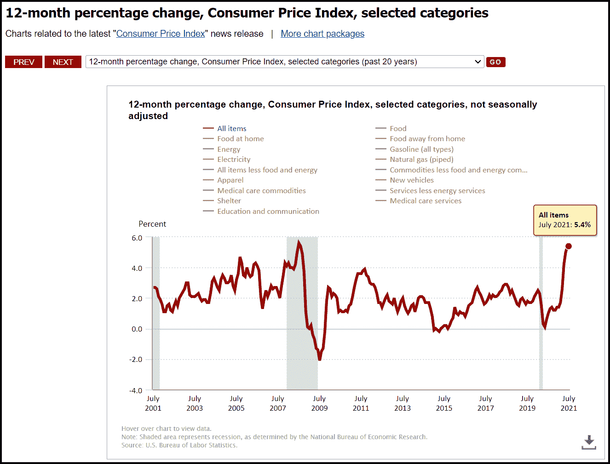
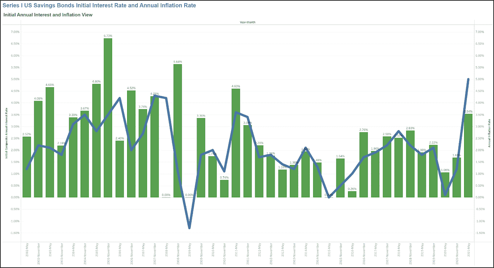
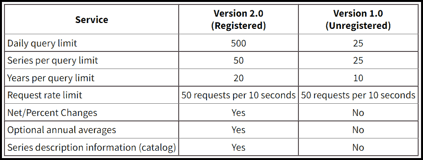
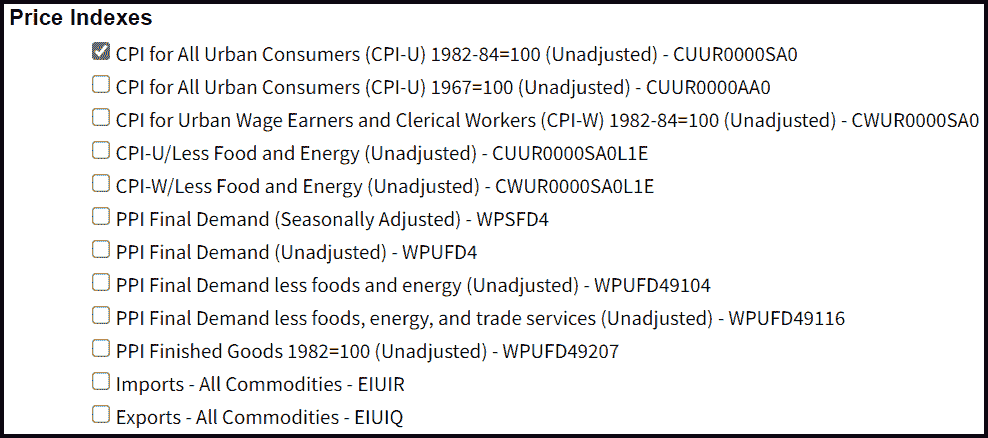
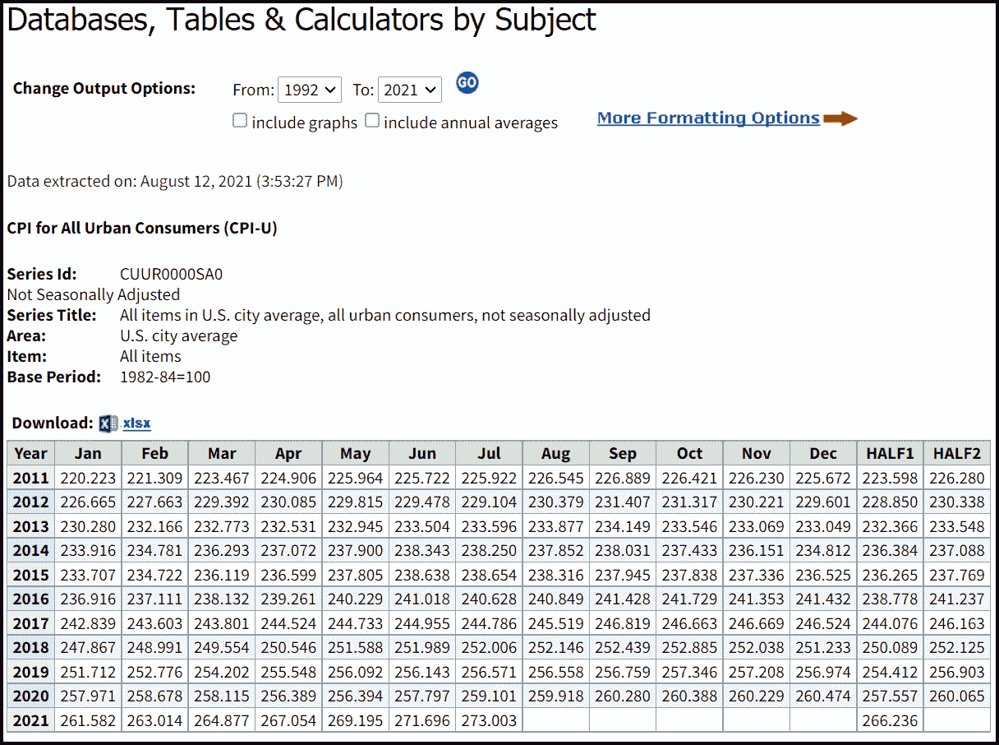
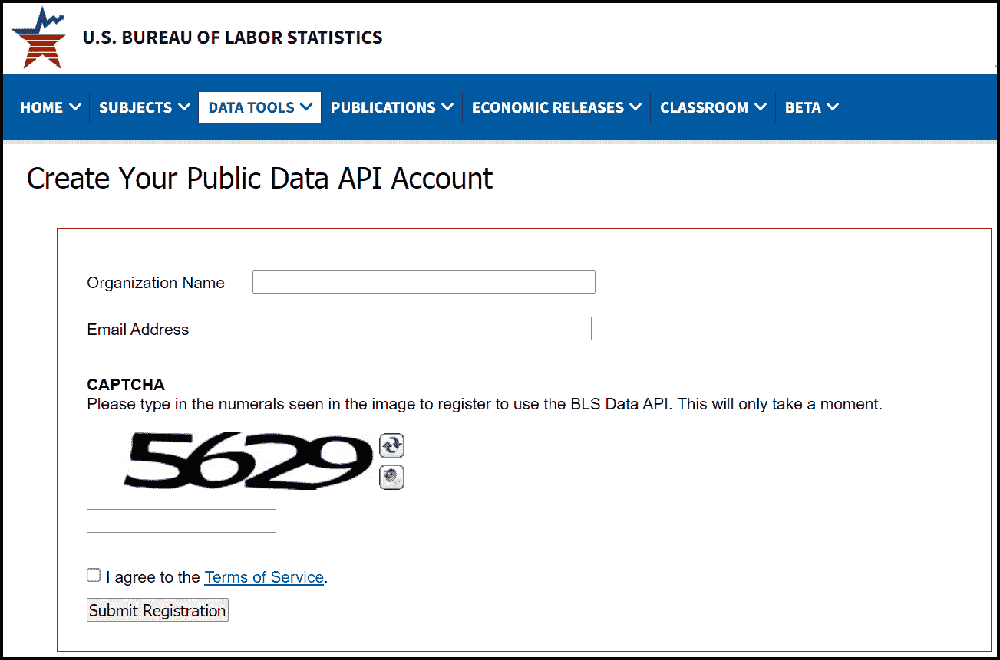
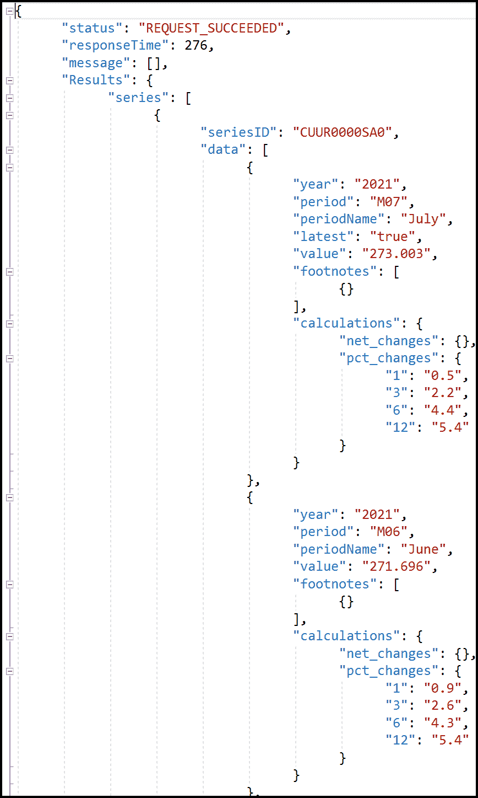
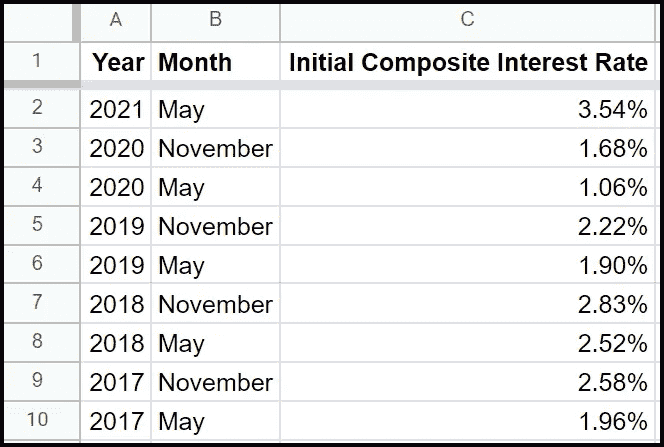
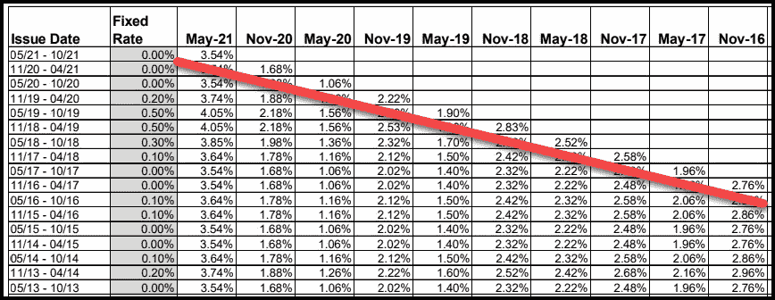

# 使用 API、Python 和 Tableau 获取和分析美国的通货膨胀数据

> 原文：<https://towardsdatascience.com/acquire-and-analyze-inflation-data-in-the-us-with-an-api-python-and-tableau-ae81944bcbb0?source=collection_archive---------12----------------------->

## 数据、通货膨胀、数据分析、Python 和 Tableau

## 使用 Python 和美国劳工统计局数据 API 检索消费者价格指数数据。将数据加载到 Tableau 中，与系列 I 美国储蓄债券初始综合利率进行比较。

莎伦·麦卡琴在 [Unsplash](https://unsplash.com/s/photos/consumer?utm_source=unsplash&utm_medium=referral&utm_content=creditCopyText) 上的照片

# 介绍

2021 年 8 月初，美国劳工统计局(BLS)报告称，截至 2021 年 7 月，整个秋季的[消费者价格指数](https://www.bls.gov/cpi/overview.htm) (CPI)同比增长 5.4%。根据 BLS 的说法，CPI“是对城市消费者购买一篮子消费品和服务的平均价格变化的衡量”通胀基准上次超过这一水平是在 2008 年 7 月，当时达到 5.6%。

CPI 是一种用来衡量长期通胀(和通缩)的指标。这是一个经济指标，衡量消费者的购买力随着时间的推移。

所有项目的消费价格指数(CPI)，12 个月百分比变化，按年份。作者截图。

虽然 BLS 的消费物价指数网页以各种方式描述数据，BLS 也提供许多数据工具来访问和查看数据。本文将向您展示如何使用 BLS 数据 API 和 Python 来获取 CPI 数据。它还将显示一个在 Tableau 中创建的图表，以比较 CPI 值和 I 系列美国储蓄债券的通胀率。

# 示范项目

本文描述了我用来获取 CPI 通胀数据和 I 系列美国储蓄债券利率的过程，以便在数据分析项目中使用这些数据:

1.  编写一个使用 BLS 数据 API 从 BLS 服务器获取 CPI 数据的 Python 程序。API 将返回 JSON 结构中的数据，程序将把这些数据写入文件。
2.  创建一个 Google Sheets 电子表格，其中包含美国财政部在其 TreasuryDirect.gov 网站上发布的 I 系列储蓄债券利息数据。
3.  使用 Tableau 公共数据可视化工具集创建一个混合 CPI 和储蓄债券利率数据集的仪表板，并以可视化方式显示数据。
4.  将 Tableau 可视化(如下面显示的仪表板)发布到 Tableau 公共网站。

使用 Tableau Public 创建的示例“第一系列美国储蓄债券初始利率和年通货膨胀率”仪表板。信用——作者。

# BLS 数据 API 概述

BLS 提供了两个版本的公共数据 API。2.0 版本需要注册，并允许用户更频繁地访问更多数据。它还允许用户在请求中添加计算和年平均值。1.0 版本更简单，对公众开放，无需注册。我将展示如何使用 API 的 2.0 版本，因为它提供了比 1.0 版本更好的优势:

*   它可以检索 20 年的数据，而不是 10 年。
*   它可以根据 CPI 原始值计算周期性通货膨胀率(以 1、3、6 和 12 个月为间隔)。

BLS 数据 API 版本 1.0 和 2.0 的功能和限制。

虽然这里描述的项目使用 Python 编程语言，但 BLS 数据 API 支持许多语言和环境，包括:

*   C#
*   Java 语言(一种计算机语言，尤用于创建网站)
*   服务器端编程语言（Professional Hypertext Preprocessor 的缩写）
*   稀有
*   Ruby/Ruby on Rails
*   斯堪的纳维亚航空公司
*   矩阵实验室
*   朱莉娅
*   UNIX 命令语言

# BLS 数据系列

这里描述的项目使用 CPI 数据，但是程序员和数据分析师可以使用 BLS 数据 API 来检索许多其他类型的数据。BLS [Top Picks](https://data.bls.gov/cgi-bin/surveymost?bls) 页面提供了一个流行数据系列的列表。CPI 是一个价格指数。BLS 还提供就业、薪酬和生产率数据集。

流行的 BLS 价格指数数据集。作者截图。

在这次演示中，我将使用“所有城市消费者的 CPI…—cuur 0000 sa 0”数据系列。点击页面的[检索]按钮，返回如下所示的数据。

BLS 网站上的 CPI 查询工具。作者截图。

# 注册 BLS 数据 API 2.0 版

要使用 BLS 数据 API 2.0 版的全部功能，请使用您的组织名称(或个人姓名)和电子邮件地址注册一个密钥。如果请求成功，BLS 将通过电子邮件向您发送密钥值。

BLS 数据 API 2.0 版注册表。作者截图。

# 获取 CPI 数据并将其写入文件的 Python 代码

您可以从 Github 中的 [bls_data_api 项目的 BLS 数据 API 下载示例 Python 代码来获取 CPI 数据。代码如下所示，包含以下两个源文件:](https://github.com/rruntsch/bls_data_api.git)

**c_bls_data_api.py** —该文件中的 c_bls_data_api 类是一个简单的 Python 类，可用于通过 bls 数据 api 从大多数可用数据集中检索数据。

**get_bls_cpi_data.py** —该文件中的代码为 bls 数据 API 构建输入参数(作为 JSON 结构)，以请求 2002 年到 2021 年的 cpi 数据。然后，它使用数据 api 参数和要将返回的 JSON 数据文件写入的文件名调用 c_bls_data_api 类的构造函数。

## c_bls_data_api.py 类

这个类有两个函数，构造函数 __init__()和 get_report()。请查看下面代码中的注释，以了解它们所做工作的摘要。

在 get_report()函数中，注意对 requests.post()的调用包括 BLS 数据 API 的以下基本 URL:

*' https://API . bls . gov/public API/v2/time series/data/'*

URL 后面是数据(这些参数指定将要检索的数据)和头(指示 post()函数其输出将采用 JSON 格式)。

## get_bls_cpi_data.py 文件

这个文件是主控制器。它只是打印程序已经启动，构建调用 c_bls_data_api 构造函数所需的参数，调用构造函数，并打印程序已经完成。在这种情况下，' CUUR0000SA0 '的 *seriesid* 值*表示程序将检索 CPI 数据。*

在对 json.dumps()的调用中，确保将“PasteYourKeyHere”替换为您在注册使用 BLS 数据 API 2.0 版时收到的注册密钥。

## 运行程序并检查输出

我在 Microsoft Visual Studio 中创建了这个 Python 项目。您可以使用您喜欢的 Python 环境。

加载程序后，请参见文件 c_bls_data_api.py 的第 15 行中对 c_bls_data_api()类构造函数的调用。请注意，该示例将输出文件设置为“D:/project _ data/CPI/CPI _ data _ report . JSON”。将驱动器、文件夹和输出文件名更改为您喜欢的任何值。

运行程序，并根据需要进行故障排除。工作时，它将创建一个名为 cpi_data_report.json 的输出文件，其中包含从 2002 年到 2021 年的 cpi 数据。在编辑器中打开 JSON 文件。它应该类似于下面的代码片段。

请注意，对于 *year* 字段中的每一年， *periodName* 字段包含月份的名称。*百分比变化*部分的字段 *12* 包含过去 12 个月的 CPI 百分比变化。这个值就是年通货膨胀率。

摘自 cpi_data_report.json 文件，由示例 Python 程序创建，该程序使用 BLS 数据 API 获取 cpi 数据。信用——作者。

# 获取 I 系列储蓄债券利息数据

在我运行 Python 程序来获取 CPI 数据并将其写入 JSON 文件后，我在 Google Sheets 中创建了一个电子表格来记录 I 系列美国储蓄债券的初始复合利率。

摘自 2002 年至 2021 年每年 5 月至 10 月和 11 月至 4 月发行的系列 I 美国储蓄债券的初始复合利率文件。信用——作者。

债券的[复利](https://www.treasurydirect.gov/indiv/research/indepth/ibonds/res_ibonds_iratesandterms.htm)确定如下:

*   每年 5 月和 11 月，确定未来 6 个月内发行的债券的综合年利率。
*   复利由固定利率加上通货膨胀率组成。固定利率在债券有效期内保持不变，而通货膨胀率每六个月调整一次。

我无法找到 Tableau 可以随时下载的美国储蓄债券利率表，所以我手动将利率从 TreasuryDirect 网站上的 [I 债券利率图表 PDF 文件](https://www.treasurydirect.gov/indiv/research/indepth/ibonds/IBondRateChart.pdf)(见下面的摘录)转录到名为[I 系列储蓄债券利率](https://docs.google.com/spreadsheets/d/1GiV0VxpwEnROhYbaVXYbhUKCG1HhBVv0fHS4NeBIndo/edit?usp=sharing)的 Google Sheets 文件。您可以复制这个公共文件以在 Tableau 中使用。

摘自财政部指令系列一美国储蓄债券利率表。红线以上的数字代表债券发行时的初始综合利率。作者截图。

# Tableau Public 中的通货膨胀率和系列 I 利率仪表板

Tableau Public 是功能强大的 Tableau 数据可视化软件的免费版本。为了比较和查看 I 系列美国储蓄债券的年通胀率和初始复合利率的趋势，我将 JSON 文件和利率电子表格(如上所述)导入 Tableau Public。然后，我创建了一个复合条形图/折线图，如下所示，它描述了这些数据。

虽然 BLS 每月都会发布新的 CPI 数据，但财政部会在 5 月和 11 月调整 I 系列债券的利率。为了比较这两个值，下面的图表只显示了五月和十一月的值。

你可以[在这里](https://public.tableau.com/views/SeriesIUSSavingsBondsInitialAnnualInterestRate/InterestandInflation?:language=en-US&:retry=yes&:display_count=n&:origin=viz_share_link)查看仪表盘。请随意[安装 Tableau Public](https://public.tableau.com/) 并复制一份仪表盘供您使用。

使用 Tableau Public 创建的示例“第一系列美国储蓄债券初始利率和年通货膨胀率”仪表板。信用——作者。

# 摘要

经济学家和其他人使用 CPI 数据来衡量美国消费者的购买力。虽然本文描述了一个使用 BLS 数据 API 2.0 版获取数据的 Python 程序和一个 Tableau Public dashboard 来比较 CPI 和 Series I 储蓄债券初始综合利率，但是 CPI 指数有多种用途。例如，它可用于以下目的:

*   来衡量美元的购买力。
*   供政府机构、企业和消费者用来对经济做出明智的决策。
*   美国政府可以用它来决定政府项目的资格，如社会保障。
*   政府机构和企业可以把它作为决定员工工资的一个因素。

# 资源

[如何购买 I 系列美国储蓄债券以抵御通胀](https://rruntsch.medium.com/how-to-buy-series-i-us-savings-bonds-to-protect-against-inflation-4afa9e2ccfb8)

[劳动统计局数据 API](https://www.bls.gov/developers/)

[美国财政部国库指令](https://www.treasurydirect.gov/)

[W3schools Python JSON 教程](https://www.w3schools.com/python/python_json.asp)

[Tableau Public](https://public.tableau.com/)