# 使用 Python 和 Tableau 获取和分析天气和气候数据

> 原文：<https://towardsdatascience.com/acquire-and-analyze-weather-and-climate-data-with-python-and-tableau-4878e8759152?source=collection_archive---------1----------------------->

## 美国国家海洋和大气管理局(NOAA)存储了大量的天气和气候数据。了解如何编写 Python 程序来调用 API 来检索数据，并使用 Tableau Public 或其他可视化工具对其进行分析。

戏剧性的云。照片由 [Unsplash](https://unsplash.com/s/photos/weather?utm_source=unsplash&utm_medium=referral&utm_content=creditCopyText) 上的 [NOAA](https://unsplash.com/@noaa?utm_source=unsplash&utm_medium=referral&utm_content=creditCopyText) 提供。

天气和气候数据是宝贵的资源，不仅可以预测天气，还可以用于行业、政府和个人生活中的许多目的。将数据分析和数据科学技术应用于这些数据以通知和支持决策的机会几乎是无穷无尽的。

NOAA 的[国家环境信息中心](https://www.ncdc.noaa.gov/) (NCEI)是世界上最广泛的天气和气候数据收集中心。它的数据库包含超过 37pb 的大气、海岸、海洋和地球物理数据。本文描述了数据、如何下载其数据文件，以及使用调用其数据服务 API 的 Python 程序获取数据的说明。它还演示了一个 Tableau 公共仪表板，以可视化使用 API 检索的一组示例风数据。

# 天气和气候数据的使用

天气和气候数据服务于社会的多种需求。以下是一些例子:

*   **农业** —农民可以利用天气数据来决定何时种植和收获作物，施用化肥和除草剂，等等。
*   **过敏** —天气在过敏季节起着重要作用，尤其是对那些与花粉和其他植物材料有关的过敏。
*   **建筑和道路施工** —天气可能影响室外施工作业。
*   **土木工程** —设计桥梁、道路和隧道等结构的工程师必须意识到天气对这些结构及其材料的短期和长期影响。
*   **气候学** —气候科学家使用天气和气候数据来了解过去、现在和潜在的未来气候。
*   **服装和时尚**——我们穿的服装种类随着季节和天气条件的变化而变化。有些人根据季节选择他们的风格和颜色。
*   **应急管理** —应急管理人员使用天气和气候数据来确定灾难性事件的潜在风险，如野火、龙卷风、飓风和洪水。
*   **法医气象学** —法医气象学家分析天气数据，拼凑过去的天气事件。
*   **林业和土地管理** —林业工作者使用天气和气候数据来管理森林，了解干旱的影响，降低火灾风险，等等。例如，[美国林务局](https://www.fs.fed.us/naturalresources/weather/index.shtml)运营着一个广泛的自动气象站网络。
*   **人口迁移** —天气和气候是人们用来帮助他们决定居住地的因素。
*   **户外娱乐**——户外活动，如徒步旅行、航海、滑雪、露营、钓鱼和打猎，因季节和天气而异。人们评估历史气候和天气数据以及当前条件和预测，以选择户外活动的最佳时间。
*   **产品销售和营销** —例如，零售商使用天气数据来确定何时在商店中储备某些类型的商品，如泳衣或滑雪板。
*   **运输** —运输可能会受到天气的影响。例如，在冬天可能结冰的内陆水道上用驳船装运谷物和其他散装货物会受到天气的影响。
*   **旅游和旅行** —人们依靠天气和气候数据来计划去他们选择的目的地的短期和长期旅行。
*   **波浪活动和水动力影响** —来自安装在浮标上的气象仪器的数据可以帮助预测波浪和天气对海岸线和海滩的影响。
*   **天气预报** —气象学家使用气候和天气数据来帮助他们预测未来的天气。

# 数据概述

NCEI 是美国环境数据的主要权威。它管理着大量的大气、海岸、地球物理和海洋研究数据的档案。

NCEI 管理着各种各样的数据[产品](https://www.ncei.noaa.gov/products)，其中很多都是向公众开放的。不胜枚举，超出了本文的范围，下面是其数据产品类别的一些示例:

*   气温和大气特性
*   北极和海冰
*   生态系统和自然资源
*   地磁学
*   自然灾害、灾难和恶劣天气
*   海洋气候
*   沉淀
*   太空天气
*   美国和地区气候

# 下载天气和气候数据

除了应用程序编程接口(API)，NCEI 还提供了查找、请求和下载天气和气候数据的工具。

# 找到一个电台，订购并下载其数据

位于美国和世界各地的气象观测站收集了由 NCEI 管理的大部分气象数据。导航至 [*数据工具:查找电台*](https://www.ncdc.noaa.gov/cdo-web/datatools/findstation) 页面，按城市、县、州、邮政编码或国家搜索电台。

在下面的例子中，我使用 *Find a Statio* n 工具来搜索加利福尼亚州圣何塞的一个位置、每日摘要类别、日期范围 2000-01-01 到 2020-12-31 以及风数据类别。请注意地图上加利福尼亚州弗里蒙特和圣何塞的观测站符号。

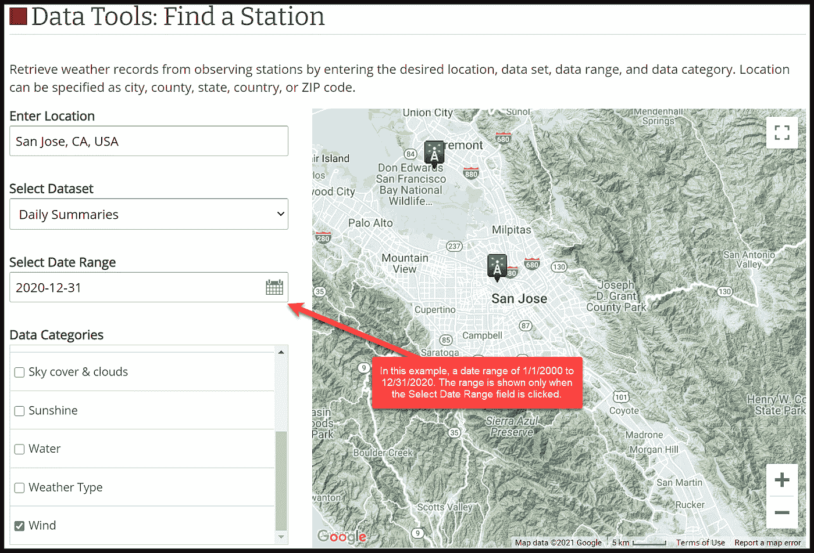

数据工具:找一个站。作者捕获的图像。

当我点击圣何塞的车站标志时，弹出一个*车站详情*窗口，如下图所示。请注意“GHCND:.”右侧的 ID 值的组成部分该值“USW00023293”是圣何塞国际机场观测站的唯一标识符。稍后将在调用 NCEI 数据服务 API 时使用该 ID，以通过编程方式检索该气象站捕获的气象数据。

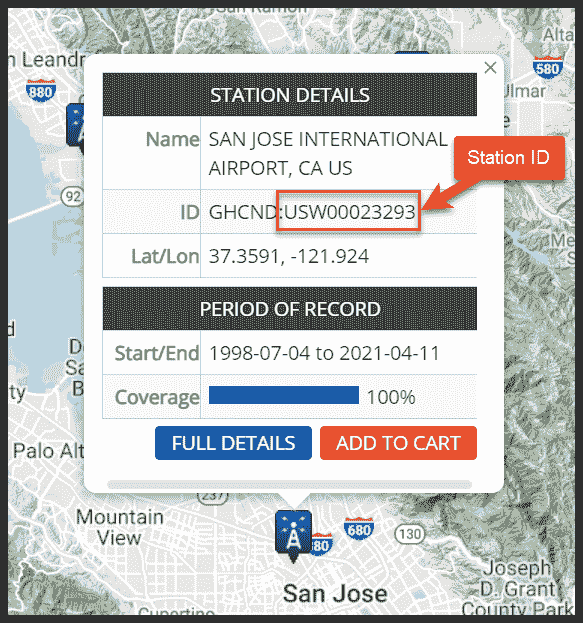

气象观测站详情。作者捕获的图像。

要开始检索此数据，请单击[添加到购物车]按钮。然后，单击屏幕右上角的[购物车(免费数据)…]按钮。

数据购物车按钮。作者捕获的图像。

在*购物车:每日摘要*页面上，选择“自定义 GHCN-每日 CSV”格式。此选项将导致下载逗号分隔值(CSV)文件中的风数据。文件格式类似于 Python 程序在调用数据服务 API 后保存的 CSV 文件。

查看搜索值，包括“日期范围”准备就绪后，单击[继续]按钮。

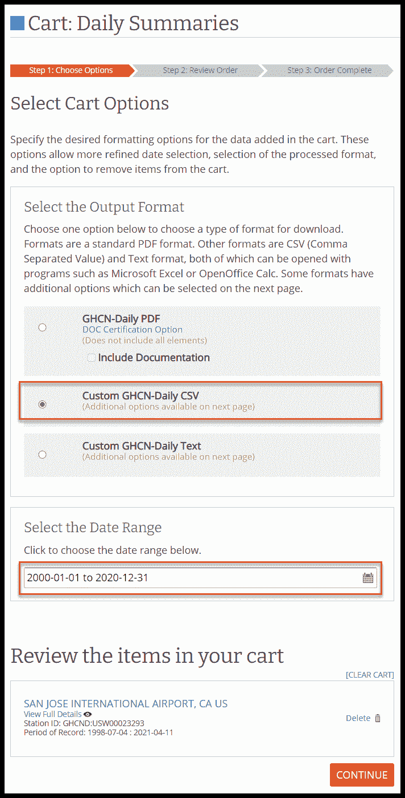

购物车:每日汇总页。作者捕获的图像。

在*自定义选项:每日摘要*页面上，进行如下图所示的选择。注意“标准”的*单位*值将以英里每小时(MPH)为单位返回风速值。选择“公制”将返回以米每秒为单位的风速值。

本文后面还将使用“平均风速(AWND)”数据类型来演示 Tableau Public 中数据的可视化。“最快 2 分钟风速(WSF2)”和“最快 5 分钟风速(WSF5)”数据类型仅用于演示。

“AWND”、“WSF2”和“WSF5”数据类型值将在稍后调用数据服务 API 时使用。

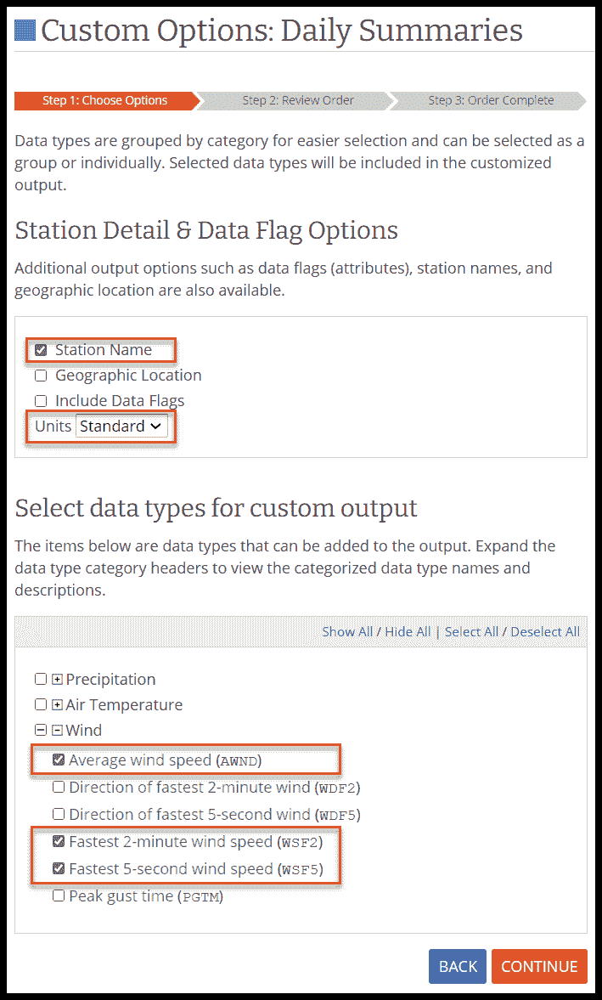

自定义选项:每日摘要页面。作者捕获的图像。

出现*查看订单*页面时，查看您的选择并输入两次您的电子邮件地址。准备好后，点击[提交订单]按钮。在几秒钟或几分钟内，NCEI 将向您发送第一封确认订单提交的电子邮件和第二封确认订单完成的电子邮件。完成电子邮件包含下载符合您选择标准的数据文件的链接。

气候数据在线请求电子邮件主题行。作者捕获的图像。

打开第二封“订单完成…”电子邮件。单击[下载]链接下载数据文件。

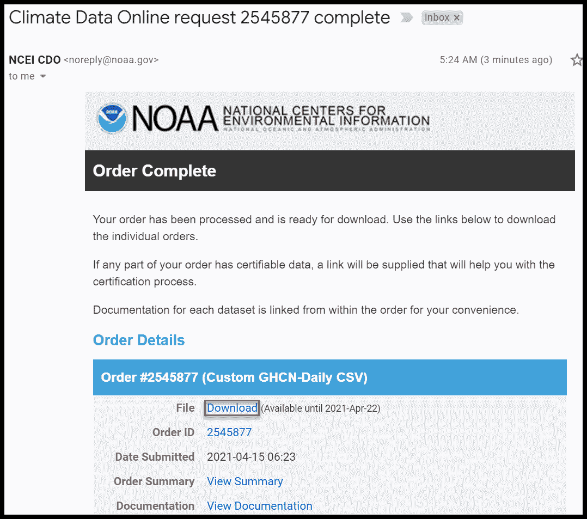

部分气候数据在线请求完成电子邮件。点击[下载]按钮下载数据文件。作者捕获的图像。

在文本编辑器中打开下载的 CSV 文件。它应该类似于下面显示的文件。注意，第一行中的列名(NCEI 称之为“数据类型”)对应于后续行中逗号分隔的数据值。

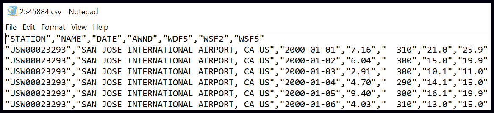

下载的每日风力数据 CSV 文件示例。作者捕获的图像。

# 其他数据搜索工具集

搜索观测站并选择和下载其数据是从 NCEI 数据集中检索数据的多种方法之一。使用 [*气候数据在线*](https://www.ncdc.noaa.gov/cdo-web/) 页面上的链接探索其他方法。

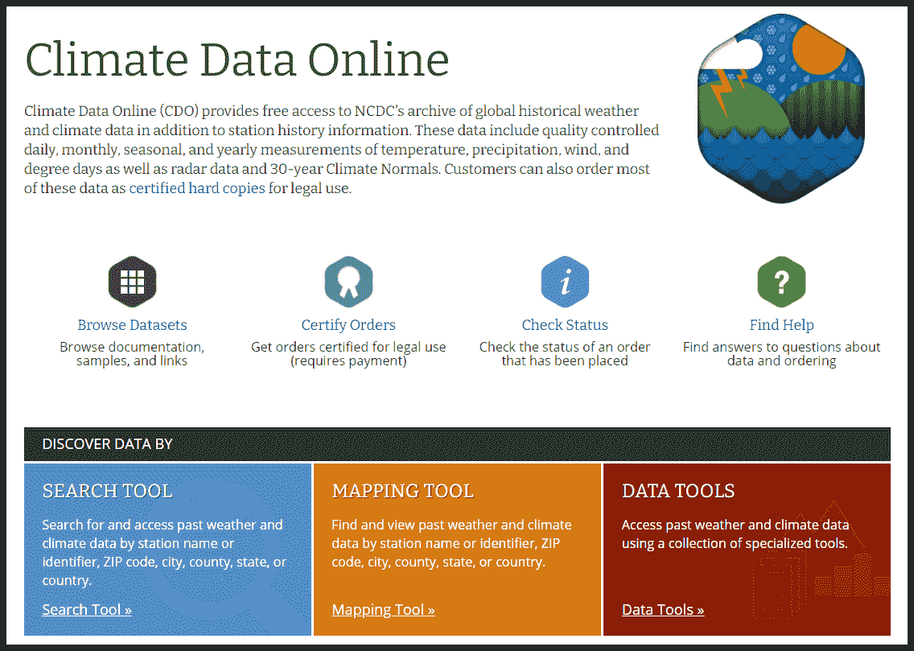

气候数据在线页面。图片由作者提供。

NOAA 还提供了一站式数据搜索平台，可以交互式地查找和查看各种数据。一些数据可供下载。

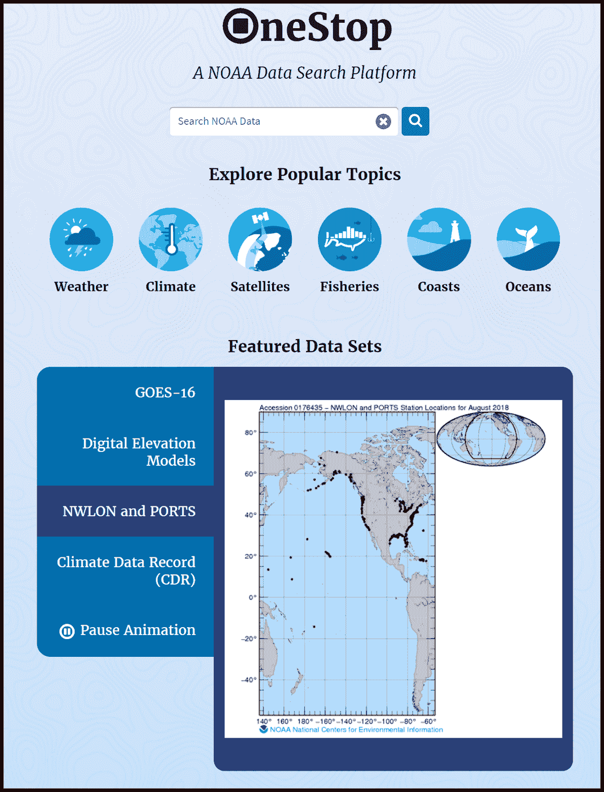

NOAA 一站式数据搜索平台主页。作者捕获的图像。

# 用 Python 调用 Access 数据服务 API

NCEI 提供了四个 RESTful APIs 来获取天气和气候数据。本文描述了如何使用数据服务 API 来获取几个气象站的每日汇总数据。

数据服务 API 根据发送到 web 服务器的参数和预定义的 URL 检索数据。请参见简短的[数据服务 API 文档](https://www.ncei.noaa.gov/support/access-data-service-api-user-documentation)了解其工作原理。

# URL 和参数

要使用数据服务 API，请将参数追加到此预定义的 URL:

[*https://www.ncei.noaa.gov/access/services/data/v1*](https://www.ncei.noaa.gov/access/services/data/v1)

下一节中描述的示例代码将查询 daily-summaries 数据集，以检索 2000 年 1 月 1 日至 2020 年 12 月 31 日期间美国几个地点每天的日平均风速值。API 返回 AWND 和其他风速值，单位为英里/小时(MPH)。要检索所需的数据，请将这些参数附加到上面显示的 URL 中:

*   **数据集** —“每日汇总”数据集提供汇总的每日天气数据，包括风数据。
*   **数据类型** —我们对本例中的日平均风速(‘AWND’)感兴趣。但是为了将来可能的使用，该参数值被设置为获得最快的 2 分钟风速(“WSF2”)和最快的 5 秒风速(“WSF5”)。要获得这三种类型，请将 dataTypes 参数值设置为“AWND，WSF2，WSF5”
*   **站** —在本例中，我们感兴趣的是这些站的日平均风速:芝加哥奥黑尔国际机场、罗彻斯特国际机场(明尼苏达州)和圣何塞国际机场。在逗号分隔的列表中向 API 提供这些工作站的标识符:“USW00094846、USW00014925、USW00023293”。在 [*数据工具中搜索电台 id:如本文前一节所述，查找电台*](https://www.ncdc.noaa.gov/cdo-web/datatools/findstation) 页面。
*   **开始日期** —将检索从 2000 年 1 月 1 日到 2020 年 12 月 31 日的记录。因此，在本例中，将设置值“2000–01–01”。
*   **结束日期** —因为我们对 2020 年的数据感兴趣，所以将该值设置为“2020–12–31”。
*   **边界框** —设置边界框值，从坐标内包含的地理位置选择数据。它包括四个逗号分隔的数字。南北从-90 度到 90 度，东西从-180 度到 180 度。对于此示例，将 boundingBox 设置为' 90，-180，-90，180 '。
*   **单位** —数值为“公制”或“标准”对于平均风速数据类型，“标准”值将以英里/小时为单位返回风速。

以下是将参数附加到基本 URL 后得到的完整 URL:

[https://www.ncei.noaa.gov/access/services/data/v1/?dataset = daily-summaries&data types = AWND，WSF2，WSF5 & stations=USW00094846，USW00014925，usw 00023293&start date = 2000-01-01&end date = 2020-12-31&bounding box = 90，-180，-90，180 & units=standard](https://www.ncei.noaa.gov/access/services/data/v1/?dataset=daily-summaries&dataTypes=AWND,WSF2,WSF5&stations=USW00094846,USW00014925,USW00023293&startDate=2000-01-01&endDate=2020-12-31&boundingBox=90,-180,-90,180&units=standard)

# Python 代码

## 类 c_ncei_data_service_api

文件 c_ncei_data_service_api.py 定义了 c_ncei_data_service_api 类。以下部分描述了它的功能。

**__init__()构造函数**

当程序创建 c_ncei_data_service_api 类的实例时，会调用 __init__()构造函数。它接受这些输入参数:

*   **数据集** —包含所需数据的 NCEI 数据集的名称。
*   **data_types** —从数据集中返回的字段。它由逗号分隔的字段名称列表组成。
*   **站** —这些是感兴趣的观测站的唯一标识符。该参数由逗号分隔的工作站 id 列表组成。
*   **开始日期时间** —要检索的数据的第一个日期。
*   **结束日期时间** —检索数据的最后日期。
*   **bounding_box** —参见上一节对 boundingBox 的描述。

该函数执行以下步骤:

1.  设置变量 self。_base_api_url 设置为 NCEI 服务数据 api 的基本 url 的值。
2.  使用输入参数调用 self.call_api()来检索请求的数据。

c_ncei_data_service_api 类模块顶部 __init__()函数的定义。注意“import requests”指令，这是使用 requests.get()向 NCEI 数据服务 API 提交请求所必需的。

注意:默认情况下，对 URL 的调用将返回 CSV 格式的数据。请参阅文档，了解为检索 JSON 和其他类型的数据而设置的参数。

**call_api()函数**

call_api()函数从指定的 NCEI 数据集中检索数据。它执行以下步骤:

1.  向基本 URL 追加参数以创建 full_url 变量。请注意，除了函数的输入参数之外，它还设置了 API 的“单位”参数。
2.  用 requests.get()函数提交 URL。产生的数据集(如果有)将被返回到“响应”变量中。
3.  将“response.text”变量返回到构造函数。

c_ncei_data_service_api 类模块中的 call_api()函数。该函数使用 requests.data()提交 NCEI 数据服务 API 请求的完整 URL。

**get_data()函数**

get_data()函数将数据集数据返回给它的调用者。

c_ncei_data_service_api 类模块中的 get_data()函数。

**write_data_file()函数**

函数的作用是:写 URL 调用返回的数据，并保存在 self 中。_dataset 变量转换为文本文件。它执行以下步骤:

1.  以写入模式打开参数中指定的文件。
2.  把价值写在自我里。_dataset 变量添加到文件中。
3.  关闭文件。

c_nei_data_service_api 类模块内的 write_data_file()函数。

## 控制器模块

控制器模块导入 c_ncei_data_service_api 模块，并执行以下步骤:

1.  使用 __init__()构造函数描述中描述的参数创建 c_ncei_data_service_api 类的实例。此步骤将从 NCEI 数据集中检索数据。
2.  将检索到的数据打印到显示器上。
3.  将检索到的数据写入指定的文件。

控制器模块创建并调用 c_ncei_data_service_api 类的一个实例。然后，它将从 API 返回的数据打印到屏幕上，并将其写入文件。

# 可能的类和程序改进

我开发 c_ncei_data_service_api 类和控制器模块是为了演示和学习的目的。以下是一些添加功能并使模块更加健壮和适合生产的想法:

*   添加**错误处理**以从错误中正常恢复，并在需要时重试部分代码。
*   将有关程序操作的信息，如开始和结束的日期和时间、错误信息、输入参数以及检索到的记录数量写入一个**日志文件**。
*   修改 **call_api()函数**来处理更多的输入参数，比如想要的输出数据格式(CSV、JSON、PDF 等)。

## 运行程序

运行控制器模块以创建 c_ncei_data_service_api 的实例，从 ncei 数据服务 api 检索所需的数据，显示数据，并将其写入文件。输出文件应该类似于下面显示的输出 *weather_data.csv* 文件中的示例。第一行包含列标题，而后面的行包含数据。

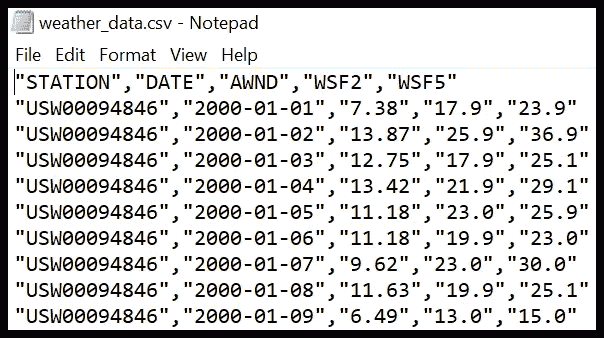

通过调用 NCEI 数据服务 API 检索 CSV 文件。作者捕获的图像。

# 其他 NCEI 原料药

虽然本文探索了数据服务 API 的使用，但 NCEI 也提供了这些 API:

*   [**搜索服务 API**](https://www.ncei.noaa.gov/support/access-search-service-api-user-documentation) —基于一组参数发现数据集和数据。
*   [**访问支持服务 API**](https://www.ncei.noaa.gov/support/access-support-service) —基于一组参数发现关于数据集的元数据和属性。
*   [**访问订单服务 API**](https://www.ncei.noaa.gov/support/access-order-service) —根据一组参数检索以前订单的信息。

在[访问页面](https://www.ncei.noaa.gov/access)了解更多关于 NCEI 数据集的信息。它提供了数据发现工具、数据访问信息和开发人员工具的链接，包括 API、地图服务目录、气候数据 web 服务和官方 NOAA GitHub 知识库。

# 分析 Tableau Public 中的数据

伊利诺伊州的芝加哥被称为“风城”我住在明尼苏达州东南部，那也是一个多风的地方。为了直观地比较芝加哥地区和明尼苏达州东南部最大的城市罗切斯特的日平均风速，我在 Tableau Public 中加载了用数据服务 API 检索的数据。在那里，我创建了一个*日平均风速的仪表盘。我儿子住在加州圣何塞附近，所以圣何塞国际机场的风速也会显示出来。*

*结果令我吃惊。罗切斯特国际机场(明尼苏达州)的风速一直高于芝加哥奥黑尔国际机场。这两个机场的风力都比圣何塞国际机场大得多。*

*从 2000 年到 2020 年，这些位置的日平均风速为英里每小时:*

*   *罗切斯特国际机场(明尼苏达州)——11.31 英里/小时*
*   *芝加哥奥黑尔国际机场——9.52 英里/小时*
*   *圣何塞国际机场——6.44 英里/小时*

*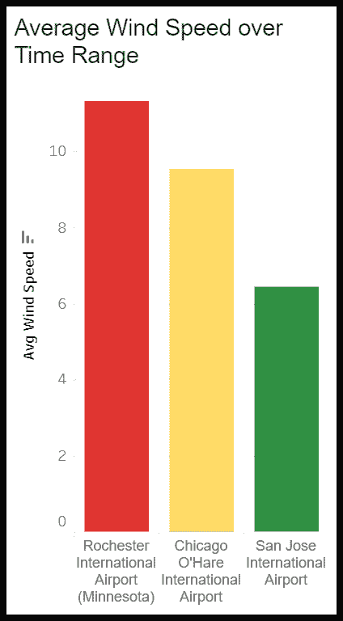*

*2000 年至 2020 年三个地点的日平均风速。作者捕获的图像。*

*仪表板还显示了年、月、年和季节的日平均风速。北半球的气象季节定义如下。*

*   *春天——三月、四月和五月。*
*   *夏季——六月、七月和八月。*
*   *秋季——九月、十月和十一月。*
*   *冬季——十二月、一月和二月。*

*资料显示，春天和冬天是罗切斯特和芝加哥风最大的季节，夏天最平静。圣何塞全年风力相对较小。*

*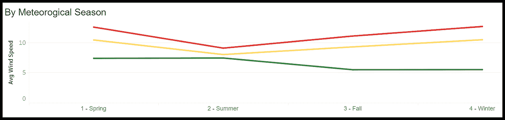*

*2000 年至 2020 年三个地点按季节的日平均风速。作者捕获的图像。*

*为本文准备的仪表板图代表了 Tableau Public、Tableau 和 Microsoft Power BI 等工具中数据可视化的一小部分可能性。*

# *摘要*

*天气和气候数据是宝贵的资产，数据分析师和数据科学家可以利用这些资产为个人和组织提供信息，并支持各方面的决策。美国国家海洋和大气管理局的 NCEI 服务拥有超过 37pb 的数据，管理着巨大的资产。它还提供了各种用户友好的搜索和下载工具，以及一组 API，使数据对任何人都可用。*

*您可以随意使用和修改 c_ncei_data_service_api Python 类和控制器模块来查询各种天气数据集，以满足您的需求。通过 API 和程序访问数据提供了一种将天气和气候数据集成到数据分析或数据科学解决方案、网站或软件应用程序中的方法。*

*Randy Runtsch 是一名作家、数据工程师、数据分析师、程序员、摄影师和自行车手。他和妻子住在美国明尼苏达州东南部。*

*Randy 撰写了大量关于利用公共数据集中的数据的文章。参见最近的文章， [*使用 Data.gov 上编目的公共数据集来推动数据科学项目*](/use-public-datasets-cataloged-on-data-gov-to-power-data-science-projects-1a7d84e9212b) ，以了解在[data.gov](https://www.data.gov/)上编目的 280，000+政府数据集的收集情况。*