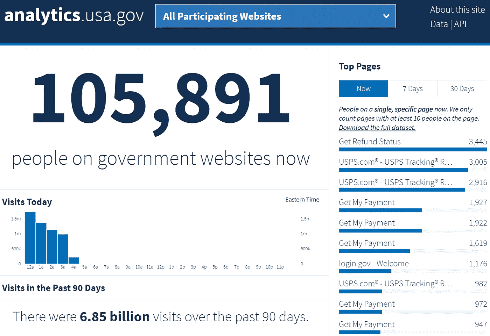
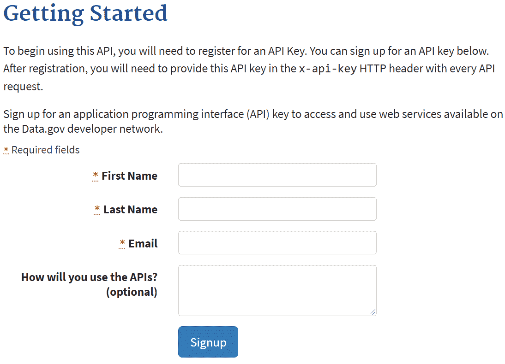
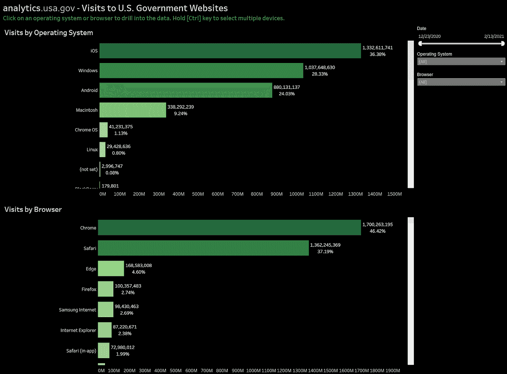
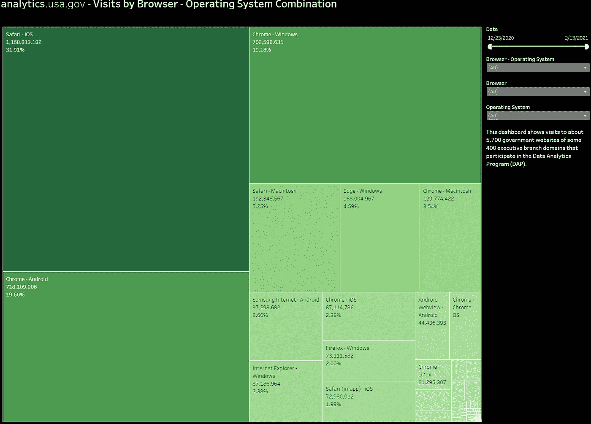
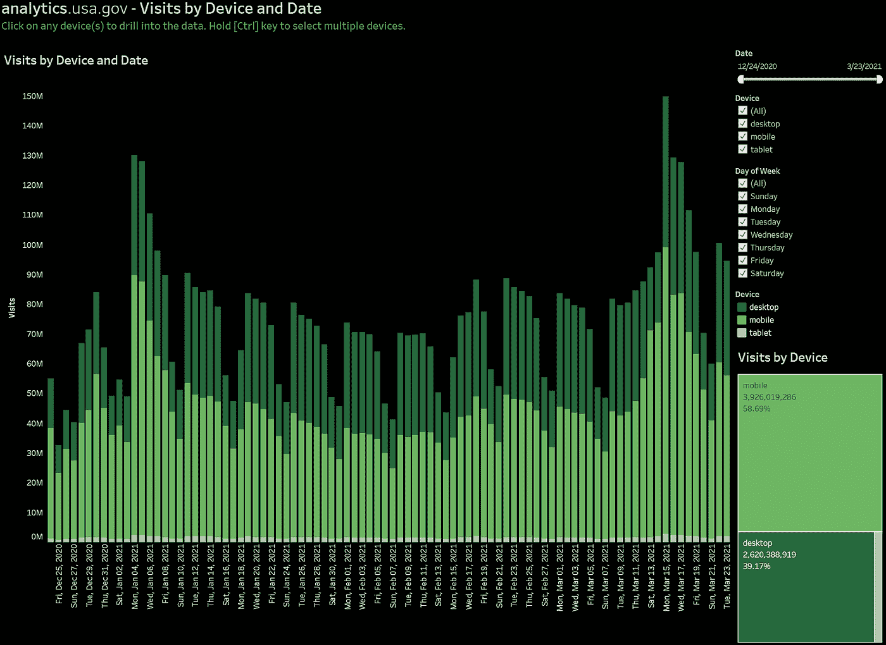

# 如何用 Python 和 Tableau 获取和分析 analytics.usa.gov 的数据

> 原文：<https://towardsdatascience.com/acquiring-and-analyzing-data-from-analytics-usa-gov-with-python-and-tableau-b61870ea065c?source=collection_archive---------25----------------------->

## analytics.usa.gov 免费提供的数据提供了人们如何在网上与美国政府互动的见解。本文向您展示了如何通过下载以及使用 Python 程序和 API 来访问站点的报告。

# 什么是 analytics.usa.gov？

analytics.usa.gov 提供了人们如何与美国政府在线互动的数据。美国总务管理局(GSA)的数字分析计划(DAP)运营该网站。它的数据提供了关于公众如何访问大约 [400 个行政部门域名](https://analytics.usa.gov/data/live/second-level-domains.csv)上的[5700 个政府网站](https://analytics.usa.gov/data/live/sites.csv)的洞察。

美国政府的 analytics.usa.gov 网站提供关于公众访问大约 5，700 个面向公众的政府网站的公开报告。作者捕获的图像。

这篇文章描述了公众可以从 analytics.usa.gov 下载的政府网站使用数据。它还展示了如何使用 Python 程序和 API 以 JSON 流的形式检索数据。最后，它展示了几个用于分析数据子集的 Tableau 公共仪表板。

# 可用数据集

用户可以下载下面列出的[数据集，作为 CSV 或 JSON 文件](https://analytics.usa.gov/data/)。他们还可以调用测试 API 来检索数据。本文稍后将演示如何从 Python 程序调用 API。

## 参与机构的访问量和流量来源

**报告每日更新**

*   过去 30 天内对所有域的访问
*   昨天下载量最高的
*   过去 30 天的主要流量来源
*   过去 30 天的热门退出页面

**报告每 5 分钟更新一次**

*   人们在某个时间点访问的所有页面
*   某一时间点的在线总人数

## 参与机构的访客人口统计

**报告每日更新**

*   语言
*   台式机/手机/平板电脑
*   网络浏览器
*   Internet Explorer 的版本
*   操作系统
*   Windows 版本
*   操作系统和浏览器(组合)
*   Windows 和浏览器(组合)
*   Windows 和 IE(组合)
*   屏幕尺寸
*   设备型号

**报告每 5 分钟更新一次**

*   每个国家的游客
*   每个城市的游客

# 使用 Python 和 API 访问数据

DAP 已经开发了[analytics.usa.gov API](https://open.gsa.gov/api/dap/)来以编程的方式检索 JSON 流形式的报告。在测试阶段，我发现这个 API 在一个简单的测试中运行良好。要使用 API，请通过提交一个请求表单来注册一个密钥，如下所示，其中包含您的姓名和电子邮件地址。当您按下[注册]按钮时，表单将立即返回 API 密钥。

程序员必须申请一个 API 密钥来使用 analytics.usa.gov API 检索报告。作者拍摄的图片。

文件 [openapi.yaml](https://open.gsa.gov/api/dap/#openapi-specification-file) 记录了 api 规范。YAML 代表 YAML 不是标记语言。用代码编辑器或文本编辑器打开 YAML 文件。

## 程序设计环境

我用这些免费工具在我的 Windows 10 PC 上编写并执行了这个程序:

*   [Python 3 . 9 . 2](https://www.python.org/downloads/)——Python 3 的任何版本都可能工作。
*   Microsoft Visual Studio Communityfor Windows——我的大部分代码都是用 Visual Studio 编写的。但是任何支持 Python 的编辑器或集成开发环境(IDE)都应该可以工作。注意，Visual Studio 的 Macintosh 版本不支持 Python。

## 代码逻辑

下面的示例程序执行这些步骤来调用 API，以 JSON 流的形式下载一个报告，并将其保存到一个文件中:

1.  调用 c_analytics_usa_gov_api 类的构造函数。指定所需的报告名称和 JSON 输出文件名。
2.  打开 JSON 输出文件进行写入。
3.  调用 API 来检索报告。
4.  将报告数据流写入 JSON 文件。
5.  关闭 JSON 文件。

## Python 模块

该程序使用[请求](https://pypi.org/project/requests/)和 [json](https://docs.python.org/3/library/json.html) Python 模块。要安装这些模块，请从命令行调用这些命令，或者如果支持，在您的开发工具中调用这些命令:

*   pip 安装请求
*   pip 安装 json

## 控制器模块

控制器模块文件 call_analytics_usa_gov_api.py 是程序入口点。注意对 c_analytics_usa_gov_api()的调用。

## c 类 _ 分析 _ 美国 _ 政府 _ 应用编程接口

c_analytics_usa_gov_api 类由控制器实例化。它执行上面代码逻辑部分中列出的步骤。

# 数据使用理念

虽然 analytics.usa.gov 的可用数据可能对政府开发人员和部门管理人员最有帮助，但我想到了这两种用途:

*   确定访问美国政府网站的最流行的操作系统和浏览器。由于美国政府如此庞大，这些数字可能表明它们在美国的一般使用情况。
*   从事特定行业(例如会计或税务处理)的人员可能会发现昨天的[总下载量](https://analytics.usa.gov/data/live/top-downloads-yesterday.csv)报告有助于分析经常访问的政府服务。

# 数据分析仪表板示例

为了演示 analytics.usa.gov 报告的使用，我用免费的 [Tableau Public](https://public.tableau.com/s/) 商业智能和数据可视化工具开发了几个仪表板。仪表盘的数据来源是 [OS &浏览器(组合)CSV](https://analytics.usa.gov/data/live/os-browsers.csv) 和[桌面/移动/平板 CSV](https://analytics.usa.gov/data/live/devices.csv) 报表。因为 CSV 文件的结构是表格形式的，所以在 Tableau 中很容易处理。

我很惊讶地得知，如下图所示，iOS(iphone)是用于访问政府网站的头号操作系统。

这个交互式的 Tableau 公共仪表板显示了通过操作系统和网络浏览器访问政府网站的情况。由作者创建的仪表板和捕获的图像。

下面的仪表盘显示，访问政府网站的浏览器和操作系统的顶级组合是 Safari 和 iOS、Chrome 和 Windows、Chrome 和 Android。

该 Tableau 公共仪表板显示了通过操作系统和网络浏览器组合访问政府网站的情况。由作者创建的仪表板和捕获的图像。

如下图所示，移动设备(智能手机)对政府网站的访问超过了台式电脑。这些信息表明，web 开发人员可能希望确保他们设计的网站能够像在桌面上一样在移动设备上显示页面。

这个交互式的 Tableau 公共仪表板显示了桌面电脑、移动设备(智能手机)和平板电脑对政府网站的访问。由作者创建的仪表板和捕获的图像。

# 把所有的放在一起

如你所知，analytics.usa.gov 提供了关于公众访问大约 5，700 个美国政府网站的各种报告。大多数报告都可以 CSV 或 JSON 格式下载。

analytics.usa.gov API[使用 Python 或其他语言编写的程序能够轻松下载 JSON 报告。它还支持按机构过滤。](https://open.gsa.gov/api/dap/)

由于美国政府网站的流量如此之大，analytics.usa.gov 上的报告可能会为 web 和应用程序开发人员提供一些见解。有了这些可以代表整个美国的数据，他们可以识别广泛使用的操作系统、浏览器和平台。也许您可以想到数据的其他用途，以促进理解和支持决策。

# 关于作者

Randy Runtsch 是一名数据分析师、软件开发人员、作家、摄影师、自行车手和冒险家。他和妻子住在美国明尼苏达州东南部。

关注 Randy 即将发表的关于公共数据集的文章，以推动数据分析见解和决策、编程、数据分析、摄影、自行车旅行等。你可以在 shootproof.com 和 shutterstock.com[看到他的一些照片。](https://www.shutterstock.com/g/rruntsch)