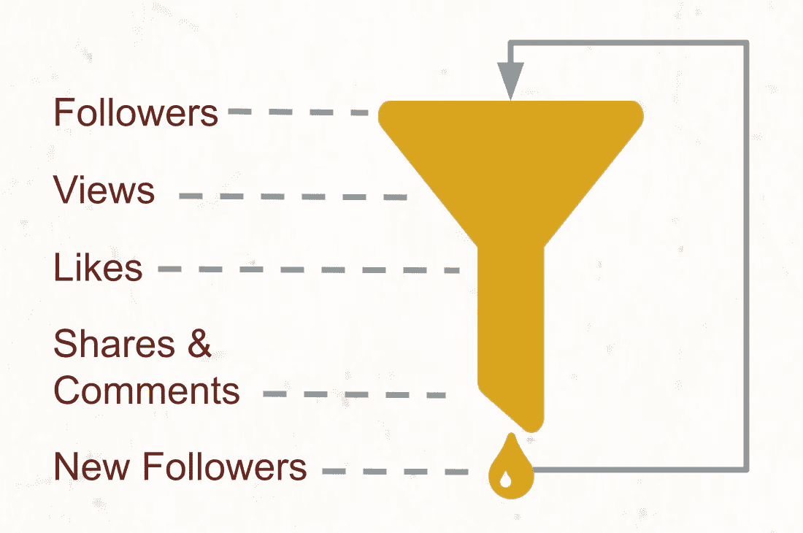
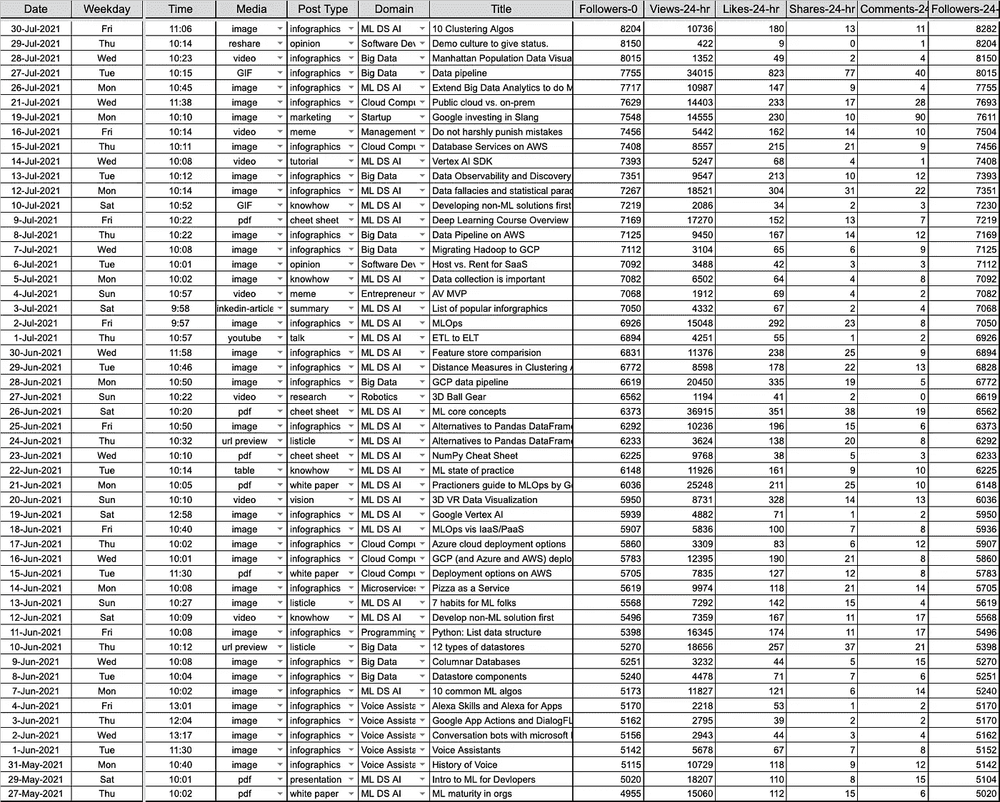
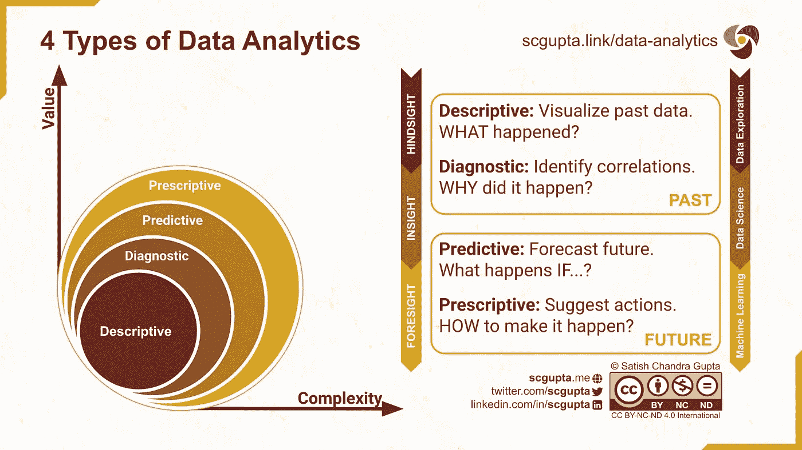
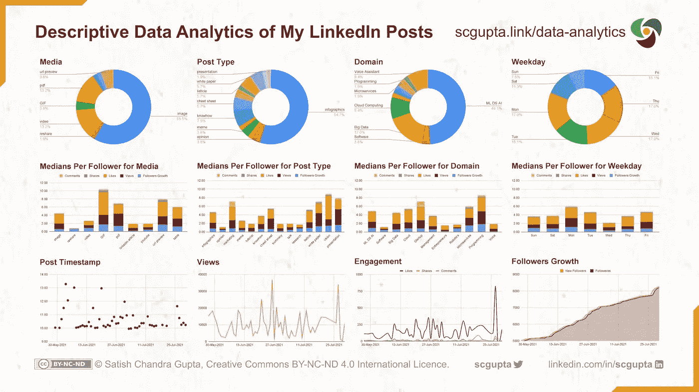
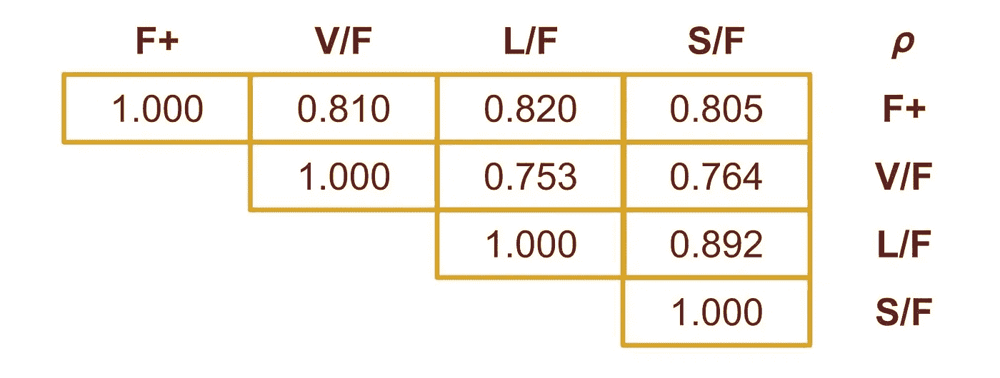
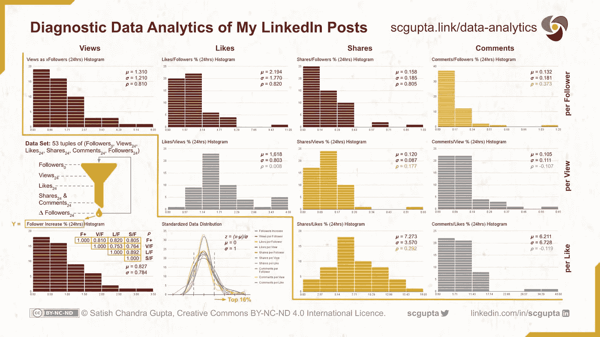
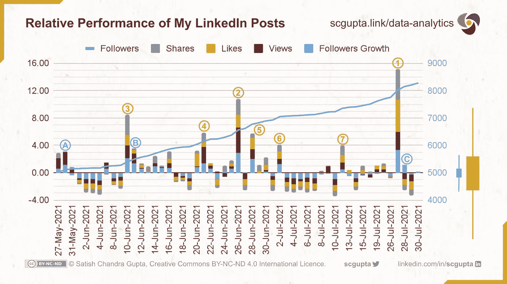

# 来自 4 种数据分析的可行见解

> 原文：<https://towardsdatascience.com/actionable-insights-from-descriptive-diagnostic-predictive-prescriptive-data-analytics-drivetrain-approach-f4e08828cc7?source=collection_archive---------9----------------------->

[TT 先生](https://unsplash.com/@mrtt)在 [Unsplash](https://unsplash.com/photos/xb0wLfZH9Zo) 上的照片

## 数据分析，[行业笔记](https://towardsdatascience.com/tagged/notes-from-industry)

## 使用动力系统方法收集数据和提取可行见解的系统方法。

“让我们收集所有我们能收集的数据，稍后我们会收集更多的见解。”你以前听过这个吗？

这种方法很少奏效。在极少数情况下，当它确实有点作用时，相对于收集、处理和存储大量数据的成本，投资回报率非常低。当你以一个目标开始时，分析会产生更好的回报。

此外，并不是所有的分析都是平等的。有趣的数据很有趣。但是能指导你下一步行动的可操作的见解更有价值。

[动力传动系统方法](https://www.oreilly.com/radar/drivetrain-approach-data-products/) ( [讲座视频](https://www.youtube.com/watch?v=vYrWTDxoeGg))提供了一种产生可操作见解的系统方法。它有四个步骤:

1.  定义目标:从定义你的目标开始。
2.  **指定杠杆:**指定你控制的输入，你可以拉动来影响结果的杠杆。
3.  **收集数据:**找出你*需要*收集哪些数据来测量拉动这些杠杆的效果。
4.  **确定行动:**分析数据，建立统计模型，计算要达到预期的结果，应该移动哪个杠杆，移动多少。

本文将应用驱动方法来解决问题:从一个目标开始收集和分析数据，并确定实现该目标的行动。

# 定义目标

动力传动系统方法的第一步是定义目标。业务问题和目标最初可能是模糊的，但是要精炼，使它们清晰可量化。

就拿这个问题来说吧:我想让我的作品通过社交媒体接触到更多的人。我想在 LinkedIn 上建立一个受众群。为了最大化我努力的结果，我想找到我的哪些内容效果最好。

目标是在 LinkedIn 上撰写吸引关注者的技术文章。换句话说，我的目标是确定我的帖子(在我的专业领域)的特征，这些特征能产生最大的追随者增长。

## 关键绩效指标(KPI)

一旦定义了目标，下一个任务就是指定一个或多个 KPI 来衡量实现该目标的绩效。所以让我们来理解一个 LinkedIn 帖子的生命周期。

当你在 LinkedIn 上发布一些东西时，它会出现在你的一些关注者的新闻源中。如果他们与你的帖子互动，LinkedIn 会显示给他们的关注者和你的更多关注者。

一篇文章的典型受众漏斗如下:

*   **追随者:**这是漏斗的入口尺寸。更多的关注者意味着会有更多潜在的人看到帖子并与之互动。
*   **浏览量:**在你的订阅源中看到帖子的关注者的分数或倍数。
*   **喜欢:**一些关注者可能会觉得这个帖子足够有趣，从而喜欢上它。
*   分享和评论:一些人可能会发现与他们的追随者分享和评论帖子很有帮助。
*   **新关注者:**随着越来越多的人与帖子互动，更多即时圈子之外的人会看到它。他们可能会查看你的个人资料，并可能决定跟随它。

**社交媒体帖子的漏斗。**作者图片

成功的内容有三个指标:浏览量、参与度(喜欢、分享、评论)和新关注者。

观点和参与是有价值的。然而，新的追随者扩大了下一篇文章的漏斗入口。所以我认为这是社交媒体帖子成功吸引受众的最重要的衡量标准。

# 指定杠杆

下一步是问:你能控制什么，能改变什么来影响结果？

> “上帝，请赐予我平静去接受我不能改变的事情，赐予我勇气去改变我能改变的事情，赐予我智慧去分辨两者的不同。”

在 LinkedIn 帖子的例子中，我控制的杠杆是:

*   **何时**发帖:发帖的日期和时间。
*   我多久发一次帖子:帖子的频率。
*   **我在帖子里写什么**:领域、主题、内容复杂度、长度、结构、嵌入媒体(如图片、视频、文档、链接)。

有关于“何时”([周二到周四](https://blog.hubspot.com/marketing/how-frequently-should-i-publish-on-social-media)，上午[到中午](https://sproutsocial.com/insights/best-times-to-post-on-social-media/#LI-times))和“多长时间”(每个工作日最多[一次](https://buffer.com/library/linkedin-marketing/))在 LinkedIn 上发帖的研究。一些研究建议[不要在帖子](https://growthrocks.com/blog/linkedin-abtest-link-in-comment/)中包含链接。当然，有几个帖子提供了撰写杀手级 Linkedin 帖子的技巧。

虽然这些研究集中在公司网页上的营销帖子，但结果和提示对个人来说似乎也是明智的。但其适用性取决于题材、受众、地域等。因此，当我采纳一些建议(例如，每天最多发一篇文章)时，我想知道哪些方法对我有用。

# 收集数据

在过去的两个月里，我发布了 53 次。对于每个帖子，我记录了 KPI 和“杠杆”特征:

*   发帖时的关注者，以及
*   发帖 24 小时后的浏览量、点赞量、分享量、评论量和关注量。

对于每个帖子，KPI 是以下元组:(Followers_₀、Likes_₂₄、Shares_₂₄、Comments_₂₄、Followers_₂₄)

在大数据时代，这些数据少得可笑。虽然我会继续收集更多的数据，但我不会很快有“大数据”，因为我每天最多发一篇帖子。我想探索:

*   从少量数据中收集可行的见解是否可行？
*   我需要收集之前没有意识到的其他特征(杠杆)或 KPI 吗？
*   如何在 Excel 或 Google Sheets 中进行数据分析？当我每天记录更多数据时，它可以作为一个具有最新分析的仪表板。

使用小数据集还有助于解释分析中的细微差别。

我的 LinkedIn 帖子的原始数据。图片由作者提供。

# 4 种数据分析

在我们开始分析数据和确定行动之前，让我们了解四种类型的数据分析:

*   **描述性分析:** *发生了什么*？
*   **诊断分析:** *为什么*会发生？
*   **预测分析:**如果会发生什么*？*
*   **规定性分析:** *如何*使之发生？

描述性和诊断性分析是关于检查过去，而预测性和规范性分析是关于规划未来。

## 描述性分析

这是最常见的分析，从过去的事件中回答了根本问题:*发生了什么？*

*在描述性分析中，我们沿着不同的维度聚集数据，并识别特定的模式或趋势。*

*大多数企业都有跟踪重要指标的仪表板。例如:*

*   *各种产品在不同地理市场的月度和季度销售数量是多少？*
*   *一个产品的销量是在增加还是在减少？*
*   *不同地区的库存水平如何，是上升还是下降？*

## *诊断分析*

*分析学的下一步是分析一个趋势并回答: ***为什么*** 会发生？*

*在诊断分析中，我们向下钻取并进行根本原因分析。我们想找到是什么推动了一种趋势。因此，我们对数据进行切片，以识别异常值，隔离模式，并揭示相关性。*

*商业智能(BI)产品就是为了做到这一点。例如:*

*   *确定推动盈利产品销售的客户群的特征。*
*   *比较产品在不同客户群中的表现。*
*   *比较不同产品在一个客户群中的表现。*
*   *解释为什么会这样。是因为产品意识还是因为激烈的竞争？还是说这是该产品类别的总体趋势？*

## *预测分析*

*有了模式和相关性的知识，分析就进展到预测:如果***发生的可能性有多大？****

*在预测分析中，我们使用回归分析、时间序列预测和其他多元统计建模技术。目标是在未来给定的时间点估计一些可量化的变量。*

*这是诊断分析的一大进步。它涉及到更复杂的预测分析:*

*   *对产品线的需求*
*   *客户群的收入潜力*
*   *来自即将到来的活动的收入增长*
*   *下一个财政年度的利润预测*

## *规定性分析*

*一旦了解了过去，人们就可以预测未来，目标就转移到塑造未来上:*如何让它发生？**

**在规定分析中，我们进行“假设”分析来估计我们控制的移动杠杆的影响。然后，我们比较可用的替代方案，选择最佳的行动方案。**

**这是最具挑战性的级别，需要高级分析和数据科学技能。它是决定资源分配以实现利润最大化的游戏规则改变者。例如:**

*   **哪些产品的产量需要增加，增加多少？**
*   **每种产品在不同地区应该有多少库存？**
*   **选择什么样的产品活动，瞄准哪些客户群？**
*   **哪些产品或服务需要价格调整，调整幅度是多少？**

**大多数组织都没有达到这个成熟度级别。这需要一种数据驱动的决策文化来在这一层面运作。从一开始，您就需要开始考虑目标、需要什么数据、如何收集这些数据，并执行之前级别的数据分析以达到这一级别。**

****

****四种类型的数据分析:描述性、诊断性、预测性和规范性。**图片由作者根据[Creative Commons BY-NC-ND 4.0 International](https://creativecommons.org/licenses/by-nc-nd/4.0/)许可发布。**

# **确定行动**

**让我们回到动力传动系统的方法。最后一步是分析数据并提取可操作的见解。概括一下:**

*   ****杠杆:**嵌入媒体，帖子类型，域，工作日**
*   ****关键绩效指标:**浏览量、参与度(喜欢、分享、评论)和追随者增长**

**如果您查看原始数据，KPI 的两个方面非常突出:**

*   **KPI 的范围非常不同。**
*   **随着追随者的增长，所有 KPI 也在增长，这使得它们随着时间的推移变得不可比拟。**

**将 KPI 转换为“每个关注者”基础，并计算浏览量、点赞数、分享数、评论数和关注者增长数的百分比，可以解决该数据集的两个问题:**

*   ****每个关注者的浏览量(V/F):** `(Views_₂₄ / Followers_₀)`**
*   ****每个关注者的点赞数(左/右):** `100 * (Likes_₂₄ / Followers_₀)`**
*   ****每追随者股份(S/F):** `100 * (Shares_₂₄ / Followers_₀)`**
*   ****每个关注者的评论(C/F):** `100 * (Comments_₂₄ / Followers_₀)`**
*   ****跟随者成长(F+):** `100 * (Followers_₂₄ - Followers_₀) / Followers_₀`**

**下面的仪表板显示了一些描述性分析。它有跨职位的杠杆分布、各种杠杆的 KPI 聚合，以及一些随时间变化的特征。**

**对于聚合，我选择了中位数而不是总和，因为杠杆在帖子中的分布并不均匀。**

**从因果关系上看，它告诉我们:**

*   **gif、URL 预览(即带有链接但没有其他媒体的帖子)和 pdf 是表现最好的**媒体类型**。**
*   **愿景、演示、白皮书和营销是表现最好的**职位类型**。**
*   **编程、启动和微服务是表现最好的**主题领域**。**
*   **周一、周二和周五是最好的，周三是最糟糕的**工作日**。**

**然而，一项仔细的评估显示，许多突出的特点只出现在少数职位上。例如，只有:**

*   **两个帖子带有 gif，两个带有 URL 预览**
*   **愿景和营销各一个帖子**
*   **编程、启动和微服务各一篇**

**一半以上的帖子是关于 ML/DS/AI 的，并且有图片信息图。如果在这么多天里关注者增加了 65%，那么这些帖子一定有所贡献。**

**这是否意味着，如果我只在 vision for programming 上发布 gif，追随者的增长将会翻倍(因为每个的指数大约是 ML/DS/AI 图像信息图的两倍)？**

> **由于统计数据不是算术数据，因此在解释分析数据时会有细微差别。**

****

****对我的 LinkedIn 帖子的描述性分析。**图片由作者根据[Creative Commons BY-NC-ND 4.0 International](https://creativecommons.org/licenses/by-nc-nd/4.0/)许可发布。**

**让我们试着从诊断分析中得到一些答案。**

**我的第一个问题是:**

*   **KPI 之间的相关性如何？**
*   **我应该只关注追随者的增长吗？**
*   **“每个追随者”是正确的方法吗？或者我应该跟随漏斗，考虑每个关注者的观点，每个观点的喜欢，每个喜欢的分享，等等。？**

****

**强相关 KPI 之间的相关性(𝞺)。**

**因此，我绘制了所有这些潜在的[模型特征](https://en.wikipedia.org/wiki/Feature_(machine_learning))的直方图，并计算了它们与追随者增长的相关性(最重要的 KPI)。**

**如下图所示，所有这些特征都遵循[正态分布](https://en.wikipedia.org/wiki/Normal_distribution)。观点、喜欢和分享与追随者增长(F+)和相互之间有很强的相关性。另一方面，评论和 F+没有很强的相关性。**

****

****诊断分析:潜在模型特征的直方图、分布和相关性。**图片由作者创作，在[知识共享 BY-NC-ND 4.0 国际](https://creativecommons.org/licenses/by-nc-nd/4.0/)许可下发布。**

**接下来，我想识别性能帖子。因此，我通过添加强相关 KPI 的标准化值(即 F+、V/F、L/F 和 S/F)创建了一个分数。**

**对于标准化值，平均值(𝞵)为 0，标准差(𝞼)为 1。由于得分是四个 KPI 的总和，值为 4 或更高(即𝞵+𝞼)的职位位于前 16%的表现突出者中。**

**下图是所有帖子的分数。右边的方框图用于识别异常值。金黄色代表总分，浅蓝色代表 F+。**

**有 7 个帖子的得分在 4 分以上，但其中两个是异常值。除了这 7 个中的一个，所有人的追随者增长分数都在跑赢大盘的范围内。**

**有 3 篇帖子(A、B 和 C)超过了关注者增长分数，但总分数低于 4。其中一个 C，综合得分为负。**

****

****LinkedIn 帖子的关注者计数和绩效得分，用方框图来识别异常值。**图片由作者根据[Creative Commons BY-NC-ND 4.0 International](https://creativecommons.org/licenses/by-nc-nd/4.0/)许可发布。**

**下一步是深入预测分析。但是目前的数据不足以计算杠杆和分数之间的点-双列相关或进行线性回归。所以我决定检查这 10 个帖子:**

*   ****异常值:** [岗位 1](https://www.linkedin.com/feed/update/urn:li:activity:6825647267006025729/) ，[岗位 2](https://www.linkedin.com/feed/update/urn:li:activity:6814413945496047616/)**
*   ****跑赢大盘:** [岗位 3](https://www.linkedin.com/feed/update/urn:li:activity:6808614203344207872/) ，[岗位 4](https://www.linkedin.com/feed/update/urn:li:activity:6812598675198631936/) ，[岗位 5](https://www.linkedin.com/feed/update/urn:li:activity:6815148161485680641/) ，[岗位 6](https://www.linkedin.com/feed/update/urn:li:activity:6816581502806188032/)**
*   ****超越参与度，但追随者增长一般:** [排名第七](https://www.linkedin.com/feed/update/urn:li:activity:6820211059937431552/)**
*   ****参与度一般，但增长优于跟随者:** [帖子 A](https://www.linkedin.com/feed/update/urn:li:activity:6804262824416686080/) ，[帖子 B](https://www.linkedin.com/feed/update/urn:li:activity:6808975583565897728/)**
*   ****怪招:** [帖 C](https://www.linkedin.com/feed/update/urn:li:activity:6826011417645322240/)**

**我的观察是:**

*   ****离群值:**岗位 1 和岗位 2 分别具有高价值的形象和资源。甚至 Post 3 也是一个异常值，因为它共享一个 URL，众所周知这会减少浏览量。**
*   ****Wierd:** 帖子 C 和帖子 B 记录了高追随者增长，因为前一个帖子是离群值。我观察到 LinkedIn 持续显示非常高性能的帖子长达 3 天。**
*   ****参与度一般，但表现优于跟随者增长:**贴出我演讲的幻灯片。似乎这副牌吸引了人们去追随，但没有足够的吸引力去喜欢或分享。太奇怪了。**
*   ****超越参与度，但追随者平均增长:**第 7 篇帖子是一篇关于复杂主题的长文。我可以看到它是有用的，但太复杂了，无法跟踪和寻求更多的信息。**
*   ****优于:**帖子 4、5、6(以及帖子 A)处于中等长度(130-180 字)和中等复杂性的最佳位置。**

## **可行的见解**

**虽然还需要更多的数据，但根据总体趋势和对这 10 篇文章的仔细研究，我打算这样做:**

*   **千万不要错过周一发帖，周三放轻松。**
*   **所有表现突出(和异常)的帖子都在大数据和 DS/ML/AI 中，所以要加倍下注。**
*   **尝试更多的 gif，看看它是否能提高平均水平，这将把离群值转化为优于大盘的值。**
*   **使用更多的信息图、列表条、备忘单和白皮书，因为它们表现良好，并且在数据中出现的频率相当高。**

**我还需要收集更多数据，尝试预测性和规范性分析。**

## **警告**

**这些见解可能不是通用的，可能只适用于我的内容类型。此外，数据中存在偏差，因为我已经遵循了传统的最佳实践:**

*   **写作是为了提供价值**
*   **使用简单的语言**
*   **将它格式化以便于阅读**
*   **包括视觉丰富的媒体**
*   **不要嵌入链接**

# **摘要**

**动力驱动方法和四种数据分析为提取可行的见解提供了一个良好的框架。但请记住，数据分析和数据科学是实验性的，可能需要多次迭代才能正确。**

****如果您喜欢，请:****

************

***最初发表于*[T5【ML4Devs.com】](https://www.ml4devs.com/articles/drivetrain-approach-actionable-insights-from-descriptive-diagnostic-predictive-prescriptive-data-analytics/)*。***