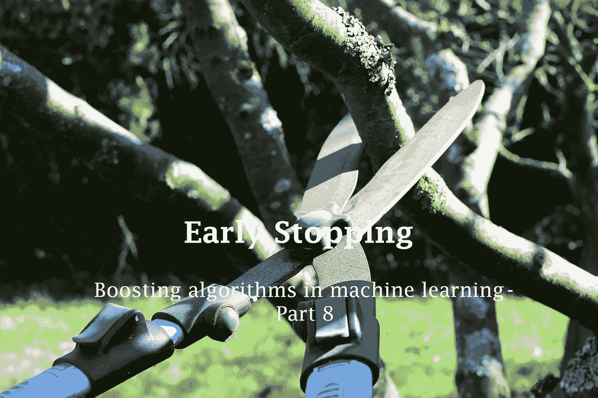
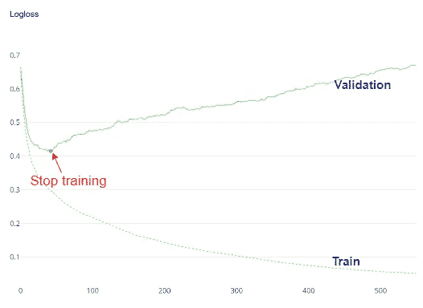
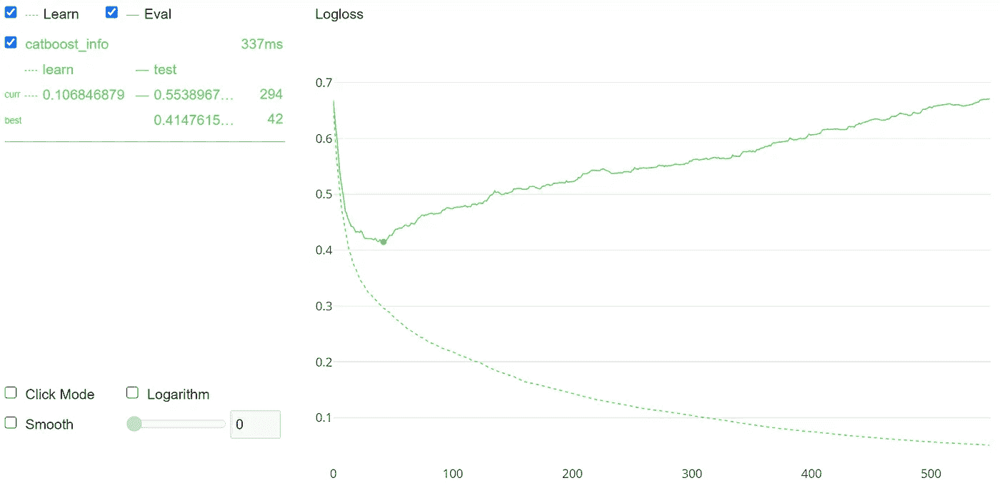
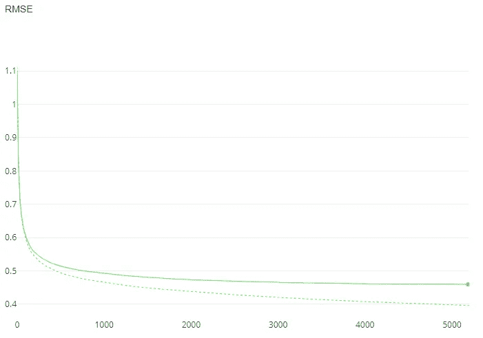

# 在增强算法中激活早期停止以减轻过度拟合

> 原文：<https://towardsdatascience.com/activate-early-stopping-in-boosting-algorithms-to-mitigate-overfitting-9c1b12cc6729?source=collection_archive---------16----------------------->

## 助推技术

## 机器学习中的助推算法——第八部分



图片来自[皮克斯拜](https://pixabay.com/?utm_source=link-attribution&utm_medium=referral&utm_campaign=image&utm_content=4964455)的[克里斯蒂安·里德](https://pixabay.com/users/schraubgut-15720492/?utm_source=link-attribution&utm_medium=referral&utm_campaign=image&utm_content=4964455)

在[第七部分](/performance-comparison-catboost-vs-xgboost-and-catboost-vs-lightgbm-886c1c96db64)中，我已经提到过在提升算法中很容易发生过度拟合。过拟合是 boosting 技术的主要缺点之一。

***提前停止*** 是一种特殊的技术，可用于减轻 boosting 算法中的过拟合。它在算法的训练阶段使用。

# 提前停止在 boosting 算法中有多有效？

在 boosting 中，在每个 boosting 轮(迭代)中添加一个新树。新树试图纠正树在前几轮中所犯的错误。

顾名思义，提前停止在由 **n_estimators** 给出的指定提升回合之前的某处停止算法的训练过程。可以通过绘制学习曲线来监控停止点。



(图片由作者提供)

我们通过提供训练和验证数据来计算训练和验证分数(通常，RMSE 用于回归，对数损失用于分类),然后将它们与增强回合数进行绘图。有一个点，验证分数没有进一步提高，并开始变得更差，而训练分数仍然继续提高。这是过度拟合开始和模型训练应该停止的地方。

根据迭代或推进轮次来确定该点的价值是非常重要的。在此之前，验证分数在每次迭代中都会提高。在这一点上，增强的模型在看不见的数据上概括得很好。在这一点之后，模型往往会过度拟合。

默认情况下，提前停止不是由升压算法本身激活的。要激活 XGBoost、LightGBM 和 CatBoost 等 boosting 算法中的提前停止，我们应该在 boosting 模型的 **fit()** 方法或 **train()** 函数中的参数***early _ stopping _ rounds***中指定一个整数值。

```
.fit(***early_stopping_rounds=int***)
#OR
.train(***early_stopping_rounds=int***)
```

整数值表示模型对看不见的数据进行良好概括的提升回合。如前所述，这可以通过监控学习曲线来发现。

# 使用 CatBoost 执行提前停止

CatBoost 是一个强大的升压算法。它有两个很好的特性，是其他 boosting 算法所没有的。它可以直接处理分类特征。另一个是我们可以通过在 **fit()** 方法或者 **train()** 函数中将 ***plot*** 自变量设置为`True`来轻松生成学习曲线。这就是我们在这里使用 CatBoost 实现提前停止的原因。

现在，我们在[**heart _ disease**](https://drive.google.com/file/d/19s5qMRjssBoohFb2NY4FFYQ3YW2eCxP4/view?usp=sharing)**数据集上构建 CatBoost 分类模型，并通过创建学习曲线来监控学习过程。除了训练数据，我们还应该为 **fit()** 方法中的 ***eval_set*** 参数提供验证(测试)数据。这里，我们使用**“对数损失”**作为我们模型的评估指标。对数损失值越低，预测概率与实际值的偏差就越小。因此，日志损失值越低越好。**

**监控 CatBoost 的学习过程**

****

**(图片由作者提供)**

**模型在看不见的数据上概括得很好的地方用绿点标出。可以通过运行以下命令获得 X 坐标:**

```
**cb.get_best_iteration()**
```

**这将返回 42，这意味着模型在第 42 次迭代时对看不见的数据进行了很好的概括。之后，模型开始过度拟合。我们可以为***early _ stopping _ rounds***argument*提供这个值来激活提前停止。***

```
*cb.fit(X_test, y_test,
       ***early_stopping_rounds=42***)*
```

***当您再次运行模型时，它将在第 42 轮提升(迭代)时停止训练，尽管我们已经在 ***n_estimators*** 中指定了 550 轮提升！***

# ***关键要点***

***我们已经讨论了如何实现针对 CatBoost 算法的早期停止，该算法具有内置功能来监控学习过程。但是，我们也可以将早期停止与 AdaBoost、梯度增强、XGBoost 和 LightGBM 等其他增强算法结合使用。下面是一些将早期停止应用于这些算法的具体想法。***

## ***想法 1:创建学习曲线来监控学习过程***

***使用其内置的 ***图*** 参数，很容易为 CatBoost 创建针对增强回合的学习曲线。对于其他算法，您需要手动创建学习曲线。***

## ***想法二:激活提前停车***

***XGBoost、LightGBM 和 CatBoost 在 **fit()** 方法或 **train()** 函数中有一个参数叫做***early _ stopping _ rounds***。您可以指定一个小于 ***n_estimators*** 中的值的整数值来激活提前停止。*AdaBoost 和 Gradient Boosting 中没有这样的内置参数。要激活 AdaBoost 和梯度增强的提前停止，您可以监控学习过程，找到模型开始过度拟合的点(如果有)，并在 ***n_estimators*** 参数中设置该值。然后，需要用新的 ***n_estimators*** 值重新执行算法。****

## ****想法三:寻找是否有机会提前停止****

****不是所有的增压模型都有机会提前停止。通过查看学习曲线，您可以很容易地找到这一点。具有以下学习曲线的模型即使在 5000 次助推轮后也没有提前停止的机会！****

********

****没有机会提前停止(图片由作者提供)****

## ****想法 4:选择正确的 API****

****对于 XGBoost 和 LightGBM 这样的 boosting 算法，有两个 API:Scikit-learn API 和 Learning API。Scikit-learn API 使用通用的 **fit()** 方法进行训练，而 Learning API 使用自己的 **train()** 函数进行训练。举个例子，****

```
**import lightgbmlgbm = lightgbm.LGBMRegressor()#Training: Scikit-learn API
lgbm.fit(X_train, y_train)#Training: Learning API
lightgbm.train(**params=...,
               train_set=...,
               valid_sets=...**)**
```

****最简单和推荐的是 Scikit-learn API。在这些 API 和算法中，同一个参数可能有不同的名称。****

## ****想法 5:随机化你的数据****

****由于训练/测试数据分割过程的随机性，输出可能会有很大变化。我建议您在拆分之前对数据进行洗牌，并为训练集使用尽可能多的数据。我还建议您在不同的 **random_state** 值下多次运行该算法，并查看输出。****

****今天的帖子到此结束。我总是尽我最大的努力来写和组织我的内容，以一种你可以从中获得最大收益的方式。应该有很多方法来进一步改善我的内容，你可能有很好的想法。所以，****

****如果你有任何反馈，请告诉我。****

****与此同时，你可以通过下面的链接注册成为会员，以获得我写的每一个故事的全部信息，我会收到你的一部分会员费。****

****<https://rukshanpramoditha.medium.com/membership>  

还有，再也不要错过我的一个故事。订阅获取这样的故事:

[https://rukshanpramoditha.medium.com/subscribe](https://rukshanpramoditha.medium.com/subscribe)

非常感谢你一直以来的支持！下一个故事再见。祝大家学习愉快！

特别感谢 Pixabay 上的 **Christian Riedl** ，为我提供了这篇文章的封面图片。

[鲁克山·普拉莫迪塔](https://medium.com/u/f90a3bb1d400?source=post_page-----9c1b12cc6729--------------------------------)
**2021–11–08******