# 深度学习中的激活函数

> 原文：<https://towardsdatascience.com/activation-functions-in-deep-neural-networks-aae2a598f211?source=collection_archive---------22----------------------->

## [入门](https://towardsdatascience.com/tagged/getting-started)

## 神经网络中激活函数的理论指南，以及为什么我们首先需要它们。

来源:https://unsplash.com/photos/dQejX2ucPBs

**在这本详细的指南中，我将解释深度学习中激活功能的所有知识。特别是什么是激活函数，为什么我们在实现神经网络时必须使用它们。**

**简答**:我们必须使用*激活函数，如 ReLu、sigmoid 和 tanh，以便为神经网络添加非线性属性。这样，网络可以模拟数据中更复杂的关系和模式。*

但是让我们在下面更详细地讨论这一点。

## 目录

1.  **重述:正向传播**
2.  **神经网络是一个函数**
3.  **为什么我们需要激活功能？**
4.  **不同种类的激活功能(sigmoid、tanh、ReLU、leaky ReLU、softmax)**
5.  **我们应该使用哪些激活功能？**
6.  带回家的信息

## 1.重述:向前传播

为了理解激活函数的重要性，我们必须首先回顾神经网络如何计算预测/输出。这通常被称为正向传播。在前向传播期间，神经网络接收输入向量 ***x*** 并输出预测向量 ***y*** 。

那是怎么回事？

请考虑以下具有一个输入、一个输出和三个隐藏层的神经网络:

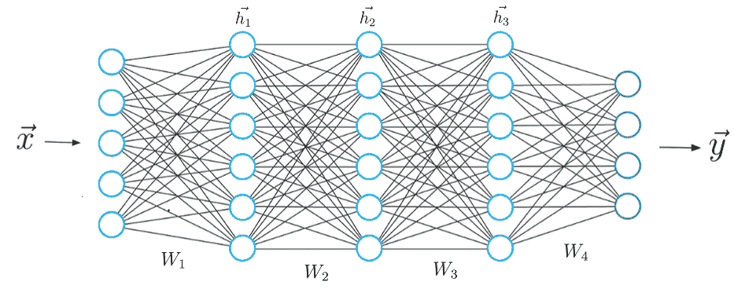

图 1 前馈神经网络的示意图。来源；作者的形象。

网络的每一层都通过所谓的权重矩阵与下一层相连。我们总共有 4 个权重矩阵***W1******W2******W3******W4***。

给定输入向量 ***x*** ，我们用第一权重矩阵 ***W1*** 计算点积，并将激活函数应用于该点积的结果。结果是一个新的矢量 ***h1*** ，它代表第一层中神经元的值。该向量 ***h1*** 被用作下一层的新输入向量，在此再次执行相同的操作。如此重复，直到我们得到最终的输出向量 ***y*** ，它被认为是神经网络的预测。

整组操作可以由下面的等式表示，其中 ***σ*** 表示任意的激活函数:

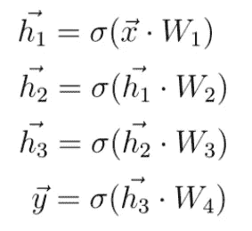

情商。1 正向传播。

关于神经网络及其具体工作方式的更多细节，请参考我的另一篇文章[什么是深度学习以及它是如何工作的？](/what-is-deep-learning-and-how-does-it-work-2ce44bb692ac)

## 2.神经网络是一个函数

在这一点上，我想和你讨论另一种可以用来描述神经网络的解释。我们可以简单地称之为函数，而不是将神经网络视为节点和边的集合。

就像任何常规的数学函数一样，神经网络执行从输入 ***x*** 到输出 ***y*** 的映射。

对于一个输入 ***x*** 计算一个输出 ***y*** 的概念想必你已经知道了。这是一个常见的数学函数的概念。在数学上，我们可以定义一个函数 ***f(x)*** 如下:

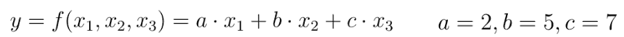

Eq2。基础数学的例子。功能。

该函数有三个输入值***【x1】******x2***和**【x3】**。 ***a*** ， ***b*** ， ***c*** 是取一定值的函数参数。给定输入 ***x1*** ， ***x2*** 和 ***x3*** ，该函数计算出一个输出 ***y*** 。

在基本层面上，这正是神经网络的工作方式。我们取一个特征向量 ***x*** 放入神经网络，神经网络计算一个输出 ***y*** 。

也就是说，我们可以将神经网络视为一种功能，而不是将神经网络视为节点和连接的简单集合。该函数将我们之前单独查看的所有计算合并为一个单一的链式计算:

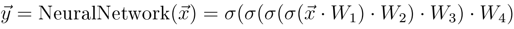

情商。3 神经网络作为一种功能。

在上面的例子中，我们考虑的简单数学函数有参数 ***a*** 、 **b** 和 ***c*** ，它可以强有力地确定输入***×输入*** 的输出值 **y** 。

在神经网络的情况下，相应函数的参数是权重。这意味着我们在训练神经网络期间的目标是找到一组特定的权重或参数，以便给定特征向量 ***x*** ，我们可以计算对应于实际目标值 ***y_hat*** 的预测 ***y*** 。

或者换句话说，我们正试图建立一个可以模拟我们训练数据的函数。

你可能会问自己的一个问题是，我们可以总是对数据建模吗？**我们是否总能找到定义一个函数的权重，该函数可以为给定的特征 *x* 计算特定的预测 *y* ？答案是否定的。只有在特征 ***x*** 和标签 ***y*** 之间存在数学依赖关系时，我们才能对数据建模。**

这种数学依赖的复杂程度可能不同。在大多数情况下，当我们看数据时，我们人类永远无法用我们的眼睛看到这种关系。然而，如果在特征和标签之间存在某种数学相关性，我们可以确定在神经网络的训练期间，网络将识别这种相关性并调整其权重，从而可以在训练数据中对这种相关性进行建模。或者换句话说，这样可以实现从输入特征 ***x*** 到输出 ***y*** 的数学映射。

## 3.为什么我们需要激活函数？

激活函数的目的是向函数添加某种非线性属性，该函数是神经网络。没有激活函数，神经网络只能执行从输入 ***x*** 到输出 ***y*** 的线性映射。为什么会这样呢？

如果没有激活函数，向前传播期间唯一的数学运算将是输入向量和权重矩阵之间的点积。

> 由于单个点积是线性运算，所以连续的点积只不过是一个接一个重复的多个线性运算。*而连续的线性运算可以认为是单一的线性运算。*

为了能够计算真正有趣的东西，神经网络必须能够逼近从输入特征到输出标签的非线性关系。通常，我们试图从中学习的数据越复杂，特征到基础事实标签的映射就越非线性。

没有任何激活功能的神经网络将无法在数学上实现如此复杂的映射，也无法解决我们希望网络解决的任务。

## 4.不同种类的激活功能

在这一点上，我们应该讨论深度学习中使用的不同激活函数以及它们的优缺点

## 4.1 乙状结肠

几年前，你可能遇到的最常见的激活函数是 sigmoid 函数。sigmoid 函数将输入映射到 0 和 1 之间的范围:

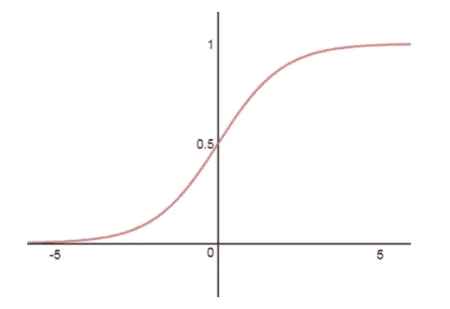

图 2 Sigmoid 函数。来源；作者的形象。

sigmoid 激活函数定义如下:

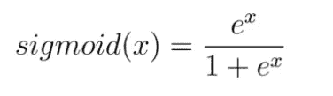

情商。4 数学。s 形函数的定义。

实际上，sigmoid 非线性最近已经失宠，很少使用。它有两个主要缺点:

## 乙状结肠杀死梯度

第一个是 Sigmoids 饱和并杀死梯度。乙状结肠的一个非常不理想的特征是神经元的激活在 0 或 1 的尾部饱和(蓝色区域):

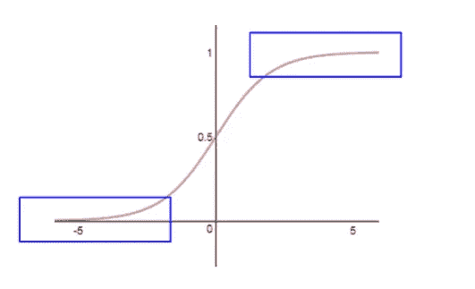

来源；作者的形象。

对于这些蓝色区域，sigmoid 函数的导数变得非常小(意味着:大的负或正输入值)。在这种情况下，接近零的导数将使得损失函数的梯度非常小，这阻止了权重的更新，从而阻止了整个学习过程。

## 乙状结肠非零居中

sigmoid 激活的另一个不希望的特性是函数的输出不是以零为中心的。通常，这使得神经网络的训练更加困难和不稳定。

请考虑一个由***【w1】***和 ***w2:*** 加权的具有输入 ***x1*** 和 *x2* 的乙状结肠神经元 **y**

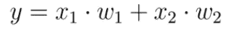

***【x1】***和 ***x2*** 是具有 sigmoid 激活的前一隐藏层的输出。所以 ***x1*** 和 ***x2*** 总是正的，因为乙状结肠不是以零为中心的。根据整个表达式的梯度***y = x1 * w1+x2 * w2***相对于 **w1** 和 ***w2*** 的梯度对于 ***w1*** 和 ***w2*** 总是为正，对于 ***w1*** 和***w2*总是为负**

通常最佳梯度下降步骤需要增加 ***w1*** 和减少 ***w2*** 。所以既然 ***x1*** 和 ***x2*** 总是正的我们就不能同时增减权重，而只能同时增减所有权重。因此，最终，我们将需要更多的步骤。

## 4.2 Tanh 激活功能

深度学习中使用的另一个非常常见的激活函数是 Tanh 函数。下图显示了 *tangens 双曲线*非线性:

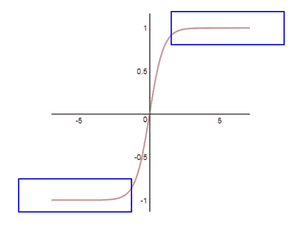

图 3 双曲正切函数。来源；作者的图像。

该函数根据以下等式将一个实数值映射到范围[-1，1]:

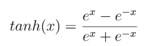

情商。5 数学。Tanh 函数的定义。

与 sigmoid 函数一样，神经元对较大的负值和正值饱和，函数的导数变为零(蓝色区域)。但与 sigmoid 不同，它的输出以零为中心。

> 因此，在实践中，*双曲正切非线性总是优于 sigmoid 非线性。*

## 4.3 整流线性装置— ReLU

在过去几年里，整流线性单元或简单的整流单元变得非常流行。激活的阈值简单地为零: *R(x) = max(0，x)* 或者更准确地说:

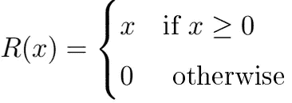

情商。6 数学。ReLU 函数的定义。

对于大于零的输入，我们得到线性映射:

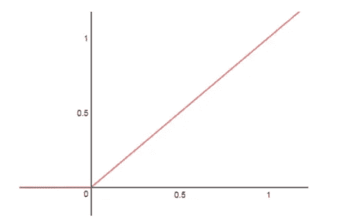

图 4 ReLU。来源；作者的图像。

使用 ReLU 有几个优点和缺点:

*   **(+)** 实际上，与其他激活函数相比，ReLU 加速了梯度下降向损失函数全局最小值的收敛。这是由于它的线性、不饱和特性。
*   **(+)** 而其他激活函数(tanh 和 sigmoid)涉及计算量非常大的运算，如指数运算等。另一方面，ReLU 可以通过简单地将值向量的阈值设定为零来容易地实现。
*   **(-)** 不幸的是 ReLU 激活功能也有问题。因为对于低于零的输入值，该函数的输出为零，所以网络的神经元在训练期间可能非常脆弱，甚至可能“死亡”。这是什么意思？在权重更新期间，可能会发生(不必但仍然可以)以这样的方式调整权重，使得对于某些神经元，输入总是小于零。这意味着这些神经元的隐藏值始终为零，对训练过程没有贡献。这意味着从该点开始，流经这些 ReLU 神经元的梯度也将为零。我们说神经元“死了”。例如，观察到多达 20–50%的使用 ReLU 激活的整个神经网络可能是“死的”,这是非常常见的。或者换句话说，这些神经元永远不会在训练期间使用的整个数据集中激活。

## 4.4 泄漏的 ReLU

Leaky ReLu 只不过是 ReLu 激活函数的一个改进版本。如前一节所述，通过使用 ReLU，我们可能会“杀死”我们神经网络中的一些神经元，这些神经元将再也不会对任何数据进行激活，这是非常常见的。

漏 ReLU 就是为了解决这个问题而定义的。与“普通”ReLU 相反，在“普通”ReLU 中，对于低于零的输入值，所有输出都为零，在泄漏 ReLU 的情况下，我们在函数中添加一个小的线性分量:

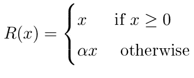

泄漏的 ReLU 激活看起来如下:

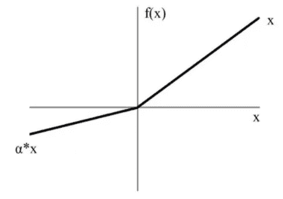

图 5 泄漏的 ReLU。来源；作者的图像。

基本上，我们已经用一条非水平的线性线代替了表示零值的水平线。这条直线的斜率可以通过参数 ***α*** 乘以输入 ***x*** 来调整。

使用泄漏 ReLU 和替换水平线的优点是我们避免了零梯度。因为在这种情况下，我们不再有总是为零的“死亡”神经元导致我们的梯度变为零。

## 4.5 Softmax 激活功能

最后，我想介绍一下 softmax 激活功能。这个激活功能相当独特。

> **Softmax 仅在最后一层应用，并且仅在我们希望神经网络在分类任务期间预测概率得分时应用。**

简单来说，softmax 激活函数强制输出神经元的值取 0 到 1 之间的值，因此它们可以表示概率得分。

我们必须考虑的另一件事是，当我们将输入要素分类为不同的类时，这些类是互斥的。这意味着每个特征向量 ***x*** 只属于一个类别。这意味着作为狗的图像的特征向量不能以 50%的概率表示狗类，也不能以 50%的概率表示猫类。这个特征向量必须以 100%的概率代表狗类

此外， ***在互斥类的情况下，所有输出神经元上的概率分数总和必须为 1。*** 只有这样神经网络才代表了一个合适的概率分布。一个反例是一个神经网络，它以 80%的概率将狗的图像分类到狗类，以 60%的概率分类到猫类。

幸运的是，softmax 函数不仅强制输出到零和 out 之间的范围，而且该函数还确保所有可能类的输出总和为 1。现在让我们看看 softmax 函数是如何工作的。

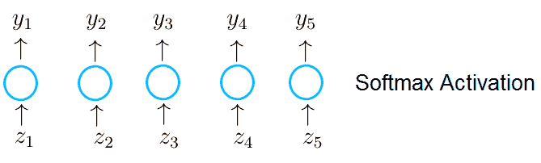

来源；作者的图像。

假设输出层中的神经元接收输入向量 ***z*** ，该向量是当前层的权重矩阵与前一层的输出之间的点积的结果。具有 softmax 激活的输出层中的神经元接收单个值 ***z1*** ，其是向量 ***z*** 中的条目，并输出值 ***y_1*** 。

当我们使用 softmax 激活时，输出层中神经元的每个单个输出根据以下等式计算:

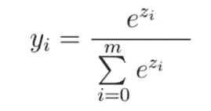

情商。7 数学。Softmax 函数的定义。

可以看到，特定神经元的每个值 ***y*** 不仅取决于神经元接收的值 ***z*** ，还取决于向量 ***z*** 中的所有值。这使得一个输出神经元的每一个值 ***y*** 都是一个介于 0 和 1 之间的概率值。所有输出神经元的概率预测总和为 1。

这样，输出神经元现在表示互斥类标签上的概率分布。

## 5.我们应该使用哪些激活功能？

我将用最好的答案来回答这个问题:视情况而定。\_(ツ)_/

*具体来说，取决于你试图解决的问题和你所期望的输出的取值范围。*

例如，如果您希望您的神经网络预测大于 1 的值，那么 tanh 或 sigmoid 不适合在输出层使用，我们必须使用 ReLU 来代替。

另一方面，如果我们期望输出值在范围[0，1]或[-1，1]内，那么 ReLU 不是输出层的好选择，我们必须使用 sigmoid 或 tanh。

如果您执行分类任务，并希望神经网络预测互斥类标签的概率分布，则应在最后一层使用 softmax 激活函数。

然而，关于隐藏层，作为一个经验法则，我强烈建议你总是使用 ReLU 作为这些层的激活。

## 带回家的信息

*   激活函数给神经网络增加了非线性特性。这样，网络可以模拟更复杂的数据
*   ReLU 通常应该用作隐藏层中的激活函数
*   关于输出层，我们必须始终考虑预测的期望值范围
*   对于分类任务，我建议在输出层专门使用 softmax 激活