# 你可能错过的激活功能

> 原文：<https://towardsdatascience.com/activation-functions-you-might-have-missed-79d72fc080a5?source=collection_archive---------8----------------------->

## [提示和技巧](https://towardsdatascience.com/tagged/tips-and-tricks)

## 你应该“嗖嗖”一下这些新发明，还是继续使用老掉牙的东西？

如今，机器学习领域的科学进步速度是无与伦比的。很难跟上时代，除非是在一个狭窄的领域。时不时会冒出一篇新论文，声称已经取得了一些最先进的成果。这些新发明中的大多数从未成为默认的首选方法，有时是因为它们没有最初希望的那么好，但有时只是因为它们最终在新出版物的洪流中被淹没了。

错过一些金块是多么可惜啊！别害怕，我会保护你的。我最近浏览了一些相对较新的关于神经网络构建模块之一的论文:激活函数。让我们来看看几个最有前途的，看看他们为什么好，什么时候使用它们。但在此之前，我们将快速浏览一下常用的激活，以了解它们解决或产生了什么问题。如果您能区分 PReLU 和 RReLU，请随意向下滚动前两个部分。

## 为什么还要激活？

在每个神经网络的单元内，单元的输入与一些权重参数 *W* 相乘，添加一个偏差 *b* ，并且结果被馈送到一个函数中，称为*激活函数。*它的输出又是传递给下一层单元的单元输出。

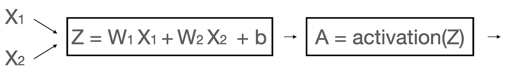

神经网络单元的内部。图片由作者提供。

激活函数原则上可以是任何函数，只要它不是线性的。为什么？如果我们使用线性激活(包括一个身份函数，意味着根本没有激活)，我们的网络将有效地成为一个简单的线性回归模型，无论我们使用多少层和单元。这是因为线性组合的线性组合可以表示为一个线性方程。

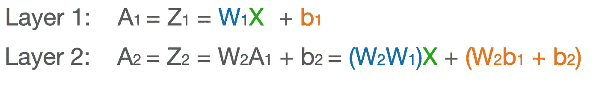

这种网络将具有有限的学习能力，因此需要引入非线性。

## 经典激活函数

让我们快速看一下五个最常用的激活函数。在这里，它们是使用 *numpy* 实现的。

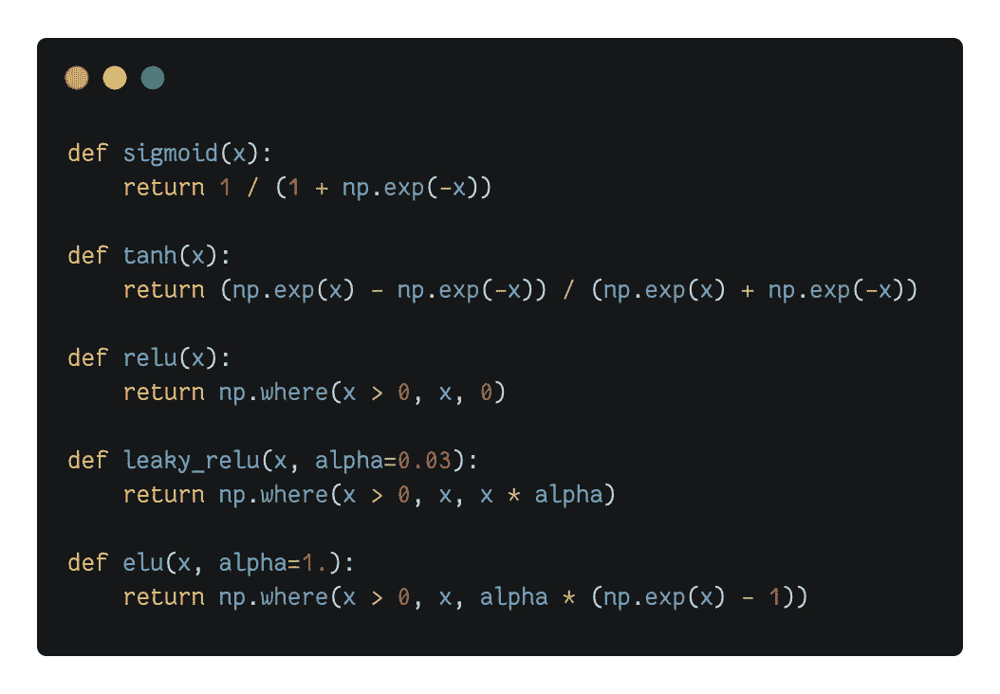

经典激活函数:numpy 实现。图片由作者提供。

这是它们的样子:

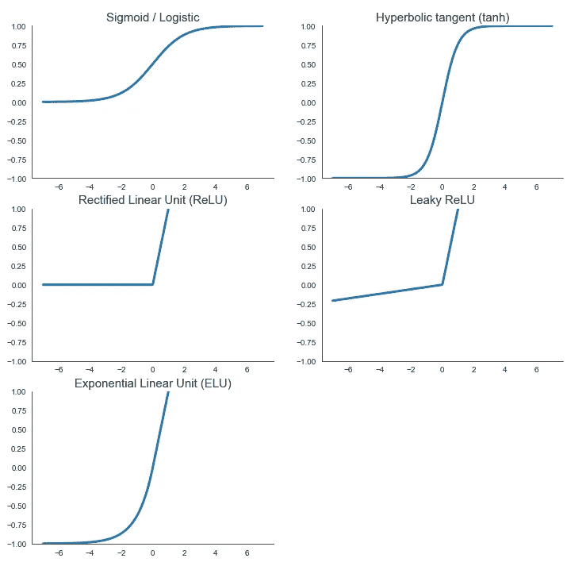

经典激活函数:图。图片由作者提供。

让我简短地讨论一下它们。

在历史上，sigmoid 或**逻辑**激活是第一个取代早期网络中阶跃函数的激活。根据科学，这大致是用于激活我们生物大脑中神经元的功能。这是一个游戏改变者，因为 sigmoid 的定义明确的非零导数允许使用梯度下降来训练神经网络。从那以后，sigmoid 已经被网络隐藏层中的其他函数所取代，尽管它仍然被用作二元分类任务的最终预测层。

**双曲正切(tanh)** 在形状上与 sigmoid 非常相似，但是它取值在-1 和 1 之间，而不是 0 和 1 之间。因此，它的输出更集中在零附近，这有助于加速收敛，尤其是在训练的早期。

然而，sigmoid 和 tanh 都有一个共同的问题:它们都是饱和函数。当输入非常大或非常小时，斜率接近零，使得梯度消失，学习缓慢。因此需要非饱和激活。一个成功的故事属于 r **有限线性单元(ReLU)** 函数，它不会对正值饱和。它的计算速度很快，由于没有最大值，它防止了消失梯度问题。不过它有一个缺点，被称为*将死。*问题是 ReLU 对任何负值都输出零。如果网络的权重达到这样的值，当与输入相乘时，它们总是产生负值，那么整个重新激活的单元继续产生零。如果许多神经元像这样死亡，网络的学习能力就会受损。

为了缓解日益严重的 ReLU 问题，已经有人提议对 ReLU 进行一些升级。 **Leaky ReLU** 对负值有一个小但非零的斜率，确保神经元不会死亡。这种激活函数的一些奇特变体包括**随机化的泄漏 ReLU (RReLU)** ，其中这个小斜率是在训练时随机选择的，或者**参数化的泄漏 ReLU(PReLU)**，其中斜率被认为是网络的参数之一，并通过梯度下降来学习。

最后，**指数线性单位(ELU)** 诞生了，击败了所有真正的变种。它吸收了所有世界的精华:负值的非零梯度消除了死亡神经元的问题，就像在 leaky ReLU 中一样，负值使输出更接近零，就像在 tanh 中一样，最重要的是，eLU 在零附近是平滑的，这加快了收敛速度。但是它也有自己的问题:指数函数的使用使得计算相对较慢。

为了方便起见，以下是经典激活的概述:

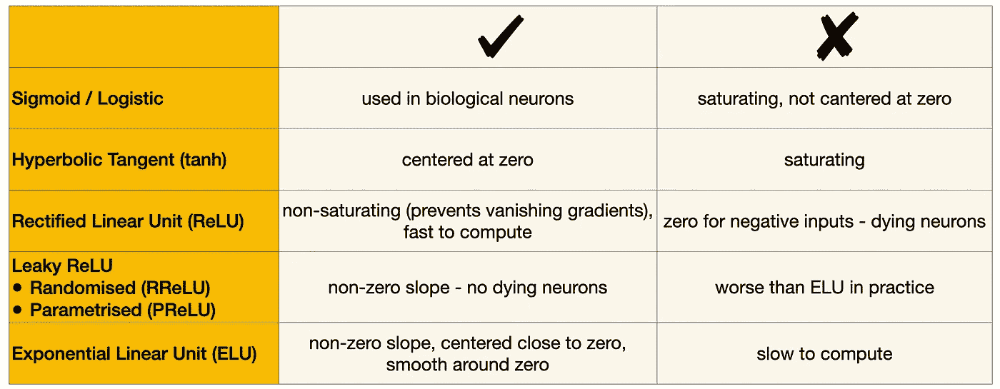

经典激活函数的比较。由作者编译。

现在让我们来看看最近的一些发明吧！

## 缩放的 ELU (SELU)

Klambauer 等人在 [2017 年的一篇论文中介绍了**比例 ELU** 或 **SELU** 激活。顾名思义，它是 ELU 的缩放版本，在下面的公式中选择了两个缩放常数，例如在 TensorFlow 和 Pytorch 实现中。](https://arxiv.org/abs/1706.02515)

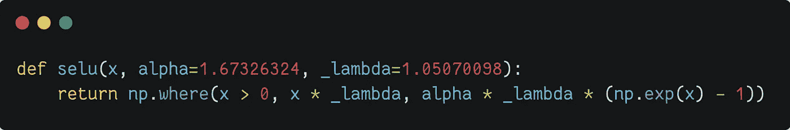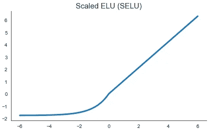

SELU 函数有一个奇特的性质。该论文的作者表明，如果正确初始化，如果所有隐藏层都是 SELU 激活的，密集的前馈网络将会自我归一化。这意味着每个图层的输出将大致具有等于零的平均值和等于一的标准差，这有助于防止消失或爆炸梯度问题，并允许构建深度网络。该论文在 UCI 机器学习知识库、药物发现基准甚至天文学任务的 120 多个任务上评估了这种自规范化网络，发现它们明显优于传统的前馈网络。

## 高斯误差线性单位

Hendrycks & Gimpel 在[2016 年的一篇论文中提出了**高斯误差线性单元**，或 **GELU，**。该函数只是将其输入与该输入的正态分布累积密度函数相乘。由于这种计算非常慢，所以在实践中经常使用一种更快的近似值，这种近似值只有第四位小数不同。](https://arxiv.org/abs/1606.08415)

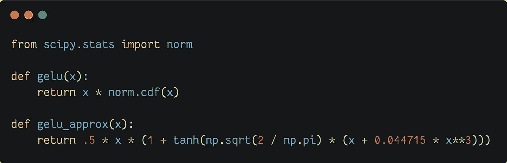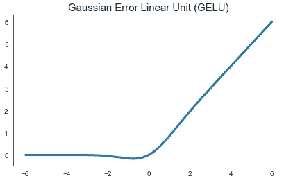

与 ReLU 系列的激活相反，GELU 根据输入值对其进行加权，而不是根据符号对其进行阈值处理。作者针对 ReLU 和 ELU 函数评估了 GELU 激活，发现所有考虑的计算机视觉、自然语言处理和语音任务的性能都有所提高。

## 嗖嗖

由 [Ramachandran 等人](https://arxiv.org/abs/1710.05941v1?source=post_page---------------------------)于 2017 年在谷歌大脑发明的 **Swish** 激活功能非常简单:它只是将输入乘以自己的 sigmoid。它在形状上非常类似于 GELU 函数。

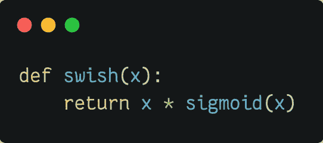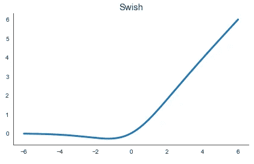

该论文的作者注意到，尽管已经提出了许多其他激活，ReLU 仍然是最广泛采用的，主要是因为使用这些新奇事物的收益不一致。因此，他们评估 Swish 的方法是，在针对 ReLU 进行优化的网络架构中，简单地将它作为 ReLU 的替代。他们发现了显著的性能提升，并建议使用 Swish 作为 ReLU 的替代方案。

Swish 的论文还包含了一个有趣的讨论，关于是什么让激活函数变好的。作者指出，上无界、下有界、非单调和平滑是 Swish 如此出色的原因。你可能已经注意到 GELU 也有所有这些属性，我们稍后将讨论的最后一个激活也是如此。看起来这是激活研究的方向。

## 米什

激活是迄今为止讨论过的发明中最新的一个。它是由 Misra 在[2019 年的一篇论文](https://arxiv.org/abs/1908.08681)中提出的。米什受到了 Swish 的启发，并已被证明在各种计算机视觉任务中胜过它。

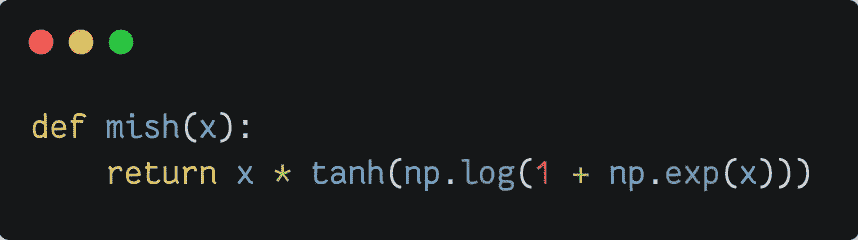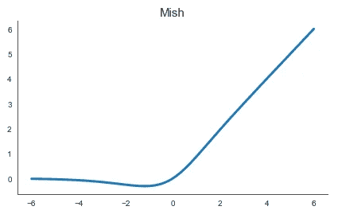

引用原始论文，Mish 是“通过对使 Swish 如此有效的特征进行系统分析和实验而发现的”。Mish 似乎是库存中最好的激活，但请记住，原始论文只在计算机视觉任务上测试了它。

## 使用哪个激活？

在他的精彩著作《用 Scikit-Learn 和 TensorFlow 实践机器学习》中，Geron 陈述了以下一般规则:

> SELU > ELU >泄漏的 ReLU > ReLU

但是有一些问题。如果网络的架构阻止它自我正常化，那么 ELU 可能是比 SELU 更好的选择。其次，如果速度是重要的，(漏)ReLU 将是一个比缓慢的 eLU 更好的选择。但是，这本书没有讨论最近提出的激活。

有一次，我和我的同事，一位前谷歌员工讨论我当时正在做的一个网络架构。他给我的第一条建议是用 Swishes 代替 ReLUs。这并没有改变游戏规则，但尽管如此，性能还是提高了。

基于这一点和我的其他经验，我建议在选择激活时使用以下主观决策树，假设架构的其余部分是固定的。

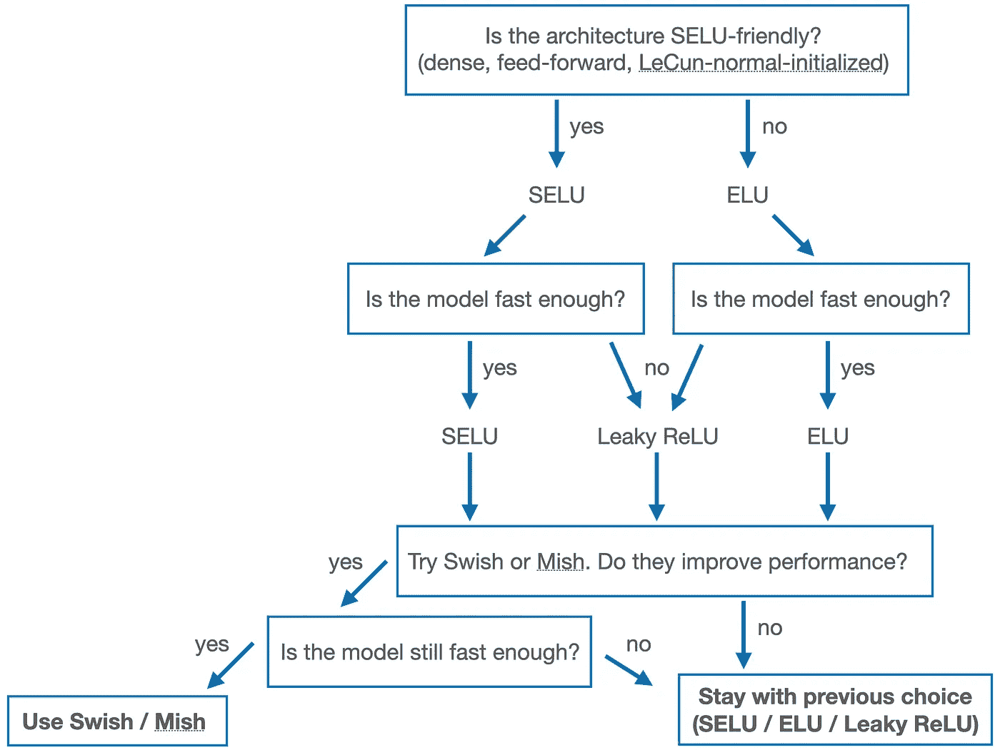

如何选择激活，作者。

## 来源

*   Geron A .，2019，第二版，使用 Scikit-Learn 和 TensorFlow 进行机器学习:构建智能系统的概念、工具和技术
*   [deepdrive.pl](https://deepdrive.pl) 的图像分类教程(波兰语)
*   [2016，丹·亨德里克斯&凯文·金佩尔，高斯误差线性单位(GELUs)](https://arxiv.org/abs/1606.08415)
*   [2017，Prajit Ramachandran，Barret Zoph，Quoc V. Le，Swish:一个自门控激活函数](https://arxiv.org/abs/1710.05941v1?source=post_page---------------------------)
*   [2017，君特·克兰鲍尔，托马斯·安特辛纳，安德里亚斯·迈尔，塞普·霍克雷特，自归一化神经网络](https://arxiv.org/abs/1706.02515)
*   [2019，迪甘塔·米斯拉，米什:一个自正则化的非单调激活函数](https://arxiv.org/abs/1908.08681)

感谢阅读！

如果你喜欢这篇文章，为什么不订阅电子邮件更新我的新文章呢？并且通过 [**成为媒介会员**](https://michaloleszak.medium.com/membership) ，可以支持我的写作，获得其他作者和我自己的所有故事的无限访问权限。

需要咨询？你可以问我任何事情，也可以在这里 为我预约 1:1 [**。**](http://hiretheauthor.com/michal)

你也可以试试我的其他文章。不能选择？从这些中选择一个:

 [## 蒙特卡洛辍学

### 用一个小技巧免费改善你的神经网络，获得模型不确定性估计作为奖励。

towardsdatascience.com](/monte-carlo-dropout-7fd52f8b6571)  [## 6 有用的概率分布及其在数据科学问题中的应用

### 带有示例和 Python 代码的实用概述。

towardsdatascience.com](/6-useful-probability-distributions-with-applications-to-data-science-problems-2c0bee7cef28)  [## 学习率查找器

### 无需昂贵的搜索即可快速到达最佳值的邻域。

towardsdatascience.com](/the-learning-rate-finder-6618dfcb2025)