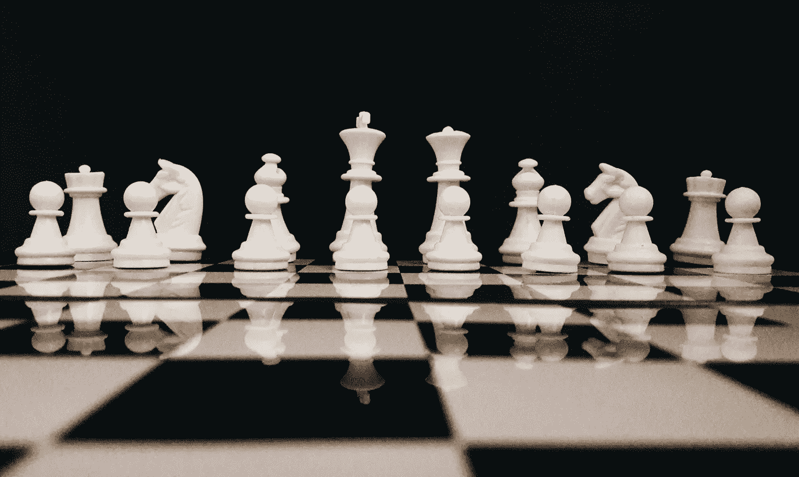
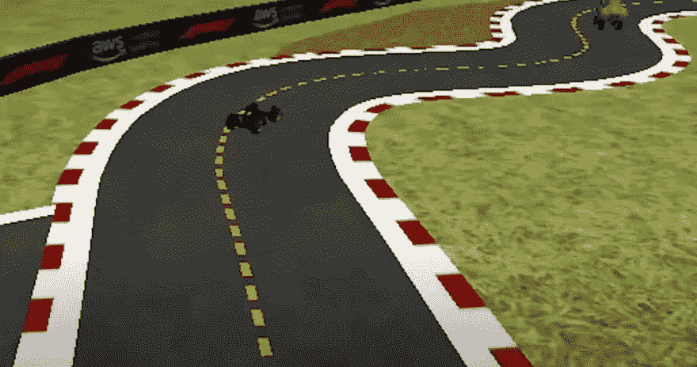
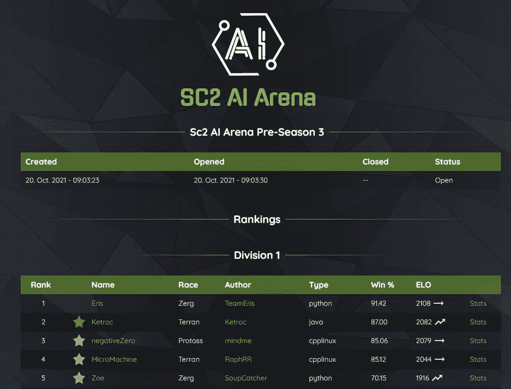
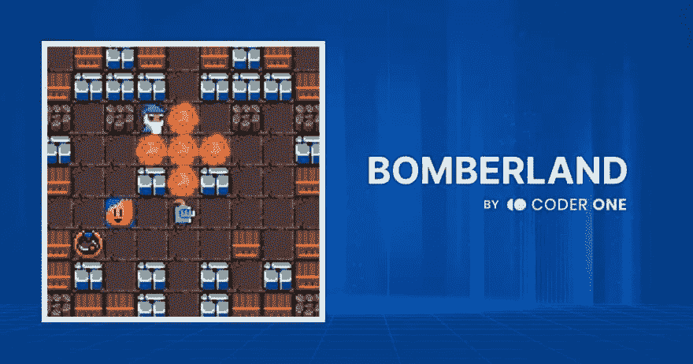

# 7+强化学习竞赛将于 2022 年结束

> 原文：<https://towardsdatascience.com/active-and-upcoming-reinforcement-learning-competitions-8ed3c4fb14ab?source=collection_archive---------23----------------------->

## 一份正在进行的年度竞赛清单，适合通过强化学习获得实践机会(同时赢得一两个奖项)。

[sk](https://unsplash.com/@rollelflex_graphy726?utm_source=unsplash&utm_medium=referral&utm_content=creditCopyText) 在 [Unsplash](https://unsplash.com/s/photos/competition?utm_source=unsplash&utm_medium=referral&utm_content=creditCopyText) 上拍照

**强化学习** **(RL)** 是机器学习的一个子域，涉及代理通过与他们的环境交互来学习做出决策。虽然像 Kaggle 这样的流行竞赛平台主要适合监督学习问题，但 RL 竞赛更难获得。

在这篇文章中，我整理了 7 个适合 RL 的正在进行的年度比赛。

*对于不一定是为 RL 量身定制的 AI 比赛，你可能会感兴趣的是列表* [*14 个活跃的 AI 游戏比赛*](https://www.gocoder.one/blog/ai-game-competitions-list) *。*

# 1. [AWS DeepRacer](https://aws.amazon.com/deepracer/) (2018 年——正在进行的比赛)

AWS DeepRacer 联赛流(作者截图)

[**AWS DeepRacer**](https://aws.amazon.com/deepracer/) 是一款对初学者友好的 3D 赛车模拟器，旨在帮助开发者入门 RL。参与者可以在亚马逊 SageMaker 上训练模型(前 10 个小时是免费的)，并以正在进行的 AWS DeepRacer 联盟的形式参加每月的比赛。

AWS DeepRacer 联赛以计时赛的形式进行(尽管还存在其他挑战，如短兵相接的比赛)。顶级赛车手赢得奖品，包括商品、定制和前往拉斯维加斯参加锦标赛杯 AWS re:invent 的付费旅行。参与者还可以赢得或花 399 美元购买一辆 1/18 比例的赛车，在现实世界中测试他们的模型。

# 2.[人工智能竞技场](https://aiarena.net/) (2016 年——正在进行的比赛)

AI Arena 网站(作者截图)

你可能还记得 [AlphaStar 在 2019 年达到特级大师地位](https://deepmind.com/blog/article/AlphaStar-Grandmaster-level-in-StarCraft-II-using-multi-agent-reinforcement-learning)并击败两名世界顶级星际争霸 2 玩家的时候。星际争霸 2 最初是由暴雪在 2017 年开源的[，以加速高度复杂环境中的人工智能研究。](https://deepmind.com/blog/announcements/deepmind-and-blizzard-open-starcraft-ii-ai-research-environment)

你仍然可以在 [**AI 竞技场**](https://aiarena.net/) 的社区参与训练星际争霸 2 中的深层 RL 特工。他们运行一个持续的排名阶梯，在那里你可以与其他团队直接竞争。比赛是 24/7 直播到 Twitch，偶尔有社区流事件。

对于原版星际争霸，你也可以查看:

*   SCHNAIL :人类 vs 人工智能比赛
*   [SSCAIT](https://sscaitournament.com/) :学生星际 AI 锦标赛

# 3. [Bomberland](https://www.gocoder.one/bomberland) (2020 年——正在进行的比赛)

图片作者。

[**炸弹人**](https://www.gocoder.one/bomberland) 是我们自己基于经典主机游戏《炸弹人》打造的机器学习竞赛。参与者建立代理人，导航 2D 网格世界收集皮卡和放置炸药放倒对手。参与者与其他团队面对面竞争，并在实时排行榜上排名。

Bomberland 环境对于开箱即用的机器学习来说是具有挑战性的，需要规划、实时决策以及在对抗和合作游戏中导航。

比赛目前正在直播，顶级团队赢得的奖品包括 1000 美元的现金奖金池、定制商品以及 2022 年 3 月举行的决赛 Twitch livestream 上的一个专题节目。

# 4.[平地](https://www.aicrowd.com/challenges/flatland-3) (2019 —，年度比赛)

[**平地**](https://www.aicrowd.com/challenges/flatland-3) 是一年一度的竞赛，是 NeurIPS 2020 的一部分。它旨在解决在复杂的铁路网络上有效管理密集交通的问题。目标是构建最佳时间表，使所有列车的要求到达时间的延迟最小化。

2021 年的比赛目前正在 AICrowd 平台上进行。根据在受控环境中累积的总奖励对提交的内容进行评估和排名。鼓励 RL 方法，为 RL 提交提供单独的奖励途径。往年的奖品有无人机和 VR 头戴设备。

# 5.[米纳尔](https://minerl.io/) (2019 年——年度比赛)

[**MineRL**](https://minerl.io/) 关注样本高效深度 RL 算法的开发，该算法可以使用《我的世界》的人类演示来解决分层、稀疏的奖励环境。

参与者可以访问《我的世界》超过 6000 万帧记录的人类球员数据的大型模仿学习数据集。目标是开发能够完成任务的系统，例如获得钻石、建造房屋、寻找洞穴等。

该比赛从 2019 年至 2021 年一直作为 NeurIPS 的一部分在 AICrowd 上进行。奖品包括合著作品和超过 10，000 美元的现金。

# 6.网络黑客 (2020 年——年度比赛)

[**NetHack**](https://nethackchallenge.com/) 是在 AICrowd 上举办的 NeurIPS 2021 的另一项年度比赛。团队竞争建立最好的代理来玩 NetHack，一个 ASCII 渲染的单人地牢爬行游戏。NetHack 的特点是程序生成的关卡，有数百个复杂的场景，这使得它成为当前最先进的 RL 的一个极具挑战性的环境。

像 Flatland 和 MineRL 一样，提交的内容在一个排行榜上根据受控测试环境中的分数进行排名。今年的比赛设有 20，000 美元的现金奖金池。鼓励 RL 方法，但也接受非 RL 方法。

# 7.[编译馆](https://github.com/facebookresearch/CompilerGym) (2021 —，排行榜)

[**CompilerGym**](https://github.com/facebookresearch/CompilerGym) 其实是一个将强化学习应用于编译器优化的工具包，而不是竞赛。但是，用户可以向[公共回购排行榜](https://github.com/facebookresearch/CompilerGym#leaderboards)提交算法以及他们的报告和结果。

# 奖励:竞争平台和会议

我将正在进行的或定期进行的比赛列为该列表的优先项目。跟踪跑步比赛的另一个好方法是跟踪他们参加的比赛平台和会议。这里有一些值得你关注的:

*   [**AICrowd**](https://www.aicrowd.com/) :管理 ML 竞赛和 RL 竞赛的组合。
*   [**Kaggle**](https://www.kaggle.com/) :主要是监督 ML/数据科学比赛，但也有特色的[模拟比赛](https://www.kaggle.com/simulations)可以很好的解决 RL 的问题。
*   [**NeurIPS**](https://nips.cc/) :每年一次的大会，有各种机器学习比赛的比赛赛道。
*   [**IEEE CoGs**](https://ieee-cog.org/2022/) :有竞赛赛道的年度会议，专门针对游戏方面的研究。

# 结束语

我希望这个列表能帮助你找到一个有趣的竞赛来检验和练习强化学习。随着新的比赛来来去去，我会努力保持这个列表的更新。祝你好运！