# 主动学习在统计学和 R 中应用的探索性研究

> 原文：<https://towardsdatascience.com/active-learning-an-exploratory-study-of-its-application-in-statistics-and-r-65713ccdad16?source=collection_archive---------7----------------------->

## 我们如何利用少量的标记数据集并实现最大化？

## 介绍

在这篇文章中，我们的目标是在 R 中实现一些基线主动学习策略，在一个著名的数据集 *Iris，*上进行实验，强调一些见解，并提出统计领域中主动学习的未来方向。

什么是**主动学习**？在机器学习的许多现实情况下，未标记的数据可以以很低的成本获得。尽管如此，仍缺乏标记数据，手动标记这些数据既昂贵又耗时。这推动了主动学习的发展，在主动学习中，学习算法可以交互式地查询 oracle(用户或领域专家)以给新数据贴上合适的标签。在统计学文献中，主动学习也被称为“*最优实验设计*”。

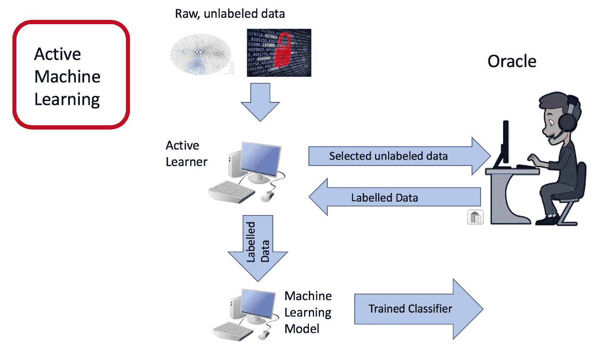

主动机器学习。鸣谢:受张懿主动学习[幻灯片](https://www.cs.cmu.edu/~tom/10701_sp11/recitations/Recitation_13.pdf)的启发。

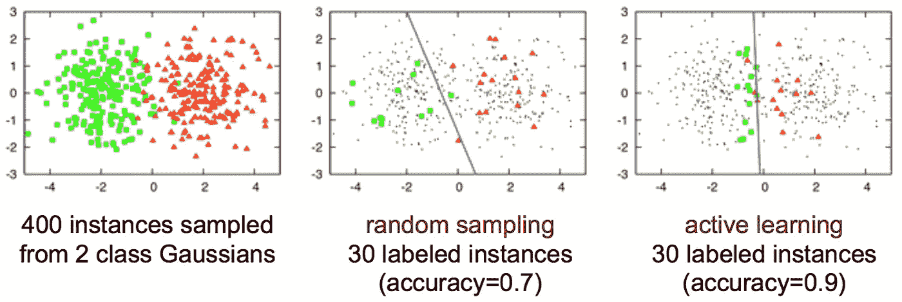

主动学习的一个著名例子(鸣谢:图片来自 Burr Settles' [主动学习](/introduction-to-active-learning-117e0740d7cc))

在过去的十年中，许多成功的主动学习查询技术被开发出来，并被评估为具有竞争力。但是几乎都是基于 Python 环境的(比如包 [modAL](https://github.com/modAL-python/modAL) 和 [Libact](https://github.com/ntucllab/libact) )，主要用于计算机科学行业。

在一般的数据科学领域，R 也是一种常用的语言，尤其是统计学家。可惜没有可用的主动学习的 R 包(一个老的，“ [activelearning](https://github.com/ramhiser/activelearning) ”，5 年前就过时了)。当 R and R 工作室为统计学习构建一个用户友好平台时，我们想看看 R 是否能同样使主动学习变得平易近人。

更重要的是，我们认为主动学习可以是一个跨学科的领域，邀请统计学家做出贡献。在我们开始实验之前，我们想快速概括以下关于主动学习的统计术语:

> **采样。**我们将介绍两种常见的基线抽样方法，包括随机抽样。
> 
> **最优实验设计。**主动学习旨在达到最小的实验成本。
> 
> **回归模型**。我们将使用逻辑回归模型在 *Iris* 数据集上执行分类任务。

# D 数据集和预处理

为了清晰和简单，我们将使用一个著名的机器学习数据集: *Iris* 。Iris flower 数据集是由著名的统计学家和遗传学家罗纳德·艾尔默·费希尔爵士引入的多元数据集。鸢尾包含三个类别标签: *setosa、virginica* 和 *versicolor。*每个类别标签有 50 个数据条目。每个条目有四个关于花瓣和萼片的宽度和长度组合的特征。

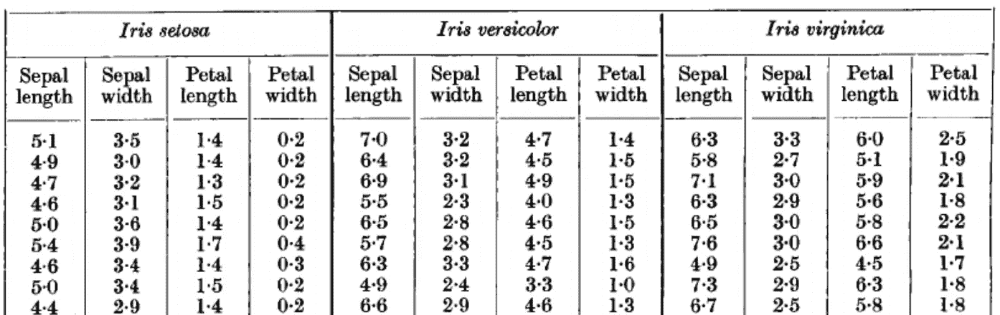

鸢尾花的形态测量。[来源](https://onlinelibrary.wiley.com/doi/epdf/10.1111/j.1469-1809.1936.tb02137.x)

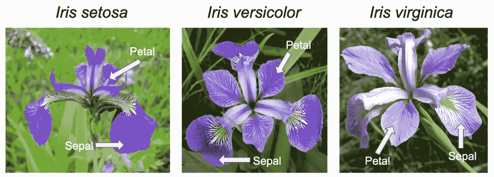

Iris 类别标签和特征的插图。[来源](/the-iris-dataset-a-little-bit-of-history-and-biology-fb4812f5a7b5)

## 降维

为了构造二元分类问题，我们首先对虹膜数据集进行主成分分析。前两个主成分解释了 95.81%的方差。此外，它显示了" setosa "群体与其他两个群体之间的明显区别。LFDA 图也证实了这一发现。有两个完全分离的类，意义会小一些。因此，我们从“versicolor”(绿色)和“virginica”(蓝色)组中选择数据条目来构建二元分类问题。

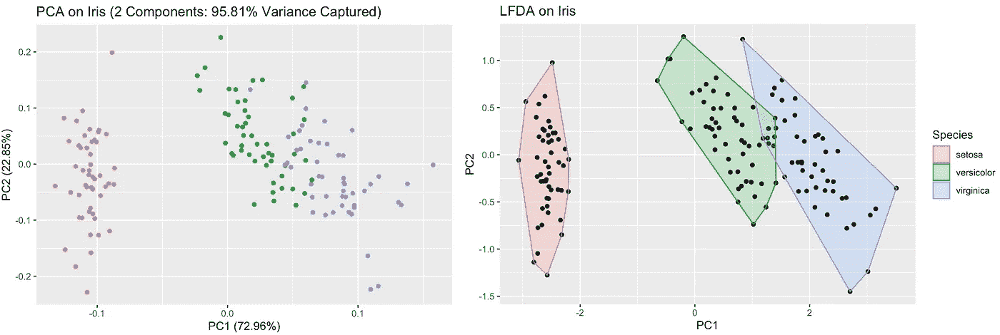

虹膜上的 PCA 和 LFDA 图(来源:[安迪的 GitHub 教程](https://github.com/AndyWangSFU/Active_Learning_in_R)

## 变量选择

我们希望选择两个特征，并使用二维图来说明主动学习如何实现可视化。“花瓣。长度”和“花瓣。宽度”是理想的选择，因为它们对于“杂色”(红色)和“海滨”(绿色)组来说有适度的交叉。

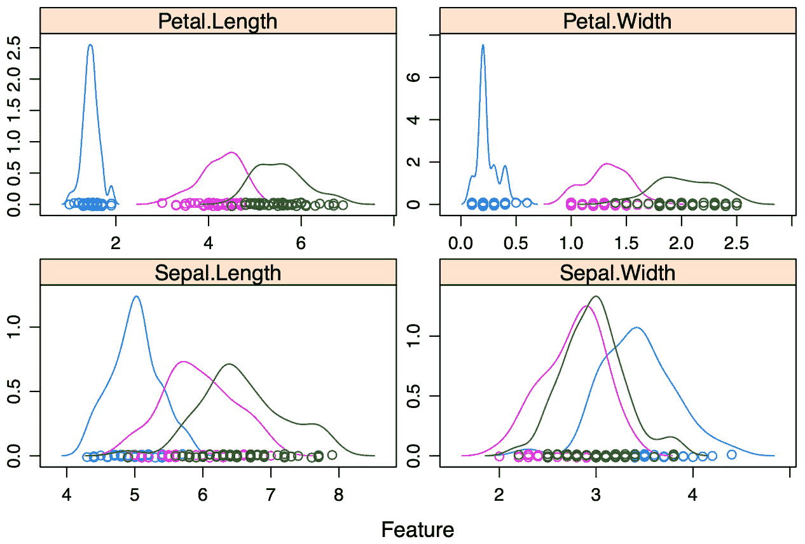

Iris 上的特写图(来源:[安迪的 GitHub 教程](https://github.com/AndyWangSFU/Active_Learning_in_R))

最后，我们有一个适当的预处理数据集用于主动学习。我们在整个数据集上训练一个逻辑回归分类器，并使用这个决策边界作为*基础事实*。这两个组不能使用线性决策边界完全分开。

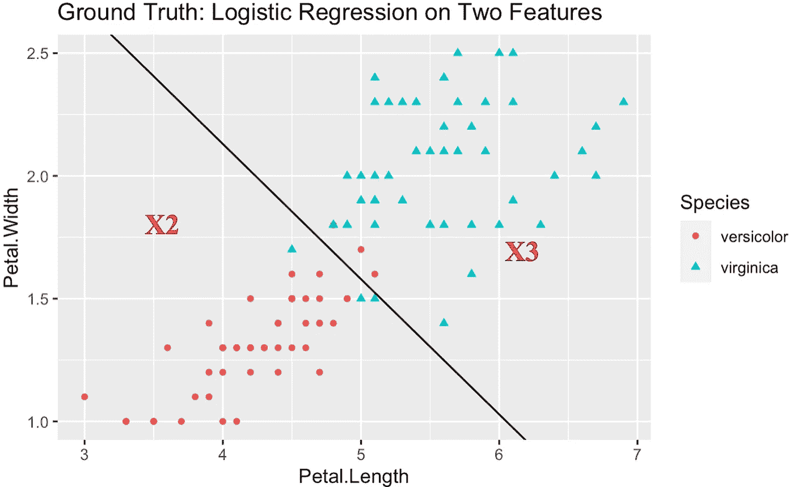

(来源:[安迪的 GitHub 教程](https://github.com/AndyWangSFU/Active_Learning_in_R))

# 模拟

我们将这 100 个点分成两部分:池和测试集(80:20)。然后，我们将池分为被标记的初始训练集和未标记的池(10:70)。数据集的两种分割都依赖于随机状态。

我们通过在这 10 个点上训练初始逻辑回归分类器来开始主动学习过程。迭代 0 的结果(测试集在右图中标记为黄色点)表明决策边界偏离地面真值很多，这是合理的，因为我们只从一个小的集合开始。

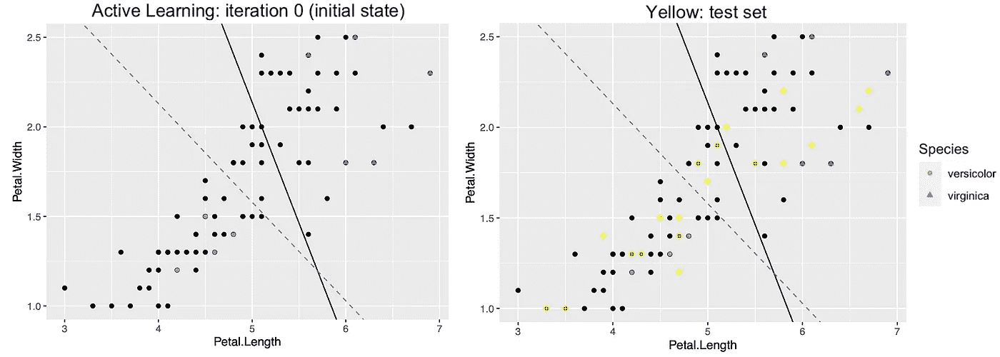

在主动学习的每次迭代中，我们基于不同的查询策略查询一个点，将其添加到训练集并重新训练 logistic 回归分类器。我们将使用以下两种基本策略:**不确定性采样:**我们选择置信度最小的点，即最接近当前决策边界的点，以及**随机采样:**我们从无标签池中随机查询该点。

## 不确定抽样

对于通过不确定性采样策略进行查询的迭代 1 至 3，蓝色菱形符号标记每次迭代中查询的点。我们可以看到，预测线与最初查询的样本相比变化很大。这符合不确定性抽样的逻辑，因为我们期望它带来最多的信息，并极大地改变我们的模型。

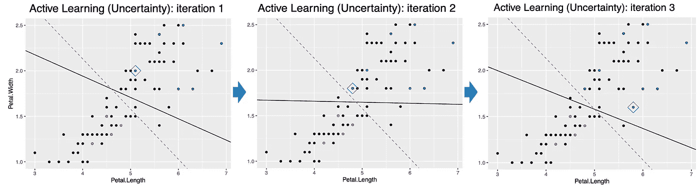

主动学习(不确定性)迭代 1 到 3

然而，我们也注意到一些被查询的样本可能实际上并不有用。例如，第二个查询样本使预测边界变得更差，并降低了分类精度。

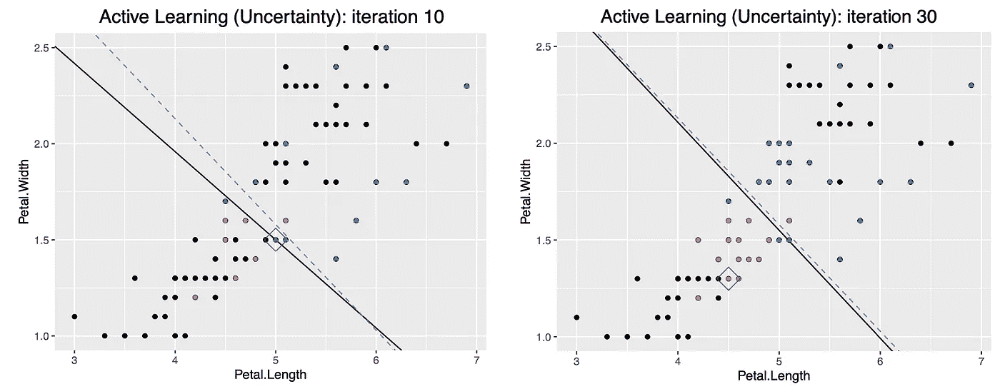

主动学习(不确定性)迭代 10 和 30

在迭代 10 中，逻辑回归的决策边界接近地面真实。在第 30 次迭代中，中心点、关键点和信息量最大的点都被查询，预测边界几乎是固定的。我们使用一个较小的训练集来实现一个相当好的分类模型。

## 随意采样

我们使用随机抽样策略进行了类似的实验。初始状态不会改变。但是，每次迭代查询哪个点和不确定性采样完全不同。迭代 1 至 3 和 10 以及 30 的类似曲线也在下面给出。

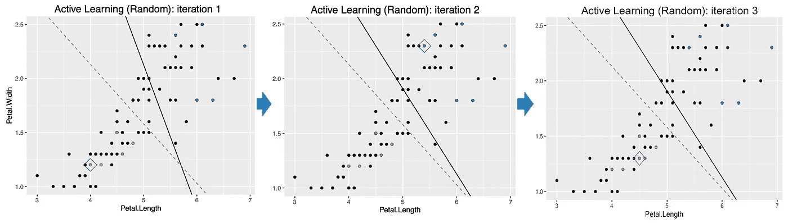

主动学习(随机)迭代 1 到 3 次

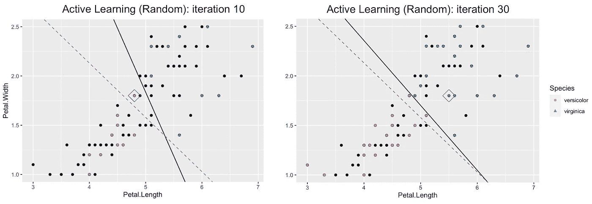

主动学习(随机)迭代 10 和 30

我们可以看到点是随机选取的(蓝色菱形点)，决策边界没有太大变化。即使在第 10 次迭代中，预测边界看起来仍然远离实际情况。显然，随机采样比不确定性采样收敛得更慢，并且需要更多时间才能达到相同的分类精度水平。

# 洞察力:不确定性与随机性

随机采样并不保证是最优的，因为它并不关注所查询的实例是否为训练的分类器提供了新的信息。由于它是任意的，实现起来相当快速和简单，随机抽样通常被用作不同查询策略的最常见基准。问题是，*不确定性抽样总是比随机抽样好吗？*

事实上，随机抽样是一种合理的竞争策略，没有任何主动学习方法可以防止比随机抽样更差的表现。尽管普遍认为应该存在平均来说至少与随机采样一样好的主动学习技术，并且在大多数情况下应该优于随机采样。然而，这经常与来自真实世界环境的经验评估相矛盾。

> 这仍然是一个悬而未决的问题。在过去的十年中，大多数研究论文集中在提出新的、新奇的和平衡的主动学习技术。而有限的工作试图研究为什么随机抽样实际上如此具有竞争性。在主动学习领域，寻找一种*安全*又有效的主动学习方法仍然是一个具有挑战性的问题。

# 主动学习:R 与 Python

我们还在 Python 中实现了类似的主动学习工作流。由于列表和 *Pandas.dataframe* 操作的简明性，它只需要大约 1/4 的代码。不足为奇的是，无论是从最终的结果还是见解来看，都没有显著的差异。此外， *ggplot2* 和 *matplotlib* 都让可视化变得简单。

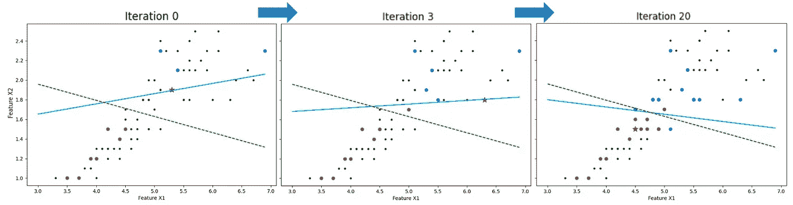

Python 中主动学习的例子(来源: [Andy 的 GitHub 教程](https://github.com/AndyWangSFU/Active_Learning_in_R))

尽管我们的实验很简单，并且基于一个玩具数据集，但是与 Python 相比，用 R 实现这些主动学习技术看起来并没有那么残忍。在 KDD2018 [研讨会](https://www.kdd.org/kdd2018/hands-on-tutorials/view/active-learning-and-transfer-learning-at-scale-with-r-and-python)“使用 R 和 Python 进行大规模的主动学习和迁移学习”中，作者还使用 R 和 Python 提供了两个主动学习的优秀示例。他们声称“我们的练习将强调这些语言之间的互操作性，以便我们可以使用两种环境来实现共同的目标”。

那么*为什么不是 R* ？如果我们回到我们推论的起源，这个问题是可以解释的:主动学习仍然是一个没有建立安全技术的成长领域。不能保证比随机抽样更好，解释和使用随机性仍然是一个公开的问题。大多数开发的方法都声称克服了这种限制，但是当使用不同的真实世界数据集和/或分类模型在 Python 中进行测试时，通常表现出矛盾。在这种情况下，不太需要在 R 中实现相同的实验来获得令人沮丧的支持。

另一方面，我们仍然看到在 R 中引入主动学习并进一步邀请统计人员做出贡献的巨大潜力。目前，R 中没有可用的主动学习包。实施一些有代表性的主动学习方法并将其引入 R 社区可以成为统计学硕士和博士生贡献的一个极好的主题。从最初的尝试来看，我们没有发现它有什么特别棘手的地方。同时，由于主动学习属于最优实验设计，我们相信有经验的统计学家可以帮助解决主动学习中的开放性问题，例如我们之前讨论的随机抽样问题。主动学习仍然是一个不断发展的领域，跨学科合作的前景令人振奋。

# 摘要

在这个简短的演示中，我们用两个基线方法开发了一个简单的 R 主动学习管道，灵感来自于几乎所有现有的主动学习方法都是基于 Python 环境的背景。首先，我们形象化地展示了不同的主动学习方法是如何工作的，以及分类器在每次查询迭代中是如何改进的。尽管有这些观察，我们提出了一些在 R 社区发展主动学习的有希望的方向，并留下一些开放的问题来鼓励统计学家做出跨学科的贡献。

# 杂项(其他来源)

所有的脚本和源代码都可以在我的 GitHub [repo](https://github.com/AndyWangSFU/Active_Learning_in_R) 中找到。此外，我为初学者提供了一个简短的演讲(也有幻灯片)来快速学习主动学习。如果你喜欢这些材料，请留下一颗星，非常感谢！