# 大规模主动学习—构建强大的数据统一框架

> 原文：<https://towardsdatascience.com/active-learning-at-scale-building-a-robust-data-unification-framework-fd9084a139d5?source=collection_archive---------16----------------------->

## 通常，这与模型无关，甚至与数据本身无关，而是与持续运转的引擎有关。

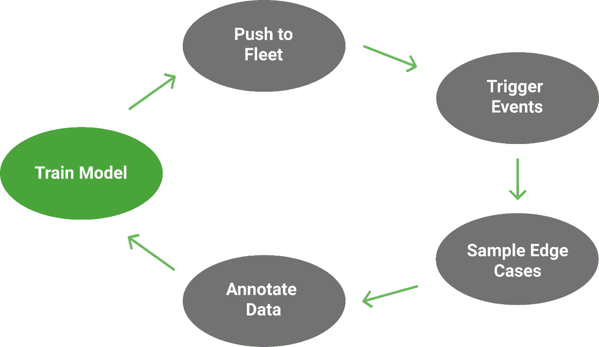

作者图片

Nauto 是先进驾驶辅助系统的领先供应商，该系统改善了当今商业车队和未来自动驾驶汽车的安全性。为此，我们每月处理万亿字节的驾驶数据，这些数据是由安装在挡风玻璃上的设备从世界各地的车辆上收集的。这些数据用于不断改进支持我们车辆安全堆栈的模型，从部署到我们设备的实时预测碰撞警报，到运行在云上的安全分析。数据驱动一切。

**除了为驾驶员提供即时的安全价值，我们的功能还在塑造他们自身发展方面发挥着重要作用。**

如果我们想提高车辆检测向前行驶碰撞预警(FCW)，我们首先要考虑的是 FCW 触发的误报。行人和 PCW 也是如此。随着时间的推移，每个功能都建立了自己的定制数据集，包括相关示例和有趣的边缘案例，然后在训练过程中反馈到底层模型中。这一闭环形成了一个非常强大的数据引擎的基础，推动我们所有功能的持续改进。

# 问题是

问题是，多个功能通常由一个型号提供。对我们来说，一个单一的多类物体探测器的权力尾随，FCW 和 PCW。虽然从计算的角度来看这很棒，但这让训练变得有点复杂。

让我们以 FCW 为例。假设它已经部署了一段时间，并且已经收集了相当大的涉及领头车辆的风险事件数据集。我们注意到，它的误报主要源于未能定位形状奇怪的车辆，因此我们对这些事件进行采样，用高质量的车辆边界框对它们进行注释，并建立一批由 50k 图像组成的新训练数据。

问题是，我们不能简单地将这批新车辆添加到现有的多类数据集中。这样做会不公平地惩罚正确检测的模型，比如说行人或红灯，在一个只为车辆标记的例子中。该模型最终通过一个损失函数进行优化，该函数将其预测与地面真实情况进行比较。**在这个例子中，损失函数不会区分不存在的对象和只是碰巧没有被标记的对象。**我们不能只是将一堆部分标记的数据集连接在一起，否则会导致不公平、混乱的训练。

幸运的是，我们有几个选择。

## 注释所有数据集的所有类。

最显而易见的解决方案就是手工给所有东西贴上标签。如果我们的模型检测到行人、车辆和交通信号，那么每一批新的训练数据都必须在整个类别分类中进行注释——不管它来自哪个特征。

第一个问题是可扩展性。在 Nauto，我们的核心物体检测器可检测 5 个主要任务中的 20 多个类别，并且还在不断增加。使用这种方法，我们不仅需要通过车辆标注工作流运行单批 FCW 数据，还需要运行行人、交通信号、车道检测等数据。工作流程也是如此。

总的注释工作量随着以下因素的变化而成倍增加:

```
 **#_annotations = (#_examples) x (#_tasks)**
```

这很快变得不切实际，尤其是当你考虑到当我们决定增加一个新任务时会发生什么，比如交通锥检测。不仅新的交通锥数据需要用我们所有 5 个现有任务的类进行注释，而且*我们现有数据集中的每一个例子都必须用交通锥进行反向标记*。

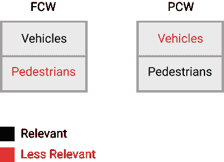

作者图片

**第二个问题是无关紧要。**我们来自 FCW 的新一批 50k 图像可能会包含许多形状奇怪的车辆的有趣例子，这将大大提高车辆检测。但是很有可能不会有很多行人。即使有，它也肯定不会包含那么多相关的*边缘案例，比如形状怪异的行人——因为这些图像来自 FCW，而不是 PCW。然而，我们必须通过两个注释工作流运行这些 50k 图像。*

**在每个标记任务的预算和资源有限的情况下，这种强力方法会在除了一个检测任务之外与*所有检测任务都不相关的例子上快速吃掉我们的整个标记带宽。***

因为总注释的数量成倍增长，而相关的、特定于任务的注释的数量呈线性增长，所以随着时间的推移，随着我们添加更多的任务，不相关注释的整体比例只会增长。

## 利用自动标记。

一个更具可扩展性的解决方案是利用我们现有的模型来填补缺失的标签。在我们新的一批 FCW 数据中，我们将只手动标记相关的车辆类别，并调用我们现有的检测器集合来填充行人和交通信号类别。

最棒的是，这些“自动贴标机”不受我们的生产模式在设备上面临的任何限制。它们可以运行在强大的云 GPU 上，它们可以离线运行而没有延迟限制，它们可以利用在某个时间点*之前和*之后收集的数据。他们也可以是专家；如果这意味着比多任务模型更好的性能，那么每个任务都可以有自己专门的自动标注器。

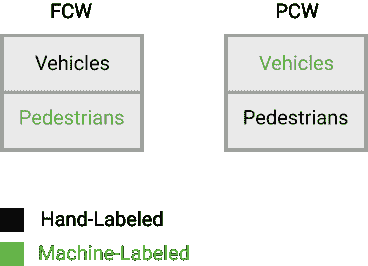

作者图片

相对于强力方法的优势是显而易见的；人类可以专注于为每个任务中最相关的示例制作高质量的标签，而机器可以填充剩余的不太相关的数据。有了本月标记 10 万张车辆和行人图像的预算，我们可以用有趣的车辆标记 5 万张 FCW 的例子*和用有趣的行人标记 5 万张 PCW 的例子——而不是全部花在前者上。剩下的就交给我们的模特了。*

缺点是我们在标签中引入了噪声。虽然人类不是完美的贴标机，但模型通常不太一致。使用这种方法，我们的数据集将总是包含有噪声的、机器制造的标签的子集。

**此外，对于每一个添加的新任务，所有*任务中噪声标签与干净标签的比例都会增加。***

这是因为我们实际上并没有降低第一种方法的乘法复杂度，只是简单地将负载从人转移到机器。用“人”代替“相关的”，用“机器”代替“不相关的”，关系就清楚了。

这里有一个例子。假设我们希望将新的锥形检测任务合并到现有的 100k 图像的车辆和行人数据集，因此我们添加了一批新的手动标记有交通锥的 10k 图像。现在，我们必须对新 10k 批次中缺失的*车辆*和*行人*进行机器标记。但是我们还必须对原始数据集的所有 100k 张图像中未标记的交通锥*进行同样的处理。最终，我们增加了训练集中人类标签的数量——但没有将机器标签的数量增加一个数量级。*

## 使用部分损失函数。

也许最优雅的方法不是将部分标记的数据建模为与我们的损失函数兼容，而是将我们的损失函数建模为与部分标记的数据兼容。

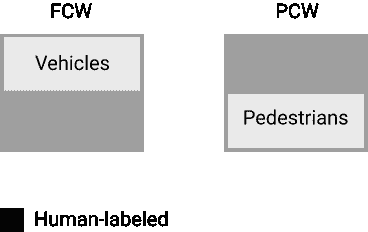

作者图片

这样的损失函数*将*需要在每个例子中区分不存在的对象和只是碰巧没有被标记的对象。然后，它将简单地反向传播被标记的类的损失。对于一个给定的例子，对一个碰巧未被标记的物体的任何正确检测都不会受到不公平的惩罚。

**修改损失函数而非数据的明显优势在于，我们将前两种方法所面临的复杂性从乘法缩减为加法。**

有了我们新的一批 FCW 数据，我们只需给车辆贴上标签就可以了！当这些示例在训练期间被采样时，损失函数将仅针对其车辆预测惩罚模型，而不是其他。当添加新的检测任务时，我们不需要用新标签回填现有数据集。我们的数据集 100%相关，100%无噪声。

唯一的挑战是如何建立这样一个损失函数。令人惊讶的是，很少有文献涉及这个主题，开源代码就更少了。还有一些问题需要考虑，例如如何对损失进行归一化，由于一些例子被最低限度地标记，而另一些例子被高度标记，损失的幅度现在可能会有很大差异。

# 构建数据统一框架

考虑到这一点，我在四月份的目标是构建一个框架来支持我们数据的快速增长的复杂性。我们在 Nauto 的团队一直在积极进行持续的模型改进，但当时我们特别积极——准备将 3 个全新的检测任务集成到我们的核心对象检测器中。

作为该模型的所有者，我刚刚开始意识到我现有的工作流变得不可扩展的速度有多快。到那时，我已经利用自动标记来统一我们的数据集，并且刚刚完成了我的第一个部分损失函数的工作版本。但是我仍然手动操作。我没有正式的流程来跟踪这些部分数据集、最终的统一数据集或用作自动标注器的模型。每当我们需要合并一批新的带标签的数据时，我就想方设法弄清楚什么需要用什么来自动标记，并手动安排推理作业。

我真正想要的是一个灵活、用户友好的框架，它能够:

*   **支持部分损耗&自动贴标。**
*   **抽象出统一过程的复杂性。**
*   **跟踪和维护我们不断增长的特定任务数据集、自动贴标机和统一数据集。**

我最后整理出来的东西大概是这样的:

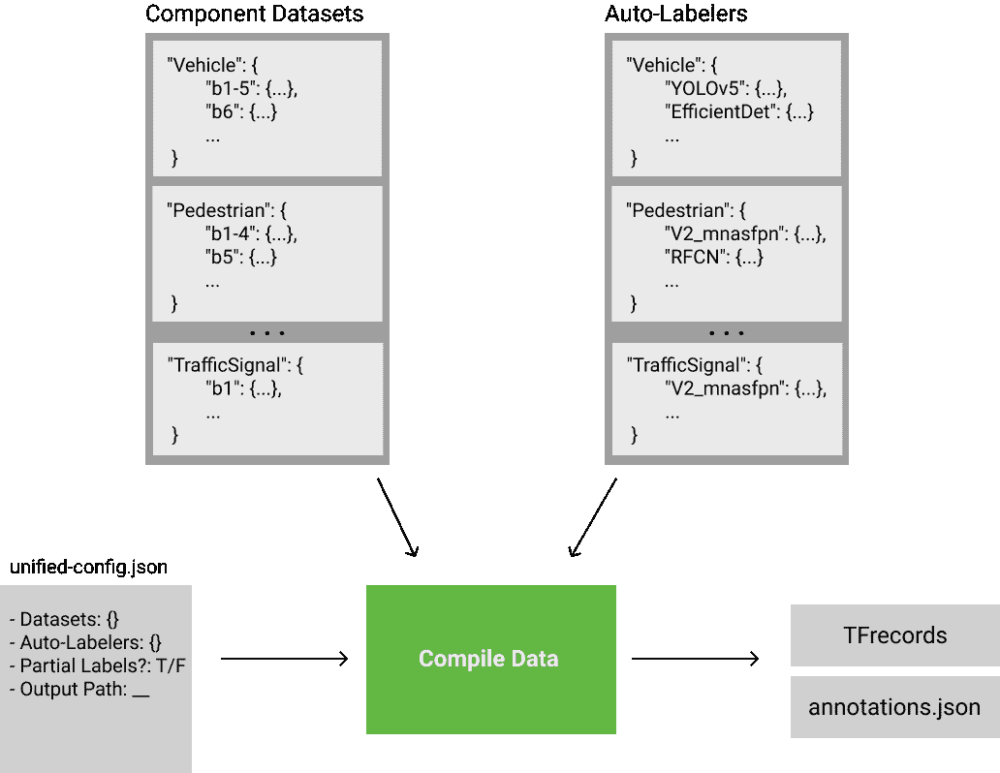

作者图片

我将简要介绍一下核心部分:

## 组件数据集

这些是部分标记的特定于任务的数据集，构成了统一框架的构建块。在统一过程中，我们不仅可以指定包含哪些任务，还可以指定包含哪些任务的哪些批次。

当一批新的 PCW 数据从行人标签队列中出来时，我们只需将其注册在配置文件的“行人”部分。现在可以统一了！

## 自动贴标机

如果选择自动贴标作为统一方法，这些是可供我们使用的专业型号。对于每项任务，我们必须从一组训练好的模型中挑选一个自动贴标机，并使用其预先优化的阈值集或用新值覆盖它们。在数据统一过程中，这些阈值将决定哪些模型预测将被用作基本事实，哪些将被丢弃。

注意，对于我们从组件数据集中包含的每个任务，我们还必须选择一个相应的自动贴标机。例如，我们不能选择*车辆:[b6]* 和*行人:[B1–4，b5]【T3]作为数据集，而只能选择一个车辆自动贴标机，因为*车辆:b6* 将无法填充其缺少的行人标签。*

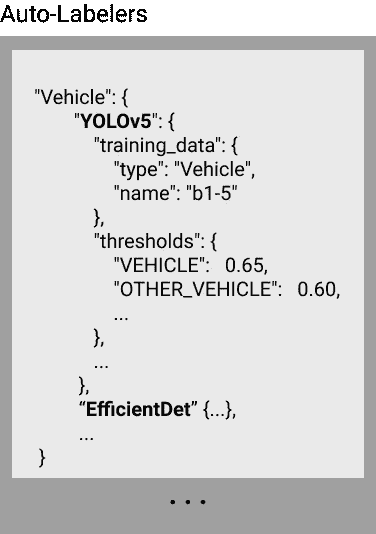

作者图片

根据设计，每项任务的最准确、最近训练的模型将总是被推到堆栈的顶部。每个模型还会列出*本身*被训练的数据。**这两种方法可确保我们始终在任何时间点最大限度地提高机器标签的准确性，并确保我们完全了解最终生成这些机器标签的原始训练数据。**注意，我们甚至可以使用过去在统一数据上训练的生产模型作为当前迭代的自动标注器。

## 编制资料

要编译新的统一数据集，只需指定要包含的所需组件数据集、统一方法(部分丢失或自动标记)、要用作自动标记器的模型(如果选择该选项)以及输出路径。就是这样！该框架将统一数据，并以 TFrecords 的形式将其转储出来，以便立即进行生产模型培训。

然而，根据所选择的统一方法，幕后发生的事情会有很大的不同。

**在部分丢失的情况下，组件数据集基本上只是被连接和丢弃。**唯一的警告是，对于每个示例，标记的类都被记录下来并注册在 TFrecords 中。这是为了以后，当训练循环提取该特定示例时，它将知道只反向传播属于该组标记类的检测的损失，而不惩罚其他任何东西。

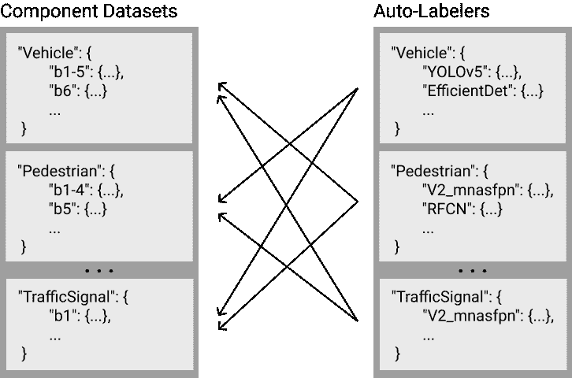

作者图片

**相比之下，自动标注由于其复杂性而更加复杂。**对于每个组件数据集，我们必须使用自动贴标机为除数据集所属任务之外的所有任务运行推理。假设我们想要统一跨越 4 个任务的 5 个组件数据集(因此有 4 个自动贴标机)。对于每个组件，3 个独立的自动贴标机必须运行推理来生成缺失的标签，总共 5 x 3 个推理作业。更一般地说，推理工作负载的比例为:

```
 **#_inference_jobs = (#_component_datasets) x (#_tasks — 1)**
```

这应该感觉很熟悉，因为它基本上重新表述了完全人为标记的方法的复杂性等式。令我难以置信的是，即使对于在服务器级 GPU 上一分钟生成 1000 个预测的模型，仅通过少数几个任务就可以感受到这种工作负载的巨大规模。我最近在 5 个任务上编译了大约 100k 个示例，花了几个 GPU 小时才完成。想象一下用人力来做这件事吧！

# 结果

当我开始这个项目时，我的第一个问题是——我相信你现在也有了——哪种方法会产生更好的模型？由于有多少变量在起作用，这实际上是一个相当复杂的问题:与组件数据集的数量相比的任务数量、自动标注器的准确性、使用的阈值、损失函数的实现等等。我还没有足够的时间进行足够多的控制实验来真正回答这个问题，所以我不会假装回答。但是我将分享我的一些有限的发现，我觉得这些发现很有趣——我希望你也会感兴趣。

从理论的角度来看，我几乎可以肯定，部分损失将严格优于自动标记。部分损失允许 100%无噪声的、人类标记的数据集，该数据集应该训练比被有噪声的机器标签污染的模型更准确的模型。从实用的角度来看，它还有在几分钟而不是几小时内编译的好处。

这就是为什么我如此惊讶地发现事实正好相反:

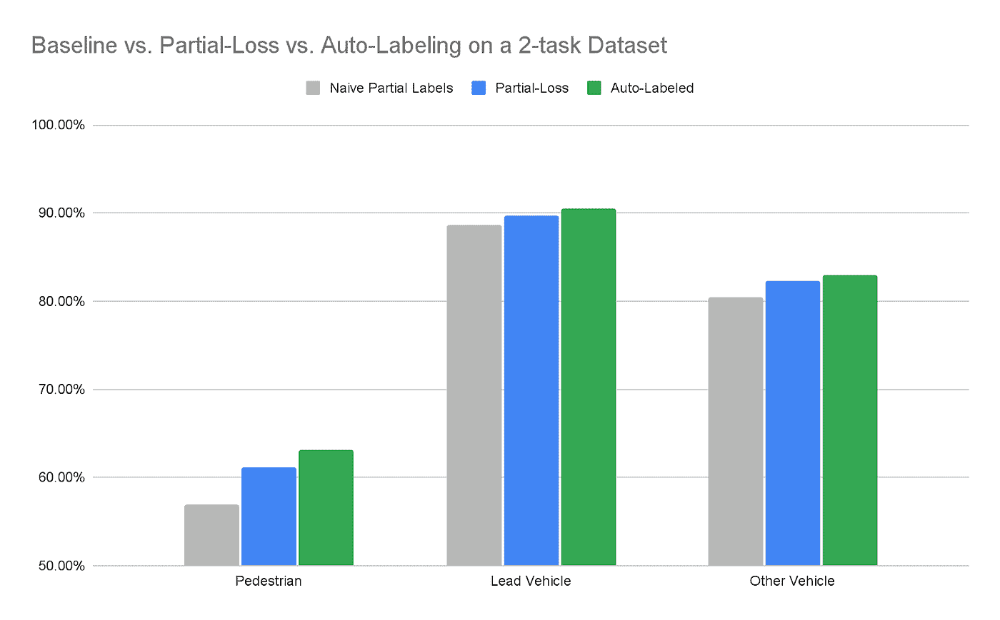

**试验 1:在行人&车辆的实验数据集上与基线相比较的统一方法。**这里，基线运行使用部分标记数据的默认损失。图片作者。

首先要注意的是，在对部分标注的数据集进行训练时，使用部分损失函数比默认损失的精度高得多。这看起来很棒，有几个原因。首先，它验证了整个框架旨在解决的中心问题:**在部分标签的数据集上进行天真的训练是次优的，因为它不公平地惩罚了对未标记对象的正确预测。**从实践的角度来看，这也验证了我的部分损失函数的实现——到目前为止，我只进行了最低限度的测试。

有趣的是，在所有三个类别中，自动标记的表现都优于部分损失。出于好奇，我做了更深入的研究:

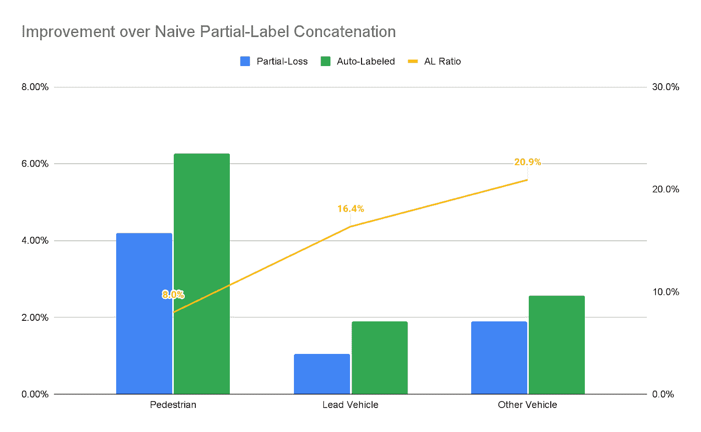

**试验 1:部分损失&自动标记基线的改善，以及每类自动标记比率。**图片作者。

在这里，我绘制了每个类别的“自动标记比率”——嘈杂的机器标签与干净的人类标签的比率。虽然自动贴标在所有类别中都优于部分损失，但随着机器贴标比例的增加，其领先优势逐渐缩小。对于*行人*，机器标签比例最低的类别(8%)，自动标签领先超过 2% F1。但是对于*其他车型*，一个机器标签比例更高的级别(21%)，差距缩小到 0.67% F1。**一个假设是，自动标注的比例越大，拥有完整标注相对于部分标注的好处就越小，这是因为地面真实中的噪声越来越大。**很自然的问题是，如果自动贴标率足够高，领先优势是否会翻转。

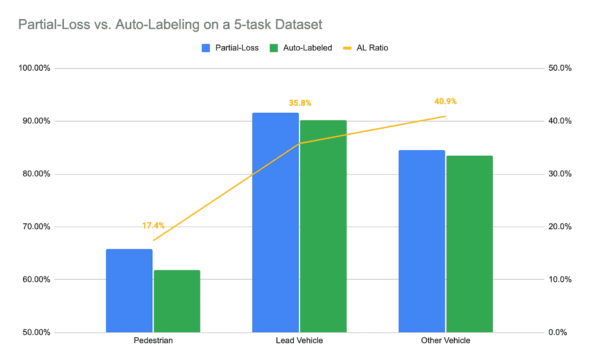

**试验 2:在具有 5 个任务的实验数据集上比较统一方法。**为了保持一致，只显示了两个原始任务(车辆&行人检测)。图片作者。

原来答案是肯定的！通过将数据集从 2 个任务扩展到 5 个，我能够显著提高所有类的自动标记率。在新的试验中，在所有类别中，部分损失最终胜过自动标记。

虽然这一发现确实为我们的假设增加了一些支持，但它也提出了一些其他问题。例如，为什么部分损失销售线索不会随着自动标签比率的提高而增加？部分损失在自动标签百分比最低的*行人*类别中领先 4%，在自动标签百分比超过两倍的*其他车辆*类别中仅领先 1%。如果我们的假设是真的，那么我们不应该也看到部分损失的好处随着噪音数据集的增加变得更加明显吗？

一种解释是，我们忽略了一个重要的变量:自动贴标机本身。**自动标注数据集中的噪声是自动标注器的精度和它对地面真实数据集贡献的标注分数的函数。考虑到这一点，当我们考虑到我的*行人*自动贴标机远不如我的*车辆*自动贴标机准确时，我们的发现就更有意义了。这部分是因为行人检测在 Nauto 是一项更新的任务，部分是因为行人比车辆更难定位。**

我们可能还忽略了另一个相关变量:数据集大小。第一个实验数据集相当小，迄今为止，*行人*的人类标签份额最小，其次是*车辆*，然后是*其他车辆*。第二个数据集要大得多，最明显的是包含了大量的*普通*标签。有人可能会说，在第一次试验中，自动标记为缺乏标签的行人任务提供了巨大的好处——增加了标签的总数，并使其更接近收敛。到第二次试验时，由于人类标签的基础更加坚实，这种好处缩小了，事实上，由*行人*自动贴标机引入的越来越多的噪音超过了这种好处。

# 前进

显而易见，现在仍有大量未解决的研究问题有待探索。令人欣慰的是，这样一个统一的框架使得这类实验运行起来没有痛苦，并且随着时间的推移可以跟踪。最棒的是，因为统一过程本身被抽象掉了，我们可以在不中断或复杂化用户工作流的情况下修改不同的优化。以下是我希望今后能够实现的一些改进:

## 软自动标记

实际上有第三种统一方法。我们可以用置信度来衡量任何自动标签，而不是像对待人类标签一样对待它。这将对象标签从二进制[0 或 1]变为连续的[0 到 1]，其中人类标签将始终被赋予权重 1，而机器标签将属于低于该权重的分布。

**这种方法背后的直觉是，并非所有的自动标签都是平等的；有的会比较自信从而准确，有的会不太自信从而吵闹。**虽然默认的“硬”自动标记将对所有高于阈值的机器预测一视同仁，但“软”方法将根据准确的可能性来调整每个预测。因此，在训练过程中，错过权重为 0.95 的自动标记对象的模型将受到惩罚，就像它错过了人类标记的对象一样。相比之下，错过 0.45 权重的自动标签的模型将不会受到几乎同样严厉的惩罚，因为标签不可靠的可能性更大。

我们仍然可以实现阈值来过滤垃圾预测，但是选择不再像标签不再是二元的那样重要。我们还可以在分配权重时实现一个归一化函数，以考虑不同模型体系结构中置信度得分分布的变化。

这种方法感觉很有前途，因为它允许我们利用我们的自动贴标机产生的高质量、有用的注释，同时以一种机制来减轻嘈杂、有害的标签的影响。

## 贮藏

目前，每次编译新的统一数据集时，都是从头开始。对于自动标记，这可能是一种浪费，因为我们的数据会随着时间的推移而逐渐增加；很有可能新编译的大部分预定推理作业之前已经运行过。解决方案是简单地将每个推理作业缓存为完全注释数据的构建块——使用自动标注器的 id 和组件数据集作为签名。如果将来安排了完全相同的签名，我们只需从缓存中提取，而不是重新运行推理。

以存储少量文本注释为代价，这样的缓存可以节省我们大量的时间——将编译新的自动标记数据集的周转时间从几小时缩短到几分钟。

## 并行化

同样，自动标记过程可以很容易地在许多 GPU 上并行化——通过批处理或推理作业。这应该是不言自明的，实现起来也很简单，所以我就不赘述了。同样，好处是缩短了编译时间，以便尽快开始培训。

# 最后的想法

我最初开始这个项目只是为了自动化一个很快变得不可扩展的手动任务:*将越来越多的特定于任务的数据集统一到我们的模型可以在*上训练的东西中。现在回想起来，如果不在 6 个月前投资这样一个框架，我不可能支持 3 个新探测任务的启动。从这个意义上说，我已经看到这项投资的回报了。

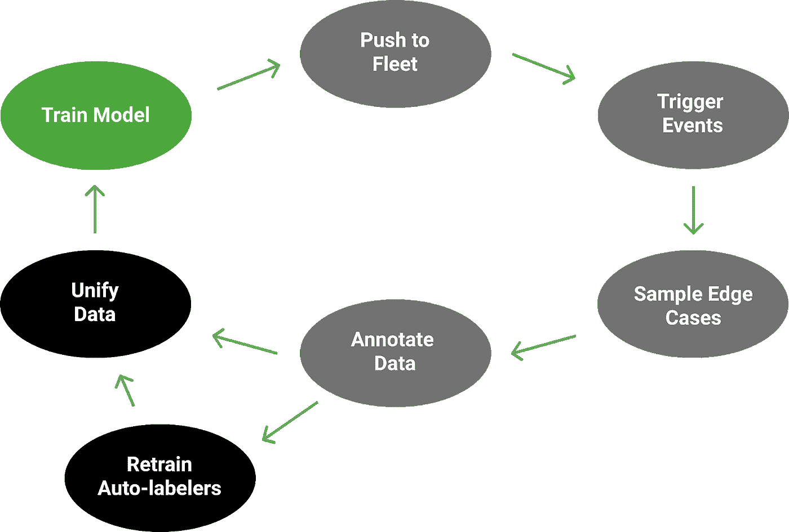

作者图片

展望未来，我希望这个统一框架能够支持主动学习引擎，推动我们不断改进现有功能并推出新功能。**在这个扩展的循环中，我们不仅在重复我们收集的数据和部署的模型，还在重复我们统一这些数据的过程，以及推动这一过程的幕后模型。**关键是这个过程是健壮的、自文档化的，并且是固有的*迭代*。Nauto 必须能够继续以积极的步伐扩展其安全产品和人工智能能力——不受规模和复杂性问题的限制。

在 AI 领域，持续改进是必须的，而数据是这一切的核心。拥有一个驱动高效数据收集和数据监管的引擎至关重要。当我开始我的职业生涯时，我假设人工智能是关于建立最好的模型。然后我开始意识到这是关于建立最好的数据。但是我现在开始意识到这实际上是关于建立最好的过程。因为一旦你有了一个使迭代变得毫不费力的过程，其他的一切都会随之而来。