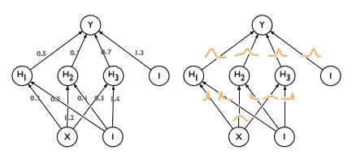
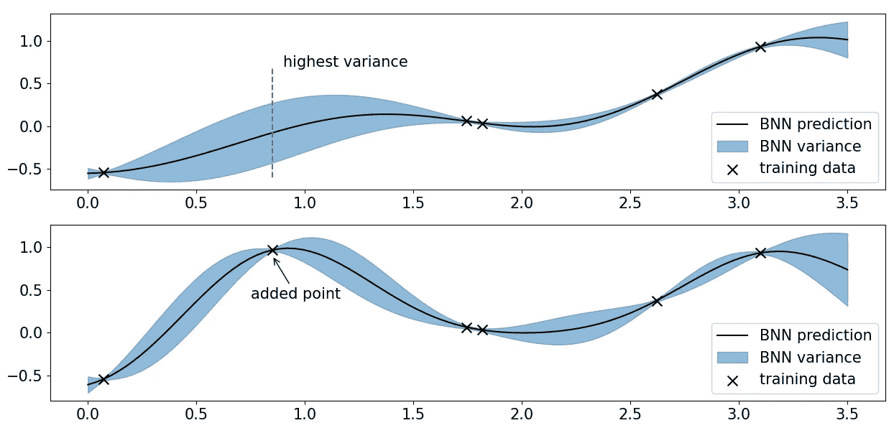
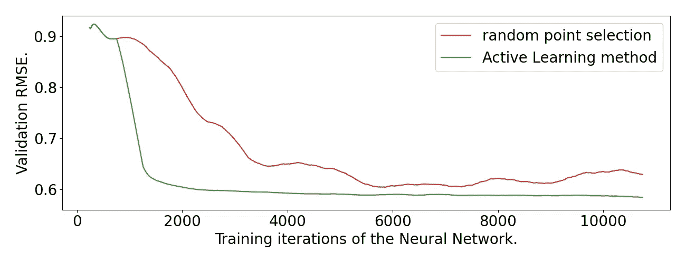

# (贝叶斯)神经网络的主动学习

> 原文：<https://towardsdatascience.com/active-learning-for-bayesian-neural-networks-b8471212850f?source=collection_archive---------25----------------------->

杰瑞米·拉帕克在 [Unsplash](https://unsplash.com?utm_source=medium&utm_medium=referral) 上的照片

训练机器学习模型可能很难，尤其是在使用神经网络时。有时候，即使是最好的超参数和最干净的数据也达不到我们想要看到的结果。在这一点上，需要额外的训练数据，并且也可能提高模型的性能。毕竟，收敛速度主要取决于观察数据点的数量，对吗？现在可以选择向模型中扔更多的数据，并希望得到最好的结果，但是有一种更有效的方法来完成这个数据选择任务。在机器学习中，这被称为*主动学习。*

**主动学习方法指导数据选择过程。它们添加最少的数据点，同时最大限度地提高模型的训练效果。**把主动学习方法想象成一个神谕，告诉你应该在哪些额外的数据点上训练模型。主动训练模型*可以证明将额外数据点的数量以指数方式减少(！)量(相比只是随机加点)。这非常强大，在很多情况下比你想象的更有用。我们将在下面讨论一些例子。*

*在这篇博文中，你将了解到:*

*   *最常用的主动学习框架(基于资源库)*
*   *主动学习有用的应用场景*
*   *(贝叶斯)神经网络与高斯过程的联系*
*   *一种适用于所有神经网络的优雅主动学习技术*

*这项技术的想法源于这篇[论文](https://arxiv.org/abs/1902.10350)。在我的论文中，我使用了他们的方法，甚至改进了它(一点点)。这是我尝试分享我在过去一年中所学到的东西。我会解释更多关于我的贡献，并在后续文章中提供数学公式。*

*！我论文中的示例代码可以从 [GitHub](https://github.com/LukasErlenbach/active_learning_bnn) 获得。！
！你可以在这个[链接](https://drive.google.com/file/d/1pgNn8ZAEjHANyzPy7JGC8-J0p2qUgxoO/view?usp=sharing)下找到我的论文。！*

# *主动学习框架*

*让我们首先了解在主动学习中我们想要解决哪个问题。(我们考虑基于池的变体，有关更广泛的概述，您可以查看第 2 章[此处](https://research.cs.wisc.edu/techreports/2009/TR1648.pdf)。)一般来说，我们首先在一些训练数据上训练一个模型。**主动学习方法然后选择*额外的*数据来丰富训练数据。**最后，恢复模型训练。*

*考虑下面的 GIF 作为例子。在第一帧中，我们得到了一些标记的训练点(黑点)。标有的*意味着我们不仅知道 x 轴上的位置，还知道 y 轴上底层函数的真实值。我们在第二帧(黑线)的这些训练点上拟合一个神经网络。到目前为止，这是监督回归。**

*现在主动学习开始了。为此，我们需要一组*未标记的*数据点，称为*池。*未标记的数据通常很容易获得:想想没有描述的图像，或者在这种情况下只是 x 轴上的随机数(用蓝色表示)。主动学习方法从池中选择最有希望的数据点。它们被标记(label=y 值)并添加到训练数据(蓝点)中。最后，在*所有*数据点上对模型进行训练，这在这种情况下会带来很大的改进。*

*回归任务的主动学习:在初始网络(黑线)在一些点上被训练之后，从池(蓝色)中选择额外的点，添加到训练数据并用于改进模型。作者 GIF*

## *什么时候适用主动学习？*

*当然，有可能为池中的点获得附加标签是必不可少的。这听起来很难实现，但事实上它比你想象的更加可行。*

*经典的例子是图像分类。在这里，一个未标记的数据点是一个图像，你可以简单地自己对它进行分类。*

*主动学习也**适用于真正的大数据**。有时，对所有可用数据进行培训已经花费了太多时间。在这种情况下，您可以从一个小的子集开始，让主动学习方法决定大集合中的哪些数据是相关的。我在分子数据集上使用这个想法取得了一些成功，在这个数据集上我训练了一只 T21。*

*另一个主要的例子是应用程序，标签可以在运行时计算。当使用神经网络对工程或材料设计的复杂过程进行建模时，这种情况经常发生。在这种情况下，标签是(耗时的)计算机模拟的结果，而**主动学习有助于战略性地投资计算资源。***

*在我的论文中，我考虑了[的这项工作](https://arxiv.org/abs/1907.05317)，其中一个偏微分方程(PDE)用一个神经网络来求解，标签可以通过运行另一个算法来获得。*

## *什么是贝叶斯神经网络和高斯过程？*

*为了理解有目的的主动学习技术，我们必须简要地谈论贝叶斯神经网络(BNNs)和高斯过程(GPs)。两者都是非常有趣的机器学习模型。最后，**最终的技术可以用于任何可以使用 Dropout 的神经网络。***

**

*经典(左)和贝叶斯神经网络(左)。在贝叶斯版本中，权重是分布。这是这篇[论文](https://arxiv.org/abs/1505.05424) [1]中的一个可视化图，它介绍了一种有效训练贝叶斯网络的方法，称为反向传播贝叶斯。*

*贝叶斯神经网络是经典的前馈神经网络，其中**权重被建模为分布**。您仍然可以获取一个输入向量，并通过 BNN 对其进行馈送，但结果将是一个分布，而不是单个值。换句话说，**如果你给网络*，*一个输入，BNN 会给每个可能的输出分配一个概率。**训练有素的 BNN 会给很可能正确的标签以*高*概率，给极不可能正确的标签以*低*甚至零概率。*

*这使得 BNN 成为一个概率模型，并且我们可以从网络中获得额外的信息。例如，如果网络很难在 *label_A* 和 *label_B* 之间做出决定，它可以为这两者返回 50%的概率，而通常它必须选择一个标签，并且我们不知道决策过程中涉及的不确定性。*

*高斯过程也是概率机器学习模型。在像时间序列预测这样的许多应用中，它们的核函数被用来合并像领域知识这样的附加信息。然而，由于拟合过程涉及计算上昂贵的操作，它们往往不能扩展到更大的数据问题。为了了解更多，我推荐看一看这本关于⁵.的书*

*20 多年前，R.M.Neal 发现了贝叶斯神经网络和高斯过程之间的联系。他证明了当单层随机神经网络的层宽度取无穷大时，单层随机神经网络收敛到一个 GP。在过去的几年里，几篇论文([李等人](https://arxiv.org/abs/1711.00165)、[马修斯等人](https://arxiv.org/abs/1804.11271))给出了多层网络的类似结果。*

# *为什么这对主动学习有意思？*

*因为这种联系允许我们通过用高斯过程近似它来为一般的神经网络定义一种很好的主动学习方法。*

*假设我们已经在一些训练数据上训练了一个(贝叶斯)神经网络，并且想要知道池中的哪些未标记点应该被标记以改进模型。**我们希望选择网络具有高度不确定性的点。**当我们将这些点添加到训练数据中时，不确定性可能会降低，预测总体上会变得更好。*

**

*主动学习:具有最高网络方差的点被添加到训练数据中。添加这样的点减少了网络的不确定性，并且可以从整体上改善网络的预测。图片作者。*

*高斯过程有一个很好的特性，那就是它们完全由它们的均值和协方差定义。为了用 GP 逼近网络，我们因此必须计算训练和池点的网络均值和协方差。在贝叶斯网络的情况下，权重是分布，**均值和协方差可以通过从权重分布**中抽取样本 **并计算向前传递来估计。对于非贝叶斯网络，可以使用 Dropout 来代替。根据这篇[论文](https://arxiv.org/abs/1506.02142) ⁴的研究，对辍学进行抽样实际上大致相当于贝叶斯方法。***

*估计的平均值和协方差完全定义了神经网络的高斯过程近似。该过程为池中的每个点定义所谓的*后验方差*。**这个方差正是主动学习所需的不确定性的度量:**如果池中的一个点具有高方差，则网络对其预测具有高不确定性，应该选择该点。*

*在将来自池的一堆高方差点添加到训练数据之后，恢复网络训练，并且模型的质量应该提高。这种在增加点数和重新训练网络之间的切换通常要重复几次。*

*(该论文还讨论了一种加速该过程并确保所选点多样性的方法。我将在后续文章中谈到这一点。)*

## *加州住房数据集的结果(回归)*

**

*一个 BNN 在来自 sklearn 的[加州住房数据集](https://scikit-learn.org/stable/modules/generated/sklearn.datasets.fetch_california_housing.html)上的训练进度，平均超过 10 次运行。图片作者。*

*这里你可以看到主动学习方法和随机选点的比较。我在 sklearn 的[加州住房数据集](https://scikit-learn.org/stable/modules/generated/sklearn.datasets.fetch_california_housing.html)上训练了一个有两层 100 个神经元的 BNN。训练从 500 个随机点开始，执行 10 次主动学习迭代，每次从大约 20.000 个实例的池中增加另外 250 个点。你可以看到**主动学习方法(绿色)比仅仅选择随机点(红色)更快也更稳定地收敛了网络**。*

## *结论*

*主动学习在很多情况下是有用的。它为训练机器学习模型提供了高效和有效的数据选择方法。*

*在这篇文章中，你已经了解了一般神经网络的主动学习技术。该技术利用高斯过程来计算具有高度网络不确定性的数据点。它的动机是贝叶斯神经网络和高斯过程之间的联系，但也可以用于任何使用辍学的网络。在接下来的文章中，我将解释如何改进主动学习方法，并更多地了解数学细节。*

*谢谢你看了我的第一篇博文！我希望你喜欢阅读它，并欢迎任何建设性的反馈:)*

## *参考*

*我的[论文](https://drive.google.com/file/d/1pgNn8ZAEjHANyzPy7JGC8-J0p2qUgxoO/view?usp=sharing)、[GitHub](https://github.com/LukasErlenbach)&[LinkedIn](https://www.linkedin.com/in/lukas-erlenbach/)
【1】Tsymbalov 等人、*Dropout as a Bayes Approximation:表示深度学习中的模型不确定性、*[https://arxiv.org/abs/1506.02142](https://arxiv.org/abs/1506.02142)
【2】Lee 等人、*深度神经网络 as Gaussian Processes、*[*https://arxiv.org/abs/1711.00165*](https://arxiv.org/abs/1711.00165)【3】Matthews 等人、 *辍学作为贝叶斯近似:表示深度学习中的模型不确定性，*[https://arxiv.org/abs/1506.02142](https://arxiv.org/abs/1506.02142)
【5】c . e .拉斯姆森，C. K. I .威廉姆斯*，机器学习的高斯过程*，[http://www.gaussianprocess.org/gpml/](http://www.gaussianprocess.org/gpml/)*