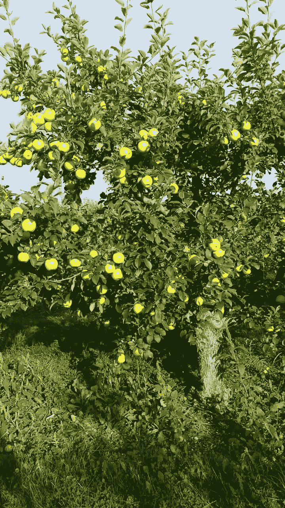

# 使用 Nvidia 转移学习工具包的主动学习教程

> 原文：<https://towardsdatascience.com/active-learning-tutorial-with-the-nvidia-transfer-learning-toolkit-b41489985713?source=collection_archive---------29----------------------->

## 如何使用主动学习和英伟达 TLT 从快速原型到生产就绪对象检测系统

每个机器学习项目中最大的挑战之一是在训练机器学习模型之前，对收集的数据进行整理和注释。通常，神经网络需要如此多的数据，以至于简单地注释所有样本对于中小型公司来说成为不可逾越的障碍。本教程展示了如何仅基于一小部分可用数据制作一个原型，然后通过主动学习迭代改进它，直到模型可以生产。

主动学习描述了一个只有一小部分可用数据被注释的过程。然后，在该子集上训练机器学习模型，并且使用来自该模型的预测来选择要注释的下一批数据。由于训练神经网络可能需要大量时间，因此使用预训练模型并根据可用数据点对其进行微调是有意义的。这就是 Nvidia Transfer Learning Toolkit 发挥作用的地方。该工具包提供了大量预训练的计算机视觉模型和功能，用于训练和评估深度神经网络。

接下来的部分将是关于使用英伟达 TLT 在 [MinneApple 数据集](https://conservancy.umn.edu/handle/11299/206575)上构建一个水果检测模型，并使用来自 [Lightly](https://www.lightly.ai/) 的主动学习功能迭代改进该模型，这是一个计算机视觉数据监管平台。

来自 [MinneApple 数据集](https://conservancy.umn.edu/handle/11299/206575)的示例图像。

## 为什么要水果检测？

准确检测和计数水果是自动化收获过程的关键一步。果实计数可用于预测预期产量，从而及早发现低产年份。此外，水果检测数据集中的图像通常包含大量目标，因此需要更长的时间来注释，这反过来又增加了每幅图像的成本。这使得主动学习的好处更加明显。

## 为什么是明尼阿波利斯？

MinneApple 由 670 张果园中苹果的高分辨率图像组成，每个苹果都标有一个边界框。少量的图片使它非常适合快速浏览教程。

# 我们开始吧

本教程跟随它的 [Github 对应部分](https://github.com/lightly-ai/NvidiaTLTActiveLearning/tree/main)。如果您想亲自体验本教程，可以随意克隆存储库并进行尝试。

## 上传数据集

要用[轻](https://www.lightly.ai/)做主动学习，首先需要把你的数据集上传到平台上。命令`lightly-magic`训练自监督模型以获得良好的图像表示，然后将图像连同图像表示一起上传到平台。由于自我监督，这一步不需要标签，因此您可以立即开始处理原始数据。如果想跳过训练，可以设置`trainer.max_epochs=0`。在下面的命令中，用平台上的令牌替换`MY_TOKEN`。

将数据集嵌入并上传到 [Lightly web-app](https://app.lightly.ai) 的命令。

出于隐私原因，也可以上传缩略图，甚至只是元数据，而不是完整的图像。更多信息见[此链接](https://docs.lightly.ai/lightly.cli.html#lightly.cli.upload_cli.upload_cli)。

上传完成后，您可以在 [Lightly 平台](https://app.lightly.ai/)中直观地浏览您的数据集。你可能会发现不同的图像群。摆弄一下，看看你能得到什么样的见解。

在 [Lightly web-app](https://app.lightly.ai) 中探索您的数据集。

## 初始取样

现在，让我们选择一批初始图像进行注释和训练。

Lightly 提供了不同的采样策略，其中最突出的是`CORESET`和`RANDOM`采样。`RANDOM`采样将很好地保留数据集的基本分布，而`CORESET`最大化数据集的异质性。在 [Lightly Platform](https://app.lightly.ai) 中探索我们的数据集时，我们注意到许多不同的集群。因此，我们选择`CORESET`采样来确保每个聚类都在训练数据中有所表示。

要进行初始采样，您可以使用 [Github 库](https://github.com/lightly-ai/NvidiaTLTActiveLearning/tree/main)中提供的脚本，或者您可以编写自己的 Python 脚本。该脚本应该包括以下步骤。

创建一个 API 客户端来与 Lightly API 通信。

创建一个主动学习代理，作为进行主动学习的界面。

最后，创建一个采样配置，进行一个主动学习查询，并使用一个助手函数将带注释的图像移动到`data/train`目录中。

`query`将在 Lightly 平台中自动创建一个名为`initial-selection`的新标签。

## 训练和推理

现在我们已经有了带注释的训练数据，让我们在上面训练一个对象检测模型，看看效果如何！使用 Nvidia Transfer Learning Toolkit 从命令行训练 YOLOv4 对象检测器。迁移学习最酷的一点是，你不必从头开始训练一个模型，因此需要更少的带注释的图像来获得好的结果。

首先从 Nvidia 注册表下载一个预先训练的对象检测模型。

从 NGC 英伟达下载 ResNet-18 检查点的命令。

在采样的训练数据上微调对象检测器就像下面的命令一样简单。确保用你从 [Nvidia 账户](https://ngc.nvidia.com/catalog)获得的 API 令牌替换你的 _KEY。

命令在所选图像上训练水果检测模型。

既然您已经对数据集上的对象检测器进行了微调，那么您可以进行推断，看看它的工作情况如何。

对整个数据集进行推断的好处是，您可以轻松地找出模型对哪些图像表现不佳或有很多不确定性。

命令使用训练好的水果检测模型进行推理。

下面你可以看到两个训练后的例子图像。很明显，该模型在未标记的图像上表现不佳。因此，向训练数据集添加更多样本是有意义的。

来自训练集和未标记集的图像示例。该模型在图像中缺少来自未标记数据的多个苹果。这意味着这个模型对于生产来说还不够精确。

## 主动学习步骤

您可以使用上一步的推论来确定哪些图像导致了模型问题。使用 Lightly，您可以轻松地选择这些图像，同时确保您的训练数据集不会充斥着重复的图像。

本节将介绍如何选择图像来完善您的训练数据集。您可以再次使用`active_learning_query.py`脚本，但这一次您必须指出已经存在一组预先选择的图像，并将脚本指向存储推理的位置。

注意，`n_samples`参数表示主动学习查询后的样本总数。最初的选择包含 100 个样本，我们希望将另外 100 个样本添加到标记集。因此，我们设置`n_samples=200`。

使用`CORAL`代替`CORESET`作为采样方法。`CORAL`同时最大化样本数据中主动学习得分的多样性和总和。

该脚本的工作方式与之前非常相似，但有一个显著的不同:这一次，所有推断的标签都被加载并用于计算每个样本的主动学习分数。

脚本的其余部分与初始选择几乎相同:

## 再培训

您可以在新的数据集上重新训练我们的对象检测器，以获得更好的模型。为此，您可以使用与前面相同的命令。如果要从最后一个检查点继续训练，请确保用 resume_model_path 替换 specs 文件中的 pretrain_model_path。

如果你对重新训练后的表现仍然不满意，你可以再次重复训练、预测和主动学习步骤——这就是所谓的主动学习循环。由于所有三个步骤都是作为脚本实现的[，迭代花费很少的精力，并且是持续改进模型的一个很好的方法。](https://github.com/lightly-ai/NvidiaTLTActiveLearning)

— — — — — — — — — — — — — — — — — — — — — — — — — — — — — —

Philipp Wirth
机器学习工程师
lightly.ai