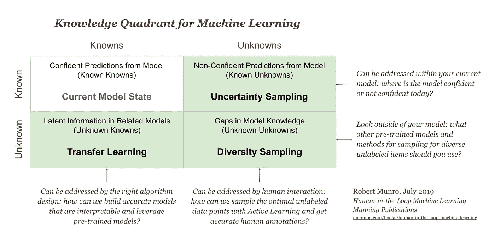
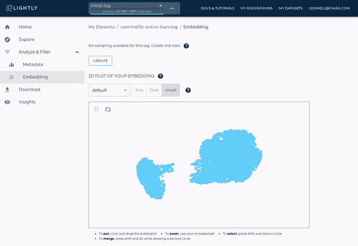

# 使用检测器的主动学习 2

> 原文：<https://towardsdatascience.com/active-learning-using-detectron2-922a13982564?source=collection_archive---------33----------------------->

## 厌倦了给所有数据贴标签？了解有关模型预测和嵌入如何帮助您选择正确数据的更多信息。

监督机器学习需要有标签的数据。在自动驾驶等计算机视觉应用中，标记一帧图像的成本高达 10 美元。新的互联设备和更便宜的传感器的快速增长导致新数据不断增加。给所有东西贴标签再也不可能了。事实上，许多公司只标注了他们收集的数据的 0.1%到 1%。但是找到正确的 0.1%的数据就像大海捞针，不知道针长什么样。那么，如何才能做到高效呢？

解决这个问题的一个方法是主动学习。当进行主动学习时，我们使用预训练的模型，并使用模型预测来选择下一批数据进行标记。有不同的算法可以帮助您根据模型预测选择正确的数据。例如，众所周知的不确定性采样方法基于低模型置信度选择新数据。让我们假设一个场景，我们有两张猫的图片，一张是模型 60%确定是猫，另一张是模型 90%确定有猫。我们现在将选择模型只有 60%置信度的图像。我们本质上选择了“更难”的例子。
通过主动学习，我们重复这个预测和选择过程，直到达到我们的目标指标。

来自 Comma10k 的示例图像，具有在 MS COCO 上训练的具有 ResNet-50 主干的更快 R-CNN 模型的模型预测。

在这篇文章中，我们不会详细讨论主动学习是如何工作的。有很多关于主动学习的好资源。相反，我们将关注如何通过使用 Lightly 的[主动学习特性，用几行代码来使用主动学习。](https://docs.lightly.ai/getting_started/active_learning.html)[轻飘飘](https://lightly.ai/)是一个计算机视觉的数据策展平台。它利用自我监督学习和主动学习的最新进展来帮助您处理未标记的数据集。

# 数据集:从 COCO 女士到 Comma10k

如今，使用预先训练好的模型，并使用迁移学习在新任务中对其进行微调是非常常见的。因为我们对物体检测感兴趣，所以我们使用了一个来自可可小姐的预训练模型。它由超过 100k 个标记图像组成，是一个非常常见的数据集，用于图像分割、对象检测或关键点/姿态估计的迁移学习。

我们的目标是使用主动学习来使用 COCO 预训练模型，并在自动驾驶的数据集上对其进行微调。对于这个传输任务，我们使用的是 [Comma10k 数据集](https://github.com/commaai/comma10k)。来自[仓库](https://github.com/commaai/comma10k):“这是从逗号舰队捕获的 10，000 png 真实驾驶。这是麻省理工学院的许可证，没有学术限制或任何东西。”

您可能已经注意到，Comma10k 数据集有用于训练“segnets”(语义分段网络)的注释。但是，没有我们转移任务所需的边界框注释。因此，我们必须添加缺少的注释。我们将使用主动学习来挑选前 100 张图像，并首先对它们进行注释，而不是对所有 10k 图像进行注释，我们预计这 100 张图像在模型改进方面的回报最高。

让我们看看主动学习如何帮助我们选择前 100 幅图像进行标注。

# 我们开始吧

本文基于[在 Comma10k 教程](https://docs.lightly.ai/tutorials/platform/tutorial_active_learning_detectron2.html)上使用 Detectron2 主动学习。如果你想自己运行代码，还有一个现成的 Google Colab 笔记本。

主动学习工作真的很难。许多公司未能恰当地实施主动学习，从中得到很少甚至没有价值。其中一个主要原因是他们只关注不确定性抽样。不确定采样是主动学习算法的两大类别之一。在下图中，你会发现右侧有两种主动学习方法。

知识象限—右栏是主动学习。(参见[使用 PyTorch 进行主动学习](https://medium.com/pytorch/https-medium-com-robert-munro-active-learning-with-pytorch-2f3ee8ebec))

不确定性抽样可能是最常见的方法。您根据模型预测可信度低的地方选择新样本。

> Lightly 平台支持不确定性采样和分集采样算法。

第二种方法是多样性抽样。您可以使用它来使数据集多样化。我们挑选视觉上/语义上彼此不同的图像。

不确定性抽样可用于各种评分(最小置信度、边际、熵……)。
对于多样性采样，轻度使用 coreset 算法，轻度使用[从其开源自我监督学习框架获得的嵌入](https://github.com/lightly-ai/lightly)。

然而，还有更多。

> Lightly 有另一种称为 CORAL 的主动学习算法(**COR**ESET**A**active**L**earning)，它使用多样性和不确定性采样的组合。

目标是通过选择具有低模型置信度的图像来克服单个方法的局限性，但同时确保它们在视觉上彼此不同。

让我们看看如何利用主动学习和 Lightly 平台。

# 嵌入并上传数据集

让我们从创建嵌入并将数据集上传到 Lightly 平台开始。稍后，我们将在 CORAL 算法的多样化部分使用嵌入。

您可以使用 [lightly Python 包](https://github.com/lightly-ai/lightly)轻松训练、嵌入和上传数据集。
首先，我们需要安装软件包。为此，我们建议使用 pip。确保您处于 Python3.6+环境中。如果你在 Windows 上，你应该创建一个 conda 环境。

在 shell 中运行以下命令，轻松安装最新版本的:

现在我们已经轻松安装了，我们可以运行命令行命令`lightly-magic`来训练、嵌入和上传我们的数据集。您需要向命令传递一个*令牌*和一个 *dataset_id* 参数。在创建一个新的数据集后，您可以在 Lightly 平台中找到这两者。

用于训练、嵌入和上传数据集到 Lightly 平台的命令行界面命令

一旦运行了`lightly-magic` CLI 命令，您应该会在 Lightly 平台中看到上传的数据集。您可以查看数据集的 2d 可视化效果。你能看到形成白天和黑夜图像的两个星团吗？

Lightly 平台上 Comma10k 数据集的 2D 可视化

# 主动学习工作流程

现在，我们已经将数据集上传到带有嵌入的 Lightly 平台，我们可以开始主动学习工作流了。我们感兴趣的部分是，你有一个训练好的模型，并准备好对未标记的数据进行预测。我们从创建一个`ActiveLearningAgent`开始。这个代理将帮助我们管理未标记的图像，并确保我们与平台的接口正确。

创建 ActiveLearningAgent 的代码。代理将用于以正确的顺序获取文件名，并上传模型预测。

在我们的例子中，我们还没有一个模型。让我们从磁盘中加载它，并让它准备好对未标记的数据运行预测。

从检查点加载 detectron2 模型的代码。

最后，我们可以使用我们预先训练的模型，对未标记的数据进行预测。重要的是，我们使用与 Lightly 平台上相同的单个文件顺序。我们可以简单地通过迭代`al_agent.query_set`来做到这一点，它包含一个按正确顺序排列的文件名列表。

基于主动学习代理的 query_set 运行模型预测的代码。

为了上传预测，我们需要将它们转化为分数。因为我们正在处理一个“物体检测”问题，所以我们使用了`ScorerObjectDetection`。

计算主动学习分数的代码。

我们终于准备好查询第一批图像了。

# 查询前 100 个图像进行标记

为了基于模型预测和我们在 Lightly 平台上的嵌入来查询数据，我们可以使用代理的`.query(...)`方法。我们可以将它传递给一个`SamplerConfig`对象来描述我们想要运行的采样算法及其参数。

创建 SamplerConfig 并执行查询的代码。

在查询了新的 100 幅图像后，我们可以使用主动学习代理的`added_set`简单地访问它们的文件名。

我们现在可以打印新选择的图像的前 3 个文件名进行标记。

恭喜你，你完成了你的(第一次)主动学习迭代！
现在你可以标记这 100 张图片，并用它们训练你的模型。主动学习通常是在一个连续的反馈循环中完成的。在使用新数据训练您的模型后，您将进行另一次迭代，并预测+选择另一批图像进行标记。

我希望你对如何在你的下一个计算机视觉项目中使用主动学习有一个很好的想法。欲了解更多信息，请查看使用 Comma10k 上的 Detectron2 的[主动学习](https://docs.lightly.ai/tutorials/platform/tutorial_active_learning_detectron2.html)教程。

Igor Susmelj，联合创始人
[淡淡地](https://lightly.ai/)

*原帖已发布于此:*[*https://www . lightly . ai/post/active-learning-using-detectron 2*](https://www.lightly.ai/post/active-learning-using-detectron2)