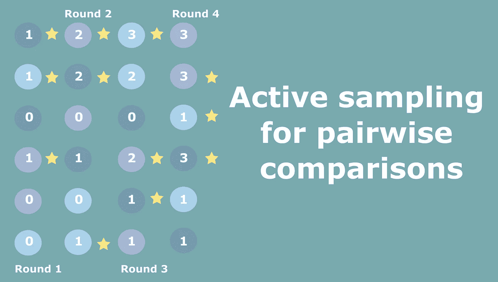
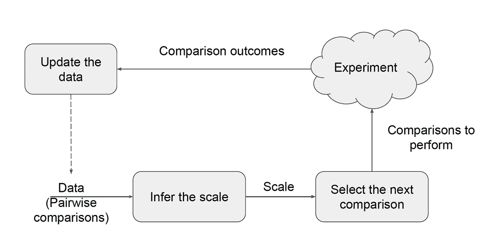
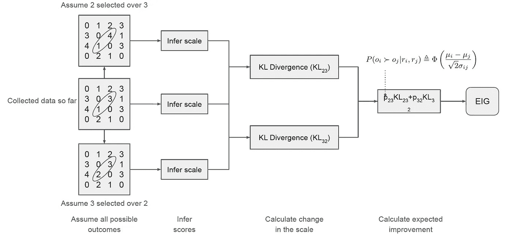
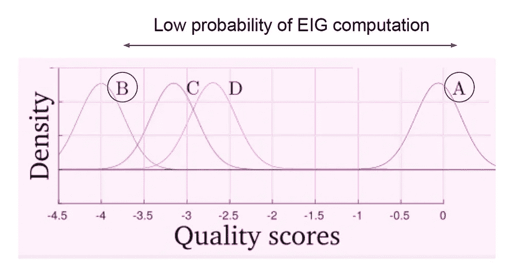
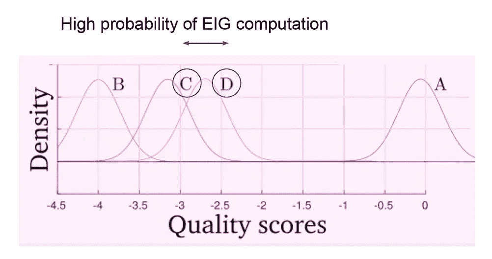
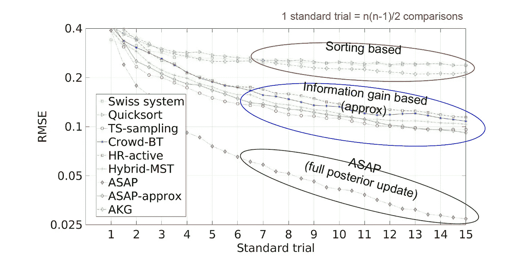
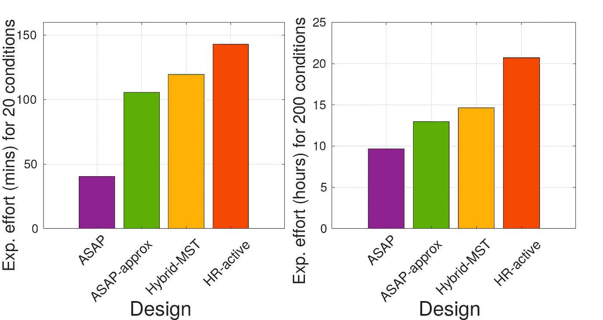

# 成对比较的主动采样

> 原文：<https://towardsdatascience.com/active-sampling-for-pairwise-comparisons-476c2dc18231?source=collection_archive---------38----------------------->

作者图片

国际象棋、网球或任何其他有两个竞争对手的游戏的爱好者经常面临这个问题——如何将球员配对，以便在尽可能少的比赛中确定球员的排名？

类似的问题发生在许多行业，如酒店、餐饮服务、教育，这些行业的实体将被放入消费者偏好/技能量表，同时尽可能少地进行评估。

成对比较是排名和规模推断的常见选择。然而，成对比较的一个缺点是大量可能的配对。因此，自然的问题是——我们如何在获得尽可能多的关于实体在一个尺度上的相对位置的信息的同时，最大限度地减少比较的次数。例如，在网球比赛中，我和费德勒搭档不如他和德约科维奇搭档，因为我们比赛的结果是显而易见的。正如你可能注意到的，玩家对游戏的满意度也很重要，因为

这篇文章基于[论文](https://arxiv.org/abs/2004.05691)“通过近似消息传递和信息增益最大化进行成对比较的主动采样”，并附带了[代码](https://github.com/gfxdisp/asap)，请随意查看！方法叫 ASAP！

## 过去做了什么？

通常有两种不同的方法。

**基于排序:**使用简单的启发法，技能或质量条件相似的应该配对。这种方法的一个众所周知的例子是瑞士国际象棋锦标赛系统，在该系统中，在第一轮中，棋手被随机配对，每个棋手参加完全相同数量的游戏，在锦标赛的后期阶段，具有可比较数量的赢和输的棋手被配对。

**信息增益:**这里成对比较的结果*通常*映射到一维尺度，并且形成降低尺度中不确定性的条件对。ASAP 就属于这一类！

## 管道

大多数用于成对比较的主动采样方法遵循类似的管道。

用于成对比较的主动采样算法的示例管道。图片作者。

**数据:**我们从目前收集的数据开始，这些将是成对比较的结果。

**刻度:**然后数据被映射到刻度上。基于信息增益的方法假设一个规模模型，例如正态分布的玩家技能，如在著名的 [TrueSkill](https://en.wikipedia.org/wiki/TrueSkill) 算法中(瑟斯通案例 V 假设)，基于排序的方法使用一个规模的代理，例如条件的排名。大多数信息增益方法侧重于尺度的近似推断，以提高计算效率。ASAP 不使用近似推断，大大提高了推断分数的准确性。

**配对选择:**一旦秤可用，它将用于选择下一个要执行的比较。与其他方法不同，我们关注的是算法中这一部分的计算节省。

**实验:**选择下一对条件并输入到实验中，它可以是一个国际象棋游戏或一个问卷。

**数据更新:**我们得到结果后，数据被更新。

## 标度推断

对于规模推断，ASAP 使用 [TrueSkill](https://en.wikipedia.org/wiki/TrueSkill) 算法。有关该算法的直观和详细的解释，请查看这篇文章。鉴于目前收集的成对比较的结果，我们对正态分布的得分变量感兴趣。得分变量的后验分布为我们提供了得分变量均值的估计，以及得分变量的标准差(置信度/标准误差)。

TrueSkill 使用和积算法，通过矩匹配进行期望传播。该算法是迭代的，对于分数推断的总复杂度为 k*O(n+t ),其中 n 是条件的数量，t 是到目前为止收集的比较的数量，k 是要执行的迭代的数量。更多的迭代产生更好的结果，然而，对于实时应用来说，比较次数 t 和比较条件 n 的增加可能是非常昂贵的。由于这个原因，大多数方法近似于后一种方法。

## 预期信息增益

一旦秤可用，我们就可以选择进行下一次比较，这将最大程度地提高秤的精确度。

预期信息增益的计算(EIG)。图片作者。

**阶段 1:** 我们从目前收集到的配对开始。在成对比较矩阵(上图中带数字的正方形)中，每个条目都是相对于相应列中的条件，相应行中的条件被选择的次数。以条件二和条件三为例，条件二赢了 3 次，条件三赢了 1 次。

**第二阶段:**现在我们模拟每一对条件下所有可能的比较结果。让我们再来看看条件二和条件三。我们模拟了两人赢在最上面，三人赢在最下面的结果。

**第三阶段:**然后我们推断每一个可能的模拟结果的规模

**阶段 4:** 接着是新的分数分布与具有 KL 散度的原始量表的比较。为了从配对中获得期望的信息增益，我们计算关于结果概率的期望。

对所有可能的条件组合重复这一过程，正如你可以想象的那样，计算量非常大。

## 保存计算

计算所有可能配对的期望信息增益是昂贵的，我们通过两种方式来提高速度:

1.  我们只计算对的子集的期望信息增益
2.  基于最小生成树选择批量比较

**EIG 评价精选**

选择性 EIG 评估，评估概率。相距甚远的情况下，EIG 被评估的概率较低。图片作者。

为了减少预期信息增益评估的数量，我们基于标度中条件的距离来计算预期信息增益评估的概率。

对于较低的概率，将为较远的条件计算期望的信息增益，而对于较远的条件，将计算较高的概率。你可以在报纸上找到更多的细节。

**批处理模式**

C1、C2、C3 和 C4 的可能成对条件比较图。图片作者。

在批处理模式中，算法建议不执行一个比较，而是一组接下来可能的比较，允许运行算法更少的次数。批处理模式在众包实验中也非常有用，我们可以在工人中分配批处理。

在批处理模式中，我们将所有条件视为顶点，无向边是潜在的比较。这些由预期信息增益的倒数加权。增益大的地方，权重小。

然后，我们选择具有最小生成树的批次——选择具有最小公共权重的边，或者具有最大信息增益的边。这个想法在之前[就已经被探索过了，并且显示出也能提高结果的准确性。](https://arxiv.org/abs/1810.08851)

## 估价

为了评估性能，我们运行蒙特卡罗模拟。

运行各种主动采样策略的结果。图片作者。

这里，y 轴是均方根误差，x 轴是迄今为止在标准试验中进行的比较次数。

我们可以看到三类具有可比性能的方法——基于排序的方法性能最差，其次是基于近似标度推断的方法。最好的执行方法是 ASAP，为此我们计算完整的后验更新，从而得到非常精确的比例。

## 实验努力

ASAP 获得的更高精度如何转化为实验时间？考虑一个目标精度为 0.15 RMSE 的实验室实验。如果需要 5 秒钟来获得两两比较的结果，那么在实验室中需要花费多少时间。

最佳方法在 20 和 200 种条件下的实验工作量(达到 0.15 rmse 精度所需的总时间)。图片作者。

对于 asap 的 20 个条件，大约 40 分钟将在实验室中花费。对于性能第二好的方法，大约需要两个小时的实验室时间。在 200 种情况下，ASAP 的时间转换为 9.5 小时，第二种最佳方法的时间转换为 14 小时。

# 摘要

由于在分数分布的计算中的完整海报更新，我们的方法实现了最先进的准确性，其他方法依赖于部分(近似)更新。

我们通过仅评估条件子集的期望信息增益，使该方法在计算上可行，从而将计算成本降低高达 80%。

我们还选择了一批条件，使算法特别适合众包实验。

查看[纸](https://arxiv.org/abs/2004.05691)和[码](https://github.com/gfxdisp/asap)！

## 喜欢作者？保持联系！

我错过了什么吗？不要犹豫，直接在 [LinkedIn](https://www.linkedin.com/in/aliakseimikhailiuk/) 或 [Twitter](https://twitter.com/mikhailiuka) 上给我留言、评论或发消息吧！

</bayesian-optimization-or-how-i-carved-boats-from-wood-examples-and-code-78b9c79b31e5>  </dataset-fusion-sushi-age-and-image-quality-and-what-the-hell-do-they-have-in-common-814e8dae7cf7>  </can-you-do-better-sampling-strategies-with-an-emphasis-on-gibbs-sampling-practicals-and-code-c97730d54ebc> 