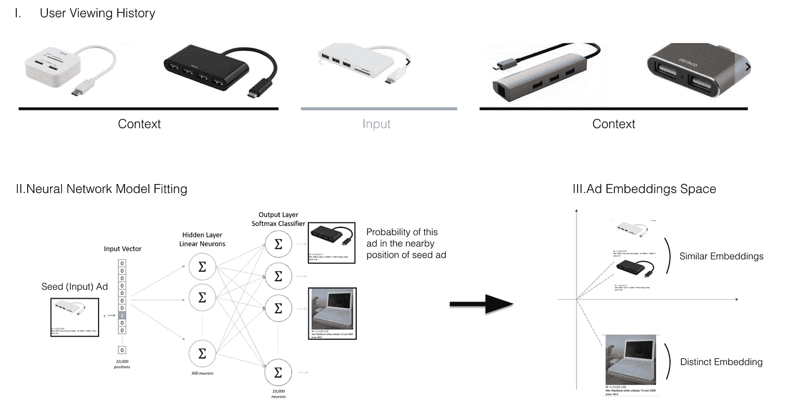
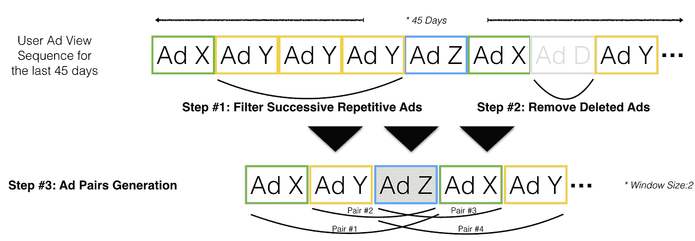
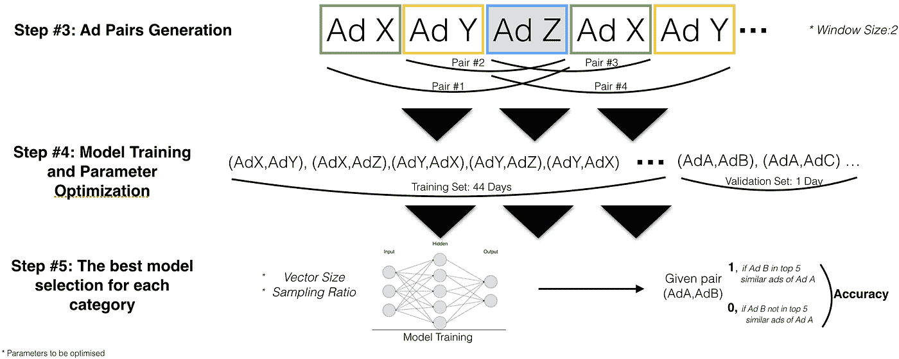
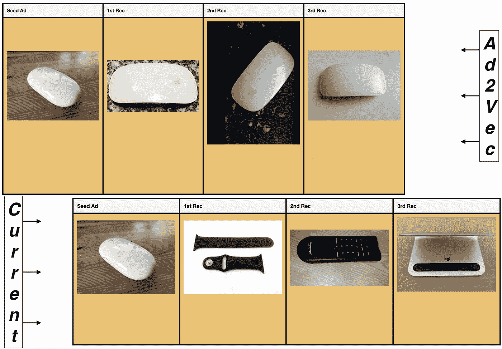
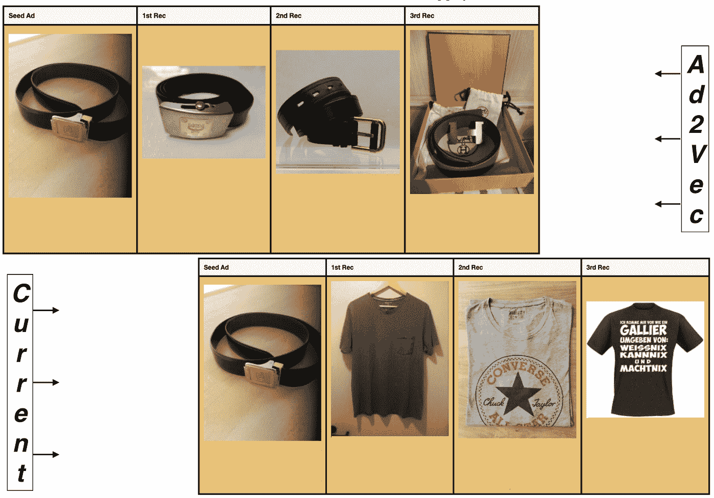
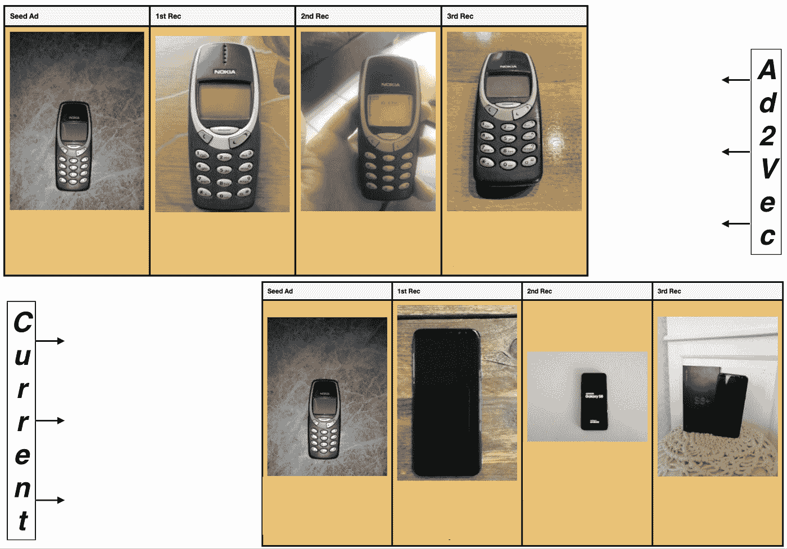
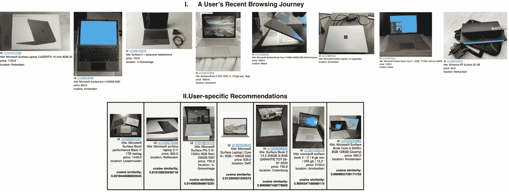
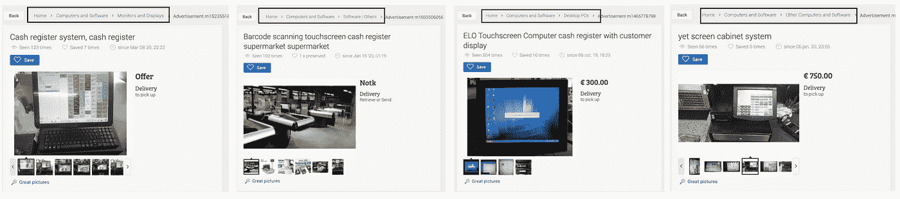

# Ad2Vec:市场的相似列表推荐器

> 原文：<https://towardsdatascience.com/ad2vec-similar-listings-recommender-for-marketplaces-d98f7b6e8f03?source=collection_archive---------30----------------------->

罗斯·乔伊纳在 [Unsplash](https://unsplash.com?utm_source=medium&utm_medium=referral) 上的照片

# 介绍

如今，产品推荐可以说是电子商务网站或移动应用程序最重要的组成部分。公司可以通过改进他们的推荐，轻松提高他们平台上的点击率(CTR)这一关键业务指标。因此，我认为推荐是数据科学团队有机会通过对产品产生深远影响来提高他们在企业中的知名度的最佳领域。

这是一个关于我们的新推荐方法对 eCG(易贝分类集团)市场平台的影响的故事。

## 目录

**一、问题陈述:**

*   我们的市场平台上有页面、推荐者和广告类型的定义
*   我们当前的推荐系统是如何工作的？
*   为什么我们需要一个新的推荐人？

**二。我们的方式和方法:**

*   Word2Vec 有什么用？
*   在推荐器上下文中如何使用 Word2Vec 算法？
*   高级方法
*   我们的方法论
*   一个推荐问题如何优化 Word2Vec 的参数？

**三世。模型评估和抽查结果:**

*   如何比较新的推荐系统和现有系统的性能？

**四。其他未来使用案例:**

*   User2Vec:更丰富的用户推荐
*   简单的产品分类
*   个性化搜索排名

# 问题陈述

## 页面类型

在我们的市场平台中，有两种不同的页面类型向用户显示推荐:

*   **首页:**是*【为你】* feed 所在的页面。在这个提要中，我们向用户展示了与他们最近在平台上访问的内容相关的产品。简单来说，我们获取用户查看的最后 5 个广告(列表),然后从我们的推荐系统中检索与这 5 个广告相似的广告。
*   **查看项目页面(VIP):** 这是一个页面，其中列出了特定广告的所有详细信息。在该页面的右下方，有一个名为*“其他浏览过的”*的广告列表组件，我们在其中为该特定广告推荐了前 5 个相似的广告。

## 推荐者类型

两种不同的算法在产品中运行，以生成这些广告推荐。

*   **基于内容的推荐系统(CBR):** 基于广告的属性
*   **基于行为的推荐器(BBR):** 基于用户的点击行为

## 广告列表类型

这些算法中的每一个都旨在解决关于我们平台上不同广告类型的推荐问题:

*   **新发布的(新鲜)广告:**

由于市场是高度动态的平台，用户每天都会添加大量的新广告，因此在平台上发布的许多新鲜或新的广告还根本没有被浏览过。这是在名为*“冷启动问题”*的推荐系统中最受欢迎的挑战之一。我们有基于内容的推荐器来解决这个问题。该算法获取新发布广告的属性，如图像、大小、位置、价格，然后通过与其他现有广告的属性进行比较来获取最相似的广告。

*   **现有广告:**

我们平台上的另一个广告类型是不久前添加的，因此有几个用户查看过。为了给这种类型的广告提供推荐，我们利用用户的行为浏览数据，而不是像基于内容的推荐那样使用广告属性。大体上，我们采用用户广告矩阵，并将其输入我们基于行为的推荐系统:协同过滤算法，最终得到类似的商品推荐。

## 我们目前的推荐系统是如何工作的？

对于一个特定的广告，我们首先尝试从 BBR 获取所有的推荐。如果有足够数量的广告从这个推荐器返回，那么我们只使用这些广告向我们的用户展示，否则我们通过从 CBR 获取更多的推荐来填充它们。这里值得一提的是，我们只是在寻求改善 BBR。因此，我们仍然需要 CBR 为这些新广告提出建议。

> 这篇文章是关于我们寻找比目前基于行为的推荐方法更好的方法——协同过滤的旅程。

## 为什么我们需要一个新的推荐人？

在我们当前的 BBR 中，协同过滤算法只把用户的广告视图作为一个整体来考虑，而没有考虑它的时序或时间方面。我们相信，我们的用户在我们的市场平台上旅行时，会倾向于近距离观看更多类似的广告。因此，在我们的例子中，广告视图的时间戳属性非常重要。我们希望更多地关注解决这个问题，同时通过从广告视图的共现到广告视图的接近来发现新的方法。

# 我们的方式和方法

## Word2Vec 有什么用？

你们很多人可能听说过 Word2Vec，这是最流行的 NLP 算法之一。背后的逻辑简单而有力，并且依赖于一个假设，即出现在相似上下文中的单词可能具有相似的含义。根据上下文窗口的大小，通过从文本中提取成对的单词来生成训练数据。然后，使用该训练数据训练单层神经网络，最后使用隐含层权重作为单词嵌入。

## 如何可能使用 Word2Vec 算法作为推荐器？

在推荐上下文中使用单词 2Vec 也很流行，特别是对于电子商务平台，用户可以在会话期间访问不同的项目/产品。这是因为电子商务平台上用户的**物品访问顺序在结构上类似于句子**的**词序。换句话说，该算法将假设如果两个广告与其他相似的广告被共同访问(在单词的情况下是上下文相似性)，那么这两个广告将被该算法定义为“相似广告”。最终，相似的广告将具有非常接近的嵌入(数字向量),并且来自不同子类别的广告将最终具有在余弦相似性空间中彼此远离的嵌入。**

## 高级方法

下面，您将看到我们在荷兰平台 Marktplaats 上针对计算机和软件类别解释的方法的高级概述。

**I:用户观看历史:**用户在平台上的最近广告观看的序列

**II:神经网络模型拟合:**使用从用户观看历史生成的广告对来训练具有单个隐藏层的神经网络。

**III:广告嵌入空间:**使用神经网络中的隐藏层权重将平台上的每个直播广告嵌入到代表性的数字向量中

我们方法的高级概述

## 我们的方法论

现在，是时候深入了解实施过程的细节了。旅程从为每个用户生成一系列最近观看的广告开始。在生成这些序列时，我们只考虑了过去 45 天内的广告浏览量。这个时间框架已经被我们当前的协同过滤算法使用了一段时间，这就是为什么我们也坚持我们的新方法的确切时间间隔。我们将实现的其余部分分成 5 个不同的步骤。

**第一步:**首先，我们从这些序列中过滤出连续重复的广告。这是一个重要的应用步骤，因为我们的用户在平台上的旅程中倾向于重复查看相同的广告，这可能会导致在下一阶段为我们的模型生成训练数据时创建许多对相同的广告。

**第二步:**在第二个数据清理步骤中，我们还从这些用户的广告浏览序列中删除了非直播广告。这也是更好地嵌入直播广告的必要步骤。这是因为所有非直播广告都以这样的方式扭曲了嵌入生成过程，不久前发布的*直播广告*与非直播广告一起被访问，但*相对较新的直播广告*将没有机会与这些非直播广告一起被访问，因为它们已经从平台中移除。该算法会将这种情况解释为这两个广告组之间的差异，尽管这不一定是真的。最终，这可能会阻止模型为当前的直播广告产生高质量的嵌入。

**第三步:**接下来，我们进入第三步，从这些经过清理的用户旅程中生成广告对。回想一下，在给定窗口大小参数的情况下，这些广告对是通过沿着用户旅程滑动“上下文窗口”来生成的。

在下图中，你会看到前三步的总结。

方法—前 3 步

**第四步:**在第四步中，我们将过去 45 天的用户旅程的整个数据集分成两部分:训练数据集和验证数据集。我们以这样一种方式完成，前 44 天用于为模型生成训练数据，后 1 天用于为验证数据集生成广告对。请记住，为您的验证集选择一个晚于训练集的时间段是至关重要的，以便从该过程中获得最佳结果。

在这个阶段，你可能会想到一个问题:

**问:**“为什么我们首先需要一个验证集？”

**答:**这是因为我们需要调整下面列出的几个参数，以找到最佳模型:

*   **窗口大小:**我们在其中生成广告对的输入广告周围的上下文窗口的大小
*   **向量大小:**广告嵌入的维度(数字向量)
*   **采样率:**设置一个阈值来修剪那些序列中出现很多的广告。换句话说，在受欢迎和不受欢迎的广告之间取得平衡。
*   **时期数:**整个训练数据的通过次数

这里值得一提的是，我们使用了 H2O 的 Word2Vec 算法，通过苏打水包将其集成到我们的 Spark 管道中。因为 H2O 的 Word2Vec 算法有更多的参数需要调整，而且比它的 SparkML 对手快得多，所以我们决定用那个。但是，我们在前面的步骤中使用了 SparkSQL 和 Spark Data Frame API 来生成这些广告视图序列。

**第五步:**在第五步也是最后一步，我们对参数组合进行网格搜索，为每个类别选择最佳模型。我们使用准确性度量来测量每个模型在验证数据集对上的性能。我们用每对广告中的第一个广告输入模型，然后获取该特定广告的前 5 个推荐。如果这两个广告中的第二个是前 5 个推荐广告中的一个，那么我们称之为“成功”(1)，否则称之为“失败”(0)。该模型通过在余弦相似性空间中使用*强力 kNN* 来获取特定广告的前 5 个推荐。

下图描述了第 4 步和第 5 步。

方法—最后 3 步

# 模型评估和抽查结果

这个项目的最终目标是最终得到一个优于我们当前基于行为的推荐协同过滤(CF)的算法。因此，在这个评估步骤中，我们进行了一些抽查，以比较当前推荐器与我们的新方法 Ad2Vec 的性能。为了公平起见，在整个实验过程中，我们尽可能系统地进行抽查。

## 我们如何比较新的推荐系统 Ad2Vec 和当前的协同过滤系统的性能？

***每类:***

1.  *随机挑选 10 个广告，比较从当前推荐者和新推荐者那里获得的推荐。*
2.  *从上一步的 10 个广告中找出 3 个广告，从中我们可以很容易地看出这两个推荐者的表现差异。(注:对于某些广告，两种算法的表现一样好。)*
3.  *对于上一步中的 3 个广告，从当前和新算法中提取前 3 个推荐。*
4.  *将结果可视化，以便于比较*

在下面的图片中，你会看到一些来自不同类别的案例。令人惊讶的是，在这个实验中，我们甚至没有遇到一个案例，在这个案例中，当前推荐器(CF)给出的推荐比 Ad2Vec 更相关。

经[www.marktplaats.com](http://www.marktplaats.com)许可拍摄的广告截图

经[www.marktplaats.com](http://www.marktplaats.com)许可拍摄的广告截图

经[www.marktplaats.com](http://www.marktplaats.com)许可拍摄的广告截图

# 其他未来使用案例

Ad2Vec 模型的主要结果是平台上所有直播广告的一组嵌入，类似的项目/广告将在余弦空间中具有类似的嵌入。有了这些信息，我们可以在不同的用例中使用与推荐完全相同的结果。

以下是我们将在后续步骤中考虑的 3 个使用案例列表:

## 用例 1:User 2 vec——更丰富的用户推荐

我们可以通过对用户在平台上的整个旅程中的所有广告的嵌入进行平均来为用户生成嵌入，而不是只考虑用户观看的最后 5 个广告并相应地生成用户推荐。通过这种方式，用户和广告嵌入将采用完全相同的格式，因此我们可以通过在广告嵌入空间中搜索特定用户的嵌入来获取最相关的广告。在下图中，我们应用了上述逻辑，并在一个示例案例中生成了特定于用户的推荐。

经[www.marktplaats.com](http://www.marktplaats.com)许可拍摄的广告截图

## 用例 2:简洁的产品分类

在市场平台上，所有的广告都是由用户发布和管理的，因此，产品分类很容易失控。这个问题背后有许多不同的原因。例如，我们的卖家有时无法在平台上找到单独的产品类别来销售他们的商品，基本上不得不将其发布在错误的类别中，或者他们可能会意外地将广告发布在错误的类别中。最终，所有这些都导致我们的买家有一个组织混乱的平台。

然而，我们可以通过对属于某个类别的所有广告的嵌入进行聚类来发现该类别中的异常值。通过这种方式，我们可以有机会纠正他们的类别，或者向平台建议一个关于产品组的全新类别。

在下图中，由于没有专门针对*【收银机系统】*的子类别，我们的用户不得不在不同的子类别中发布完全相同的产品类型:“监视器和显示器”、“台式电脑”、“软件|其他”和“其他计算机和软件”。这种情况很容易被我们新的 Ad2Vec 算法捕获，让我们有机会对产品进行更整洁的分类，从而改善我们平台上的买家体验。

经 www.marktplaats.com[许可拍摄的广告截图](http://www.marktplaats.com)

## 用例 3:个性化搜索排名

因为我们能够创建除广告嵌入之外的用户嵌入，所以我们可以通过简单地比较用户嵌入和搜索结果中列出的广告之间的相似性来遵循逻辑对任何搜索结果进行排名。

Joshua Golde 在 [Unsplash](https://unsplash.com?utm_source=medium&utm_medium=referral) 上拍摄的照片

# 结论

在本文中，我们想分享如何将流行的 NLP 算法 Word2Vec 转换成市场推荐器的方法。因为结果表明这种方法可以是对早期推荐器的改进。此外，您可以将相同的模型用于不同的目的，从而对您的业务产生深远的影响。希望您发现本文中的一些想法对您的项目和业务也有价值。

