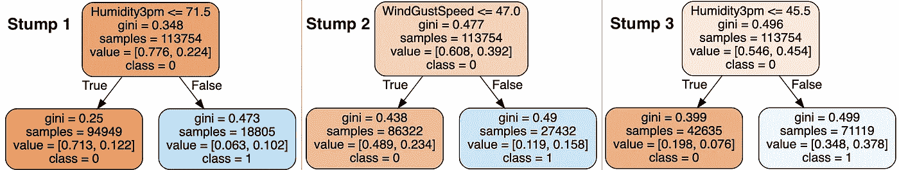
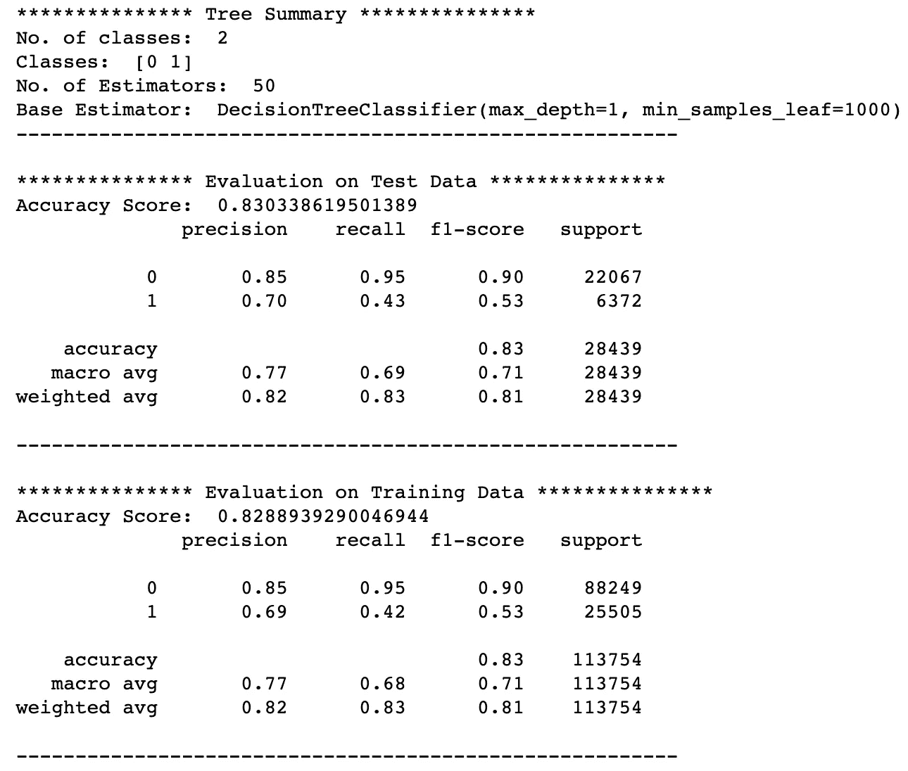

# AdaBoost 机器学习算法:如何提高难以预测案例的性能

> 原文：<https://towardsdatascience.com/adaboost-algorithm-remarkably-capable-but-with-one-interesting-limitation-cf95905bf8a0?source=collection_archive---------20----------------------->

## 机器学习

## 对自适应 Boosting 算法及其与其他基于决策树的机器学习算法的区别的直观解释

自适应升压(AdaBoost)。图片由[作者](https://solclover.medium.com/)提供。

# 介绍

机器学习算法的数量随着时间不断增加。如果你想成为一名成功的数据科学家，你必须了解它们之间的区别。

这个故事是我深入研究不同算法、它们如何工作以及如何用 Python 构建它们的系列文章的一部分。

# 故事涵盖以下主题:

*   AdaBoost 所属的算法类别
*   单个决策树、随机森林和 AdaBoost 之间模型预测的可视化比较。
*   解释 AdaBoost 与其他算法的不同之处
*   Python 代码示例

# AdaBoost 属于哪一类算法？

AdaBoost 和它的另一个基于树的算法“朋友”一样，属于机器学习的监督分支。虽然它可以用于分类和回归问题，但我在这个故事中只关注分类方面。

> 旁注，由于神经网络独特的机器学习方法，我已经将它们归为一类。然而，它们可以用于解决广泛的问题，包括但不限于分类和回归。下图是**互动**所以一定要点击👇在不同的类别上对**进行放大并揭示更多的**。

机器学习算法分类。由[作者](https://solclover.com/)创建的交互式图表。

***如果你喜欢数据科学和机器学习*** *，请* [*订阅*](https://solclover.com/subscribe) *每当我发布一个新的故事，你都会收到一封电子邮件。*

# **决策树 vs 随机森林 vs AdaBoost**

让我们先来比较一下这三个模型的预测概率面。他们都使用相同的澳大利亚天气数据:

*   **目标**(又名因变量):“明天下雨”。可能值:1(是，下雨)和 0(否，不下雨)；
*   **特征**(又名自变量):今天“下午 3 点的湿度”，今天“阵风速度”。*注意，我们仅使用两个特征来使我们能够容易地可视化结果。*

以下是模型预测平面。请注意，如果您想复制这些图表，可以在本文的最后部分使用 Python 代码。

**1。决策树** (1 棵树，max _ depth = 3)； **2。随机森林** (500 棵树，max _ depth = 3)； **3。AdaBoost** (50 棵树，max_depth=1)。图片由[作者](https://solclover.medium.com/)提供。

## 解释

让我们解释可视化，看看它们告诉我们这些算法的区别。上图中的 z 轴是明天下雨的概率。同时，细白线是判定边界，即下雨的概率= 0.5。

在深入 AdaBoost 之前，我们现在将快速回顾一下购物车和随机森林。

## 1.单一决策树(CART)

CART 是标准决策树算法的首字母缩写，代表**分类和回归树**。在这个例子中，我们建立了一个决策树，它有 3 层，8 个叶子。以下是可供参考的精确树:

购物车决策树。图片由[作者](https://solclover.medium.com/)提供。

这棵树上的每一片叶子都给了我们明天下雨的可能性，这是下雨的情况数量与叶子内观察到的总数量之间的比率。例如，左下角的叶子给出了明天下雨的概率为 6% (2，806 / 46，684)。

每个叶子对应于 3D 预测图中的平面，而树中的分裂是阶跃变化。请参见下图。

CART 决策树及其相应的预测。图片由[作者](https://solclover.medium.com/)提供。

如你所见，这是一个非常简单的树，只给出了 8 种不同的概率。这些叶子中的 5 个导致明天没有雨的预测(概率< 0.5), while the remainder 3 leaves suggest it will rain tomorrow (probability > 0.5)。

如果你想更深入地了解 CART 算法的机制，你可以在这里参考我之前的故事:

</cart-classification-and-regression-trees-for-clean-but-powerful-models-cc89e60b7a85>  

## 2.随机森林

首先要注意的是，在我们的例子中，随机森林使用相同的 CART 算法作为它的基本估计量。但是，有几个主要区别:

*   它构建**许多随机树**并组合来自每个单独树的预测以生成最终预测。
*   它使用**引导(替换采样)**从原始数据中创建许多样本。这些样本保持相同的大小，但有不同的观察分布。
*   最后，使用**特征随机性**来最小化树之间的相关性。这是通过在每个节点分裂时仅使特征的随机子集可用于算法来实现的。

最后，随机森林创建了许多树(在我们的例子中有 500 棵树),并根据每棵树的预测来计算总体概率。这就是为什么与单棵树相比，预测平面表面更平滑(即，它具有许多小台阶而不是几个大台阶)。

随机森林预测平面。图片由[作者](https://solclover.medium.com/)提供。

你可以在我的独立故事中找到更多关于随机森林的细节:

</random-forest-models-why-are-they-better-than-single-decision-trees-70494c29ccd1>  

## 3.adaboost 算法

最后，我们到达这个故事的主题。

像随机森林一样，我们使用 CART 作为自适应 Boosting 算法中的基本估计器。然而，如果需要，AdaBoost 也可以使用其他估计器。

AdaBoost 的核心原理是将一系列**弱学习器**，如**决策树桩**，拟合到反复修改的数据版本上。决策树桩是只有一层深度的决策树，即它只由一个根节点和两个(或更多)叶子组成。以下是我们的 AdaBoost 模型中 3 个独立决策问题的示例:

三个决策难题。图片由[作者](https://solclover.medium.com/)提供。

类似于随机森林，来自所有弱学习者(在这种情况下，树桩)的预测通过加权多数投票来组合，以产生最终预测。然而，主要的区别在于这些弱学习者是如何产生的。

提升迭代包括对每个训练样本(观察值)应用权重。最初，这些权重在所有观察值中是相等的，因此第一步在原始数据上训练弱学习者。

将此与我们的示例联系起来，这意味着第一个决策树桩(第一次拆分)与使用单一决策树方法得到的结果相同:

单一决策树与 AdaBoost 中的第一个决策树桩。图片作者[作者](https://solclover.medium.com/)。

对于每个连续的迭代，样本权重被单独修改，并且学习算法被重新应用于重新加权的数据。在前一步骤中被错误预测的那些训练示例的权重增加了。与此同时，那些被正确预测到的重量会减少。因此，每一个后来的弱学习者因此被迫集中注意力于前一个学习者错过的例子。

最后，将所有弱学习者组合成一个最终预测会产生一个更“平坦”的预测分布。这是因为该算法故意降低了最有把握的例子的权重，并将重点转移到更难分类的例子上。因此，我们将模型预测显示在下图中。

AdaBoost 预测平面。图片由[作者](https://solclover.medium.com/)提供。

*注意，你添加的弱学习者(stumps)越多，预测分布就变得越“平坦”。*

## **预测分布**

另一种可视化预测分布的方法是使用简单的频率线图。不出所料，

*   单一决策树很少有间隔预测。
*   随机森林显示了更加均匀的预测分布。
*   AdaBoost 的所有预测都位于决策边界附近(0.5)。

## 表演

虽然这三种方法产生了非常不同的概率分布，但最终的分类结果非常相似。性能可以通过多种方式进行评估，但为了简单起见，我在这里只显示准确性(测试样本):

*   单一决策树:82.843%
*   随机森林:83.202%
*   AdaBoost: 83.033%

虽然通过一些额外的超参数优化可以略微提高性能，但上述结果的相似性告诉我们，我们已经非常接近于提取所用特征中包含的最大信息。

## **AdaBoost 限制**

AdaBoost 的最终“平坦”概率分布是其主要限制。根据您的使用情况，这对您来说可能不是问题。比方说，如果你只关心分配正确的类，那么预测概率就不那么重要了。

但是，如果您更关心概率本身，您可能希望使用随机森林，它为您提供了 9%或 78%等概率预测，如上面的降雨预测建模所示。这与 AdaBoost 相反，AdaBoost 的所有预测都接近 50%。

# **Python 章节**

现在我们已经知道了 AdaBoost 的工作原理，并且理解了它与其他基于树的建模方法的不同之处，让我们来构建一个模型。

## 设置

我们将使用以下数据和库:

*   [来自 Kaggle 的澳大利亚天气数据](https://www.kaggle.com/jsphyg/weather-dataset-rattle-package)
*   [Scikit-learn 库](https://scikit-learn.org/stable/index.html)用于将数据拆分成[训练测试](https://scikit-learn.org/stable/modules/generated/sklearn.model_selection.train_test_split.html?highlight=train_test_split#sklearn.model_selection.train_test_split)样本，构建 [AdaBoost 模型](https://scikit-learn.org/stable/modules/generated/sklearn.ensemble.AdaBoostClassifier.html#sklearn.ensemble.AdaBoostClassifier)和[模型评估](https://scikit-learn.org/stable/modules/generated/sklearn.metrics.classification_report.html?highlight=classification_report#sklearn.metrics.classification_report)
*   [Plotly](https://plotly.com/python/) 用于数据可视化
*   用于数据操作的[熊猫](https://pandas.pydata.org/docs/)和 [Numpy](https://numpy.org/)

让我们导入所有的库:

然后我们从 Kaggle 获取澳大利亚的天气数据，你可以按照这个链接下载:[https://www . ka ggle . com/jsphyg/weather-dataset-rattle-package](https://www.kaggle.com/jsphyg/weather-dataset-rattle-package)。

我们接收数据并推导出一些新的变量用于模型中。

一小段 [Kaggle 的澳大利亚天气数据](https://www.kaggle.com/jsphyg/weather-dataset-rattle-package)做了一些修改。图片由[作者](https://solclover.medium.com/)提供。

接下来，让我们按照以下步骤构建一个模型:

*   步骤 1-选择模型特征(自变量)和模型目标(因变量)
*   步骤 2 —将数据分为训练样本和测试样本
*   步骤 3-设置模型参数并训练(拟合)模型
*   步骤 4-使用我们的模型预测训练和测试数据上的类别标签
*   步骤 5-生成模型摘要统计数据

上述代码生成以下总结模型性能的输出。

AdaBoost 模型性能。图片来自[作者](https://solclover.medium.com/)。

与训练数据相比，该模型在测试数据上具有相似的性能。评估者的数量是 50，这意味着最终的模型由 50 个不同的决策树桩组成。

最后，正如承诺的那样，下面是生成 3D 预测平面图的代码:

# 结论

我真诚地希望这个故事能帮助你为你的用例选择正确的算法。感谢您的阅读，您可以在自己的数据科学项目中随意使用上述代码和材料。

干杯！👏
**索尔·多比拉斯**

***如果你已经花光了这个月的学习预算，下次请记得我。*** *我的个性化链接加入媒介是:*

<https://solclover.com/membership>  

你可能喜欢的相关故事:

</gradient-boosted-trees-for-classification-one-of-the-best-machine-learning-algorithms-35245dab03f2>  </xgboost-extreme-gradient-boosting-how-to-improve-on-regular-gradient-boosting-5c6acf66c70a> 