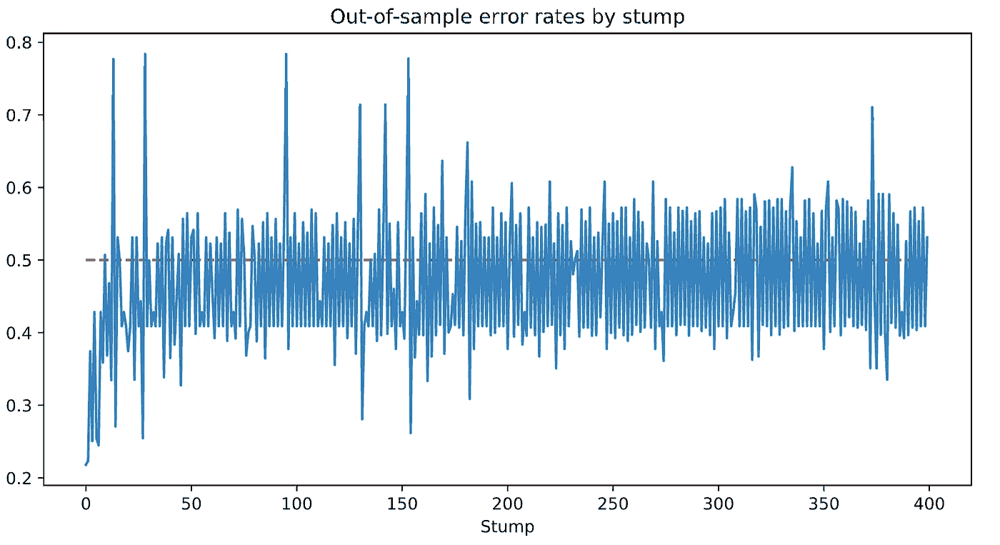

# 从头开始

> 原文：<https://towardsdatascience.com/adaboost-from-scratch-37a936da3d50?source=collection_archive---------2----------------------->

## 构建数据科学中最流行的“现成”算法之一的 Python 实现

Javier Allegue Barros 在 [Unsplash](https://unsplash.com/s/photos/decision?utm_source=unsplash&utm_medium=referral&utm_content=creditCopyText) 上拍摄的照片

有个同事曾经跟我说过，一个算法，直到你能在 NumPy 上从头开始写，你才算真正理解了它。这种说法可能很大胆，但打开一本关于机器学习的教科书或论文，并试图将数学转化为代码，仍然有一些美好的东西。这是我开始做这篇文章背后的工作的全部动机，在这篇文章中，我描述了如何构建您自己的 AdaBoost 算法实现。我们的算法版本来自*《统计学习的要素* (TESL)，第 10 章【1】。

AdaBoost 是 Ada 的缩写，已经成为数据科学中最流行的“现成”算法之一。它已经成为 Kaggle 竞赛中获胜解决方案的一部分(有时与其年轻的堂兄弟 XGBoost 和 Light GBM 结合使用)，现在它甚至成为人脸检测问题的一部分。它是由 Freund 和 Shapire 在 1996 年提出的[2]。

一个小小的警告:本文的目的不是详细推导和解释 AdaBoost 的数学——已经有很多这样的好帖子了。相反，这篇文章是关于算法的实现如何在幕后工作的。它是为那些想了解 AdaBoost 的现成实现是做什么的人准备的，比如 Python 的 [Scikit-learn](https://scikit-learn.org/stable/modules/generated/sklearn.ensemble.AdaBoostClassifier.html) 或 r 的 [Adabag](https://cran.r-project.org/web/packages/adabag/adabag.pdf) 上的那个。最后，我希望它也能启发你构建其他算法的实现，以了解它们的更多信息！

在本文的其余部分，我将遵循 TESL 第 10 章中的符号和公式。我们将实施 AdaBoost。M1 算法，在 Friedman 等人(2000) [3]中称为“离散 AdaBoost”，在 TESL 中称为算法 10.1。所有代码示例都是用 Python 编写的。你可以在 Github 库中找到代码。

# 升压概述

AdaBoost 算法基于“增强”的概念。boosting 背后的思想是，使用投票机制，一组“弱”分类器可以组成一个健壮的分类器。弱分类器只能产生比投掷(公平的)硬币稍微好一点的结果。换句话说，如果通过随机猜测一个二进制标签，我们将有 50%的机会是正确的，那么弱分类器将是正确的，比如说，55%(或者任何其他接近 50%的数字)。

使用 boosting，我们在样本的连续修改版本上训练一系列弱分类器。让我们举一个例子来看看这是如何工作的。假设我们有一个有五个观察值的样本。每个观察值被标记为-1 或 1，因此我们的标记是 *y = [1，1，-1，-1]* 。我们也有一些解释变量 *x.* 在第一轮提升中，我们训练一个弱分类器 *G₁(x)* ，它产生下面的预测: *G₁(x) = [1，-1，-1，1，-1]。*我们可以看到第二个和第四个观察值被错误分类了。在第二轮提升中，我们将使用一些权重对样本中的每个观察值进行加权 *wᵢ.*我们将设置 *wᵢ* ，使得这两个错误分类的观察值在新分类器 *G* ₂ *(x)* 的学习过程中比其他三个具有更大的影响。新的分类器现在可能会错过一些以前分类良好的观察结果，但它会更好地预测困难的观察结果。

在重复上述过程 M 次之后，我们将得到一组 M 个弱分类器，我们可以将它们组合成最终的健壮元分类器 *G(x)。*该元分类器将根据加权多数投票为每个观察值分配一个预测，如下式所示。

我们最后的分类器。资料来源:统计学习的要素。10

看到在多数表决中每个弱**分类器**的**权重**用 *α* 表示。这些不是我们在每一轮助推中应用于每个**观察**的权重，我们称之为 *wᵢ* (我知道，这么多权重！).

# 弱分类器

请记住，我们粗略地将弱分类器定义为只能产生比随机猜测稍好的结果的分类器。这个定义的更正式的版本是分类器的错误率小于但接近 50%。在这种情况下，样本内错误率就是总样本量中错误分类的观察值的数量(即*yᵢ*≦*g(xᵢ】*)，如下所示。

样本内误差率。资料来源:统计学习的要素。10

许多算法可以作为弱分类器，但在 AdaBoost 的情况下，我们通常使用“树桩”；也就是说，决策树只包含两个终端节点。直观地说，在二元分类问题中，树桩会试图通过数据集的多个解释变量中的一个来分割样本。正如你所想象的，通常这不足以简单地分离类，尤其是在复杂的数据集中。

现在，如果我们对相同的数据训练一个决策树分类器 1000 次，我们将总是得到相同的切割(对于给定的随机种子，如果你使用近似启发式)。在画线时，决策树会最小化一个基于目标值分布的指标，通常是基尼系数或来自结果类别的信息增益。这就是我们的观察权重 *wᵢ* 发挥作用的地方。在每一次 boosting 迭代中，我们告诉我们的 stump 在估计它最小化的度量时对每个观察值进行不同的加权。这样，在每次迭代中，我们都会得到不同的决策树。

在本文中，我们不会详细讨论决策树(事实上，我在算法中使用了 Scikit-learn 实现)，但是如果您想了解更多关于决策树的知识，我建议您阅读 TESL 的第 9、10 和 15 章。

# 编写我们的算法

是时候回顾一下了。为了解决二元分类问题，我们的 AdaBoost 算法将通过一系列提升迭代来拟合一系列弱分类器(树桩)。这些分类器将形成元分类器，该元分类器将基于加权多数投票机制产生预测。在每一次提升迭代中，我们将给予那些在前一次迭代中被错误分类的观察更多的权重。我们可以将这个过程形式化，如下面的算法所示。人们可以证明， *α* 和 *w* 的公式来自最小化指数损失函数。解释有点长，超出了本文的范围，但是你可以在第 10.4 节的 TESL 中找到。

资料来源:统计学习的要素。10

我们将通过识别独立的流程块来开始我们的实现，我们可以在步骤 2 的循环之外对这些独立的流程块进行编码。步骤 2(b)、2(c)和 2(d)包含在每次迭代中重复的操作，所以我们将它们定义为 Python 函数。让我们看看怎么做。

请注意，这些函数与算法无关。人们可以用 *compute_error* 函数计算任何分类器的错误率。类似地，我们可以为其他上下文估计 *α* 和 *w* 。

是时候定义我们的 AdaBoost 分类器了。为此，我们将构建一个名为 *AdaBoost* 的 Python 类，它将由几个方法组成，以适应模型并进行预测。它还将包含关于我们拟合的模型的其他相关信息，例如弱分类器的序列和它们在最终投票中的权重，以及训练和预测误差。下面的代码片段显示了我们的类的初始化和 fit 方法:

的。 *fit()* 方法的结构与典型的 Scikit-learn 类非常相似。作为必要的参数，它以数组形式的独立变量矩阵 *X* 和带有目标变量的向量 *y* 。目标变量必须是二进制的，并且必须进行编码，使其值为-1 或 1(这使得投票更容易)。增强舍入参数是可选的，默认值为 100。

AdaBoost 的步骤 1 和 2。对于循环，M1 算法在*内被特征化。开始时的 *if* 语句在第一轮中将每个观察值的权重初始化为 1/N(步骤 1)，然后在拟合树桩并计算出该迭代的 *α* 后更新它们(步骤 2(d))。该方法的输出是一组树桩、alphas 和训练错误，我们将其存储起来以供在预测方法中进一步使用。算法的步骤 3 在一个单独的方法中定义，我们称之为*。预测()。**

类似于。*合体()*法，*。predict()* 将解释变量的类似数组的矩阵作为参数。然后，它为每个观察值和树桩计算一个预测值。这些数据存储在一个数据帧中，该数据帧将用于该过程的多数表决部分，以计算每个观察的最终预测。

# 测试我们的算法

我们现在已经定义了 AdaBoost 的实现，但是我们如何知道它能工作呢？为了找到答案，我们将在 Spambase 数据集上进行测试，这是一个由 4，601 封电子邮件组成的集合，根据它们是否是垃圾邮件进行标记。自变量由每封电子邮件中的术语和字符频率组成。这个数据集可以在加州大学欧文分校的公共存储库中找到，你可以在这里下载。它还被用于 TESL 的几个章节，包括关于 AdaBoost 的章节，因此我们可以将我们的实现与其他经过验证的算法进行比较。

就像在 TESL 中一样，为了确保我们的训练集尽可能相似，我们不会对解释变量应用任何清理或特征工程。TESL 没有说明它的随机种子，所以我们不能复制训练/测试分裂。然而，我们仍然可以使用相同的集合大小，使得至少两种算法都在相同数量的观察值上被训练。下面的代码片段显示了我们如何读取和分割数据:

我们的 AdaBoost 类在这里实现非常简单。我们只需要将训练集传递给*。fit()* 方法和测试设置为*。*预测()【方法:

就是这样！如果你在你的机器上尝试上述步骤，你会发现你会得到 5.6%的错误率。相比之下，在 TESL 的第 10.8 章中，他们使用梯度推进得到的错误率为 4.5%，使用加法逻辑回归得到的错误率为 5.5%，使用 CART 树得到的错误率为 8.7%，使用 MARS 得到的错误率为 5.5%。请注意，我们使用的不是完全相同的样本，而是相同数量的观察值。但还不错，对吧？

作为第二个测试，您还可以将这个定制实现与 Scikit-learn 的实现进行比较。我们上面产生的一组预测产生了 93.99%的 ROC-AUC 分数。在相同的数据集上使用 Scikit-learn，我得到了 92.79%。由于随机种子和近似试探法，数字可能略有不同，但它真的很接近！

# 回到树桩

记住 AdaBoost 适合一组弱分类器。为了了解这在实践中意味着什么，让我们来看看上面训练的每个树桩的错误率。在下面的图表中，我们可以看到大多数树桩在训练集上的错误率非常接近，但低于 0.5。

来源:作者创作

决策树的一个众所周知的特性是它们倾向于过度拟合训练数据。我们的树桩也不例外，如下图所示。其实很多比乱猜还要烂。然而，他们的组合只有 5.6%的错误率！

# 主要外卖

本文的目标是介绍如何用 Python 构建 AdaBoost 分类算法的自定义实现。为此，我们遵循了*的第十章《统计学习的要素》。*在这一过程中，我们也给出了 boosting 的高级概述，boosting 是一种将弱学习者结合到一个健壮的元算法中的技术。

我希望这是有用的，并启发您构建自己的自定义实现。这不仅是一种有趣的学习方式，而且非常有效！正如纳西姆·n·塔勒布所说:“我自己学到的东西我仍然记得”[5]。

喜欢吗？您可以访问这个 [Github 库](https://github.com/AlvaroCorrales/AdaBoost)中的代码。

# 参考

[1] Hastie，t .等人(2009)，*《统计学习的要素》，第二版，* DOI 10.1007/b94608_10，施普林格科学+商业媒体有限责任公司。

[2] Freund，y .和 Schapire，R. (1996)，*用新的 Boosting 算法进行的实验，*机器学习:第十三届国际会议论文集，可在 http://rob.schapire.net/papers/FreundSc96.pdf[获得](http://rob.schapire.net/papers/FreundSc96.pdf)

[3]弗里德曼 J，哈斯蒂 T，蒂布希拉尼 R (2000 年)。*加法逻辑回归:助推的统计学观点。*统计年鉴，28 卷 2 期，337–407 页。

[4]杜瓦和格拉夫(2019 年)。UCI 机器学习知识库[http://archive . ics . UCI . edu/ml]。加州欧文:加州大学信息与计算机科学学院。

[5]纳西姆·尼古拉斯·塔勒布(2016)，《普洛克罗斯特斯之床:哲学和实践格言》。