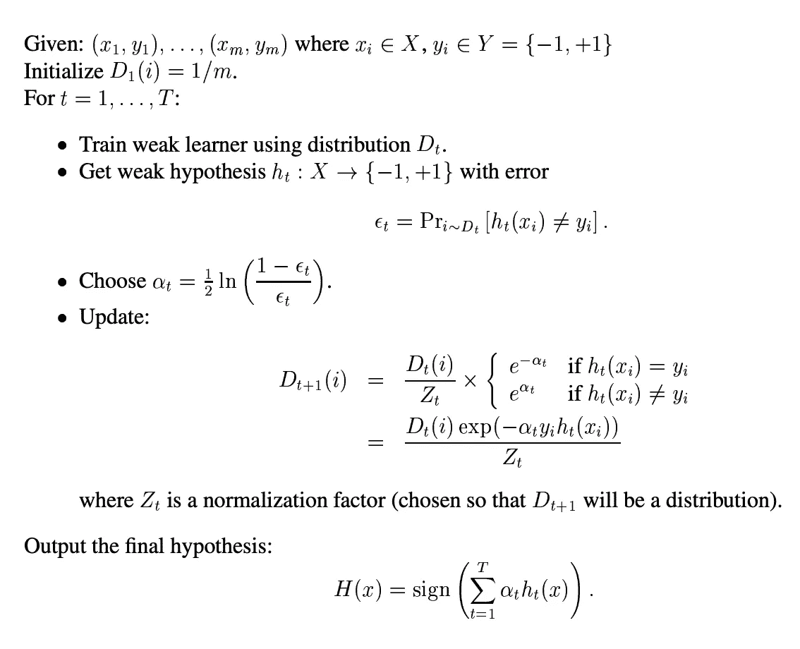

# Adaboost:直觉和解释

> 原文：<https://towardsdatascience.com/adaboost-intuition-and-explanation-9c4e67034879?source=collection_archive---------33----------------------->

## Adaboost 是最流行的提升算法之一。看看引擎盖下面，看看发生了什么事。

Ashkan Forouzani 在 [Unsplash](https://unsplash.com?utm_source=medium&utm_medium=referral) 上的照片

Boosting 是机器学习工具包中的一个重要工具。这是一种集成方法——一种结合多个模型来创建更好模型的机器学习技术。Boosting 在机器学习领域应用广泛，AdaBoost 是最受欢迎的 boosting 算法之一。让我们来了解一下它是如何工作的。

# **一个直观的故事**

假设你是一名医科学生，你正在看 x 光片，以确定某人是否患有罕见疾病——这是一个二元分类问题。因为这是一种罕见的复杂疾病，整个国家只有一个专家。这位专家无法准确地说出如何对 x 光片进行分类，因为太复杂了，无法写下来。相反，他可以通过给出经验法则来帮助你。例如，他可能会说“如果 x 射线显示高对比度，患者更有可能患有该疾病”或“如果 x 射线显示更多的血管，患者不太可能患有该疾病”。随着时间的推移，通过结合这些经验法则，你开始对病人进行越来越好的分类。

在你学会任何经验法则之前，你什么都不知道。因此，你有同等的机会对每张 x 光片进行分类。然而，一旦你学会了一些规则，你可能会注意到，一些 x 射线通常会被你所学的规则正确分类，而另一些通常会被错误分类。更重视你一直错误分类的 x 光片似乎是明智的。你要求医生开始提供针对这些困难的 x 射线的经验法则，而不是一般的经验法则。

我们刚刚描述的故事是对 AdaBoost 工作原理的一个隐喻。我们学习多个弱分类器，将它们组合起来得到一个更强的分类器。在学习之初，我们什么都不知道，所以我们对学习什么规则没有偏好。稍后，我们将重点放在帮助分类我们遇到困难的数据点的规则上。

# **数学公式**

以下是 AdaBoost 算法的形式符号:

资料来源:Freund 和 Schapire，1999 年加强免疫简介

在我们的故事中，我们假设一个二元分类问题。训练集用(x_i，y_i)表示，取自某个父分布。该算法总共有 T 个时间步长。对于每个时间步长 t，我们为每个训练示例 I 定义一个权重 D_t(i)。该权重确定该特定训练示例的“硬度”, AdaBoost 将为较难的示例赋予较高的权重。一开始(t = 1)我们不知道哪些例子比较难，所以我们把所有的权重都设为相等。

训练的每一步都是这样的。首先，我们根据硬度权重在训练集上定义的分布来训练一个“弱分类器”。直觉上，我们正在确保我们的弱分类器更重视硬数据，因为我们目前在这些数据上有麻烦。每个弱分类器对应于我们故事中医生给出的一个经验法则。粗略地说，“弱分类器”是比机会更好的分类器。数学上“弱”的精确定义需要更多的理论。为了理解 AdaBoost，我们的粗略定义已经足够好了。

一旦我们有了一个弱分类器，我们计算它在训练集上的误差，表示为ϵ_t(第二个要点)。请注意，该误差是用硬度权重加权的。然后我们计算α_t(第三个要点)。注意，训练误差越小，αt 越大。还要注意，根据“弱分类器”的定义，ϵ_t 至多为 0.5，所以α_t 总是正的。接下来，我们分别根据 e^(-α_t 因子或 e^(α_t 因子对训练数据的分类是正确的还是错误的，对训练数据进行重新加权。注意，由于α_t 总是正的，e^(-α_t) <1 and e^(α_t) > 1 总是。因此，如果数据分类正确，其权重会降低，如果数据分类不正确，其权重会增加。这就是“AdaBoost”这个名字的由来——AdaBoost 代表“自适应增强”,在这个上下文中“自适应”意味着改变我们刚才描述的权重。

随着时间的推移，一直被错误分类的数据将获得越来越高的权重。然后激励算法学习能够对困难数据进行分类的弱分类器。通过这种方式，Adaboost 可以确保覆盖所有数据。

在 T 个时间步之后，我们将所有弱分类器的加权和作为我们的最终答案。权重是α_t。这是因为较低的ϵ_t 对应于较高的α_ t——我们更信任误差较低的分类器，而不是误差较高的分类器。我们的最终分类器有多好？原来这个分类器是一个“强”分类器。同样，像弱分类器一样，“强”的正确定义需要更多的理论。但是粗略地说，一个“强分类器”是一个有足够的时间和数据可以得到任意小误差的分类器。

我们必须澄清一件重要的事情。我们说过最终的分类器很强。回想一下，我们运行 AdaBoost 迭代测试的训练集是从一些父分布中提取的。那么，最终的分类器是只对训练集有效，还是对整个父代分布有效呢？事实证明，答案是两者皆有。理论结果如下。这些结果的证明，以及“强”和“弱”的更严格定义，可以在[这里](https://www.cs.princeton.edu/courses/archive/spring18/cos511/scribe_notes/0312.pdf)找到。

*   训练集误差随着 Adaboost 迭代次数 t 呈指数下降。因此，我们可以通过运行更多迭代来使训练集误差任意小。
*   泛化误差(父分布上的误差)随着训练集大小的平方根而减小。因此，我们可以通过增加训练集的大小来使泛化误差任意小。

# **重述**

我们已经了解了 Adaboost 背后的直觉，并讲述了它可能如何使用的故事。然后我们看了形式算法，讨论了最重要的部分。最后，我们陈述了主要的理论结果:Adaboost 将弱分类器转化为强分类器。我希望您在阅读完本文后，能够更好地理解 Adaboost 的工作原理。欢迎任何反馈，感谢阅读！