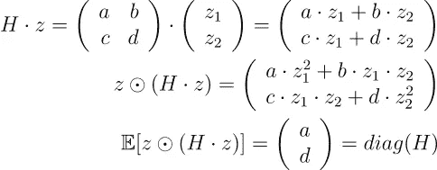

# AdaHessian:用于深度学习的二阶优化器

> 原文：<https://towardsdatascience.com/adahessian-a-second-order-optimizer-for-deep-learning-2fc76b29bcbb?source=collection_archive---------24----------------------->

## [思想和理论](https://towardsdatascience.com/tagged/thoughts-and-theory)

阿达赫森在向最小值前进。(图片由作者提供)

深度学习中使用的优化器大多是(随机)梯度下降法。他们只考虑损失函数的梯度。相比之下，二阶方法也考虑了损失函数的曲率。有了它，就可以计算更好的更新步长(至少在理论上)。只有少数二阶方法可用于深度学习，其中之一是姚等人在 2020 年发表的 [AdaHessian](https://arxiv.org/pdf/2006.00719.pdf) 。作者提供了 PyTorch 实现。

在其最基本的形式中，二阶方法需要计算包含 N×N 个元素的 Hessian 矩阵，其中 N 是神经网络中参数(权重)的数量。这对于大多数模型来说是不可行的。AdaHessian 包含了一些有趣的技术来解决这个问题。然而，乍看起来它们可能很复杂。本文将介绍这些技术，它们可以有效地计算 Hessian 矩阵的近似值。

# 动机

梯度下降仅使用其一阶导数来模拟损失函数:该算法在负梯度的方向上采取足够小的步长(由学习速率控制),从而损失值降低。损失函数的曲率信息(在 Hessian 矩阵中收集的二阶导数)被忽略。

图 1 显示了当前位置的损失函数(绿色)和梯度(红色)。左图显示了梯度与损失函数局部精确匹配的情况。右图显示了当向负梯度方向移动时损失函数向上的情况。虽然在左图中应用较大的更新步长可能有意义，但在右图中需要较小的更新步长，以避免超过最小值。

图 1:损失函数 f(w)(绿色)及其在 w=-1 处的梯度(红色)。(图片由作者提供)

# 牛顿更新步骤

牛顿的方法就是这样处理的:它同时考虑了当前位置的梯度和曲率。它用二次模型对损失函数 f(w)(w 是模型的参数或权重)进行局部建模。更新步骤推导如下(公式见图 2):

*   使用泰勒多项式计算二次模型 m
*   g 是梯度，H 是海森矩阵
*   为了找到模型 m 的最小值，计算模型的导数，将其设置为零，并求解更新步长δw
*   这给出了牛顿更新，其中负梯度被 Hessian 的逆缩放和旋转

图 2:牛顿法的导出更新步骤。(图片由作者提供)

梯度和 Hessian 都可以用 PyTorch 这样的深度学习框架来计算，这是应用牛顿方法所需的一切。然而，对于具有 N 个参数的神经网络模型，Hessian 矩阵由 N×N 个元素组成，这对于典型模型是不可行的。AdaHessian 用一个对角矩阵来近似 Hessian 矩阵，它只包含 N 个元素(与梯度向量大小相同)。

# 计算黑森的对角线

我们现在有了牛顿更新公式，我们把海森近似法限制在一个对角矩阵上。让我们看看它是如何计算的。

## 哈钦森方法

图 3 示出了 Hutchinson 方法的公式，其计算 Hessian 的对角元素:

*   通过为每个元素抛硬币来创建一个随机向量 z，并为头部设置+1，为尾部设置-1，因此在 2D 的例子中，z 可以是(1，-1)
*   计算矩阵向量乘积
*   将 z 元素(用⊙表示)乘以上一步的结果 z⊙(H z)
*   计算期望值(或在实际实现中使用 z 向量的多个实例的平均值)

图 3: Hutchinson 计算 h 对角线的方法

这乍一看很奇怪。我们已经需要 H 来获得 H 的对角元素——这听起来不是很聪明。但事实证明我们只需要知道 H z(一个向量)的结果，这个结果很容易计算，所以我们从来不需要知道全 Hessian 矩阵的实际元素。

但是哈钦森的方法是如何工作的呢？当写下 2D 的例子时(图 4 ),很容易看出。逐元素乘法意味着逐行乘以向量。检查 z⊙(H z)的结果显示其中有 z₁(和 z₂)的项和 z₁ z₂的项。在计算多次试验的 z⊙(H z)时，z₁(和 z₂)总是+1，而 z₁ z₂在 50%的试验中给出+1，在另外 50%的试验中给出-1(只需写下所有可能的乘积:1 1，1 (-1)，(-1) 1，(-1) (-1))。当计算多次试验的平均值时，包含 z₁ z₂的项趋向于零，留给我们的是 h 的对角元素的向量

图 4:哈钦森在 2D 案例中的方法。(图片由作者提供)

## 矩阵矢量积

只剩下一个问题:我们没有在 Hutchinson 方法中使用的 Hessian 矩阵 H。然而，正如已经提到的，我们实际上并不需要黑森。如果我们有 H z 的结果就足够了。它是在 PyTorch 的自动微分功能的帮助下计算的:如果我们采用 PyTorch 已经计算的梯度，乘以 z，并对参数向量 w 进行微分，我们会得到与直接计算 H z 相同的结果。因此，我们可以在不知道 H 的元素的情况下计算 H z。图 5 显示了为什么这是正确的:再次对梯度求导得到 Hessian，z 被视为常数。

图 5:我们用 PyTorch 的自动微分法(左)和 Hutchinson 方法所需的矩阵向量乘积 H z(右)计算的结果相等。(图片由作者提供)

# 把所有的放在一起

我们现在有了 Hessian 的梯度和对角线值，所以我们可以直接应用牛顿更新步骤。然而，AdaHessian 遵循与 Adam 优化器类似的方法:它在多个时间步长上求平均值，以获得对梯度和 Hessian 的更平滑的估计。

单个更新步骤如下所示:

*   计算当前梯度
*   计算当前对角 Hessian 近似
*   通过将其与早期值混合来平均梯度
*   通过将它与早期的值混合来平均 Hessian，并注意对角线元素是正的(否则，我们可能会以上升的方向结束移动)
*   计算牛顿更新步骤，包括学习率参数，以避免过大的步骤导致发散

在图 6 中，一个简单的二次函数用梯度下降和 AdaHessian 最小化。这里，AdaHessian 是不带动量使用的。在这个玩具示例中，与梯度下降相比，它收敛得更快，并且不需要调整学习速率。当然，最小化二次函数有利于二阶优化器。

图 6:二次函数最小值的三个步骤。左:具有适当学习速率的梯度下降。右图:使用对角海森近似的牛顿方法(右图)。(图片由作者提供)

# 结论

AdaHessian 通过(1)使用对角线近似，(2)利用 Hutchinson 的方法和(PyTorch 中包含的自动微分函数解决了计算 Hessian 的任务。

链接:

*   [论文](https://arxiv.org/pdf/2006.00719.pdf)
*   [原 PyTorch 实现](https://github.com/amirgholami/adahessian)
*   [另一个 PyTorch 实现，具有简化的接口](https://github.com/davda54/ada-hessian)
*   [对 2D 函数进行分析的代码](https://github.com/githubharald/analyze_ada_hessian)
*   [代码分析所描述的 Hessian 计算](https://gist.github.com/githubharald/201196d445373dacbfda60e1942db2ca)