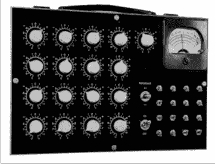
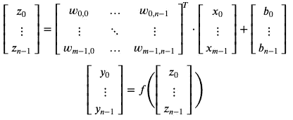
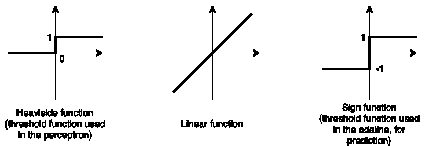
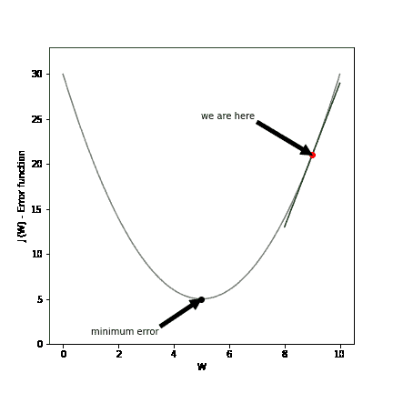
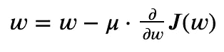
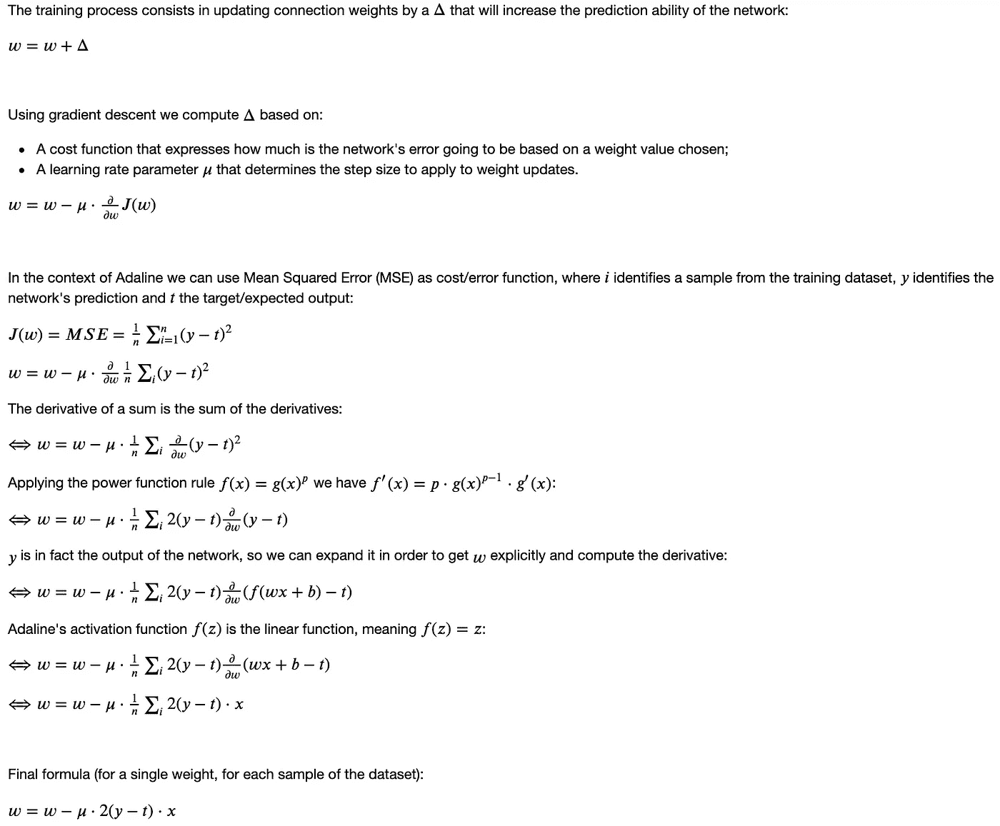
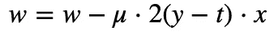
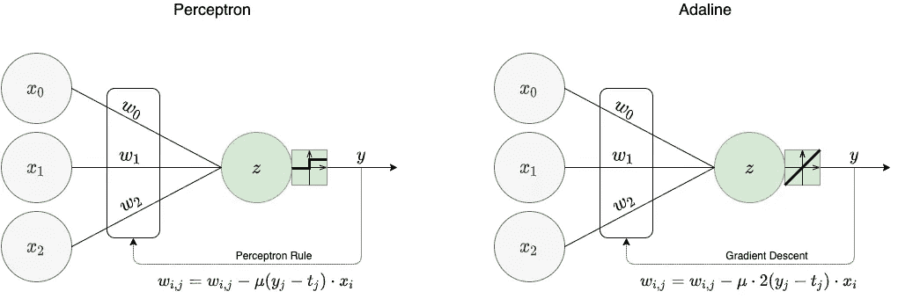
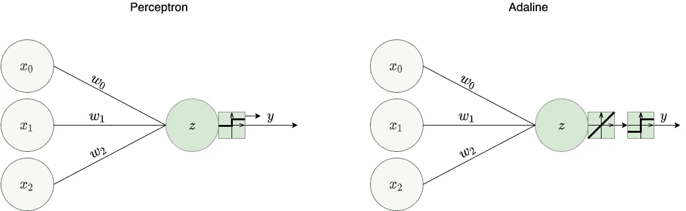

# Adaline 神经网络:梯度下降的起源

> 原文：<https://towardsdatascience.com/adaline-neural-networks-the-origin-of-gradient-descent-783ed05d7c18?source=collection_archive---------7----------------------->

## [神经网络系列](https://towardsdatascience.com/tagged/neural-networks-series)

## 神经网络系列—第 2 章

## 序言注释

这个故事是我正在创作的关于神经网络系列的一部分。本章致力于一种被称为**自适应线性单元** (adaline)的神经网络，其创建归功于感知机网络之后不久的[伯纳德·维德罗](https://en.wikipedia.org/wiki/Bernard_Widrow)和[泰德·霍夫](https://en.wikipedia.org/wiki/Marcian_Hoff)。虽然 adaline 和感知器都是受麦卡洛克和皮茨神经元的启发，但两个网络之间有一些微妙但重要的差异，其中一些已经建立了当前神经网络架构中训练算法的基础。

## Adaline 神经元

Ted Hoff 是 Widrow 的博士生(有趣的事实:他也是英特尔的第 12 号员工)。他们在此期间的合作导致了 adaline neuron 的工作，并于 1960 年出版。他们设计了一个受先前神经元架构启发的逻辑电路后，专门为这项任务制造了一个小型机器，以测试他们的提议。该机器如下图所示。

来源:[https://isl.stanford.edu/~widrow/papers/t1960anadaptive.pdf](https://isl.stanford.edu/~widrow/papers/t1960anadaptive.pdf)

并入该机器的架构在于具有单个神经元，一些输入连接到该神经元(包括偏置节点)。每个连接都有一个权重 ***w* ( *i，j)*** ，其中 *i* 标识连接来自的输入， *j* 是连接去往的神经元。至于偏置节点，我们可以认为是一个输入为 1 的特殊节点。假设有 ***m*** 个输入节点和 ***n*** 个神经元，一个更一般的 adaline 的神经网络架构可以用以下方式形成:

您可能已经从我以前的文章中熟悉了这个符号。唯一不同的是 ***f(z)*** 现在是线性激活函数，意思是 ***f(z)=z*** 。然而，为了分类的目的，原始文件详述了一个额外的步骤，其中应用了一个不同的阈值函数，以便获得一个类别/类作为输出。

## 训练 adaline 网络

训练过程背后的推理仍然与[感知器](/the-magic-behind-the-perceptron-network-eaa461088367)相同:每个权重 ***w* ( *i，j)*** 需要以这样一种方式更新，即它将在下一次迭代中增加正确预测的输出数量——我们将这个更新值称为δ**(*I，j)*** 。然而，这个更新变量是以不同的方式计算的，使用一种称为梯度下降的算法。

## 梯度下降

梯度下降是一种算法，用于找到最小化整个网络预测误差的一组权重 ***W*** 。为了实现这一点，我们定义了所谓的误差函数(也称为损失函数或成本函数)***【J(W)***，并且我们迭代地试图找到该函数的全局最小值。
假设有一个图，其中我们可以描述误差函数***【W】***如何基于权重值变化，如下所示:

根据权重值 W 绘制成本函数 J(W)

在上图中，当 ***w*** 为 9 时，我们目前的误差大约为 20。然而，可以看出，当 ***w*** 为 5 时，网络的误差最小。梯度下降解决的挑战是如何从当前点到产生最低误差的权重值。
梯度下降找到最小值的方法是(使用正确的数学术语)计算权重的偏导数。通俗地说，梯度下降背后的直觉在下面的动画中有所说明:

在每次迭代中，我们计算偏导数，以便知道我们应该朝哪个方向走。这个方向是由绿线给出的——它是我们所在的 ***w*** 处的函数的切线。这条线斜率是在 ***w*** 处的导数。如果斜率为正，如上图所示， ***w*** 将在下一次迭代中减少，反之如果斜率为负， ***w*** 将增加。根据下面的公式定义每次迭代的更新值，其中 ***w*** 表示权重矩阵，是以与感知器相同的方式确定步长的学习率系数，剩余部分是成本函数相对于权重的偏导数:

在另一个机会，我将奉献一篇完整的文章，梯度下降算法及其所有变种。现在，如果你想要一个替代的解释，[吴恩达](https://medium.com/u/592ce2a67248?source=post_page-----783ed05d7c18--------------------------------)在他的一门机器学习课程中为[提供了一个关于它如何工作的伟大直觉](https://www.coursera.org/lecture/machine-learning/gradient-descent-intuition-GFFPB)。

让我们将梯度下降用于 adaline 训练。在最初的 adaline 论文中，作者指出:

> 包括电平在内的所有增益都将改变相同的绝对幅度，使得误差为零。这是通过在将误差减小 1/17 的量的方向上改变每个增益(可以是正的或负的)**来实现的。(…)收敛由小误差(自适应前)表示，围绕稳定的**均方根误差**有小波动。**

因此，他们的目标是通过找到这样做的方向来减少误差，以便获得最佳增益(这只是一个不同的术语，他们称之为增益，我们称之为权重)。使用的成本函数是均方根误差( [RMSE](https://en.wikipedia.org/wiki/Root-mean-square_deviation) )。在本文中，我将使用 MSE 来代替，因为它非常相似，更容易解释背后的数学，并且它符合相同的目的。

有了成本函数，我们就可以计算在每次迭代中需要应用于每个权重的权重更新公式。下面的截图总结了为 adaline network 提出更新公式的整个过程。这是取自我的[渐变下降笔记本](https://nbviewer.jupyter.org/github/adrianovinhas/neural_networks_series/blob/master/gradient_descent.ipynb#Adaline:-The-math-behind-the-train-formula)。

adaline 训练中使用的最终权重更新公式为:

其中 ***w*** 标识单个权重，为学习率系数， ***y*** 为预测输出 ***，t*** 为期望输出， ***x*** 表示单个输入。

## **Adaline vs 感知器**

现在让我们对 adaline 和感知器进行比较，以了解它们的异同:

*   培训阶段

在架构方面，有一个明显的区别:感知机使用**阈值函数**，而 adaline 使用**线性激活函数**，这将在训练方面具有理论意义。感知器根据**感知器规则**更新其权重，当一个或多个样本在训练中被错误预测时，改变它们的值。至于 adaline，权重更新将基于**梯度下降算法**进行，即使在整个训练中所有的例子都被正确预测，它们也可能发生。这是因为 ***y*** 不再是一个分类变量，最小化是在一个损失函数上完成的，该损失函数是一个表示什么应该是正确权重的代理。但是，最后的更新公式非常相似。

你可能会问自己:如果我们最终得到了几乎相同的公式，为什么对梯度下降如此大惊小怪？梯度下降变得如此重要的原因是因为它可以推广到其他更复杂的架构(公平地说，这不是唯一的原因，但现在让我们保持简单)。例如，我们将在本系列的后面看到感知器规则不能应用于多层网络。你必须考虑的唯一事情是，为了使用梯度下降，你的激活函数必须是[可微的，](https://en.wikipedia.org/wiki/Differentiable_function)这不是阈值函数的情况。

*   预测阶段

至于预测阶段，感知器和 adaline 网络非常相似。它们都解决分类问题，并且它们都受到相同的限制，因为它们只解决线性可分问题(在[感知器文章](/the-magic-behind-the-perceptron-network-eaa461088367)中解释)。从理论角度来看，主要区别在于激活函数。但是 adaline 的线性激活函数暗示了****f(z)= z***，从分类的角度来看是多余的一步(这个函数的输出是连续变量，分类问题期望的输出是分类变量)。这就是为什么最初的 adaline 论文提到存在量化器来将输出转换为两个值之一(-1 或 1)。这个额外的激活函数被称为符号函数。*

## *最终注释*

*在本文中，我们介绍了 adaline 网络，将其与感知器进行了比较，并确定梯度下降算法是该提案引入的主要创新。然而，该算法需要考虑一些因素，以确保我们在训练过程结束时找到最优的权重集。这是我们将在下一章详述的事情。敬请期待！*

*感谢阅读！你喜欢这篇文章吗？非常感谢你的反馈，🗣。你可以随时通过 [**Twitter**](https://twitter.com/adrianovinhas) 或 [**LinkedIn**](https://www.linkedin.com/in/adrianovinhas/) 联系我，或者如果你对下一章的最新消息感兴趣，就在 Medium 上关注我😀。*

*一些相关阅读:*

*   *我关于梯度下降的笔记本可以在[这里](https://nbviewer.jupyter.org/github/adrianovinhas/neural_networks_series/blob/master/gradient_descent.ipynb)找到；*
*   *[https://pabloinsente.github.io/the-adaline](https://pabloinsente.github.io/the-adaline)*
*   *[https://arjunkathuria.com/ml/Adaline/](https://arjunkathuria.com/ml/Adaline/)*
*   *[https://sebastianraschka . com/FAQ/docs/linear-gradient-derivative . html](https://sebastianraschka.com/faq/docs/linear-gradient-derivative.html)*
*   *[https://towards data science . com/introduction-to-neural-networks-part-1-3bb 27 A8 d 314 a](/introduction-to-neural-networks-part-1-3bb27a8d314a)作者[瑞秋·萨尔希](https://medium.com/u/f017502742e1?source=post_page-----783ed05d7c18--------------------------------)*