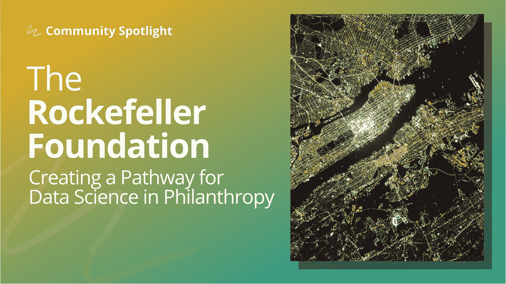
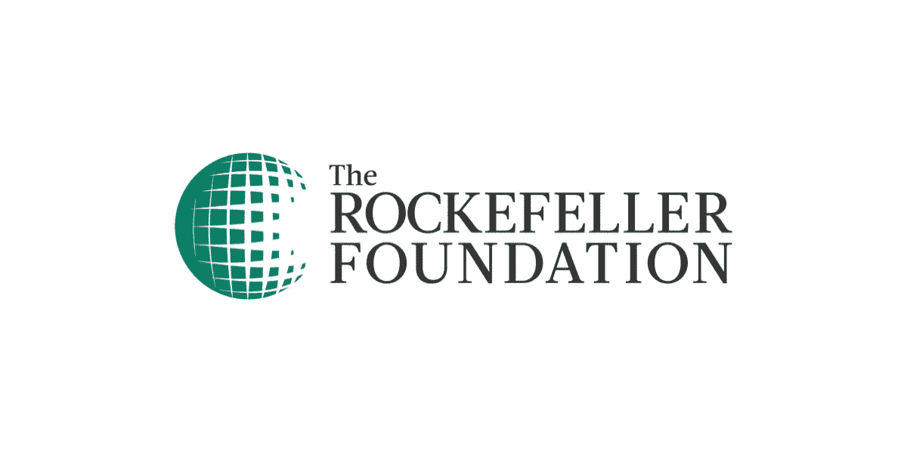

# 让数据科学工具适应慈善事业的社会影响

> 原文：<https://towardsdatascience.com/adapting-data-science-tools-for-social-impact-in-philanthropy-73a8a382c79c?source=collection_archive---------26----------------------->

## [社区聚焦](https://towardsdatascience.com/tagged/community-spotlight)

## 洛克菲勒基金会的数据科学

*在 Community Spotlight 系列中，TDS 编辑与数据科学社区成员畅谈有助于推动该领域发展的激动人心的计划。今天，我们很高兴与大家分享埃利奥特·冈恩***与* [*玛德琳·利塞乌斯*](https://medium.com/u/b375e8eb5719?source=post_page-----73a8a382c79c--------------------------------) *，* [*首席数据科学家*](https://www.linkedin.com/in/madeline-lisaius) ，*以及* [*洛克菲勒基金会*](https://www.rockefellerfoundation.org/about-us/our-history/) *的统计和机器学习团队的对话，该慈善组织成立于 1913 年，致力于解决**

**

*图片由《走向数据科学》和[美国宇航局](https://unsplash.com/photos/_SFJhRPzJHs)*

*洛克菲勒基金会的数据科学是什么样的？对于团队来说，典型的一天是什么样的？*

*自 1913 年成立以来，数据实际上一直是洛克菲勒基金会实现影响力的核心方法。采取假设和数据驱动的方法在当时被称为“科学慈善”。洛克菲勒基金会统计和机器学习团队最初的设想是利用最新的分析技术来增强我们现有慈善活动的数据驱动方法，同时将数据科学作为一种咨询服务或工具，与货币资源一起提供。*

*基于这一愿景，该团队现在位于创新团队的大伞下，并且只有大约两年的历史。虽然这听起来可能需要一段时间，但现实是我们仍在弄清楚我们希望慈善事业中的数据科学对基金会来说是什么样的——拥有稳定的资金来源和改善人类福祉的使命，可以在我们的工作中创造一个令人难以置信的特权空间来测试、失败和想象。*

*今天，该团队由三名全职数据科学家以及一组支持我们的顾问组成；从支持基金会的数据相关查询到领导与我们的计划工作一致的独立项目，我们无所不为。*

*因为我们的工作变化很大，所以没有典型的一天——我花了几天时间与顾问一起为一个计划的项目启动准备材料，但也有几天没有一次会议来调试我的模型。目前，我们的技术堆栈包括 Domino 以及用于利基工作的特定平台——例如，我使用 Google Earth Engine 主要用于我的遥感工作。*

*团队如何选择并着手项目？*

*我们通过两个主要的途径来确定项目:通过内部计划的提议或请求，或者通过我们自己团队的想法。在内部与值得信赖的合作伙伴讨论潜在的项目后，如果项目获得批准，我们将根据预计的时间表和预算向前推进。从那里开始，每个项目都非常不同。*

*对于我们参与或被要求帮助的项目，我们通常会在我们知道工作是一个合理的好主意的阶段介入，并立即传递结果——这些项目甚至可能需要不到一天的时间。*

*对于我们自己设想和开发的项目，推介、开发和再开发可能需要几个月到一年的时间。由于与团队相关的每个人都扮演着许多角色，作为一个服务于如此大的组织的如此小的团队，这些工作流和时间表包括许多不相关的工作和计算。*

**

*图片由洛克菲勒基金会提供*

***您能告诉我们洛克斐勒基金会不同种类的数据科学计划或项目吗？***

*我为我[最近发表的关于走向数据科学](/a-more-accessible-and-replicable-method-for-satellite-based-mapping-of-hand-harvested-crops-in-6243b8fb82dc)的手工收割作物绘图项目感到非常自豪。去年春天，随着新冠肺炎抵达美国，农业工人面临的障碍越来越多，在一定程度上，未来的劳动力短缺加剧了。我启动了手工收割作物测绘项目，试图在 10 米乘 10 米的地块上检测加州中央谷的每一种手工收割作物，试图跟踪生产者可能如何以及在哪里由于劳动力短缺和其他压力改变他们的种植决定。*

*洛克菲勒基金会对获得保护性食品——有助于预防与饮食有关的疾病的食品——想了很多，了解农产品生产的变化对这一对话至关重要。最大的障碍和机会空间是还没有任何围绕遥感的基础平台或政策，我有机会塑造我们的遥感方法、我们在遥感工作中的价值观、优先事项和目标，并领导我们的技术堆栈开发。除了所有这些组织开发工作的挑战和评估之外，令人难以置信的是看到新的、更简单的方法成功地完成了一项未解决的任务。很少有组织能够为制作手工收割作物制图模型所需的大量实验创造环境，能够实现我们最初的愿景和希望是一种殊荣。*

*我们团队的其他项目包括使用卫星图像绘制纽约的[经济机会区域，创建指数以捕捉美国城市福祉的各种挑战(作为单独的博客提交给 TDS)，以及](/using-satellites-to-map-economic-opportunity-in-new-york-city-3059aece5404)[支持预测城市含铅管道位置的模型](https://www.rockefellerfoundation.org/case-study/the-race-to-eliminate-lead-contaminated-drinking-water/)。*

***车队面临了哪些挑战？***

*统计和机器学习团队面临的最大挑战之一是，在我们创建框架和工作方法时，没有应用统计或数据科学团队的模型可供我们借鉴。从公共、私人和学术领域的最佳部分中汲取精华来创造一种思考和从事数据科学的新方式是非常令人兴奋的，但这需要时间和意愿。*

*其次，我们在数据科学对社会影响的问题上进行了大量思考和工作——数据科学的大多数框架都以利润为导向，但“社会公益”并没有如此明确的定义或衡量，除非通过代理。相关的挑战(和机遇)是，并非数据科学中开发的所有方法都适用于我们有兴趣探索的社会问题，我们只能研究代理数据集的可能性和想象应用统计的新方法。在这些方面，我们的挑战经常转向哲学领域和技术领域。*

***是什么让你决定写关于** [基于卫星的测绘](/a-more-accessible-and-replicable-method-for-satellite-based-mapping-of-hand-harvested-crops-in-6243b8fb82dc) **项目？你希望读者从中吸取什么？***

*统计和机器学习团队考虑影响我们技术工作的方式之一是如何接触尽可能多的相关人员。与学术界不同，我们不需要专门(或根本不)通过期刊发表文章，这意味着我们可以更快、更非正式地完成工作——允许在项目发生时而不是几年后对其进行积极的讨论，并希望将有用的工具交到现在可以使用它们的人手中。*

*在发布一篇名为《走向数据科学》的博客时，我们看到了一条接触技术同行并开始对话的途径——当我们探索数据科学在慈善事业中的作用时，就我们的方法和工作进行双向交流至关重要。因此，撰写和交流我们的工作是我们如何以及为什么做我们所做的事情的核心组成部分。在手工收割的作物制图工作中，一直很明显的是，这项工作令人兴奋的不仅是对劳动力、农业、土地使用等问题的可能应用，而且是对所使用的特定技术方法的可能应用——数据科学是这一讨论的自然归宿。*

*在我的工作和为《走向数据科学》准备一篇文章的过程中，我努力解决的一个问题是，如何确保在没有学术期刊框架的情况下，工作是勤奋的，并且经过了非正式的同行评审——建立一种透明和严谨的方法是我认为对慈善事业中数据科学的未来至关重要的事情。总的来说，我希望读者能被激发参与、学习和挑战我的作品。*

***您喜欢哪种数据科学写作，您希望更多地了解哪方面的内容？***

*出于数据科学和机器学习的目的，我们的团队喜欢接触各种各样的写作和非写作来源。我们的团队广泛关注并投资于放大数据科学和机器学习中以前未被充分代表和压制的声音的方法，我们总是希望看到更多这样的观点和意见。我们喜欢阅读关于失败的内容，并希望在通往成功的道路上有更多关于失败和失望的对话。最后，我们相信在我们的团队中，爱好者并不总是更好，我们喜欢学习如何巧妙地和优雅地使用“简单”的方法来解决挑战。*

***你对未来几年的数据科学社区有什么希望？作为数据科学非营利领域的领导者，您认为洛克菲勒基金会扮演着什么样的角色？***

*我对世界各地的数据科学和机器学习社区抱有很多希望。*

*第一个也是最大的希望是围绕“数据科学”作为一个领域的新生事物，并呼吁“数据驱动”的工作:我看到在 DS + ML 中工作的人们有很大的空间来围绕一个共享的身份和一套原则联合起来。在各个行业中，“数据科学”一词被用来指数据可视化、应用统计学、一些软件工程等等——在未来，我希望我们可以帮助定义，然后对外分享什么是数据科学的一部分，什么不是。*

*此外，善意的同事有时会要求该领域的人员“证明”或“展示”现有数据中不存在的关系——我希望随着时间的推移，我们应该和不应该对什么类型的场景做出反应将会有社区标准。*

*更有抱负的是，我对盈利性公司推动的人工智能进步可以适应和重新用于社会问题的方式充满希望。谈到洛克菲勒基金会在这些未来中的作用，目前还很难说。我们对一些正在实现有意义影响的项目感到兴奋，但仍然处于学习和倾听模式，并(仍然)思考如何在慈善事业中领导数据科学和机器学习，更不用说在世界上了。*

*还应注意的是，我们的应用数据科学商店隶属于大创新团队，该团队为利用数据科学产生社会影响提供资金。我们资助的一些合作伙伴包括 [Atlas AI](https://www.rockefellerfoundation.org/news/atlas-ai-launches-aperture-unlocking-unparalleled-insight-to-target-investments-and-drive-impact-in-emerging-markets/) ，它推进了人工智能方法，以开发对整个新兴市场的人口特征、经济条件、农业生产率和基础设施接入的估计，以及[data.org](https://www.data.org/)，这是一个利用数据力量应对社会最大挑战的平台。*

*想在洛克菲勒基金会了解更多关于数据科学的知识吗？在 [LinkedIn](https://www.linkedin.com/company/the-rockefeller-foundation/) 和 [Twitter](https://twitter.com/RockefellerFdn) 上关注他们。这里有其他文章分享了利用机器学习造福社会的项目案例研究。*

*   *"[使用卫星绘制纽约市的经济机会图](/using-satellites-to-map-economic-opportunity-in-new-york-city-3059aece5404)"(2020 年 5 月，TDS): Madeline Lisaius 分享了该团队如何使用卫星图像来确定纽约市的经济机会区。*
*   *"[一种更易于使用和复制的方法，用于基于卫星对加利福尼亚手收作物进行绘图](/a-more-accessible-and-replicable-method-for-satellite-based-mapping-of-hand-harvested-crops-in-6243b8fb82dc)"(2021 年 8 月，TDS): Madeline Lisaius 分享了该团队如何为手收作物创建一种易于使用和复制的早期绘图工具。*
*   *"[消除铅污染饮用水的竞赛](https://www.rockefellerfoundation.org/case-study/the-race-to-eliminate-lead-contaminated-drinking-water/)"(2021 年 5 月，洛克菲勒基金会):数据科学团队与 BlueConduit 的制图算法合作建立了一个铅污染仪表板，以准确预测铅管道的位置，这有助于铅去除工作。*