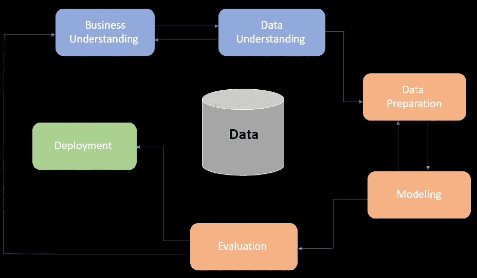
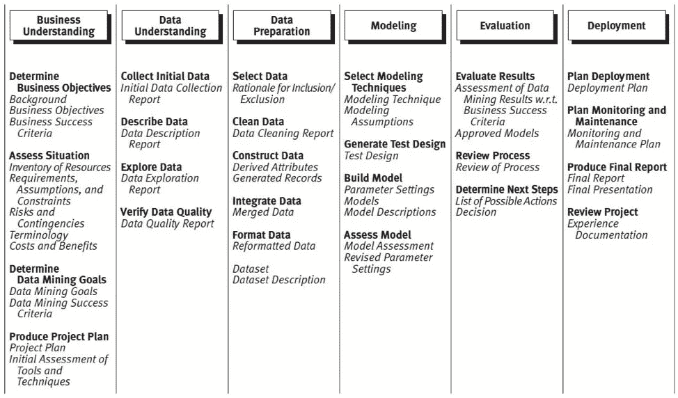
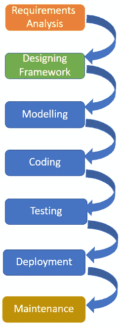
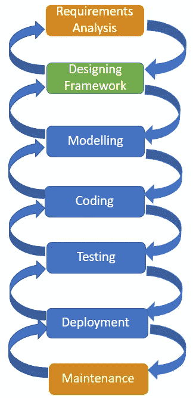
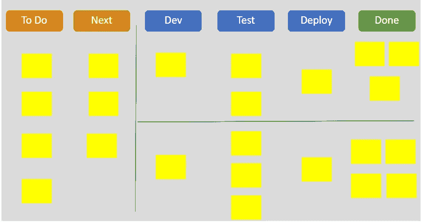

# 使项目管理方法适应数据科学

> 原文：<https://towardsdatascience.com/adapting-project-management-methodologies-to-data-science-a710ac9872ea?source=collection_archive---------10----------------------->

## [行业笔记](https://towardsdatascience.com/tagged/notes-from-industry)

## *如何有效地处理数据驱动的项目并最大化项目成果的价值*

近年来，数据科学家在各种企业中脱颖而出。数据科学家对技术和非技术人才的需求都很高。因此，数据从业者必须继续提高他们的技能，以保持相关性。目前，许多公司认识到数据科学家带来的价值。另一方面，大多数企业似乎对数据科学以及如何支持数据科学有不正确的先入之见。一些人认为，因为数据科学家利用 R 或 Python 编程语言，所以适用于软件开发的相同方法也适用于模型构建。事实并非如此，因为模型不同，应用不正确的方法可能会导致重大问题。

管理问题需要决策。这个过程还可以得到机器学习和数据挖掘技术的支持，基于对项目数据的分析和选择，做出正确的决策，解决关键的项目问题。在当今时代，数据科学家必须适应力强，并准备好以新的方式应对挑战。虽然项目管理和沟通技能对数据科学家来说至关重要，但了解项目管理和数据科学如何协同工作也很重要。软件工程有一个能力成熟度模型(CMM ),用于创建和改进组织的软件开发过程。该模型包括一个五级进化路径。CMM 类似于由国际标准化组织定义的 ISO 9001 标准。

**CMM 软件过程的五个成熟度等级**

**初级**:这个阶段的流程杂乱无章。成功取决于个人的努力，是不可重复的。

可重复级别:这是定义基本项目管理技术的地方，成功是可以重复的。

**定义的层次**:在这个阶段，组织已经通过更加关注标准化、文档化和集成来定义它的标准软件过程。

**管理层次**:组织使用数据分析和收集来控制其过程。

**优化级别**:这是通过对现有流程的反馈跟踪来频繁改进流程以满足组织需求的阶段。

**DS 管理中的临时流程**

当没有标准方法来管理数据科学项目时，团队通常会采用没有组织性、不可重复和不可持续的临时实践。因此，这些团队经常经历低项目成熟度，没有不间断的改进、频繁的反馈和定义的过程。

**那么，Ad Hoc 对数据科学有用吗？**

嗯，临时流程有几个优点和缺点。首先，它们为用户提供了决定如何处理出现的每一个问题的自由。当团队拥有由个人和小团队管理的一次性项目时，临时模式可能会更好。此外，专注于给定的任务，而不关心对组织的其他项目领域的影响，这使您可以在几乎没有管理工作的情况下处理项目。

除此之外，数据科学每天都在发展，需要团队和组织不断发展以反映当前的变化。因此，过度依赖临时实践是不正确的，因为这可能会给数据科学团队和项目带来许多问题。虽然采用成熟的项目管理方法不会完全解决项目管理的挑战，但它会减少众多的问题并增加成功的几率。除了由小团队实现的简单的小项目之外，ad hoc 不是数据科学项目的最佳选择。

也就是说，让我们回顾一下可以在数据科学领域采用的成熟软件项目管理方法。

**Crisp-DM 方法论**

CRISP-DM 完全是跨行业的数据挖掘过程。这种方法有一种结构化的方式来组织数据挖掘项目。这是一种强大且经过充分验证的方法。当数据科学家强调需要适用于数据分析和挖掘的标准方法和程序时，他们创建了 CRISP-DM 方法。CRISP-DM 包含六个独特的阶段。CRISP-DM 的阶段包括数据理解、业务理解、评估、准备、建模和部署。名义上，这些过程是按顺序进行的。然而，这个过程总是迭代的。这意味着模型是被设计来被后来的知识增强的。下图展示了 CRISP-DM 中涉及的流程。让我们从数据分析的角度来回顾一下这个过程。

作者图片

**CRISP-DM in Business**

大多数企业，当他们想了解他们的顾客、目标市场和客户时。他们总会有一组数据。例如，他们可能有一个联系人列表，或者是购买、完成表单的人，或者是在线填写表单的人。因此，CRISP-DM 的第一步是理解业务并突出组织的具体目标。了解一个企业需要识别该企业希望解决的挑战。一旦理解了目标，识别在数据中发现什么的过程就开始了。根据信息源的不同，可能会有关于客户兴趣的信息。所有这些数据对未来的活动都很有用。此后，对数据进行准备和分析，使其变得有用。数据准备过程非常庞大，可能会占用项目时间的 70-80%。数据准备过程的一部分需要识别和创建新的数据点，这些数据点可以从现有的条目中计算出来。随后，在数据准备阶段提取的信息用于建立不同的行为模型。在机器学习工具的帮助下，使用这些数据执行了大量测试。

**CRISP-DM 详情**

作者图片

CRISP-DM 任务以**粗体**显示，结果以*斜体*显示

**CRISP-DM 和数据科学项目管理**

将 CRISP-DM 的松散实现与基于敏捷的实践相集成的数据科学团队肯定会取得最好的结果。即使团队没有完全应用 CRISP-DM 的所有方法，也会获得更好的结果。CRISP-DM 提供了一个标准框架，用于:

*   经验文档
*   指导方针
*   CRISP-DM 方法支持最佳实践并支持项目复制。
*   CRISP-DM 可用于任何领域的数据科学项目。
*   CRISP-DM 是数据挖掘的事实上的行业标准过程模型。因此，数据科学家了解模型的各个步骤至关重要。

**瀑布方法**

作者图片

温斯顿·罗伊斯被认为是 1970 年发现瀑布模型的人。这是最古老的软件工程方法之一。瀑布模型代表了一个顺序模型，它被划分为预定义的阶段。瀑布方法学获得了它的名字“瀑布模型”,因为每个阶段都建立了一个定义明确的输出，并作为输入传递给下一个阶段。一旦产品进入下一阶段，就无法恢复。因此，我们可以说整个软件开发过程就像一系列小瀑布。瀑布模型将软件开发的整个过程分为不同的阶段。然后依次执行这些阶段。每个阶段都继续加工，直到获得该阶段的最终产品，然后再切换到下一阶段。

什么时候应该使用瀑布模型？

通常，您可能想知道何时是使用瀑布模型的合适时机。当客户能够一次提供他所有的需求，并且这些需求必须稳定时，就必须采用瀑布方法。此外，开发团队应该能够在软件开发开始时解释所有的客户需求。然而，任何人都很难一下子列出所有的要求。因为一个更严格的瀑布模型不允许在一个阶段完成后恢复，所以引入了一个新的瀑布模型变体来适应反馈。这被称为“相邻阶段之间的反馈”。

作者图片

该模型通过接受当前阶段的反馈，允许在相邻阶段之间纠正问题。例如，如果在编码过程中的测试阶段出现错误，可以通过返回编码阶段来修复。

**瀑布方法适合数据科学项目管理吗？**

根据 Pressman 和 Maxim (2015)，瀑布方法不能用于数据科学项目管理。首先，在所有需求都已陈述并且不可能改变的场景中，该方法是完美的。数据科学项目的情况并非如此，因为数据科学领域有大量的实验、需求修改，而且技术仍然是新颖的。瀑布模型被设计用于制造和建筑领域，其中项目的渐进运动是连续的。这解释了为什么模型的工作阶段没有重叠。在你开始给车身上螺栓之前，你需要完成汽车的框架。然而，瀑布模型的结构良好的状态对于数据科学项目的某些阶段来说是完美的，例如规划、资源管理、范围和验证。

**敏捷方法论**

敏捷方法基于敏捷宣言。该宣言包括 4 个基本价值观和 12 个关键原则。宣言的焦点是通过建立一个促进迭代开发、变更识别和团队协作的可测量的结构来揭示构建软件的最佳方法。敏捷方法的最佳价值在于它允许团队以更高的质量和可预测性提供快速的价值。敏捷过程提供了一个训练有素的项目管理实践，它支持频繁的适应、检查、自组织，以及一组工程实践，它们提供了高质量软件需求的快速交付。

**敏捷宣言的 4 个价值观**

**1。合同谈判中的客户协作**。

基于敏捷宣言，持续开发是很重要的。有必要与客户建立一个反馈回路，这样才能确保产品能与他们合作。

**2。工具和过程之上的个体和交互。**

软件团队中正确的个人群体的存在是至关重要的。此外，这些个人和团队成员之间的互动在解决手头的问题中扮演着重要的角色。

**3。响应变化而不是坚持计划。**

敏捷宣言建议软件团队应该有能力在任何需要的时候响应变化。

**4。综合文档之上的工作软件。**

敏捷宣言将工作软件置于文档之上。

**敏捷方法中的 12 个主要原则**

1.  使用重要软件的早期和持续交付来满足客户。
2.  接受不同的需求，包括开发后期的需求。
3.  从几周到几个月的时间内定期展示功能软件。
4.  开发人员和业务人员必须在整个项目中每天协作。
5.  围绕有灵感的个人建立项目。给他们提供他们想要的支持和环境。
6.  在开发团队中传递信息的最有效的方法。
7.  功能软件是进步的主要决定因素。
8.  敏捷过程强调可持续发展。开发人员、用户和赞助商应该保持同步。
9.  对技术专业和适当设计的持续关注提高了敏捷性。
10.  运用简单性来最大化未完成的工作量。
11.  自组织团队提供了最好的需求、设计和架构。
12.  在间歇期，团队应该反思如何变得有效并调整行为。

**什么时候应该使用敏捷方法？**

敏捷方法的特性，如适应性、连续交付、迭代和短时间框架，使其成为正在进行的项目和那些从一开始就不知道所有需求的项目的完美项目管理方法。换句话说，没有明确时间表、可用资源和约束的项目是敏捷方法的最佳选择。现在很多软件产品都使用敏捷。它是标准，并且已经扩展到用于营销、设计和商业。

**数据科学有可能从敏捷方法论中获益吗？**

敏捷非常适合数据科学项目管理。数据科学过程需要高度的不确定性。出于这个原因，敏捷方法与数据科学携手合作，因为它允许非线性过程成功，而不是强迫它们按顺序进行。

**敏捷数据科学的优势**

快速交付客户价值——通过交付增量产品特性，如数据端口、最小可行和模型，用户在项目结束前获得价值。

相关的可交付成果——在开发之前预先定义需求，原则很可能满足当前的需求。

更好的沟通。敏捷强调协作、清晰的沟通，关注个人。因此，当数据科学团队规模扩大并变得多样化时，利益相关方和团队内部有效沟通的价值也会增加。

敏捷让数据科学家能够试验并了解什么可行，什么不可行。实验始于假设的建立和变量的确定。接下来是数据收集和分析。

虽然敏捷是作为软件开发的方法论而创建的，但它一直在不断发展，以满足许多团队类型的需求。然而，随着敏捷技术的不断发展，新的敏捷应用程序的发布，敏捷框架也在不断发展。

**Scrum**

Scrum 是一个流行的敏捷框架，非常适合团队。根据 Scrum 指南，Scrum 是一个框架，在这个框架中，人们可以处理适应性挑战，同时创造性地交付具有最大价值的产品。在某些情况下，scrum 可能会令人困惑，因为团队会混合使用看板等其他框架的几个方面。scrum 的主要目标是通过透明的沟通、持续的进步和集体责任来满足客户的需求。

Scrum 是在被称为 sprints 的短周期的 min 块中实现的。冲刺阶段从 2 周到 4 周不等。每个 sprint 都是一个交付全部结果的实体。该过程由起点和完成项目计划的需求组成。

**数据科学有可能从 Scrum 的方法论中获益吗？**

Scrum 允许团队协作并提供增值。然而，这个过程并不容易。其中最大的挑战是定义在数据科学环境中构成挑战的定长冲刺。例如，不容易估计一项任务将花费的次数。

数据科学团队更喜欢不同持续时间的冲刺，但在使用 Scrum 时这是不可能的。因为这些问题，一些团队更喜欢应用数据驱动的 Scrum(DDS)。DDS 有 Scrum 的一些主要概念，但是它也解决了使用 Scrum 的缺点。scrum 的主要优势是它以客户/产品为中心，能够保持一致性，通过实验获得信息，以及团队成员的明确方向。Scum 很难掌握，对团队成员来说是相当大的会议开销，并且在给定的时间内满足需求对团队来说是具有挑战性的。

**看板**

看板是一种项目管理方法，最适合任何规模的公司。该工具允许您获得需要完成或完成的任务的可视化概述。它由数字或物理板组成，有三列(进行中、已完成、待完成)。然后，任务被概括为故事卡。每张牌都会从左到右抽出，直到抽完为止。看板系统首先被丰田工厂应用于平衡实际生产中的材料供应。

作者图片

**使用看板进行数据科学项目管理可以吗？**

对于许多类型的项目来说，看板已经被证明是一种很好的方法，从具有多层复杂性的大型项目到可以由一两个人快速完成的小型项目。看板提供了数据科学家所需要的灵活性，他们希望能够灵活地执行他们的任务，而不会有固定的截止日期。根据 Saltz、Shamshurin 和 Crowston (2017)的说法，看板提供了一种比数据科学团队所拥有的更好的结构。

**看板最佳实践**

在项目中使用看板提供了可视化工作流程的能力。因此，在遇到瓶颈、过度工作的步骤和其他障碍的情况下，它们很容易被识别。该团队还应该团结起来，确定以最佳方式交付最关键工作的方法。

**看板的优势**

它非常直观，因此在向利益相关者和团队成员传达正在进行的工作时非常有效。

它非常灵活。它可以一次提取一个工作项目，不像 Scrum 的批处理周期。

提供更好的协调。灵活的结构、简单性、可视化和轻量级的特性使其有利于团队合作。

减少正在进行的工作。

为流程的每一步提供清晰的规则。

**看板的缺点**

缺少最后期限。没有截止日期可能会使团队在特定的任务上工作很长时间。

看板列定义。为数据科学看板定义列是一项挑战。

客户互动未定义。因此，如果没有 sprint 评审的结构化节奏，客户可能不会对这个过程感兴趣。

**数据驱动项目管理的研发**

R&D 是指企业为开发和引进新产品和服务，以及改进现有产品和服务而从事的活动。R&D 不同于公司的大部分经营活动。通常情况下，研究和开发并不是抱着立即获利的希望进行的。相反，它旨在增加公司的长期盈利能力。随着发现和产品的开发，R&D 可能会产生专利、版权和商标。

使用研发方法进行数据驱动的项目管理有效吗？

是啊！

数据科学包括几个步骤，从 EDA 到模型创建，每个阶段都需要自己的一组实验。每个阶段都是相互联系和反复的。R&D 是数据驱动计划的最佳技术，因为它允许在创造力和产生新事物方面有很大的灵活性。R&D 带领我们走到了数据科学领域的今天。组织面临着各种数据驱动的问题，使用正常的程序和实践很难解决这些问题。

**结论**

当我们接近这篇文章的结尾时，用不同的项目管理方法以及将它们集成到信息科学中的方式来启发我们自己是很重要的。通过这样做，我们将能够发现和创造一种有效的技术。有许多项目管理工具用于维护和报告项目进展。我们不仅可以使用这些工具来通知高级管理层，还可以帮助利益相关者编写假设和项目依赖关系。项目的成功取决于许多因素。因此，在项目生命周期的所有阶段开发和分析系统主要性能指标是非常重要的。

这里有一些额外的资源可以帮助你了解数据驱动的项目管理。

**参考列表**

**瀑布模型**

[https://binaryterms.com/waterfall-process-model.html](https://binaryterms.com/waterfall-process-model.html)

[https://www . lucid chart . com/blog/pros-and-cons-of-waterfall-methodology](https://www.lucidchart.com/blog/pros-and-cons-of-waterfall-methodology)

[https://corporatefinanceinstitute . com/resources/knowledge/other/capability-maturity-model-CMM/](https://corporatefinanceinstitute.com/resources/knowledge/other/capability-maturity-model-cmm/)

**临时**

[https://www.datascience-pm.com/tag/ad-hoc/](https://www.datascience-pm.com/tag/ad-hoc/)

**敏捷**

[https://zenkit.com/en/blog/agile-methodology-an-overview/](https://zenkit.com/en/blog/agile-methodology-an-overview/)

https://project management academy . net/agile-methodology-training

[https://www.marketing91.com/agile-methodology/](https://www.marketing91.com/agile-methodology/)

[https://www.digite.com/agile/scrum-methodology/](https://www.digite.com/agile/scrum-methodology/)

**看板**

【https://www.paymoapp.com/blog/what-is-kanban/ 

[https://big data-made simple . com/why-apply-kanban-principles-big-data-projects/](https://bigdata-madesimple.com/why-apply-kanban-principles-big-data-projects/)

[https://towards data science . com/the-3-most-important-project-management-methods-in-data-science-df7e 14955 d37](/the-3-most-important-project-management-methods-in-data-science-df7e14955d37)

**其他来源**

 [## 数据科学项目管理方法

### 数据科学大数据需要时间，对其存储的要求也随之发展。这是主要的…

www.quickstart.com](https://www.quickstart.com/blog/data-science-project-management-methodologies/) 

[https://neptune.ai](https://neptune.ai/blog/data-science-project-management-in-2021-the-new-guide-for-ml-teams) /

[https://www . dominodatalab . com/resources/field-guide/managing-data-science-projects/](https://www.dominodatalab.com/resources/field-guide/managing-data-science-projects/)

[https://www.datascience-pm.com/](https://www.datascience-pm.com/)

[https://xperra.com/blog/crispy.html](https://xperra.com/blog/crispy.html)

[https://www.datascience-pm.com/crisp-dm-2/](https://www.datascience-pm.com/crisp-dm-2/)

[https://www . agile alliance . org/agile 101/12-敏捷背后的原则-宣言/](https://www.agilealliance.org/agile101/12-principles-behind-the-agile-manifesto/)

[https://www.productboard.com/glossary/agile-values/](https://www.productboard.com/glossary/agile-values/)

[https://www . mygreatlearning . com/blog/why-using-crisp-DM-will-make-you-a-better-data-scientist/](https://www.mygreatlearning.com/blog/why-using-crisp-dm-will-make-you-a-better-data-scientist/)