# 为离散动作空间调整软演员评论家

> 原文：<https://towardsdatascience.com/adapting-soft-actor-critic-for-discrete-action-spaces-a20614d4a50a?source=collection_archive---------5----------------------->

## 如何通过仅改变两个方程将流行的算法应用于新问题

自 2018 年推出以来，软演员评论家(SAC)已经成为深度强化学习(DRL)最受欢迎的算法之一。你可以在网上找到很多很棒的解释和教程。但是，它们中的大多数都假定了一个连续的动作空间。在这篇文章中，我将解释和实现在具有离散动作的环境中使用 SAC 的必要调整，这些调整是在 2019 年的一篇论文中得出的。

这篇文章假设你已经熟悉 DRL 的基本原理。SAC 算法的知识会有所帮助，但不是必需的。要了解 SAC，你可以阅读 Berkeley 的[原始论文](https://arxiv.org/abs/1801.01290)或 OpenAI 的 [SpinningUp](https://spinningup.openai.com/en/latest/algorithms/sac.html#) 的解释(这也是了解 DRL 总体情况的极好资源)。

在第 1 节中，我快速总结了 SAC 的关键要素。为此，我将引入两个核心成本函数(和一个可选的第三个)，它们需要最小化以找到最佳的模型参数。连续和离散设置的 SAC 之间的主要区别在于这些成本函数的定义。我将在第 2 节解释它们需要如何改变。最后，在第 3 节和第 4 节中，我将展示如何用 Python 实现和评估调整后的算法。

# 1.SAC 概述

顾名思义，SAC 是一种演员-评论家方法。这是政策优化和 Q 学习的混合方法。一方面，它使用基于贝尔曼方程的成本函数来训练 Q 函数网络(“评论家”)。同时，它通过最小化成本函数来优化策略(“参与者”)，以最大化预期回报。你可以在这里阅读更多关于演员-评论家方法的内容。

SAC 的成功建立在先前算法引入的许多想法之上，例如使用双 Q 学习和目标网络。然而，SAC 的主要创新是熵正则化强化学习的使用。为了节省时间，在这一节中我将只解释熵正则化，因为它是使 SAC 适应离散动作空间所需要理解的基本组件。

## 1.1 熵正则化

熵是信息论中的一个术语，用来量化随机变量结果的不确定性。本质上，随机变量的熵越高，其结果越不可预测，也越随机。例如，一枚正面和反面都有 50%机会的公平硬币将具有最大熵。另一方面，如果它有 100%的机会落在一边，熵将是 0。概率分布 P 的熵的形式定义如下:

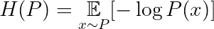

图 1:分布 P 的熵

熵正则化 RL 使用熵作为策略随机性的度量。这样的措施是有用的，因为它有助于我们在训练中鼓励随机性。这种随机性被认为可以增加探索性并有助于避免局部最优。

在下一节中，我将介绍我们如何优化函数来找到熵正则化策略，以及 Q-network 在没有熵正则化的情况下的外观。除了一个小细节，这些函数看起来与其他演员-评论家方法(如 DDPG)相同。唯一的区别是，大多数其他行动者批评方法通过向确定性策略的结果添加噪声来制造随机性。另一方面，SAC 使用非确定性策略，因此我们可以使用熵来量化策略的随机性。在接下来的部分中，我将解释 SAC 中使用的成本函数的修改版本如何考虑策略的熵。

## 1.2 无熵正则化的关键方程

对于与离散动作空间一起工作的 SAC 算法，我们需要调整两个关键等式:

*   策略π的参数θ的(行动者)成本函数
*   Q-函数 Q 的参数φ的(临界)成本函数

它们分别来自最优策略和 Q 函数的定义。我将首先讨论策略，然后讨论 Q 函数参数。

从形式上来说，通过常规的行动者-批评家方法，我们希望找到一种政策，使贴现回报随着时间的推移而最大化:

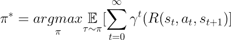

图 2:演员在演员-评论家方法中解决的优化问题

这里π是策略，τ表示由策略引起的状态和动作的轨迹，γ是贴现率，R(s，a，s’)给出使用动作 a 从 s 到 s’的过渡的奖励。

我们使用参数为θ的函数逼近器来表示我们的策略。我们的目标是找到产生最接近图 2 的解决方案的策略的那些参数。为此，我们希望最大化我们对参数化政策预期收益的估计。由于动作空间是连续的，我们不能直接计算期望值。因此，我们使用基于受访州所采取行动的蒙特卡罗估计。这个估计给出了我们的第一个成本函数(我们在期望值前面加了一个负号，因为我们在最小化成本函数)。

**成本函数 1:演员参数**

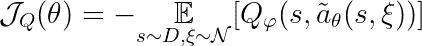

图 critic 参数的成本函数

其中 D 是重放缓冲器，可以从该重放缓冲器中采样先前访问的状态，Q 是我们的具有参数φ的 Q 网络。

获取用于计算预期回报的动作有点复杂。在 SAC 中，策略是不确定的，因此我们必须从策略参数θ和状态 s 引起的分布中得出一个动作。策略网络输出一个均值μ(θ，s)和一个方差σ(θ，s)，因此动作分布如下:

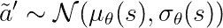

图 3b:根据策略参数化的动作分布

然而，如果我们产生这样的动作，那么我们就不能再求 Q 值对θ的导数了。因此，我们不能使用基于梯度的方法来优化θ。因此，我们使用重新参数化技巧:

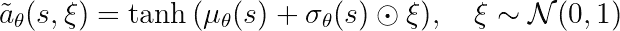

图 3c

这一项遵循与图 3b 所示相同的分布，但我们可以对θ求导。

正如我们前面提到的，我们同时优化我们的策略和 Q 函数的近似值。最佳 Q 函数由贝尔曼方程描述:

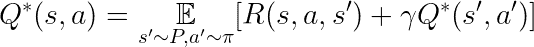

图 4:最佳 Q 函数的贝尔曼方程

其中 P 是通过采取行动 a 可以从状态 s 到达的状态的分布。

我们用一组参数φ来参数化 Q 函数。我们通过最小化二次成本函数 L 找到逼近最优 Q 函数的φ:

**成本函数 2:评论家参数**

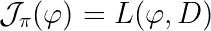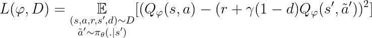

图 5:参与者参数的成本函数

其中 d=1 当且仅当 s’是轨迹的终点，否则为 0。同样，我们使用重新参数化技巧来生成左边术语中的动作。

请注意，在计算 Q 函数的损失时，我们不需要对该动作使用重新参数化技巧，因为这一项将根据φ而不是θ进行微分。

## 1.3 SAC 的熵正则化关键方程

为了对图 2 中的策略等式进行熵正则化，我们使用在一个州收到的奖励和该州的策略熵的加权和:

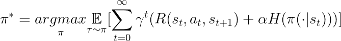

图 6:最优策略的熵正则化定义

π(.|s)表示由状态 s 中的策略给出的动作的分布的 pdf

α > 0 称为温度，它决定了获得的回报和政策随机性之间的权衡。它可以设置为一个恒定的超参数，也可以在训练期间进行优化。

预期回报将随着熵的减少而增加，反之亦然。这将加速训练后期的学习，并有助于避免局部最优。

就像之前一样，我们想找到使预期收益最优化的θ。为了在熵正则化设置中这样做，我们可以简单地将熵的估计添加到我们的预期回报的估计中:

**熵正则化演员成本函数**

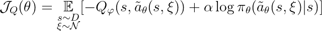

图 7:熵正则化的 critic 成本函数

我们如何将贝尔曼方程用于我们的 Q 函数类似于我们在最优策略的定义中所看到的:

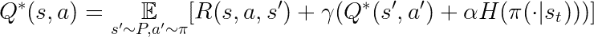

图 8:最佳 Q 函数的熵正则化贝尔曼方程

根据这个定义，我们可以导出下面的二次成本函数来优化我们的 Q 网络:

**熵正则化的批评家成本函数**

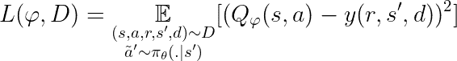

图 9:熵正则化演员成本函数

使用:

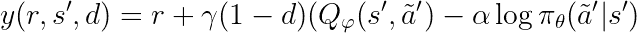

图 9b

其中右边括号中的术语称为软状态值。请注意，这个术语只是对从当前策略中提取的操作的估计。

## 1.4 用于学习温度参数的成本函数

如前所述，温度α可以在训练期间进行优化。这是可选的，因为α可以像超参数一样简单地设置或随时间减少。但是，如果您想要优化温度，那么您将使用一个成本函数，当在连续和离散设置之间切换时，该函数也需要调整。这个成本函数的推导超出了本文的范围，可以在[这篇论文](https://arxiv.org/abs/1812.05905)中找到。就我们的目的而言，知道通过最小化以下成本函数可以找到最佳温度是非常重要的:

**温度成本函数**

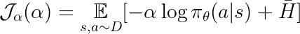

图 10:温度参数的成本函数

右边的项是给出目标熵的超参数。

# 2.转移到离散设置

既然我们已经修改了 SAC 的重要元素，那么是时候调整它们来与离散的操作一起工作了。幸运的是，这只需要我们改变两三个方程，这取决于我们是否想要优化温度参数。无论哪种方式，我们都需要改变我们的两个关键方程，以分别找到策略和 Q 函数的参数。

为了理解如何改变关键方程，让我们想想当我们进入离散设置时会发生什么变化。最重要的是，π(。|s)现在是质量函数，而不是密度函数。记住这一变化，图 6 和图 8 中给出的最优策略和 Q 函数的定义仍然有效。但是，我们需要做两处修改才能计算它们:

1.  到目前为止，我们假设 Q 函数将状态和动作作为输入并输出 Q 值。现在我们可以让它简单地获取一个状态，并映射到一个包含每个动作的 Q 值的向量。以前，这是不可能的，因为我们有无限多的可能行动，但做出这种改变将在以后派上用场。
2.  在连续设置中，π由参数θ表示，这些参数用于计算动作空间的每个特征的均值和方差。因此，我们的参数化π将状态映射到具有 2|A|个元素的实数向量，其中|A|是动作空间的维度。在离散设置中，每个动作的简单概率向量就足够了。因此，π将状态映射到具有|A|元素的概率向量。

综上所述，我们将定义修改如下:

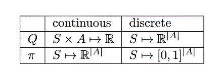

图 11:当我们从连续行动转向离散行动时，政策和 Q 函数的类型是如何变化的

那么，这些变化对我们如何计算政策参数意味着什么呢？回想一下，在图 7 中，我们必须从策略分布中抽取行动样本，以估计预期回报。当使用离散动作和我们的π和 Q 的新定义时，我们可以精确地计算动作的期望值。只有对各州的期望仍然是一种估计:

**离散行动的行动者成本函数**

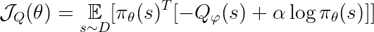

图 11:离散动作的参与者成本函数

对 Q 函数的等式所做的改变是相似的:

**离散行动的批评家成本函数**

对于行动者成本函数，我们只改变软状态值。和以前一样，我们不再需要使用估算，而是可以直接计算。

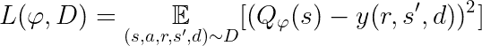

图 12:离散动作的最佳 Q 函数参数

随着

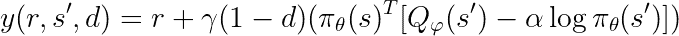

对于最佳温度:

**离散行动的适度成本函数**

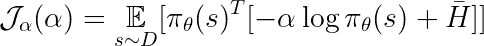

图 13:离散动作的温度成本函数

# 3.Python 实现

在本节中，我将向您展示如何使用 PyTorch 实现离散 SAC，并在一个 [OpenAI Gym](https://github.com/openai/gym) 环境中对其进行评估。你可以在这里找到包含所有代码的库。我不会查看整个代码，因为很多代码与本文没有直接关系，我只解释最重要的部分。

正如我之前提到的，SAC 使用了比熵正则化更多的技巧。有两种方法可以增加 critic 网络学习的稳定性:使用目标网络和双 Q 学习。这两者都不是本文的重点，但是我将简要地总结一下，因为它们是实现算法所需要的。简而言之，目标网络背后的想法是，当计算 y(r，s '，d)(目标)时，我们使用一个单独的批评网络。最初，该网络的参数与香草评论家网络的参数相同。然而，目标网络更新得更慢，要么通过每 N 个训练步骤仅复制 critic 的参数，要么通过在每个训练步骤使用软更新(有时称为 Polyak 更新)。这是为了增加稳定性，因为 critic 网络中无用的变化需要更长的时间才能渗透到目标值。第二个技巧，双 Q 学习，受到基于梯度的优化往往导致过大 Q 值的启发。因此，训练两个 Q 网络并使用两个网络产生的较小值。这意味着在我们的算法中总共有四个 Q-网络:两个用于批评家，两个用于目标网络。

## 3.1 代理初始化

我的实现的主类叫做 *Discrete_SAC_Agent* 。它包含目标和关键网络，以及使用转换数据训练网络和基于当前环境状态采取行动的功能。

下面可以看到类 *Discrete_SAC_Agent* 的构造器。传递给该函数的环境被假定遵循 OpenAI Gym 接口，并且具有离散的状态空间。构造器使用了一个类*网络*和 *ReplayBuffer* ，前者是一个 3 层的前馈神经网络，二者的实现都可以在 repo 中找到。

在第 22 行，我们调用函数*soft _ update _ target _ networks*，该函数执行目标网络向批评网络的软更新。它采用参数τ作为插值因子。通过将其设置为 1，我们将 critic 参数复制到 target 参数中。第 43 行设置了目标熵超参数，它基于论文中给出的启发。大多数情况下，剩下的函数是用于初始化神经网络和优化器的基本 PyTorch 代码。构造函数的其余部分是用于初始化神经网络和优化器的基本 PyTorch 代码。

Discrete_SAC_Agent 类的构造函数

*软更新目标网络*的实现如下:

软更新功能，用于在评论家的方向上缓慢改变目标参数

## 3.2 学习和损失

在每个训练步骤之后，使用 *train_on_transition* 函数将转换(s，a，s’，r，d)存储在代理的重放缓冲区中。随后，如果存储了足够多的转换，将从缓冲器中采样一批转换，根据转换的损失对概率进行加权。

存储转换和训练代理网络的功能

损失函数的实现如下所示:

演员、评论家和温度参数的损失函数

## 3.3 选择行动

给定代理的当前状态，我们可以通过使用函数 *get_next_action* 获得下一个动作。需要一个标志*评估 _ 剧集*来判断当前剧集是评估还是训练剧集。行动者网络将根据当前状态产生每个行动的概率。根据*评估 _ 情节*的值，要么选择最可能的动作，要么从演员网络给出的分布中抽取动作。

用于根据状态获取代理的下一步操作的函数

# 4.估价

为了评估我的实现，我选择了 OpenAI gym 的 [CartPole-v1 环境](https://gym.openai.com/envs/CartPole-v1/)。在这个环境中，代理的目标是通过向左或向右移动来平衡可移动推车顶部的杆子。每过一个时间步，杆没有倒下，代理人得到 1 的奖励。由于有两个离散的动作，我们的 SAC 离散版本适用于这个问题。

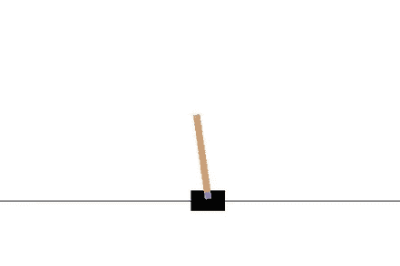

CartPole-v1 是一个具有离散动作空间的环境的简单例子。代理人可以向左或向右移动一辆手推车(黑色)来平衡一根杆子(棕色)，每走一步就获得 1 英镑的奖励，直到杆子倒下。来源: [OpenAI](https://gym.openai.com/envs/CartPole-v1/)

为了在这个环境中测试我的代理，我写了一个训练脚本。它会进行多次训练，其中一名 SAC 特工会在 CartPole-v1 环境中接受多次训练。这种情况会持续 200 步，或者直到杆子倒下。

在训练期间，每第 n 集用于评估，这意味着代理不探索而是确定性地选择动作。在所有训练运行完成后，计算并绘制评估集的平均结果。

下面你可以看到培训代理的代码。绘制结果的代码可以在资源库中找到。

用于多次运行 SAC 代理并存储结果的脚本

## 4.1 结果

在下图中，您可以看到五次训练的结果，每次 400 集，最多 200 步。由于每 4 集有 1 集用于评估，因此每次运行有 300 个训练集。x 次训练后的平均奖励用蓝色标出，浅蓝色阴影区域表示标准偏差。

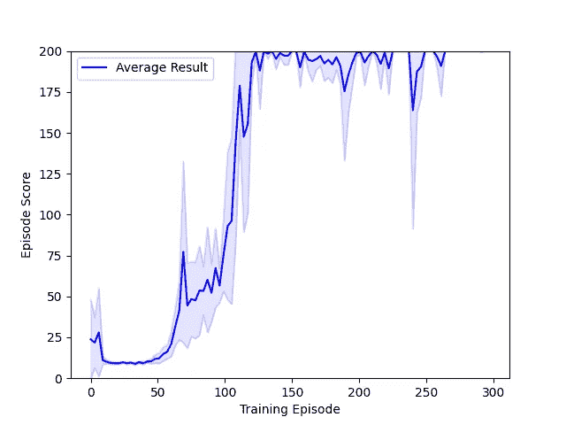

5 次训练的平均结果。作者图片

正如你所看到的，在最初被卡住了大约 50 集之后，代理取得了很大的进步，在大约 150 集之后达到了可能的最高分 200。然而，训练仍然有些不稳定，并且直到训练结束，在短时间内分数会反复下降。请记住，该评估是在没有调整任何超参数的情况下进行的，这样做可能会带来更好、更稳定的性能。

## 来源

[1]赫里斯托多洛·彼得斯，*离散动作场景软演员兼评论家*，Arxiv，2019 年 10 月 16 日，[https://arxiv.org/abs/1910.07207](https://arxiv.org/abs/1910.07207)

[2] Haarnoja 等，软行动者-批评家:随机行动者下的偏策略最大熵深度强化学习，Arxiv，2018 年 1 月 4 日，【https://arxiv.org/abs/1801.01290 