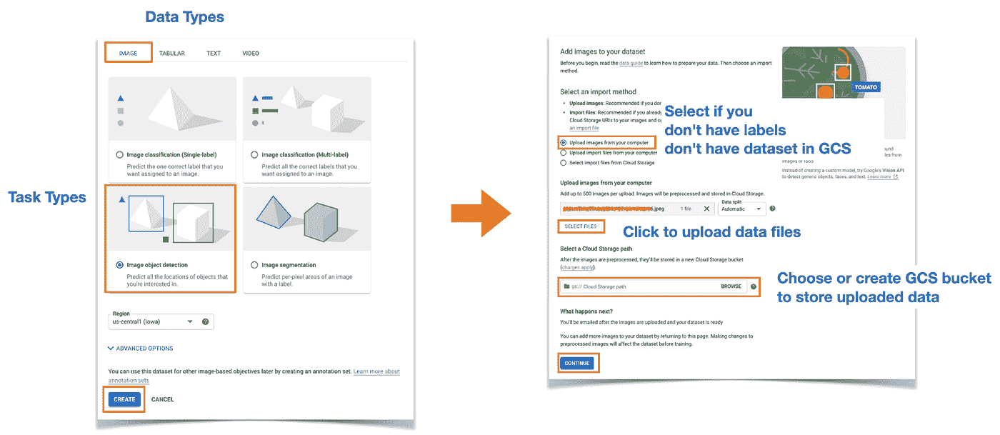

# 在 Vertex AI 中构建 MLOps 流水线以适应数据的变化

> 原文：<https://towardsdatascience.com/adapting-to-changes-of-data-by-building-mlops-pipeline-in-vertex-ai-3f8ebd19a869?source=collection_archive---------7----------------------->

## [实践教程](https://towardsdatascience.com/tagged/hands-on-tutorials)

## 这篇文章展示了如何为物体检测任务建立一个机器学习管道。目的是演示如何使用 Vertex AI 的 AutoML 和 Cloud 函数实现 MLOps 来准备数据漂移情况。

# 动机

我有一个三岁的女儿，我意识到她的脸每个月都在发生巨大的变化。谷歌照片已经在通过跟踪人们面部的变化来识别面部方面做得非常出色。然而，我想我可以更进一步，比如对她没有戴面具的照片进行分类，然后进行分层预测。这将是下一篇文章的主题。

此外，我认为这是 MLOps 的一个很好的例子，因为我和我的妻子像平常的父母一样给她拍了很多照片。这意味着我有足够的数据来建立一个模型，并且这些数据已经包含了潜在的数据漂移，因为我有她在婴儿、一岁、两岁时的照片。

# 构建管道和触发器

我们需要 Vertex AI、Google 云存储、云功能来建立机器学习管道和触发器。Vertex AI 不是一个单一的服务，而是许多不同的 AI 相关服务的组合。具体来说，这篇文章的项目利用了 Vertex AI 的数据集、AutoML、笔记本、管道、模型和端点特性。

图 1 显示了如何构建整个管道的分步说明。理解机器学习系统蓝图的最佳方式是考虑组成工作流的组件。让我们一个一个来。请记住，每个组件并不代表一个独立的作业，而是按顺序连接在一起。


**图 1** :管道设置——作者图片

## 数据准备

数据是机器学习的心脏，没有数据我们什么都做不了。所以，毫无疑问，我们首先需要准备数据集。Vertex AI 提供了托管数据集功能。您可以简单地从本地存储中导入数据，或者如果您已经在现有的 GCS 存储桶中有了数据集，您可以只指向 GCS 位置。

然而，如你所知，数据本身是不够的。我们需要标签/注释。顶点 AI 数据集允许您在导入原始数据时直接导入标注。您只需要确保标签以建议的方式形成。你可以在这里找到如何根据数据类型制作自己的标签文件[。](https://cloud.google.com/vertex-ai/docs/datasets/datasets)

为了让您了解它的样子，下面显示了一个 CSV 格式的图像分类任务标签的示例(您也可以使用 JSONL)。

```
[ML_USE], GCS_FILE_PATH,[LABEL]
```

您可以找到另一个 CSV 格式的对象检测示例。

```
[ML_USE],GCS_FILE_PATH,[LABEL],[BOUNDING_BOX]*
```

在这里，您可以简单地忽略 ML_USE，但是如果您想要手动地将数据分割成训练/验证/测试集，它可以是训练集、验证集或测试集。BOUNDING_BOX 是 8 个值的列表，每两个是一对。所以你可以猜测它代表了边界框每条边的坐标。基本上，顺序必须遵循 X_MIN，Y_MIN，X_MAX，Y_MIN，X_MAX，Y_MAX，X_MIN，Y_MAX。

## 培养

根据数据集训练模型有多种选择。这篇文章特别展示了如何利用顶点 AI AutoML 特性来实现 MLOps。以下是我选择 AutoML 的三个原因。首先，我不必关心建模。我所要做的就是以 AutoML 能够识别的正确格式准备数据集。幸运的是，Vertex AI 数据集与 Vertex AI AutoML 完美匹配，因此没有额外的工作量。

第二，当数据集演变时，我们不能保证当前最先进的模型足够好。我们可能必须通过为数据工程、建模和超参数调整编写不同版本的代码来运行多个实验。AutoML 主要显示顶级结果。这是因为内部算法可能会随着时间的推移由谷歌工程师修改和维护，它可能会保证我们几乎总是利用可靠的最先进的 AutoML 建模技术。

最后但同样重要的是，将顶点 AI AutoML 集成到顶点 AI 管道中是很简单的。Vertex AI Pipeline 只是 Kubeflow Pipeline 的一个包装器服务，Google 定义了一堆 Kubeflow 组件，平滑地融合到标准的 Kubeflow Pipeline 中。这意味着您可以在为自定义组件编写标准 Python 代码并连接它们的同时利用 Vertex AI AutoML。

## 部署和监控

部署可以被视为一个操作与两个独立的操作的组合，即模型导出和服务于端点。顶点 AI 通过顶点 AI 模型和端点支持这两者。顶点人工智能模型是一个中心位置，所有训练好的模型和它们的版本一起被管理。您可以使用指标查看训练结果，用它测试一个简单的预测。

一旦您认为您已经准备好为真实世界的用户部署模型，您就可以用选择的模型创建一个端点。实际上，Vertex AI Endpoint 管理的是 Google Kubernetes 引擎中模型的端点。这意味着您不必关心模型的可伸缩性。在企业的早期阶段，只能为几个节点提供服务，但是当企业变得太大而无法用几个节点处理用户请求时，这个数字会平稳增长。


**图 2**:Vertex AI 端点的模型监控能力——作者图片

Vertex AI Endpoint 还提供了预测/秒、请求/秒、延迟和预测错误百分比的监控功能。您需要额外的努力来处理概念/数据漂移问题，但这足以查看预测请求中是否有错误，预测延迟是否超过预期，顶点 AI 的吞吐量是否不够。Vertex AI 为表格模型和定制模型提供了额外的监控功能，以深入检查模型行为，但很可能在不久的将来会支持 AutoML 模型。

## 管道和触发器

您可以单独进行数据集创建、模型训练、端点实例化和模型部署。然而，更好的方法是构建一个管道，以一致的方式完成所有这些工作。AutoML 很可能保证你有最好的模型。这意味着我们所要做的就是准备更多的数据，并在您目睹模型性能下降时触发管道。

那么什么可以触发流水线运行来学习新的数据集呢？当然，应该有一个事件监听系统来检测数据集中的变化。这就是云功能的用武之地。每当指定的 GCS 存储桶发生变化时，云功能可以监听修改事件。有了这种能力，我们可以在记录更多数据时简单地运行管道。

# 初始操作流程

作为演示 MLOps 的初始阶段，我们需要一个基础数据集。如图 3 所示，创建数据集需要多个步骤。首先，您需要选择数据类型和任务类型。对于这个项目，我选择了“*”类别下的“图像目标检测”。其次，您可以从本地文件系统上传图像，或者如果您已经将图像上传到 GCS bucket，您可以简单地选择它。*

**

***图 3** :创建顶点人工智能数据集——作者图片*

*此外，如果您有一个额外的标签文件，您可以从与图 3 相同的 UI 上传它。对于这个项目，我没有任何标签，只是在上传了一堆图片后点击了“继续”。*

**

***图 4** :顶点人工智能数据集中的标记能力——作者图片*

*幸运的是，顶点 AI 数据集在浏览器中提供了很好的标记工具，如图 4 所示。有了这个功能，我只需简单地拖放鼠标位置，就可以标记大约 100 张图像。这样做之后，您就有了一个完整的数据集，这意味着数据和相关联的标签都存储在 GCS 存储桶中。*

*现在，我们已经准备好用数据集构建我们的初始管道。我们可以直接在终端或最喜欢的 ide 中编写管道代码，但是在 Jupyter 笔记本中运行初始管道通常是个好主意。因为它提供了一个很好的交互环境，我们可以通过反复修改代码来进行编辑和实验。此外，顶点人工智能笔记本可以让你忽略所有关于 GCP 授权过程的麻烦，因为它已经在 GCP 环境中运行。*

**

***图 5** :顶点 AI 管道中构建和运行管道的初始阶段——作者图片*

*图 5 显示了初始管道运行的工作流是如何在笔记本中进行的。作为第一步，我们需要导入必要的库并设置一些必需的变量，如下面的代码所示。*

```
***from** google.cloud **import** aiplatform
**from** google_cloud_pipeline_components **import** aiplatform **as** gcc_aip**from** kfp.dsl **import** pipeline
**from** kfp.v2 **import** compiler
**from** kfp.v2.google.client **import** AIPlatformClientPROJECT_ID = “YOUR_GCP_PROJECT_ID”
REGION = “GCP_REGION_TO_RUN_PIPELINE” 
PIPELINE_ROOT = “LOCATION_RUN_METADATA_IS_GOING_TO_BE_STORED”
DATASET_META_PATH = “LOCATION_DATASET_METADATA_IS_STORED”*
```

*我们需要三个五库三包。下面的两个代码示例展示了它们的用法。第一个代码块显示了如何定义包含三个管道组件的管道。注意***@ component***decorator 用来表示函数管道是整个管道定义到 Kubeflow 管道的地方。我们可以用***@ component***decorator 将三个组件分离成单独的函数，并在管道中挂钩。然而，我把所有东西都放在一个地方，以使这个示例尽可能简单。*

****ImageDatasetCreateOp***组件用于导入我们通过顶点 AI 数据集定义的数据集。为了实例化这个组件，我们需要告诉三件事，即 GCP 项目 ID、存储标签文件的 GCS 路径和任务类型。*

```
*@pipeline(name=”my-pipeline”)
**def** **pipeline**(project: str = PROJECT_ID):
   ds_op = gcc_aip.ImageDatasetCreateOp(
      project=project,
      display_name=”DATASET_NAME_TO_APPEAR”,
      gcs_source=DATASET_META_PATH,
      import_schema_uri=\
         aiplatform.schema.dataset.ioformat.image.bounding_box,
   ) training_job_run_op = gcc_aip.AutoMLImageTrainingJobRunOp(
      project=project,
      display_name=”my-daughter-od-training”,
      prediction_type=”object_detection”,
      model_type=”CLOUD”,
      base_model=**None**,
      dataset=ds_op.outputs[“dataset”],
      model_display_name=”my-daughter-od-model”,
      training_fraction_split=0.6,
      validation_fraction_split=0.2,
      test_fraction_split=0.2,
      budget_milli_node_hours=20000,
   ) endpoint_op = gcc_aip.ModelDeployOp(
      project=project, model=training_job_run_op.outputs[“model”]
   )*
```

*下一个组件是***autolimagetrainingjobrunop***。这是每个图像相关任务的统一组件。如您所见，您可以在 prediction_type 参数中指定特定的任务类型。还要注意 model_type 设置为“*”。这告诉 AutoML 计算出要生成哪种结果模型。例如，如果你想得到一个低延迟的更轻的模型，你可以将 model_type 不同地设置为“***CLOUD _ LOW _ LATENCY _ 1***”。有多种选择，所以请查看 API [文档](https://googleapis.dev/python/aiplatform/latest/aiplatform.html#google.cloud.aiplatform.AutoMLImageTrainingJob)了解更多信息。对于这个项目，我只是把它作为标准的平均模型。**

**在***autolimagetrainingjobrunop***组件中还有三个参数需要考虑。您可以直接指定训练/验证/测试分割比率。尽管您可以在数据集准备阶段指定哪些图像应属于哪个数据集，但如果您在此组件中显式设置它们，它将忽略信息并根据比率随机分配数据。如果你不能自己决定拆分，这是一个很好的开始方式。***buget _ milli _ node _ hours***是何时停止训练的约束。因为如果你永远训练，AutoML 可以无限增长模型的大小，你必须决定何时停止训练过程。否则，你将付出大量的金钱，却没有任何准确性的提高。最后，必须告诉 AutoML 将在哪个数据集上进行训练，这是通过 dataset 参数完成的。需要知道的重要一点是，数据集参数设置了***ImageDatasetCreateOp***和***autolimagetrainingjobrunop***之间的连接和依赖关系，因为训练作业必须在数据集创建操作之后执行。**

**最后一个组件是**ModelDeployOp。尽管名称如此，但它能够创建端点并将训练好的模型部署到端点。我们可以显式地分别执行这两个操作，但是用一个组件来执行它们会更方便。您需要做的就是指定要部署什么模型，这是通过模型参数设置的。同样，该参数设置了***autolimagetrainingjobrunop***和***ModelDeployOp***之间的连接和依赖关系。****

```
**compiler.Compiler().compile(
   pipeline_func=pipeline, package_path=PIPELINE_SPEC_PATH
)api_client = AIPlatformClient(project_id=PROJECT_ID, region=REGION)response = api_client.create_run_from_job_spec(
 PIPELINE_SPEC_PATH,
 pipeline_root=PIPELINE_ROOT,
 parameter_values={“project”: PROJECT_ID},
)**
```

**管道完全定义好了，接下来我们要用 ***编译器来编译。编译器()。编译*** 方法。编译的作用是通过查找管道函数定义来构造管道规范。在管道规范中，记录了许多隐藏的部分，比如作业依赖关系、使用哪种云机器类型和哪个容器映像等等。通过指定 ***package_path*** 参数，编译器在 JSON 文件中输出管道规范。有了 JSON 文件，运行管道所需要做的就是将 JSON 文件传递给 Vertex AI 客户端的***create _ run _ from _ job _ spec***方法。这对于流水线的自动触发和重用是非常重要的。**

**用 JSON 文件向 Vertex AI 发送请求后，您将拥有在 Vertex AI 管道中运行的初始管道。当管道运行完成时，您可以分别通过顶点 AI 模型、端点 UI 面板找到训练好的模型、端点以及部署到端点的模型。**

# **观察意外的数据漂移**

**构建一个简单的应用程序来将图像发送到端点以进行预测是很简单的，但是您可以使用 Vertex AI Model 中的测试功能轻松地测试您的模型。我使用这个特性是因为我可以在 GCP 控制台上很容易地看到预测的结果。**

**为了测试模型应该不能像预期的那样检测到我女儿三岁时的脸，我给了模型一些图像，如图 6 所示。然而，我得到了意想不到的结果，模型已经成功地检测出她长大的脸。**

****

****图 6** :意外结果(1)。经过训练的模型在 3 岁时就能认出自己的脸，尽管这张脸是在婴儿的照片上训练出来的——作者的照片**

**我继续用最近的图像测试这个模型，我意识到新冠肺炎疫情已经在去年发生了。我发现她的很多照片都戴着面具，也有一些照片戴着太阳镜。这是我最初对这个项目进行头脑风暴时的意外情况，我很快就将这种情况视为数据漂移问题。如图 7 所示，经过训练的模型捕捉到了错误的位置和不同孩子的脸。**

****

****图 7** :意想不到的结果(2)。有很多我没有预料到的图片——作者的图片**

**在收集和标记新数据后，可以手动运行管道。然而，如果能实现一个自动系统，在我们有新数据时触发管道运行，那就更好了，因为我们已经创建了 JSON 规范文件。**

**图 8 显示了发生数据漂移时的工作流程。你可以看到，我们不再需要 Vertex AI 笔记本了，流水线运行也不是直接从笔记本上执行的。相反，我们可以创建并部署一个小函数，在云函数上触发，它监听指定的 GCS 存储桶中的变化事件。需要注意的一点是，有一个单独的 GCS 桶用于存储最终数据集的元数据。逐个标注数据集时，元数据会频繁更改，您不希望每次更改时都运行管道。相反，当我们认为已经完成时，我们可以将最终的元数据文件导出到一个单独的 GCS bucket 中。**

****

****图 8** :发生数据漂移时的操作流程——作者图片**

**下面的代码块显示了云函数的所有代码。这很简单，因为我们已经有了管道规范 JSON 文件。每当属于一个指定的 GCS 桶的任何文件有任何改变时，vertex_ai_pipeline_trigger 函数被调用。因此，我们需要编写一个简单的过滤条件语句。以下代码确保在导出时对顶点 AI 数据集支持的扩展名为 ***jsonl*** 的文件进行任何更改时运行管道。**

```
****from** kfp.v2.google.client **import** AIPlatformClientPROJECT_ID = “YOUR_GCP_PROJECT_ID”
REGION = “GCP_REGION_TO_RUN_PIPELINE” 
PIPELINE_ROOT = “LOCATION_RUN_METADATA_IS_GOING_TO_BE_STORED”
PIPELINE_SPEC_PATH = “LOCATION_PIPELINE_SPEC_IS_STORED”**def** **vertex_ai_pipeline_trigger**(event, context):
   print(‘File: {}’.format(event[‘name’]))
   print(‘Extension: {}’.format(event[‘name’].split(“.”)[-1])) **if** event[‘name’].split(“.”)[-1] == “jsonl”:
      print(“target file extension”) api_client = AIPlatformClient(
         project_id=PROJECT_ID, 
         region=REGION
      )
      print(“api_client is successfully instantiated”) response = api_client.create_run_from_job_spec(
         PIPELINE_SPEC_PATH,
         pipeline_root=PIPELINE_ROOT,
         parameter_values={“project”: PROJECT_ID},
      )
      print(‘response: {}’.format(response))**
```

**在条件语句中，运行管道的代码与我们在笔记本部分看到的完全相同。你可能想知道我们是否需要额外的认证过程来从其他 GCP 服务访问 Vertex AI。不过可以精简，因为云功能和 Vertex AI 都是 GCP 服务。**

```
**gcloud functions deploy YOUR_FUNCTION_NAME \
 — trigger-resource YOUR_TRIGGER_BUCKET_NAME \
 — trigger-event providers/cloud.storage/eventTypes/object.finzlize**
```

**在编写了包含上面代码块的 python 文件后，我们可以用下面的 shell 命令将其部署到 Cloud Function。这个命令应该运行在 python 文件所在的同一个目录下，并且“***YOUR _ FUNCTION _ NAME***”应该与 python 文件中定义的实际函数名相匹配。请在官方[文档](https://cloud.google.com/functions/docs/calling/storage)中找到关于该命令的更多信息。此外，确保将 requirements.txt 包含在包含任何必要库的同一目录中。在这个项目中，包含了***Google-cloud-AI platform***来访问 Vertex AI APIs。**

# **更新数据集以补充**

**通过编写和部署云函数，收集和标记更多的数据，并将元数据导出到适当的 GCS 存储桶，就可以为更新的数据集获得新的模型。**

****

****图 9** :收集并标注更多数据以覆盖口罩佩戴情况—图片由作者提供**

**图 9 显示我已经包含了更多我女儿戴面具的图片。我还附上了更多她最近拍摄的照片，以便模特能更好地认出她。**

# **决赛成绩**

**当点击右上角的导出元数据按钮时，云函数被触发，它自动触发管道。**

****

****图 10** :模型被重新训练后，它识别所有预期的案例——作者图片**

**图 10 显示了我用新收集的数据集得到的最终模型。正如你所看到的，它不仅能识别出我女儿在婴儿时期的脸，还能识别出她最近的脸，而且它还能成功地识别出她戴着面具的脸，即使照片中还有其他孩子。**

# **结论**

**在这篇文章中，我们通过一个实际的用例探索了如何用 Vertex AI 构建一个简单但可扩展的 MLOps 管道。Vertex AI 允许您在浏览器中准备自己的数据集。你可以通过笔记本服务与顶点人工智能 API 进行交互。在修复了代码库之后，您可以运行初始管道并创建 JSON 规范文件，该文件包含了在没有实际代码的情况下如何运行管道的所有细节。最后，您可以将结合 GCS 的云函数与 Vertex AI 集成，以便在数据集发生任何变化时自动运行。**