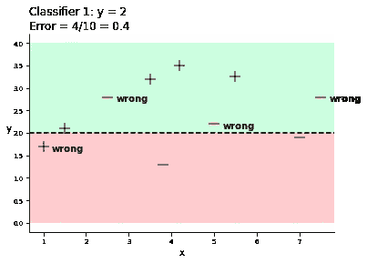
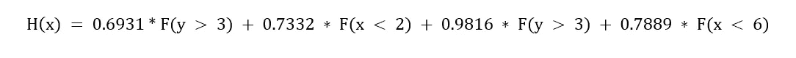

# 自适应增强:算法的逐步解释

> 原文：<https://towardsdatascience.com/adaptive-boosting-a-stepwise-explanation-of-the-algorithm-50b75c3729c1?source=collection_archive---------18----------------------->


索耶·本特森在 [Unsplash](https://unsplash.com/s/photos/jets?utm_source=unsplash&utm_medium=referral&utm_content=creditCopyText) 上的照片

自适应 Boosting(或 AdaBoost)是一种监督集成学习算法，是第一种用于实践的 Boosting 算法，由 Freund 和 Schapire 在 1995 年开发。

简而言之，自适应提升有助于通过将许多弱分类器顺序转化为一个强分类器来减少任何分类学习算法(如决策树或支持向量机)的错误。这可以通过顺序的权重调整、单个投票权和最终算法分类器的加权和来实现。

在这篇文章中，我想尽可能用最简单快捷的方式向你解释自适应增强过程。我们将根据一个简单的数据集手工计算算法的每一步。

请注意，我不会触及升压的基本理论，因为已经有大量令人惊叹的文献了。更确切地说，这篇文章的附加价值在于关注算法的数学部分。这将让你更好地理解 Boosting，从而更自由地使用它。

所以，享受这篇帖子，让你未来的机器学习模型更进一步！

# 自适应升压算法步骤

执行自适应增强时，我们必须反复执行以下每个步骤(除了步骤 1，它只在开始时执行):


自适应增压的步骤

迭代意味着自适应增强执行多轮步骤 2 至 4，并最终将所有选择的分类器组合成一个整体公式(即强分类器):


所有递归分类器的总和

> 注意:signum 函数用于获取-1 和+1 之间的最终值。

到目前为止一切顺利，让我们快速浏览一下计算所基于的模型设置！

# 模型设置

对于以下演示，我将使用后续数据:


模型数据(图片由作者提供)

**数据包含两类**(蓝色加号和红色减号)。目标是以一种优化的方式正确地划分这两个类别。这样，我们就面临一个**二元分类问题**。

但是，我们将使用以下决策树树桩


并试图找到那些能够正确划分这些数据点的弱分类器(即决策树树桩)(注意我随机选择了决策树树桩)。

让我们设想一下我们将执行自适应增强的最终模型设置:


数据和决策树树桩(图片由作者提供)

# 逐渐执行自适应增压

对于第一轮执行步骤，我将详细解释每个步骤。之后只会看每一轮的结果，看事情会怎么变化！


在**步骤 1** 中，每个数据点具有相同的权重 1/N

之所以这样做，是因为没有理由一开始就要给不同的权重。因为我们有 10 个数据点，初始权重是 1/10，因此是 0.1。


初始重量(图片由作者提供)


在**步骤 2** 中，我们绘制第一个决策树残肢并计算误差。

该误差用于两件事:首先，我们需要每个决策树树桩的误差，以便挑选具有最低误差率的树桩(步骤 3a)。其次，我们使用误差来计算新的权重(步骤 4)。

加权误差能够集中在那些难以预测的数据点上。换句话说，我们对先前分类器表现差的部分给予较高的权重。

让我们看看第一个决策树树桩 y = 2 的错误:



第一个决策树树桩(图片由作者提供)

如果你能看到，我们错误地分类了四个数据点，这导致了 0.4 (4/10)的误差。这个过程应该使用上面选择的所有分类器来完成。所以让我们开始吧！


Boosting 算法的第一轮(图片由作者提供)

我们可以看到所有的分类器和它们各自的错误。


根据**步骤 3a** ，我们必须选择误差最小的分类器。在我们的例子中，分类器 3 的错误率最低，为 0.2。


在**步骤 3b** 中，我们要计算 alpha。

Alpha 用于展示所选分类器的投票能力。误差越低，投票权越高。这是有用的，因为更准确的分类器也应该有更高的投票权。

> 注意:公式使用 log，因为如果我们有一个非常小的误差，那么 alpha 就会变得相当高。

我们将使用 Python 来计算 alpha。

```
import mathdef get_alpha(error):
    return (1/2)*math.log(((1-error)/error), math.e)print("Alpha value: " + str(get_alpha(error=0.2)))Alpha value: 0.6931471805599453
```

因此，我们的第一个分类者的投票权约为 0.69。


在**步骤 4** 中，我们需要计算新的权重。

新的权重在每一轮结束时计算，用于识别难以分类的数据点。我们再次使用 Python 来计算新的权重。

```
def new_weight_correct(error):
    return 0.1/(2*(1-error))def new_weight_incorrect(error):
    return 0.1/(2*error)print("Weights for correct classified datapoints: " + str(new_weight_correct(0.2)))
print("Weights for incorrect classified datapoints: " + str(new_weight_incorrect(0.2)))Weights for correct classified datapoints: 0.0625
Weights for incorrect classified datapoints: 0.25
```

您可能会注意到，分类不正确的数据点的权重(0.25)高于分类正确的数据点的权重(0.0625)。通过查看数据点的大小，可以在下一轮中看到更高的权重(我使数据点的大小与彼此的权重成比例)。

因此，在第一轮结束时，我们有了 Boosting 算法中的第一个分类器(分类器 3)，他各自的投票权和新的权重。

在每一轮结束时，我们可以考虑是否已经有足够的弱分类器来正确地分离所有数据点。显然，一轮是不够的，所以我们用新的重量进行第二轮！

由于每一轮的计算都是相同的，我将只从这一点来解释结果。


Boosting 算法的第二轮(图片由作者提供)

在第 2 轮之后，分类器 4 是最小化误差的那个。注意，分类器 6 也具有相同的错误率，但是我们现在将选择第一个。然而，我们将继续计算分类器 4 的α和新的权重。

```
print("Alpha value: " + str(get_alpha(error=0.1875)))
print("Weights for correct classified datapoints: " + str(new_weight_correct(error=0.1875)))
print("Weights for incorrect classified datapoints: " + str(new_weight_incorrect(error=0.1875)))Alpha value: 0.7331685343967135
Weights for correct classified datapoints: 0.06153846153846154
Weights for incorrect classified datapoints: 0.26666666666666666
```

到目前为止一切顺利，让我们继续第三轮:


Boosting 算法的第三轮(图片由作者提供)

似乎分类器 3 还是最好的。让我们添加它并计算 alpha，新的权重，从第 4 轮开始:

```
print("Alpha value: " + str(get_alpha(error=0.1231)))
print("Weights for correct classified datapoints: " + str(new_weight_correct(error=0.1231)))
print("Weights for incorrect classified datapoints: " + str(new_weight_incorrect(error=0.1231)))Alpha value: 0.9816979637974511
Weights for correct classified datapoints: 0.05701904436081651
Weights for incorrect classified datapoints: 0.4061738424045492
```


Boosting 算法的第四轮(图片由作者提供)

同样，分类器 4 和 6 是最好的。这一次，我们选择分类器 6！

```
print("Alpha value: " + str(get_alpha(error=0.1711)))
print("Weights for correct classified datapoints: " + str(new_weight_correct(error=0.1711)))
print("Weights for incorrect classified datapoints: " + str(new_weight_incorrect(error=0.1711)))Alpha value: 0.7889256698496664
Weights for correct classified datapoints: 0.06032090722644469
Weights for incorrect classified datapoints: 0.29222676797194624
```

现在等等！如果我们组合分类器，似乎我们可以对所有数据点进行分类。让我们看看最终分类:


最终分类(图片由作者提供)

在那里！我们把一切都分类对了！让我们尝试添加一个新的数据点，并让分类器投票！

x = 7
y = 3.5


添加新的数据点(图片由作者提供)

根据最终模型，我们有以下算法:



最终模型

*   **分类器 1** 以 0.6931 的投票权为 plus 投票
*   **分类器 2** 以 0.7332 的投票权投反对票
*   **分类器 3** 以 0.9816 的投票权为 plus 投票
*   **分类器 4** 以 0.7889 的投票权投负号。

如果你计算投票权的加权和，算法会将数据点归类为加号并猜测…算法完全正确！

# Python 中的自适应增强

为了向您展示如何在 Python 中实现自适应增强，我使用了来自 scikit-learn 的快速示例，其中他们基于支持向量机对数字图像进行分类。您可以在这里找到示例和相应的代码:

<https://scikit-learn.org/stable/auto_examples/classification/plot_digits_classification.html>  

但是对比这个例子，我们会用 AdaBoost 对数字进行分类。之后，我们再看表演。

> 注意，在 AdaBoost 中，默认的分类器是决策树分类器。如果你想要其他的基本估计量，你必须在模型中阐明它们。

```
# Importing the libraries
import matplotlib.pyplot as plt
from sklearn import datasets, metrics
from sklearn.model_selection import train_test_split
from sklearn.tree import DecisionTreeClassifier
from sklearn.ensemble import AdaBoostClassifierdigits = datasets.load_digits()_, axes = plt.subplots(nrows=1, ncols=4, figsize=(10, 3))
for ax, image, label in zip(axes, digits.images, digits.target):
    ax.set_axis_off()
    ax.imshow(image, cmap=plt.cm.gray_r, interpolation='nearest')
    ax.set_title('Training: %i' % label)
```


我们将尝试分类的样本数字图像

```
# flatten the images
n_samples = len(digits.images)
data = digits.images.reshape((n_samples, -1))# Split data into 50% train and 50% test subsets
X_train, X_test, y_train, y_test = train_test_split(
    data, digits.target, test_size=0.5, shuffle=False)
```

好了，我们现在准备开始使用 AdaBoost 分类器。我们将使用 accuracy_score 度量来定义分类器的性能。

```
clf = AdaBoostClassifier()
clf.fit(X_train, y_train)
y_pred = clf.predict(X_test)acc_sc = metrics.accuracy_score(y_test, y_pred)print("Accuracy Score: " + str(acc_sc))Accuracy Score: 0.7808676307007787
```

在那里！我们能够以大约 78%的准确率对数字进行分类。请注意，我们没有执行超参数优化，并且还使用 50%作为测试大小(这相当高)…因此，该模型可以进一步改进！

我希望你喜欢这篇文章，如果你喜欢…然后砸一些拍手:)编码快乐！