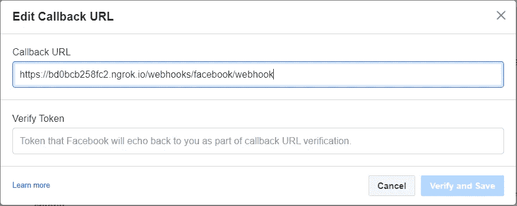

# 为您的脸书页面添加自定义的 Rasa 聊天机器人

> 原文：<https://towardsdatascience.com/add-a-customized-rasa-chatbot-for-your-facebook-page-9313687fbdcb?source=collection_archive---------34----------------------->

## 为您的脸书页面设置 Rasa 聊天机器人的简单演练

沃洛季米尔·赫里先科在 [Unsplash](https://unsplash.com?utm_source=medium&utm_medium=referral) 上的照片

在过去的十年里，聊天机器人，或者更正式地称为虚拟助手，已经成为收集和传播信息的流行选择。此外，将这些聊天机器人集成到不同的社交媒体平台和网站的能力使其成为一种可行和方便的通信选择。

此外，脸书是最受欢迎的社交媒体平台之一，它已经成为宣传个人和合作企业的重要舞台。并且将定制的聊天机器人集成到脸书页面中可以导致页面访问量的增加和来自用户的愉快的交互。这个简化的分步教程将指导您完成 Rasa 安装、设置开发环境以及与脸书页面的集成。最重要的是，**这个程序不包含任何付费工具或软件**。所以让我们进入教程。

# 设置 Rasa

## 安装 Python

首先，你必须安装 Python。您可以安装从 3.6 到 3.9 的任何版本。请注意，3.6 版本将在 2021 年底停止支持。3.9 是通常的选择，但是如果你已经安装了上面提到的 3 个版本中的一个，一切都会好的。这里 可以从 [**安装 Python for Windows。如果能通过 Windows installer 安装 Python，并且**确保在安装时勾选“将 Python *version*添加到路径”选项，那就更好了。****](https://www.python.org/downloads/windows/)

## 选择 IDE

IDE 有许多可行的选择，但我个人更喜欢 VS 代码。但是您可以使用大多数可用的流行 ide。你可以从 [**这里**](https://code.visualstudio.com/) 下载 Visual Studio 代码。

## 设置虚拟环境

首先，创建一个文件夹，您将在其中创建 Rasa 项目。现在打开命令提示符，使用**‘CD’**选项进入创建的文件夹。此外，你可以通过在文件浏览器中打开你创建的文件夹，然后在地址栏中键入**‘cmd’**并按回车键。

图 1:在目标文件路径打开命令提示符的另一种方法(图片由作者提供)

在打开相关文件夹地址的命令提示符后，您可以键入**代码。**在给定的目标地址打开 VS 代码 IDE。此快捷方式仅适用于 Windows 上的 VS 代码 IDE。对于其他 IDE 和 OS，您必须手动打开 IDE 终端并浏览到创建的文件夹。

现在，如果你正在使用 VS 代码，你必须去**终端标签>新终端**打开一个新终端。之后，你可以使用命令**Python-m venv 简单地创建一个虚拟环境。/venv'** 。

创建虚拟环境后，您可以使用命令**激活虚拟环境。\venv\Scripts\activate'** 。

## 安装 Rasa 和其他必要的组件

现在，我们将在虚拟环境中安装一些组件，包括 Rasa。首先，我们必须得到 **pip** ，它是 Python 包的包管理器。您可以使用 **'python get-pip.py'** 命令安装 pip。之后，通过使用 pip，我们可以下载并安装 Rasa。使用**‘pip 3 安装 rasa’**。安装需要几分钟时间。

## 创建 Rasa 项目

在您创建的主文件夹中创建一个子文件夹。这个新文件夹是我们创建 Rasa 项目的地方。您可以通过文件浏览器或 VS 代码本身来实现这一点。

图 2:为 Rasa 项目创建一个新文件夹(图片由作者提供)

现在使用**‘CD * folder name *’**命令进入新创建的文件夹。之后，您可以输入命令**‘rasa init’**在给定的文件夹中创建新的 rasa 项目。这也需要几分钟时间。创建项目时会有一些提示，你可以根据你的目标来回复它们。

# 与脸书融合

## 设置脸书应用程序

首先，你必须建立一个脸书应用程序。前往开发者的[脸书](https://developers.facebook.com/)，进入右上角的**“我的应用”**标签。使用脸书帐户登录，该帐户用于创建您计划集成聊天机器人的页面。点击**“创建应用”**按钮，选择**“业务”**作为应用类型。

图 3:点击**创建应用**按钮(图片由作者提供)

添加应用程序显示名称，并选择**“你自己或你自己的生意”**，然后点击**“创建应用程序”**。

现在向下滚动，在产品列表中找到 messenger，点击**“设置”**。现在在**访问令牌**部分，点击**‘添加或删除页面’**按钮，添加你想要聊天机器人进入的脸书页面。保持启用**管理和访问 Messenger 中的页面对话**属性并继续。

图 4:将脸书页面添加到应用程序后(图片由作者提供)

## 更新 Rasa 项目

现在，我们必须做一些调整，将脸书应用程序与我们新创建的 Rasa 项目链接起来。为此，请浏览 Rasa 项目中的**credit initials . yml**文件。打开文件，找到脸书的位置，取消对该代码块的注释。

图 5:**credentials . yml**文件(图片由作者提供)

现在你必须返回到脸书应用程序来获取你的 **<秘密>** 和 **<你的页面访问令牌>** ，然后将它们填入*credentials . yml*文件中。在脸书应用程序中，在我们链接脸书页面的访问令牌部分(图 5)下，单击“生成令牌”按钮。复制这个长令牌并替换*creditinitials . yml*文件中的 **<页面访问令牌>** 标签。

接下来，进入左侧菜单中的**设置>基本**，你将能够找到一个带有标签**‘App Secret’**的加密字段。这将 **<你的秘密>** 放在*credentials . yml*文件中。复制 **App Secret** ，替换 **< your secret >** 标签。

图 7:**App 秘密**(图片由作者提供)

对于 **<验证>** 字段，您可以添加一个字符串作为设置 webhook 时的验证令牌，因此您可以键入任何您想要的字符串。

最后，打开 Rasa 项目中的 **'endpoints.yml'** 文件，取消对提到 **action_endpoint** 的代码块的注释。

图 8 : **endpoints.yml** 文件(图片由作者提供)

保存在*credit initials . yml*和 *endpoints.yml* 文件中所做的更改，并重启 Rasa 服务器。你可以用 **Ctrl+C** 停止服务器，用**‘rasa run’**命令启动服务器。

## 用 ngrok 设置 Webhook

首先，你得[下载**ngrok**T3。ngrok 是一个跨平台的应用程序，它允许将本地开发服务器暴露给互联网。下载并解压缩到您计算机上的任何位置。在继续之前，您必须打开代码 IDE，并检查 Rasa 项目正在哪个本地端口上运行。你可以在**‘rasa run’**命令后的细节中找到。我的是 5005 端口。确认端口后，打开**ngrok.exe**文件，输入**‘ngrok http *端口号*’**。这将把提到的本地端口暴露给互联网。通常，会话应限制在 2 小时内，这意味着 2 小时后应重新建立连接，并且转发 URL 将被更改。您可以在](https://ngrok.com/download)[ngrok.com](https://ngrok.com/)创建一个免费帐户，并通过使用为创建的免费帐户提供的身份验证令牌来取消会话时间限制。

图 9 : ngrok 连接状态(图片由作者提供)

这里有两个转发网址。你必须复制带有**‘https’**的网址。对我来说就是**' https://BD 0 BCB 258 fc 2 . ngrok . io '**。现在进入脸书应用程序，进入左侧菜单中的**信使>设置**。在 **Webhooks** 部分下(在**访问令牌**部分的正下方)，点击**‘添加回调 URL’**按钮。对于回调 URL，你要粘贴复制的 URL，格式为:***复制的 URL */web hooks/Facebook/web hook**。以及*creditinitials . yml*文件的 **<验证>** 字段中的**验证令牌**。

图 10:添加回调 URL(作者图片)

添加以上两个字段后，您可以点击**‘验证并保存’**，如果 Rasa 服务器和 ngrok 连接都已启动并运行，它将正常工作。成功验证后，您将能够看到您的脸书页面出现在 Webhooks 部分，webhooks 字段为空。点击**编辑**按钮，添加**‘消息传递’**和**‘消息传递 _ 回发’**订阅字段。

图 11:编辑页面订阅(作者图片)

完成这些步骤后，您将能够使用创建该页面的帐户登录脸书，并与该页面的集成聊天机器人聊天。如果你也想允许其他几个人聊天，你必须将他们添加为你的脸书应用的测试者，方法是在脸书应用页面的左侧菜单中进入**角色>角色**。他们还必须注册脸书开发者账户才能接受邀请，并继续测试该页面的聊天机器人。

现在你所要做的就是通过 Rasa 项目按照你需要的方式定制聊天机器人。如果你不了解 Rasa 的发展，可以在网上找到很多正规聊天机器人的代码库。如果你这样做了，你可以根据你的愿望定制聊天机器人，最后，你可以提交你的应用程序进行审查，一旦通过，脸书的任何人都可以使用你定制的聊天机器人页面！

在这个整合过程中，我确实遇到了很多问题，这也是我觉得以一种简化的循序渐进的方式写这篇文章的主要原因。因此，您可以随时删除您在此过程中遇到的任何其他错误，希望我能够助您一臂之力。编码快乐！注意安全！