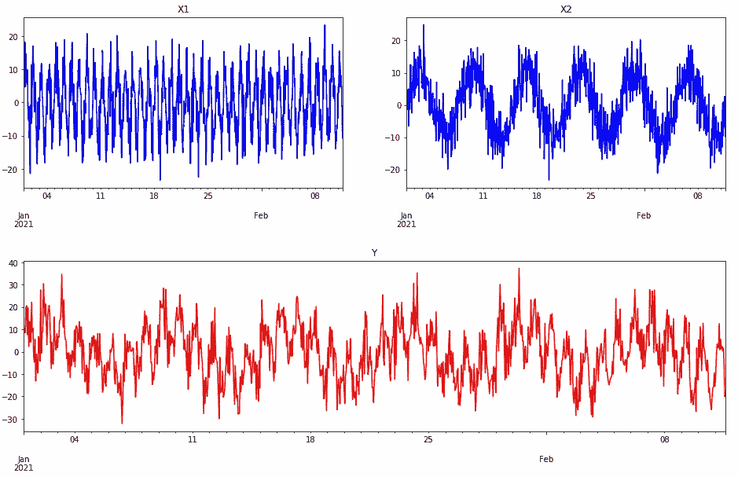
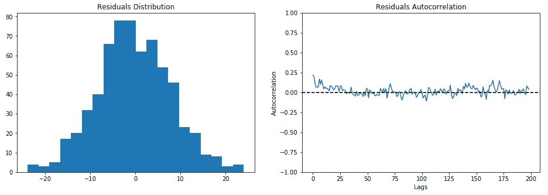
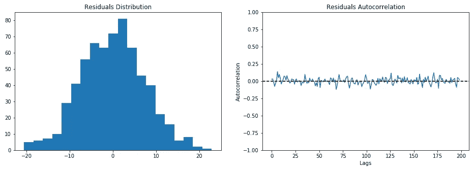
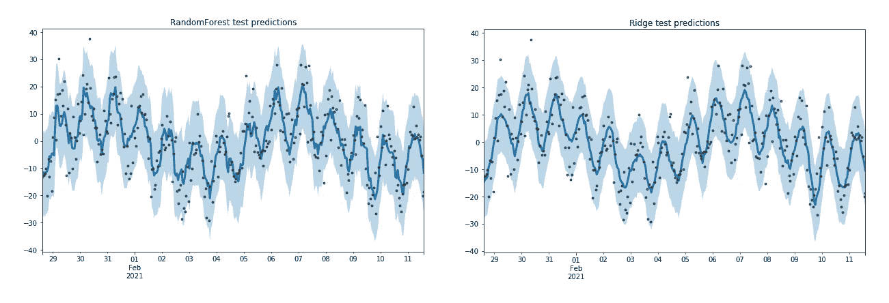
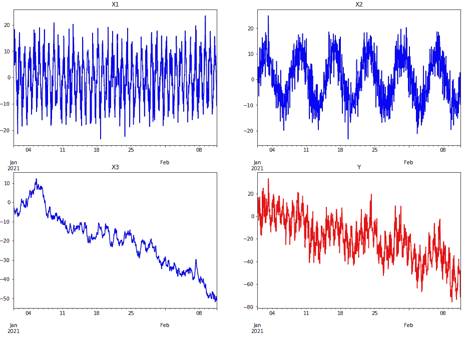
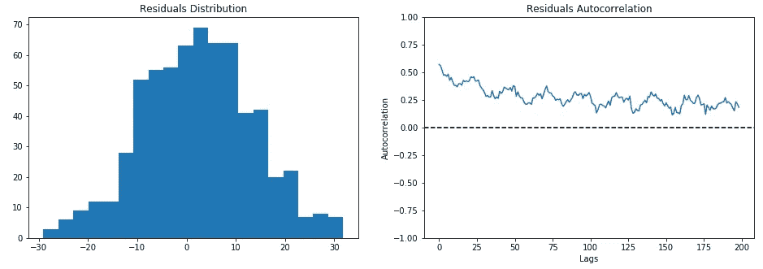
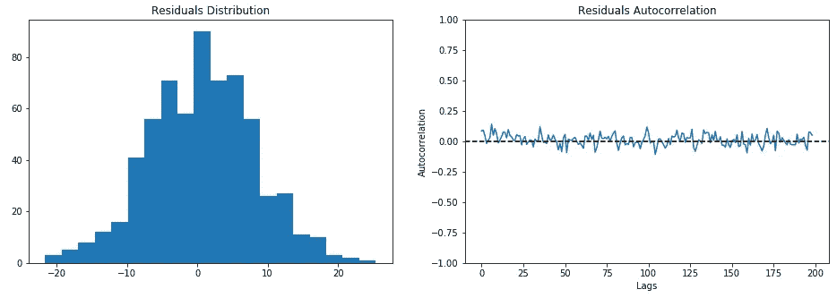
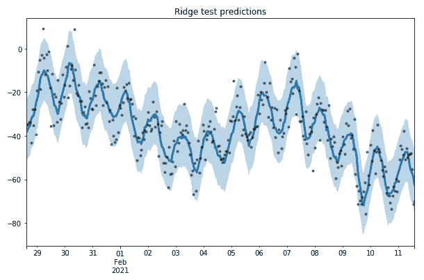

# 将预测间隔添加到预测模型中

> 原文：<https://towardsdatascience.com/add-prediction-intervals-to-your-forecasting-model-531b7c2d386c?source=collection_archive---------12----------------------->

## 在任何机器学习管道中提供预测不确定性估计

安德里克·朗菲尔德在 [Unsplash](https://unsplash.com?utm_source=medium&utm_medium=referral) 上拍摄的照片

参与预测任务的每个人都开始构建一个模型来生成点预测。在大多数预测应用中，这与提供倾向于最准确地预测未来的预测的需要有关。进行这种预测在每个业务场景中都非常有用，因为，给定一些 KPI 的预期未来值，就有可能计划一个适当的策略来最大化目标。

准确不是全部。一个适合(并经过适当验证)来产生未来均值预测的模型只是在告诉我们:“ ***未来几天*** *我们可以预期看到什么值*”。尽管如此，最新的信息可能是一条很好的信息，但它可能不足以让企业做出正确的决策。

预测区间帮助我们丰富预测报告。他们只是告诉我们:“ ***其中*** *我们可以预期看到接下来几天的值*”。它们提供了一个上限和下限，与点预测(位于中间)相关联，真实值可能会落在该点。预测区间总是与一个公差百分比相关联，该公差百分比赋予我们估计的不确定性大小。换句话说，我们期望我们的预测区间在未来 X%的时间里捕捉到真实值。

在这篇文章中，我们介绍了一种简单而有效的方法来使我们的模型产生预测区间。**主要优点是我们可以完全免费地检索每个回归模型的预测区间。**

# 方法学

我们采用的建立预测区间的方法主要基于**残差自举**。Bootstrapping 是一种重采样技术，广泛用于统计和机器学习中，以逼近未知量。顾名思义，残差自举由残差分布的替换采样组成。所涉及的残差分布是作为我们的训练/验证集上的目标和预测之间的原始差异而获得的。

例如，为了获得 95%的预测区间，我们必须从残差分布中进行替换采样，并从中提取 0.025 和 0.975 分位数。简单地将这些自举统计量添加到点预测中，我们就可以获得我们的预测区间。

如上所述，该程序非常简单，但由于这个原因，它不能被低估。有一些隐藏的陷阱，如果考虑不周，可能会使我们的工作化为乌有。

首先，残差分布必须建立在看不见的数据上。只有在这种情况下，我们才能保证近似未知行为，并为我们的预测区间提供可靠的不确定性解释。最佳实践是通过交叉验证进行拟合，并估计验证折叠上的残差分布。

其次，我们必须根据系统隐藏的动态选择一个合适的模型。错误模型的发展将影响残差自举统计，即误导性的预测区间。这个最新的方面在下面的人工例子中进行了更深入的分析，我们试图在两种不同的状态下建立预测区间。

# 平稳数据

给定一个由 3 个变量 Y、X1 和 X2 组成的固定系统；我们尝试提前一步预测 Y 以及相应的预测区间。

模拟静态数据(图片由作者提供)

我们开始进行标准特征工程，创建一些滚动特征。然后，我们通过简单的网格搜索找到了山脊和随机森林的最佳参数。使用相同的交叉验证策略来获得两个模型的最佳参数组合的折外残差。

随机森林的残差统计(图片由作者提供)

岭的残差统计(图片由作者提供)

残差分布遵循伪正态分布，残差自相关没有显示出显著的模式。这些是我们模型拟合度的指标。

如果我们想为我们的模型建立 95%的预测区间，我们只需要计算残差分布的自举分位数。根据看不见的测试数据得出的结果证实了我们的预期。近 5%的测试观测值超出了两个模型的预测范围。

对测试数据的随机森林和山脊预测(图片由作者提供)

# 非静态数据

我们在由 4 个变量 Y，X1，X2，X3 组成的非平稳系统中重复了相同的实验。X3 是一个有负趋势的随机游走。我们总是想提前一步预测未来的 Y 以及相应的预测区间。

模拟的非平稳数据(图片由作者提供)

我们重复与之前相同的预测流程，包括特征工程、网格搜索调整和残差分布计算。

随机森林的残差统计(图片由作者提供)

岭的残差统计(图片由作者提供)

残差分布遵循伪正态分布，但是自相关揭示了一些问题。在 RandomForest 的情况下，高循环自相关意味着模型没有被正确训练。

建立在自举残差分布基础上的 95%预测区间反映了 RandomForest 获得的错误性能。对于山脊，我们又有将近 5%的试验观测值落在预测带之外。对于 RandomForest 来说，由于不匹配，这个数字相当大。

测试数据上的岭预测(图片由作者提供)

我们可能会预料到这种行为。基于树的模型不适合处理数据的时间变化。一阶微分可以解决这个问题。然而，要点是预测区间并不神奇。按照我们的程序，**只有我们正确地对基础系统建模，我们才能获得良好的不确定性带。否则，糟糕的模型会导致糟糕的预测** **(对于点预测和不确定性预测)**。

# 摘要

在这篇文章中，我们介绍了一种产生预测区间的方法，作为在预测中提供不确定性估计的一种方式。该过程基于剩余自举，并且可以几乎免费地插入到任何机器学习管道中。它不依赖于模型，并且应用范围可以扩展到任何回归任务。

[**查看我的 GITHUB 回购**](https://github.com/cerlymarco/MEDIUM_NoteBook)

保持联系: [Linkedin](https://www.linkedin.com/in/marco-cerliani-b0bba714b/)