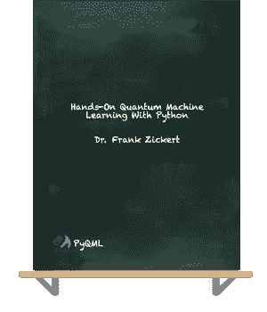

# 向量子门添加控制

> 原文：<https://towardsdatascience.com/adding-a-control-to-a-quantum-gate-7a28d8a8ec40?source=collection_archive---------24----------------------->

## 纠缠的力量

本帖是本书的一部分: [**用 Python 动手做量子机器学习**](https://www.pyqml.com/page?ref=medium_control&dest=/) **。**

在量子计算中，我们使用量子变换门来改变量子位所处的状态。

作者弗兰克·齐克特的图片

例如，X 门(非门)转换一个量子位的概率振幅。它把|0⟩变成了|1⟩，反之亦然。当我们纠缠两个量子位时，我们可以改进 X 门的行为。只有当另一个量子位(控制量子位)处于|1⟩.态时，受控 x 门(CNOT-gate)才会切换一个量子位(控制量子位)的振幅

但是我们想要在受控量子位上应用的效果并不局限于转换它的振幅。CNOT 门让我们很容易地将任何量子比特转换门，姑且称之为 U，变成一个受控门。

除了 CNOT 门，我们还需要两样东西。第一件事是将 gate U 分成两半。我们必须找到一个门——姑且称之为 v，如果应用两次，就会产生期望的整体转换门 u。我们可以说是 V⋅V⋅|υ⟩=U⋅|υ⟩.简而言之，V⋅V=U 或 V=√U。因此，v 是 u 的平方根

第二件事是创建一个门，恢复门 v 的效果。通常，这是门的变换矩阵的转置。矩阵的转置(VT)是将原始矩阵 V 翻转到其对角线上(从左上到右下)。

下图描述了我们如何控制一个任意的门 u。

作者弗兰克·齐克特的图片

首先，我们在受控量子位上应用 V 门。因此，我们完成了 U 型门的一半。然后，我们纠缠量子位。因此，受控量子位翻转了它的状态。但是只有当控制量子位处于|1⟩.态时，它才会翻转它

当我们现在应用转置矩阵 VT 时，它恢复了 v 的效果。但是只有当控制量子位是|0⟩时，因为在这种情况下，CNOT-gate 没有任何效果。

相比之下，如果控制量子位处于|1⟩状态，CNOT-gate 就会翻转控制量子位的状态。它处于完全相反的状态。当我们现在应用转置 VT 门时，我们再次应用与 V 完全相反的情况。因为 VT 是 v 的反义词，本质上，如果控制量子位处于|1⟩态，我们应用 not-v⋅v——或者不是——u

最后一个非门把非 u 态变成 u 态。但是同样，只有当控制量子位处于|1⟩.态时

也许单个控制量子位还不够？也许我们想要两个控制量子位。我们使用相同的工具。

*   CNOT 门
*   是 U 的平方根的 v 门
*   逆转电压效应的 VT 门

这一次，门 V 已经需要成为受控门。如果不是，你可以使用 CNOT 门把任何门变成受控门。正如我们刚刚看到的。

下图显示了受控门的构造。

作者弗兰克·齐克特的图片

这个受控受控门，让我们再次称之为 u，只在两个控制量子位，q0 和 q1 处于|1⟩.态时才适用

同样，我们从应用 gate V 开始。由于这是一个受控量子位，我们使用 q1 作为控制量子位，qc 作为受控量子位。如果 q1 在|1⟩，我们应用整体变换的前半部分。

因此，我们通过应用门 V 来结束电路，其中 q0 作为控制量子位，qc 作为受控量子位。如果 q0 也在|1⟩，我们应用整体变换的后半部分。

在两者之间，我们有一个三个门的序列:CNOT，佛蒙特州和 CNOT。如果量子位 q0 和 q1 都处于|1⟩状态或|0⟩.状态，第一个 CNOT-gate 将当时受控的量子位 q1 置于|0⟩状态如果一个量子位处于|0⟩状态，而另一个量子位处于|1⟩状态，它将受控量子位 q1 置于|1⟩.状态

下图显示了应用 CNOT 门的真值表，q1 是受控量子位。

作者弗兰克·齐克特的图片

因此，只有当一个量子位在|0⟩态，而另一个在|1⟩.态时，我们才应用下面的门 VT 在这些情况下，我们应用两个 V 门中的一个，要么在起点，要么在终点。因此，总体上对受控量子位 qc 没有影响。我们对它应用了 V 和 VT 来恢复它。

如果量子位 q0 和 q1 都处于|0⟩态，我们什么也不做，让受控量子位也保持原样。只有当两个量子位 q0 和 q1 都处于|1⟩状态时，我们才应用两个 v 门，而不应用 VT 门。

VT 门之后的 CNOT 门恢复了第一个 CNOT 门的效果，因此我们也不改变量子位 q1。

如果 V 不是一个受控门，我们可以把第一个电路插入第二个电路，使之成为一个受控门。下图描绘了最终的电路。

作者弗兰克·齐克特的图片

在这种情况下，我们也需要将 V-gate 分成两半。因此，W 是 v 的平方根。

# 结论

总之，通过将整体效应分成两半(v)，我们可以实现一个门(u ),它依赖于处于|1⟩.状态的另外两个量子位如果没有一个控制量子位是|1⟩，什么都不会发生。如果只有一个控制量子位处于|1⟩状态，我们错过了一个 v 的应用，我们应用 VT 门来抵消我们应用的一个 v 门的影响。如果两个控制量子位都处于|1⟩状态，我们应用两个垂直门，但错过了 VT 门。这就是受控的 U 型门。

本帖是本书的一部分: [**用 Python 动手做量子机器学习**](https://www.pyqml.com/page?ref=medium_control&dest=/) **。**

在这里免费获得前三章。