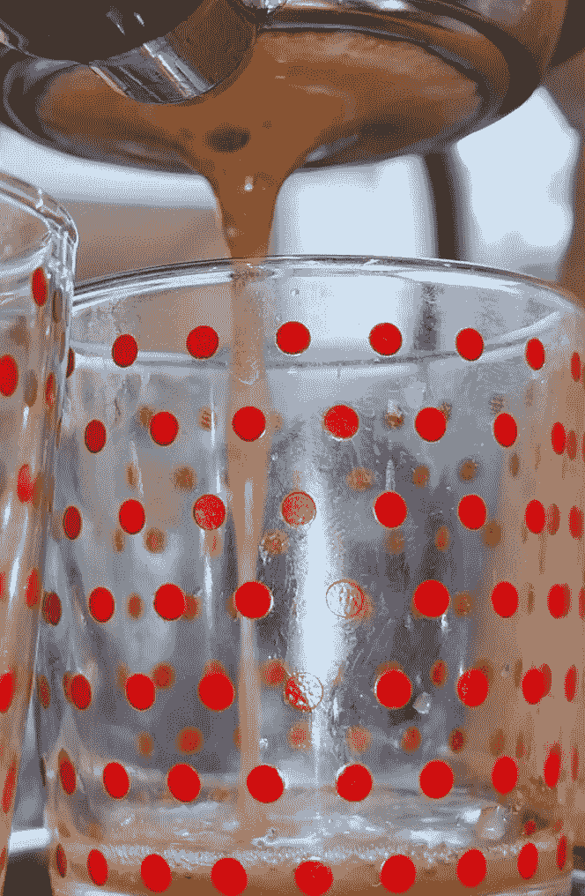

# 向浓缩咖啡中加入小苏打

> 原文：<https://towardsdatascience.com/adding-baking-soda-to-espresso-a92eaa58c681?source=collection_archive---------4----------------------->

## 咖啡数据科学

## 一项利用废弃咖啡渣下潜更深的实验

在我对[用过的咖啡渣](/producing-good-spent-coffee-grounds-for-experiments-637dcd9f4c53)进行实验后，我观察到水流过用过的咖啡渣非常快，因此只有未提取的固体和 CO2 会影响流速。为了更好地理解二氧化碳是如何影响流速的，我决定在废咖啡中加入小苏打。

首先，我观察了两种粒径的废咖啡:

1.  超细(< 200 微米)
2.  精细(200 微米

然后我混合了少量的苏打粉，比如 0.2 到 0.6 克。我没有特别设计结果会释放出多少二氧化碳，但通常情况下，少量的苏打粉就能产生很大的反应。

所有图片由作者提供:左:小苏打，右:小苏打与废咖啡混合

由于气体的释放，泡沫明显增加。这里有一些来自超细粉碎的 0.6 克的图片。

事后再看冰球，地面仍有东西要提取，甚至还有一些通道。

这里的景色是从冰球底部看的。

# 数据分析

加入小苏打肯定会增加覆盖过滤器的时间(TCF)，时间第一(前半杯)，时间第二(后半杯)。

对于提取率(EY)，加入小苏打后，EY 也有所增加。这些粉末都没有被再利用，所以应该有一个很好的解释，因为 EY 的含量比废咖啡的预期要高得多。

我怀疑是小苏打里的钠。如果我们假设小苏打完全溶解，所有溶解的钠都进入了杯子，那么我们可以看到溶解的固体是如何与钠的估计值一致的。

基于这些估计，看起来大多数测得的 EY 可能是由于钠，但我没有办法测量溶解在杯中的钠的量。

我喜欢这个简短的实验，它展示了二氧化碳对拍摄的影响。我怀疑有人可以用用过的咖啡渣和小苏打来制作假浓缩咖啡。我不确定这能告诉我们 CO2 和可提取固体是如何改变拍摄进程的。

如果你愿意，可以在 Twitter 和 YouTube 上关注我，我会在那里发布不同机器上的浓缩咖啡视频和浓缩咖啡相关的东西。你也可以在 [LinkedIn](https://www.linkedin.com/in/robert-mckeon-aloe-01581595?source=post_page---------------------------) 上找到我。也可以在[中](https://towardsdatascience.com/@rmckeon/follow)和 [Patreon](https://www.patreon.com/EspressoFun) 上关注我。

# [我的进一步阅读](https://rmckeon.medium.com/story-collection-splash-page-e15025710347):

[浓缩咖啡系列文章](https://rmckeon.medium.com/a-collection-of-espresso-articles-de8a3abf9917?postPublishedType=repub)

[工作和学校故事集](https://rmckeon.medium.com/a-collection-of-work-and-school-stories-6b7ca5a58318?source=your_stories_page-------------------------------------)

[个人故事和关注点](https://rmckeon.medium.com/personal-stories-and-concerns-51bd8b3e63e6?source=your_stories_page-------------------------------------)

[乐高故事启动页面](https://rmckeon.medium.com/lego-story-splash-page-b91ba4f56bc7?source=your_stories_page-------------------------------------)

[摄影飞溅页](https://rmckeon.medium.com/photography-splash-page-fe93297abc06?source=your_stories_page-------------------------------------)

[使用图像处理测量咖啡研磨颗粒分布](https://link.medium.com/9Az9gAfWXdb)

[改善浓缩咖啡](https://rmckeon.medium.com/improving-espresso-splash-page-576c70e64d0d?source=your_stories_page-------------------------------------)

[断奏生活方式概述](https://rmckeon.medium.com/a-summary-of-the-staccato-lifestyle-dd1dc6d4b861?source=your_stories_page-------------------------------------)

[测量咖啡磨粒分布](https://rmckeon.medium.com/measuring-coffee-grind-distribution-d37a39ffc215?source=your_stories_page-------------------------------------)

[咖啡萃取](https://rmckeon.medium.com/coffee-extraction-splash-page-3e568df003ac?source=your_stories_page-------------------------------------)

[咖啡烘焙](https://rmckeon.medium.com/coffee-roasting-splash-page-780b0c3242ea?source=your_stories_page-------------------------------------)

[咖啡豆](https://rmckeon.medium.com/coffee-beans-splash-page-e52e1993274f?source=your_stories_page-------------------------------------)

[浓缩咖啡用纸质过滤器](https://rmckeon.medium.com/paper-filters-for-espresso-splash-page-f55fc553e98?source=your_stories_page-------------------------------------)

[浓缩咖啡篮及相关主题](https://rmckeon.medium.com/espresso-baskets-and-related-topics-splash-page-ff10f690a738?source=your_stories_page-------------------------------------)

[意式咖啡观点](https://rmckeon.medium.com/espresso-opinions-splash-page-5a89856d74da?source=your_stories_page-------------------------------------)

[透明 Portafilter 实验](https://rmckeon.medium.com/transparent-portafilter-experiments-splash-page-8fd3ae3a286d?source=your_stories_page-------------------------------------)

[杠杆机维护](https://rmckeon.medium.com/lever-machine-maintenance-splash-page-72c1e3102ff?source=your_stories_page-------------------------------------)

[咖啡评论与思考](https://rmckeon.medium.com/coffee-reviews-and-thoughts-splash-page-ca6840eb04f7?source=your_stories_page-------------------------------------)

[咖啡实验](https://rmckeon.medium.com/coffee-experiments-splash-page-671a77ba4d42?source=your_stories_page-------------------------------------)