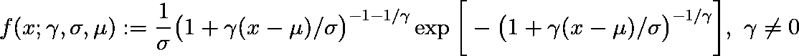
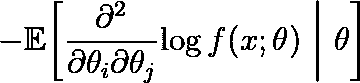

# 使用 sympy 将置信区间添加到最大似然估计

> 原文：<https://towardsdatascience.com/adding-confidence-intervals-to-maximum-likelihood-estimates-using-sympy-efe0552653f7?source=collection_archive---------24----------------------->


由[阿玛多·洛雷罗](https://unsplash.com/@amadorloureiroblanco?utm_source=unsplash&utm_medium=referral&utm_content=creditCopyText)在 [Unsplash](https://unsplash.com/) 上创作的符号

## [思想和理论](https://towardsdatascience.com/tagged/thoughts-and-theory)

## 不漂亮，但很有趣

当在 Python 中为极值理论开发名为`evt`的[包](https://github.com/spmvg/evt)时，有必要为最大似然估计值添加置信区间。基于设计考虑，被认为是最佳的实现并不是最漂亮的。然而，它将为感兴趣的人提供一个有趣的读物。这篇文章涉及了统计学中一些有趣的部分，并以展示符号代数在实际代码中的威力的例子作为结束。首先，快速介绍一下发行版。

## 广义极值分布

广义极值分布(GEV)是在统计极值研究中出现的一种分布。极值理论不会是这篇文章的主题。精彩介绍，见[本书](https://link.springer.com/book/10.1007/0-387-34471-3)。GEV 的概率密度函数 *f* 将在后面提及。它被定义为



在哪里

*   *x* 是随机变量，
*   *γ* 为极值指数，
*   *μ* 是位置参数，并且
*   *σ* 是刻度参数。

GEV 也定义为 *γ* 零，但这超出了范围。我们将很快回到 GEV，但是首先:让我们提供一些背景。像在最大似然估计中一样，我们将假设一个模型，并尝试用一个数据集来拟合它。幸运的是，`scipy`有我们[掩护](https://docs.scipy.org/doc/scipy/reference/tutorial/stats/continuous_genextreme.html)。接下来一个琐碎的步骤是问:这个估计有多确定？这就是置信区间的由来。不幸的是，置信区间通常带有星号。

## 解释置信区间

理想情况下， *α* %置信区间表示:平均而言，在 *α* %的情况下，实际值在此范围内。然而，事实往往并非如此。在解释置信区间时，记住以下几点很重要。

*   **置信区间不考虑模型误差。**例如，如果假设正态分布计算误差线，但数据不是正态分布，误差线通常会关闭。
*   **置信区间是随机变量。这不需要解释，但也不应该忘记。**
*   置信区间通常不考虑偏差。置信区间通常表示估计值的方差，而不是偏差。在解释它们的时候要考虑到这一点。给定一个估计量和一个数据集，估计偏差通常成为一个先有鸡还是先有蛋的问题。使用多重估值器总是一个好的选择，尽管不是一种补救措施。

## 估计最大似然的置信区间

在最大似然估计中，估计置信区间有多种选择。例如:

*   计算[观测费希尔信息](https://en.wikipedia.org/wiki/Observed_information)的估计值。在这种情况下，我们需要区分所有参数组合的 PDF。
*   将[威尔克斯定理](https://en.wikipedia.org/wiki/Wilks%27_theorem)应用于对数似然比统计。在 GEV 的情况下，这需要数值求根，特别是:最近的根。祝你好运找到那个数字并保持你的代码的通用性。
*   如果你幸运的话，一个概率学家已经得到了估计值的渐近行为。据我所知，GEV 的情况并非如此。
*   对数据集进行重新采样，并多次估计参数。这是计算密集型的。

因为`evt`包的代码应该尽可能通用，所以我选择使用观察到的 Fisher 信息。因此，我需要区分关于所有参数组合的 GEV 的 PDF。手动这是一个相当大的野兽。唯一现实的选择是:符号代数。这就是`sympy`发挥作用的地方。

## 计算观察到的费希尔信息

简单来说，Fisher 信息表示样本数据提供了多少关于分布 *f* ( *x* 的未知参数 *θ* 的信息； *θ* ，其中 *x* 为随机变量。在 GEV 的情况下，需要估计 3 个参数: *γ* 、 *μ* 和 *σ* 。基于观察到的费希尔信息的[定义](https://en.wikipedia.org/wiki/Observed_information)，我们将需要估计以下形式的矩阵元素:



其中 *i* 和 *j* 是矩阵索引，其列举了参数向量 *θ* 的维数，即 3。现在，有趣的部分开始了。

## 设计考虑

知道微分将使用符号代数来执行，我们有几个选项来将结果集成到`evt`包中:

*   使用一个临时脚本做一次，然后将其复制粘贴到源代码中。这是容易出错的，在写这个的时候会很疼。
*   在运行时评估符号差异。这是浪费。
*   对符号微分求值一次，[修改](https://docs.sympy.org/latest/modules/utilities/lambdify.html)该函数，并为以后序列化该函数。例如，这必须依赖于`pickle`(在此插入版本问题)。另外，`evt`包依赖于`sympy`，而`sympy`的实际使用是一次性的。尽可能限制依赖性是最佳实践。
*   对差异进行一次评估，并将结果作为 Python 代码存储在存储库中(ouch)。尽管它并不漂亮，但与其他选择相比，它看起来是最好的方法。

这就是我如何开始写一段我并不引以为豪的代码，但是写起来很有趣。让我们一步一步地实现。

## 履行

第一部分是生成模块的[脚本](https://github.com/spmvg/evt/blob/master/sympy/create_compiled_expressions.py)，该模块计算观察到的 Fisher 信息。生成的模块以一个 fat 免责声明开始:

```
...
    'This file is not intended to be human-readable. It is generated by ``sympy/create_compiled_expressions.py``:',
    'see the generation file for further details.',
...
```

符号微分由`sympy`处理:

```
from sympy import symbols, exp, log, diff

x, g, a, s = symbols('x g a s')
variables = [g, a, s]

...

for row_variable in variables:
    row = []
    for column_variable in variables:
        row.append(str(
            -diff(
                diff(
                    log_f,
                    column_variable
                ),
                row_variable
            )
        )
...
```

通过将函数转换为`str`并使用其等价的`numpy`替换数学函数的表示来存储函数。期望值是通过取平均值得到的近似值。最后，生成的代码被存储为[私有模块](https://github.com/spmvg/evt/blob/master/src/evt/_compiled_expressions/compiled_expressions.py)，以防止用户认为我是个疯子。

就是这样！好看吗？不。有用吗？是的。它能表演吗？很好。是时候关注更重要的问题了，让我们忘记我曾经写过这个。但首先，让我们发表一篇关于它的博文。

*通信:steven@vangemert.dev*