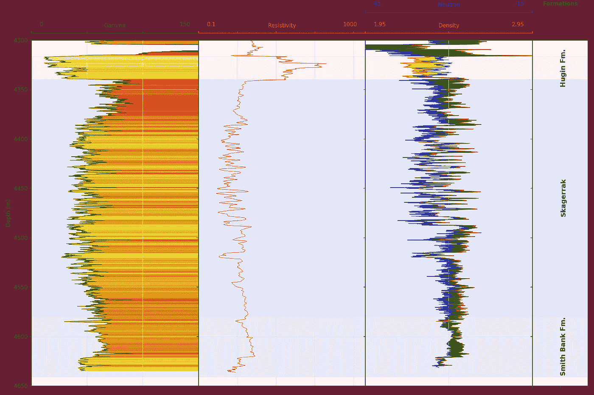
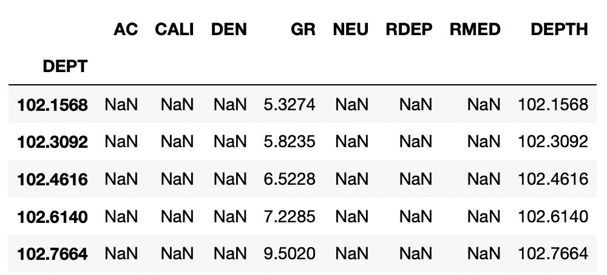
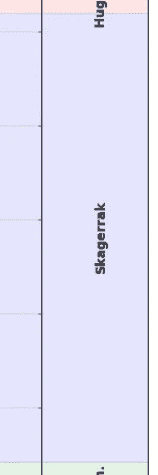

# 将地层数据添加到测井曲线中

> 原文：<https://towardsdatascience.com/adding-formation-data-to-a-well-log-plot-3897b96a3967?source=collection_archive---------15----------------------->

## 使用 Python 和 matplotlib 进一步绘制测井曲线



使用 Python 的 matplotlib 库生成的最终测井曲线，包含伽马射线上的可变填充和中子密度交叉填充。图片作者。

测井曲线是地球科学和岩石物理学中常用的可视化工具。它们使得沿井眼长度(深度)采集的数据(例如，伽马射线、中子孔隙度、体积密度等)易于可视化。

我之前已经在以下文章中介绍了制作这些情节的不同方面:

*   使用 Python 在测井图上显示岩性数据
*   [用 Python 显示随钻测井(LWD)图像日志](/displaying-logging-while-drilling-lwd-image-logs-in-python-4babb6e577ba)
*   [用图形填充增强测井曲线的可视化](/enhancing-visualization-of-well-logs-with-plot-fills-72d9dcd10c1b)
*   [加载并显示测井数据](https://andymcdonaldgeo.medium.com/loading-and-displaying-well-log-data-b9568efd1d8)

在本文中，我将展示如何将这些不同的方法组合成一个单一的绘图函数，该函数允许您轻松地重用具有相似数据的代码。

对于下面的例子，你可以在我的 GitHub 知识库中找到我的 Jupyter 笔记本和数据集，链接如下。

[](https://github.com/andymcdgeo/Petrophysics-Python-Series) [## andymcdgeo/岩石物理学-Python-系列

### 本系列 Jupyter 笔记本将带您了解使用 Python 和岩石物理数据的各个方面。一个…

github.com](https://github.com/andymcdgeo/Petrophysics-Python-Series) 

这篇文章是我的 Python &岩石物理学系列的一部分。详情可在[这里](http://andymcdonald.scot/python-and-petrophysics)找到。

我们正在使用的数据集来自于 2018 年发布的公开发布的 [Equinor Volve 场数据集](https://www.equinor.com/en/what-we-do/norwegian-continental-shelf-platforms/volve.html)。本教程中使用的文件来自 15/9- 19SR 井，其中包含一组很好的测井数据。

# 创建可重复使用的测井曲线并显示地层数据

## 设置库

对于本文和笔记本，我们将使用许多不同的库。

我们将使用五个库: [pandas](https://pandas.pydata.org/) ， [matplotlib](https://matplotlib.org/) ， [csv](https://docs.python.org/3/library/csv.html) ，[collections](https://docs.python.org/3/library/collections.html)，以及 [lasio](https://lasio.readthedocs.io/) 。Pandas 和 lasio，将用于加载和存储日志数据，集合允许我们使用 defaultdict 将我们的地层顶部加载到字典中。最后，matplotlib 将让我们绘制出测井数据。

## 加载 LAS 数据

我们将加载的第一组数据是来自 Volve 数据集的 LAS 文件。为此，我们调用`las.read()`函数并传入文件。一旦文件被读取，我们可以使用`.df()`将其快速转换成熊猫数据帧。这将使我们工作起来更容易。

要了解如何加载多个 las 文件，请点击这里查看我以前的文章。

当 lasio 将 las 文件转换为数据帧时，它会将深度曲线指定为数据帧索引。这可以转换成如下所示的列。当我们处理多个 las 文件时，这一点尤其重要，我们不希望导致具有相似深度值的冲突。

然后，我们可以打印数据帧的标题，以验证我们的数据已经正确加载。



## 装载地层顶部

对于本文，三个地层顶部存储在一个简单的 csv 文件中。对于每个地层，存储顶部和底部深度。要加载这个文件，我们可以使用下面的代码片段。

*   第 1 行创建了一个空字典，将保存我们的结构
*   第 4 行以读取模式(' r ')打开 csv 文件
*   第 5 行允许我们跳过标题行，跳到下一行。这可以防止标题行被添加到字典中
*   第 6 行允许我们遍历 csv 文件中的每一行。我们还可以为每一列指定字段名，如果没有指定，那么第一行中的值将被用作字段名
*   第 7 行让我们将地层名称指定为关键字，在=的右边，我们可以创建顶部和底部深度的列表。我们需要把这些转换成浮点数

当我们调用`formations_dict`时，我们可以预览我们的字典包含的内容。

```
{'Hugin Fm.': [4316.5, 4340.0],
 'Skagerrak': [4340.0, 4579.0],
 'Smith Bank Fm.': [4579.0, 4641.0]}
```

为了将顶部绘制在测井图上的正确位置，我们需要计算地层顶部和底部深度之间的中点。由于深度值是列表形式的，因此可以使用索引号来调用它们，0 表示顶部深度，1 表示底部深度。

当我们调用`formation_midpoints`列表时，我们得到以下值:

```
[4328.25, 4459.5, 4610.0]
```

最后，我们可以给我们的队形分配一些颜色。在这种情况下，我选择了红色、蓝色和绿色。

## 设置对数图

在我以前的文章中，我动态地创建了这些图，代码只适用于特定的数据集。由于曲线记忆和测井曲线设置的多样性，概括测井曲线或岩石物理曲线可能很困难。在这个例子中，我将绘图部分放在了一个函数中。

使用函数是提高代码可重用性和减少可能出现的重复的一个很好的方法。

在下面的代码片段中，我解释了组成测井绘图函数的一些关键部分。

**第 3–10 行**设置日志轨道。在这里，我使用 subplot2grid 来控制轨道的数量。`suplot2grid((1,10), (0,0), rowspan=1, colspan=3)`转换为创建一个 10 列宽、1 行高的绘图，前几个轴每个跨越 3 列。这使我们能够控制每个轨道的宽度。

最后一个轨迹(ax5)将用于绘制我们的地层顶部信息。

```
fig, ax = plt.subplots(figsize=(15,10))#Set up the plot axes
    ax1 = plt.subplot2grid((1,10), (0,0), rowspan=1, colspan = 3)
    ax2 = plt.subplot2grid((1,10), (0,3), rowspan=1, colspan = 3, sharey = ax1)
    ax3 = plt.subplot2grid((1,10), (0,6), rowspan=1, colspan = 3, sharey = ax1)
    ax4 = ax3.twiny() 
    ax5 = plt.subplot2grid((1,10), (0,9), rowspan=1, colspan = 1, sharey = ax1)
```

**第 14–19 行**在现有轴的基础上添加第二组轴。这样，当我们拆下秤时，可以在每个轨道周围保持一个边界。

```
 ax10 = ax1.twiny()
    ax10.xaxis.set_visible(False)
    ax11 = ax2.twiny()
    ax11.xaxis.set_visible(False)
    ax12 = ax3.twiny()
    ax12.xaxis.set_visible(False)
```

**第 21–49 行**设置伽马射线轨道。首先，我们使用`ax1.plot`来设置数据、线宽和颜色。接下来，我们用标签、轴颜色和一组限制设置 x 轴。

由于`ax1`将是图上的第一个轨迹，我们可以指定深度(m)的 y 轴标签。

定义曲线设置后，我们可以在曲线和轨道右侧之间添加一些彩色填充。关于如何设置的详细信息，请参见[用图填充增强测井曲线的可视化。](/enhancing-visualization-of-well-logs-with-plot-fills-72d9dcd10c1b)

```
# Gamma Ray track

    ## Setting up the track and curve
    ax1.plot(gamma, depth, color = "green", linewidth = 0.5)
    ax1.set_xlabel("Gamma")
    ax1.xaxis.label.set_color("green")
    ax1.set_xlim(0, 150)
    ax1.set_ylabel("Depth (m)")
    ax1.tick_params(axis='x', colors="green")
    ax1.spines["top"].set_edgecolor("green")
    ax1.title.set_color('green')
    ax1.set_xticks([0, 50, 100, 150])
    ax1.text(0.05, 1.04, 0, color='green', 
             horizontalalignment='left', transform=ax1.transAxes)
    ax1.text(0.95, 1.04, 150, color='green', 
             horizontalalignment='right', transform=ax1.transAxes)
    ax1.set_xticklabels([])

    ## Setting Up Shading for GR
    left_col_value = 0
    right_col_value = 150
    span = abs(left_col_value - right_col_value)
    cmap = plt.get_cmap('hot_r')
    color_index = np.arange(left_col_value, right_col_value, span / 100)
    #loop through each value in the color_index
    for index in sorted(color_index):
        index_value = (index - left_col_value)/span
        color = cmap(index_value) #obtain colour for color index value
        ax1.fill_betweenx(depth, gamma , right_col_value, where = gamma >= index,  color = color)
```

在我以前关于对数图的文章中，每个轨迹之间都有间隙。上图中可以看到一个例子。当这个差距减小时，每个轨道的标度信息变得混乱。一个更好的解决方案是使用`ax1.set_xticklabels([])`关闭轴标签，并使用如下所示的文本标签。

```
ax1.text(0.05, 1.04, 0, color='green', 
             horizontalalignment='left', transform=ax1.transAxes)
ax1.text(0.95, 1.04, 150, color='green', 
             horizontalalignment='right', transform=ax1.transAxes)
```

ax.text 函数可以接受许多参数，但最基本的是`ax.text(xposition, yposition, textstring)`。在我们的示例中，我们还传入了水平对齐和转换参数。

然后我们对每个轴重复这一过程，直到 ax5，在这里我们需要做的就是添加一个轨道头并隐藏 x 记号。

请注意，ax4 与 ax3 成对出现，位于 ax3 之上。这使得绘制中子孔隙度数据变得容易。

**第 103–113 行**包含设置中子孔隙度和密度测井之间填充的代码。关于这种方法的详细信息，请参见[用绘图填充增强测井曲线的可视化。](/enhancing-visualization-of-well-logs-with-plot-fills-72d9dcd10c1b)

```
ax5.set_xticklabels([])
ax5.text(0.5, 1.1, 'Formations', fontweight='bold',
             horizontalalignment='center', transform=ax5.transAxes)
```

在**第 118–123 行**中，我们可以节省一些代码行，方法是将我们想要应用于每个轨道的常用函数捆绑到一个 for 循环中，并允许我们一次性设置轴的参数。

在这个循环中，我们是:

*   将 y 轴限制设置为我们提供给函数的底部和顶部深度
*   设置网格线样式
*   设置 x 轴标签和刻度线的位置
*   偏移轨道的顶部(脊椎),使其漂浮在轨道上方

```
for ax in [ax1, ax2, ax3]:
        ax.set_ylim(bottomdepth, topdepth)
        ax.grid(which='major', color='lightgrey', linestyle='-')
        ax.xaxis.set_ticks_position("top")
        ax.xaxis.set_label_position("top")
        ax.spines["top"].set_position(("axes", 1.02))
```

**第 125–129 行**包含应用于 ax1、ax2、ax3 和 ax5 的下一个 for 循环，让我们在所有轨道上添加地层阴影。我们可以在我们的`formations_dict`和`zone_colours`列表中循环通过我们的地层深度值的压缩对象。我们将使用这些值通过`ax.axhspan`创建一个水平跨度对象。基本上，它在两个 Y 值(深度)之间的轴上添加了一个矩形。

```
for ax in [ax1, ax2, ax3, ax5]:
    # loop through the formations dictionary and zone colours
    for depth, colour in zip(formations.values(), colours):
         # use the depths and colours to shade across subplots
         ax.axhspan(depth[0], depth[1], color=colour, alpha=0.1)
```

**第 132–133 行**隐藏每个轨迹(支线剧情)上的 yticklabels(深度标签)。

```
for ax in [ax2, ax3, ax4, ax5]:
        plt.setp(ax.get_yticklabels(), visible = False)
```

**第 135–139 行**是我们将地层标签直接添加到 ax5 上的循环的最终和关键部分。这里我们使用`ax.text`函数，并传入一个 x 位置(0.5 =轨迹中间)和一个 y 位置，这是我们计算的地层中点深度。然后，我们希望从中心垂直对齐文本，以便文本字符串的中心位于结构的中间。

```
for label, formation_mid in zip(formations_dict.keys(), 
                                    formation_midpoints):
        ax5.text(0.5, formation_mid, label, rotation=90,
                verticalalignment='center', fontweight='bold',
                fontsize='large')
```



在 ax5 上的地层中间绘制地层名称。

***注意，如果该层较薄，那么文本将与该层的边界重叠，并进入下一层。***

## 用我们的数据创建图表

既然我们的函数已经按照需要的方式设置好了，现在我们可以从井数据帧中传递列了。当我们使用其他孔制作设置相同的图时，该功能的威力就显现出来了。

当我们运行这个函数调用时，我们生成了下面的图


使用 Python 的 matplotlib 库生成的最终测井曲线，包含伽马射线上的可变填充和中子密度交叉填充。图片作者。

# 摘要

在本文中，我们介绍了如何从 csv 文件加载 las 文件和地层数据。然后将这些数据绘制在我们的对数图上。此外，我们已经了解了如何将我们的测井曲线代码转换成一个函数，该函数允许我们在其他油井中重复使用该代码。这使得未来的绘图更加简单和快速。

***感谢阅读！***

*如果你觉得这篇文章有用，请随时查看我的其他文章，这些文章从不同的角度研究了 Python 和测井数据。你也可以在*[***GitHub***](https://github.com/andymcdgeo)***找到我在这篇文章和其他文章中使用的代码。***

*如果你想联系我，你可以在*[***LinkedIn***](https://www.linkedin.com/in/andymcdonaldgeo/)**或者在我的* [***网站***](http://andymcdonald.scot/) *找到我。**

**有兴趣了解更多关于 python 和测井数据或岩石物理学的知识吗？跟我上* [***中***](https://andymcdonaldgeo.medium.com/) *。**