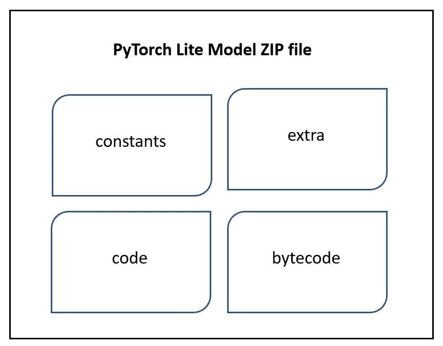

# 向 PyTorch Lite 模型添加元数据

> 原文：<https://towardsdatascience.com/adding-metadata-to-pytorch-lite-models-4d6fa45a6354?source=collection_archive---------26----------------------->

## PyTorch 允许您将附加元数据与 lite 解释器模型文件相关联。本文探讨了如何使用 Python 和 C++ API 添加/检索模型元数据。

## PyTorch (Lite)模型的结构

PyTorch Lite 模型基本上是包含大部分未压缩文件的 ZIP 存档。另外，PyTorch Lite 模型也是普通的 [TorchScript](https://pytorch.org/docs/stable/jit.html) 序列化模型。也就是说，用户可以使用 [torch.jit.load](https://pytorch.org/docs/stable/generated/torch.jit.load.html) 加载 PyTorch Lite 模式作为普通 TorchScript 模式。

下图显示了 PyTorch Lite 模型文件的外观，以及它存储了哪些高级组件。

PyTorch Lite 模型的格式(ZIP 文件)

以下是每个组件的含义:

1.  常数:对应 TorchScript 模型的序列化张量。其中一些与 Lite 模型零件共享。
2.  代码:火炬文字代码。
3.  **extra** :与模型关联的 extra(附加)元数据文件。
4.  字节码:只对应于 lite 模型的序列化张量+为移动 Lite 解释器序列化字节码。

## 在模型生成过程中向 Lite 模型添加元数据

一旦你有了 PyTorch 模型(Python 类)，你可以把它保存为 [PyTorch Lite 格式](/deep-learning-on-your-phone-pytorch-lite-interpreter-for-mobile-platforms-ae73d0b17eaa)。PyTorch Lite 格式的模型可以加载到移动设备上进行推理。

因为 PyTorch Lite 模型基本上是一个 zip 文件，所以可以使用 [*zipfile*](https://docs.python.org/3/library/zipfile.html) Python 模块来检查序列化模型文件的内容。

## 查看与 Lite 模型相关联的元数据

还可以使用[*zipfile . read()*](https://docs.python.org/3/library/zipfile.html#zipfile.ZipFile.read)方法查看 PyTorch Lite 模块中某个文件的内容。

## 在模型生成后向模型添加额外的元数据

因为 PyTorch Lite 模型基本上是一个 zip 文件，所以在保存模型之后，很容易向模型添加额外的元数据文件。您所需要做的就是知道顶层文件夹的名称，然后使用 Python 的 *zipfile* 模块将文件添加到 zip 存档中。

获取档案名称。

将新文件添加到 zip 存档中。

列出模型的内容，并打印新添加文件的内容。

## 使用 C++ API 从 Lite 模型中获取元数据

PyTorch C++ API 还提供了一种获取与模型一起保存的定制元数据的方法。

关于如何在移动平台上使用 PyTorch C++ API 的更详细的帖子，请参见[这篇帖子](https://www.kdnuggets.com/2021/11/deep-learning-mobile-phone-pytorch-c-api.html)。

## 结论

我们看到了如何用 Python 和 C++从 PyTorch Lite 模型中添加/获取元数据。同样的策略也适用于 PyTorch TorchScript 模型。其他 AI 框架如 [TFLite 也支持模型元数据](https://www.tensorflow.org/lite/convert/metadata)。