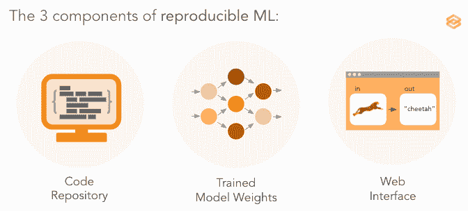
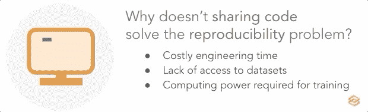
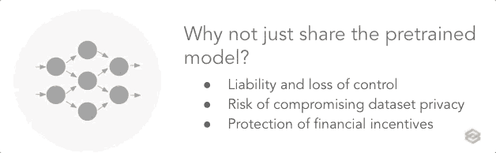
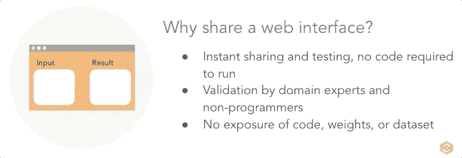
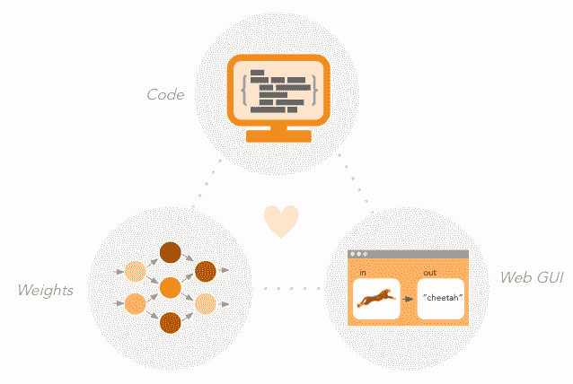

# 如何用三个简单的步骤解决 ML 的再现性危机

> 原文：<https://towardsdatascience.com/addressing-mls-reproducibility-crisis-7d59e9ed050?source=collection_archive---------55----------------------->

## **为什么代码、训练权重、&Web GUI 是可再现 ML 的三个必要组成部分。**

你可能知道机器学习(ML)有一个*再现性问题*。每周都有数百份预印本和论文发表在 ML 空间，但是太多的无法复制或验证[ [1](https://arxiv.org/abs/1807.03341) ]。因此，它们无异于炒作，损害了该领域的信任和可持续性。

可再现性问题并不新鲜，人们已经努力通过共享代码库和训练模型来解决这个问题。也就是说，任何试图复制或验证一篇 ML 论文的人都知道，这仍然非常困难和耗时。当一个模型的*验证*需要*复制*它的时候，这尤其成问题——如果你自己不能快速测试它，你怎么知道一个模型是否值得复制它呢？

图片作者。

考虑到这一点，研究人员可以做些什么来满足日益增长的透明度和再现性的期望呢？在这篇文章中，我们将讨论为什么你应该分享(1)代码，(2)预先训练的模型，和(3)网络界面，以及每一个的局限性。

# 共享代码很重要，但还不够

解决可重复性问题的第一步显然是共享用于生成算法的代码。理论上，这应该允许其他研究人员验证和扩展已发表的工作，因为它揭示了训练管道中所有微小但关键的细节。然而，利用回购来训练模型说起来容易做起来难，并且通常需要昂贵的工程时间和令人沮丧的调试。

按照这些思路，不用说，并不是所有的库都是平等的。像 Papers With Code 这样的组织已经可以很容易地将期刊中的文章与相应的代码链接起来，并通过像 [ML 代码完整性清单](https://medium.com/paperswithcode/ml-code-completeness-checklist-e9127b168501)这样的资源提高了链接库的标准。根据清单(现在是 NeurIPS 会议采用的标准)，存储库应该指定依赖关系、环境信息以及培训和评估脚本。这些努力简化了发布代码的过程，提高了对研究人员的期望，并提高了透明度和可重复性。尽管如此，大多数论文还是达不到这些期望，这大大加剧了复制者所需的跑腿工作和猜测。

图片作者。

即使储存库确实符合所有这些要求，复制器也可能被其他障碍阻挡。例如，许多 ML 模型是在**受限数据集**上训练的，比如那些包含不能公开的敏感患者信息的数据集。此外，大型组织(如 OpenAI 的 GPT-3)生产的模型可能需要花费数百万美元的**计算能力**来训练，这对一般的研究实验室来说是一个不可逾越的障碍。

# 共享一个预先训练好的模型并不是那么简单

因此，如果共享代码还不够，合理的下一步是共享训练模型本身。这消除了重复训练的需要，并且只需要传递输入，从表面上看，这听起来很简单。然而，即使可以免费获得训练过的权重，运行推理也比听起来要难。这些问题超出了环境和版本问题，可以通过简单地提供一个容器化的模型来解决(想想 Docker)。

在弄清楚如何对数据进行预处理以输入到模型中，以及如何理解另一方的输出时，仍然需要进行大量的猜测。例如，应该如何对输入进行预处理？应该使用什么版本的处理库？输出数组的索引映射到什么类标签？这些听起来可能微不足道，但这些微小的细节必须精确复制才能让模型工作。当涉及到验证一个训练好的模型时，复制者面临着上千次定义不清的切割。

图片作者。

也就是说，共享模型(并指定所有必要的文档和代码来运行它们)仍然是建立信任的好方法。但是有很多原因导致这并不总是可能的。最明显的原因是**财务冲突**；如果一个 ML 工程师希望将一个模型商业化，公开它可能没有意义。此外，共享模型会使创建者面临**法律责任和失控**；例如，如果一个临床诊断算法的模型落入坏人之手，并被用于治疗病人，那么该算法的创造者可能会受到监管法律的约束[ [4](https://www.nature.com/articles/s41586-020-2767-x) ]。一旦一个模型被发布到这个世界上，它就不再掌握在创造者的手中。最后，有证据表明，关于训练数据的信息可以从模型权重中导出，**危及数据集隐私** [ [5](https://venturebeat.com/2019/12/21/ai-has-a-privacy-problem-but-these-techniques-could-fix-it/) 。当数据集包含必须保护的敏感信息(如遗传信息或病史)时，这是一个问题。

# 界面允许即时测试和验证

共享一个 [web 接口](https://www.gradio.app/)到一个内部托管的模型可以超越所有上述问题，允许其他人测试一个模型而不需要访问数据集、重现训练、复制预处理步骤或者调试版本和环境不匹配。复制者不能单独用一个接口重新创建或构建算法，但如果目标是保护 IP，这是一个优势。

图片作者。

像 Gradio 这样的工具使得共享 web 界面变得更加容易，Gradio 是一个开源的 Python 库，只需几行代码就可以为任何函数自动生成界面。生成的接口可以立即**共享和使用**。这使得研究人员可以自己验证论文的结果是否具有代表性，而不是精选的例子。

Web GUIs 还支持非程序员领域专家的**验证，例如科学家和临床医生，因为运行模型不需要编码。易于使用的界面允许**人群测试**，激励开发处理真实数据的模型，而不仅仅是人工管理的数据集。这种更广泛的测试还可以捕捉到偏见、错误和不可预测的结果，否则这些结果可能会被隐藏起来。它还解决了责任问题；一个算法可以公开或私下共享，而模型本身不会离开服务器，并且可以由开发人员自行决定限制或删除。**

# 结论

为了解决再现性问题，ML 的文化需要适应日益增长的透明度期望。在这篇文章中，我们已经讨论了共享**代码**，训练**权重**和网络**图形用户界面**的优势和局限性。这些因素中没有一个是足够的，但是它们结合在一起可以增强公众对洗钱的信心和信任。

图片作者。

# 参考

[1] Z .利普顿，j .斯坦哈特。[机器学习奖学金令人不安的趋势](https://arxiv.org/abs/1807.03341) (2018)。arXiv

[2] R. Stojnic， [ML 代码完整性检查表](https://medium.com/paperswithcode/ml-code-completeness-checklist-e9127b168501) (2020)，带代码的中型论文

[3] B. Dickson，[GPT-3 的未披露的故事是 OpenAI 的转变](https://bdtechtalks.com/2020/08/17/openai-gpt-3-commercial-ai/) (2020)，技术讲座

[4] S. McKinney，A. Karthikesalingam，D. Tse，C. J. Kelly，Y. Liu，G. S. Corrado 和 Shravya Shetty，[回复:人工智能中的透明性和再现性](https://www.nature.com/articles/s41586-020-2767-x) (2020)，Nature

[5] K. Wiggers，[人工智能有一个隐私问题，但这些技术可以解决它](https://venturebeat.com/2019/12/21/ai-has-a-privacy-problem-but-these-techniques-could-fix-it/) (2019)，Venture Beat