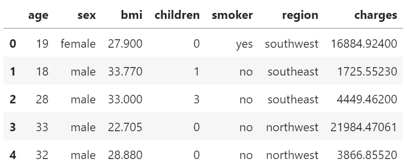
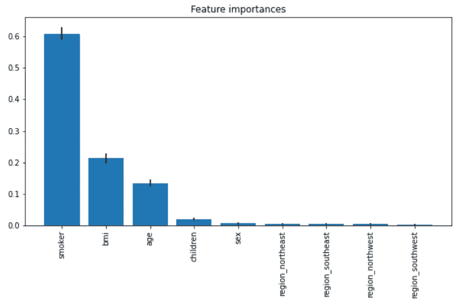
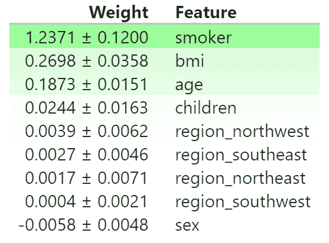
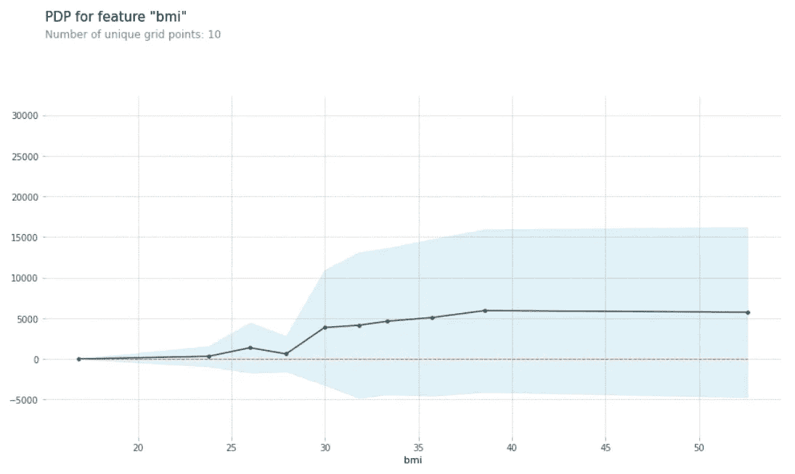
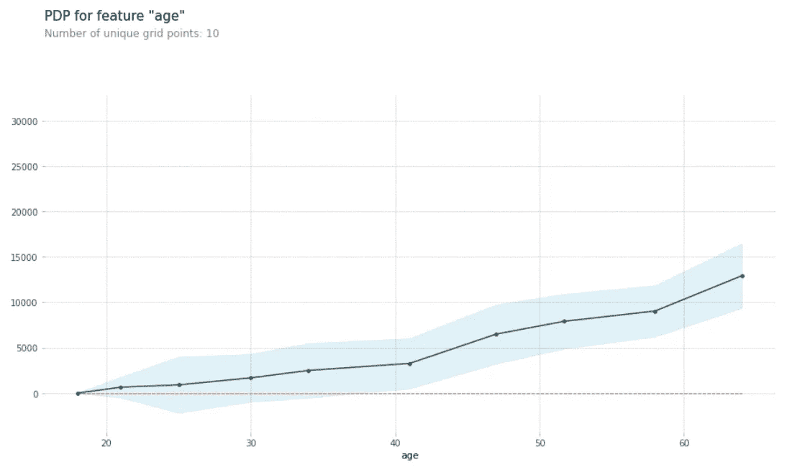
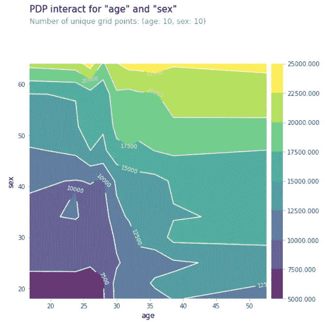
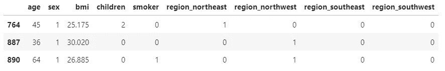
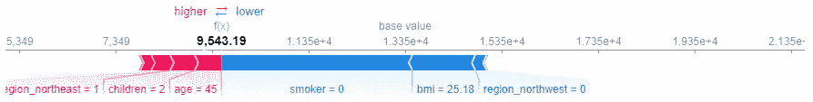
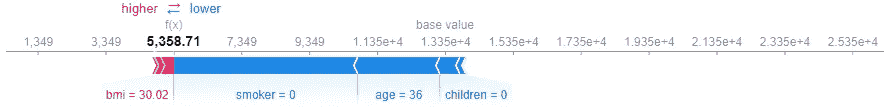
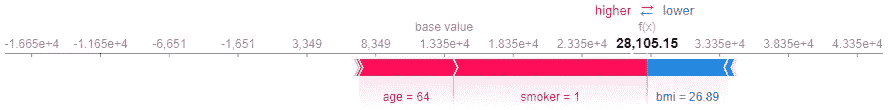

# 解决机器学习中的“黑箱”问题

> 原文：<https://towardsdatascience.com/addressing-the-issue-of-black-boxes-in-machine-learning-f86429acbb2a?source=collection_archive---------18----------------------->

## [模型可解释性](https://towardsdatascience.com/tagged/model-interpretability)

## 在模型预测中创造更多透明度和可解释性的 4 个必须知道的技术


照片由[威尔·波拉达](https://unsplash.com/@will0629?utm_source=medium&utm_medium=referral)在 [Unsplash](https://unsplash.com?utm_source=medium&utm_medium=referral) 上拍摄

毫无疑问，近几十年来，机器学习模型席卷了整个世界。他们识别模式和生成预测的能力远远超过任何其他形式的统计技术，这是真正了不起的，很难与之抗衡。

然而，尽管它有很多有希望的优势，许多人仍然持怀疑态度。具体来说，机器学习模型面临的主要挫折之一是缺乏透明度和可解释性。

换句话说，尽管机器学习模型非常能够生成非常稳健和准确的预测，但当人们试图检查和理解这些预测背后的逻辑时，往往会以复杂性为代价。

在本文中，我们的目标是通过回答两个基本问题来解开和解决黑盒模型的问题:

*   模型认为数据中的哪些特征最重要？
*   在宏观意义上以及在个案基础上，每个特征如何影响模型的预测？

为了帮助我们回答这些问题，我们将探索 4 种独特的技术，并讨论如何使用每种技术来提高模型预测的透明度:

*   特征重要性
*   排列重要性
*   部分相关图
*   SHAP 价值观

因此，如果您准备好开始剥离并检查您的模型如何准确地使用输入数据进行预测，让我们开始吧！

这篇文章的参考笔记本可以在[这里](https://www.kaggle.com/jasonchong914/ml-transparency-and-explainability)找到。

# 数据描述和准备

医疗费用个人[数据集](https://www.kaggle.com/mirichoi0218/insurance)提供了居住在美国的 1，338 名投保人的保险费用及其个人信息，例如:

*   年龄
*   性
*   身体质量指数(身体质量指数)
*   儿童人数
*   吸烟状况
*   居住区



数据的前 5 行

由于保险费用是一个连续变量，这是一个回归问题。我还决定使用随机森林回归作为我们的选择模型。

出于本文的目的，让我们不要太担心使用哪个模型，而是将我们的注意力更多地放在学习如何解释我们的模型预测的结果上。

```
# Feature encoding 
data['sex'] = data['sex'].map({'female': 1, 'male': 0})
data['smoker'] = data['smoker'].map({'yes': 1, 'no': 0})
data = pd.get_dummies(data)# Predictor and target variables
X = data.drop('charges', axis = 1)
y = data.charges# Train test split
X_train, X_val, y_train, y_val = train_test_split(X, y, test_size = 0.2, random_state = 42)# Fit random forest model
rf = RandomForestRegressor(random_state = 42).fit(X_train, y_train)
```

# 特征重要性

几个月前我写过一篇[文章](/feature-selection-dimensionality-reduction-techniques-to-improve-model-accuracy-d9cb3e008624)，题目是特征选择降维。那篇文章中讨论的技术之一叫做特性重要性。

本质上，当使用任何基于树的模型时，例如决策树、随机森林或梯度推进，每个特征将被分配一个“特征重要性”,其强调该特征在进行预测时对模型的重要性。

为了理解特征重要性背后的直觉，我们首先讨论决策树算法实际上是如何工作的是很重要的。


图片来源[丹·贝克尔，卡格尔](https://www.kaggle.com/dansbecker/how-models-work)

回想一下，当决策树模型适合定型数据时，决策树中的每个节点都表示模型用来将数据分成组的单个功能。这里的目标是以这样一种方式分割数据，即在每次分割后，目标变量中具有相似值的数据最终出现在同一个组中。

换句话说，我们希望表现出相同特征的数据被分组在一起，以便当新的看不见的数据进来时，我们的模型将能够通过从树的顶部向下遍历到树的底部来预测其最终值。

模型是如何决定每个节点使用哪个特性的？嗯，决策树算法经过优化，减少了基尼杂质(分类)和方差(回归)。基尼系数表明了一个观察值被错误分类的概率，而方差表明了一组观察值离均值有多远。因此，在树的每一层，模型将确定给出最低杂质分数或最低方差的特征。

如果你想了解更多关于基于树的模型是如何工作的，可以看看我下面的文章:

[](/battle-of-the-ensemble-random-forest-vs-gradient-boosting-6fbfed14cb7) [## 整体之战——随机森林 vs 梯度推进

towardsdatascience.com](/battle-of-the-ensemble-random-forest-vs-gradient-boosting-6fbfed14cb7) 

现在，回到特征重要性。特征重要性衡量特定特征在帮助我们的模型最小化损失函数方面的有用程度。一个特征在将数据点分成不同的类别方面做得越好，该特征对模型就越重要。

下面是如何在实践中计算和可视化特征重要性。

```
# Calculate feature importance
importances = rf.feature_importances_
std = np.std([tree.feature_importances_ for tree in rf.estimators_], axis = 0)
indices = np.argsort(importances)[::-1]# Plot feature importance
plt.figure(figsize = (10, 5))
plt.title("Feature importances")
plt.bar(range(X_train.shape[1]), importances[indices], yerr = std[indices])
plt.xticks(range(X_train.shape[1]), X_train.columns[indices], rotation = 90)
plt.show()
```



特征重要性

正如我们从图表中看到的，3 个最重要的特征是:

*   吸烟者
*   身体质量指数
*   年龄

这一结果似乎是合理的，因为吸烟习惯、身体质量指数和年龄都是一个人健康状况的常见指标，因此也是他们支付健康保险费的常见指标。

# 排列重要性

另一种类似于特征重要性的技术叫做排列重要性。

实际上，一旦我们的模型被训练好，排列重要性包括在验证数据中改组单个特征，将目标和其他列留在原位，并随后评估现在改组的数据中预测的准确性。

这种方法有效的潜在原因是，如果我们在进行预测时打乱一个对我们的模型不重要的特征，准确性将在整个排列过程中保持相当一致。另一方面，如果由于重新混合而导致精度下降，则表明该特征对模型很重要。

让我们看看这在实践中是如何工作的。

```
# Permutation importance 
perm = PermutationImportance(rf, random_state = 42).fit(X_val, y_val)
eli5.show_weights(perm, feature_names = X_val.columns.tolist())
```



排列重要性

正如我们所看到的，我们从排列重要性中得到的结果与在特征重要性中得到的结果几乎相同。表顶部的值是最重要的特性，底部的值最不重要。

作为重新洗牌的结果，将会有一定程度的随机性。因此，正负符号后的数字说明了这种随机性，因为它衡量了一次重组与下一次重组之间的性能差异。

# 部分相关图

到目前为止，我们已经接触了两种技术，帮助我们确定哪些*变量对模型预测影响最大。*

*如果我们想进一步研究 ***和*** 如何影响预测呢？接下来我们将探讨的两项技术可以帮助我们完成这项任务。*

*为了绘制部分相关图，我们反复改变我们感兴趣的变量的值，并基于这些值进行一系列预测。*

*现在让我们看两个实际的例子。假设我们想知道身体质量指数和年龄如何影响投保人的保险费。*

```
*# Create data to plot 
pdp_bmi = pdp.pdp_isolate(model = rf, dataset = X_val, model_features = X_train.columns, feature = 'bmi')*# Plot data*
pdp.pdp_plot(pdp_bmi, 'bmi')
plt.show()*
```

**

*身体质量指数特征的部分相关图*

*正如我们所见，溢价水平在身体质量指数= 25 左右开始上升，在再次上升之前略有下降。*

```
**# Create data to plot*
pdp_age = pdp.pdp_isolate(model = rf, dataset = X_val, model_features = X_train.columns, feature = 'age')

*# Plot data*
pdp.pdp_plot(pdp_age, 'age')
plt.show()*
```

**

*年龄特征的部分相关图*

*另一方面，我们看到保费水平随着年龄的增长而不断增长，尽管增长速度不同:*

*   *40 岁前*
*   *年龄在 40-60 岁之间*
*   *60 岁及以上*

*我们还可以执行二元或二维 PDP，向我们展示两个特征之间的相互作用。*

```
*# 2D partial dependence plot 
features_to_plot = ['bmi', 'age']
inter = pdp.pdp_interact(model = rf, dataset = X_val, model_features = X_train.columns, features = features_to_plot)
pdp.pdp_interact_plot(pdp_interact_out = inter, feature_names = X_train.columns, plot_type = 'contour')
plt.show()*
```

**

*2D 部分相关图*

*我希望现在你能看到并理解部分依赖图所提供的额外的复杂性。*

*使用这种技术，我们现在不仅知道哪些特征对我们的模型是重要的，而且更重要的是，这些特征实际上如何影响模型预测。*

# *SHAP 价值观*

*SHAP 是沙普利附加解释的简称。它分解了一个单独的预测，以展示每个起作用的特征的影响。这使我们能够在更具体的基础上研究模型预测。*

*例如，这种技术对于银行和保险公司等金融机构特别有用。如果银行拒绝客户的贷款，法律要求银行解释拒绝贷款的依据。同样，如果保险公司选择不承保某人的保险，该公司有义务向该人说明理由。*

*SHAP 值解释了某个特征具有某个值与该特征具有某个基线值的预测相比所产生的影响。*

*因此，数据集中的每个要素都有自己的 SHAP 值，所有 SHAP 值的总和将解释特定预测和基础值之间的差异，其中基础值是模型输出对训练数据的平均值。此外，我们还可以使用图形来可视化 SHAP 值的分解。*

*假设我们想要检查验证数据的前 3 行的 SHAP 值。*

**

*验证数据的前 3 行*

*首先，我们需要定义一个函数来计算和可视化 SHAP 值分解。*

```
*# Define SHAP plot function 
shap.initjs()
def shap_plot(index):
    explainer = shap.TreeExplainer(rf)
    shap_values = explainer.shap_values(X_val)
    res = shap.force_plot(explainer.expected_value, shap_values[index], X_val.iloc[index])
    return res*
```

*一旦我们的函数准备好了，我们只需要简单地传入我们想要调查的行的索引。让我们从验证数据的第一行开始。*

```
*# First row 
shap_plot(0)*
```

**

*验证数据的第一行*

*那么，你到底是怎么解读这个的？*

*首先，模型预测保险费用为 9，543.19，低于基础值 1.355e+4。*

*导致预测增加的特征值用粉色表示，而导致预测减少的特征值用蓝色表示。每个彩色条的长度显示了该特征对最终预测的影响程度。*

*在这个特定的场景中，因为预测值低于基准值，所以所有蓝色条的长度加起来都大于粉色条的长度。具体来说，如果从蓝色条减去粉色条，它等于从基础值到预测值的距离。*

*此外，我们还可以观察到，吸烟者= 0(即不吸烟者)是降低该特定个人的保险费用的最重要因素。*

*现在让我们再看两个例子。*

```
*# Second row
shap_plot(1)*
```

**

*验证数据的第二行*

```
*# Third row
shap_plot(2)*
```

**

*验证数据的第三行*

*总之，在本文中，我们讨论了 4 种不同的技术来检查和解释模型预测:*

*   *特征重要性*
*   *排列重要性*
*   *部分相关图*
*   *SHAP 价值观*

*希望有了这些新知识，您现在不仅可以开始检查哪些特征对您的模型很重要，还可以检查它们对模型预测的确切影响。*

*我想机器学习毕竟是一个黑箱，是吗？*

*非常感谢您的阅读。欢迎随时连接或关注我，了解更多未来内容！*

# *跟我来*

*   *[GitHub](https://github.com/chongjason914)*
*   *[领英](https://www.linkedin.com/in/chongjason914/)*
*   *[YouTube](https://www.youtube.com/jasonchong914)*
*   *[中型](https://chongjason.medium.com/)*