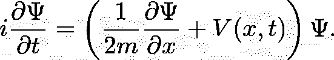

# 绝热量子计算 1:基础和绝热定理

> 原文：<https://towardsdatascience.com/adiabatic-quantum-computation-1-foundations-and-the-adiabatic-theorem-8378d3b58212?source=collection_archive---------12----------------------->

## 不太为人所知的量子计算机类型，更容易构建，更容易理解，而且(可能)同样强大。

戴维·拉托雷·罗梅罗在 [Unsplash](https://unsplash.com?utm_source=medium&utm_medium=referral) 上的照片

我刚刚在澳大利亚国立大学完成了我的[荣誉论文](https://github.com/milanleonard/Diamond-Quantum-Annealer/blob/main/AnnealingThesisFinal_milan.pdf)，论文提出了钻石如何被用作绝热量子计算机。然而，在这个项目中，我意识到很少有人知道绝热量子计算机是什么，即使是在更广泛的量子计算领域。

这个系列针对具有一些 Python 技能的 quantum 初学者，试图通过计算透镜解释它是什么，每篇文章也是一个笔记本，可以在 [Deepnote](https://deepnote.com/) 上执行，并在顶部链接。运行笔记本[这里](https://deepnote.com/@milanleonard/Adiabatic-Quantum-Computation-1-The-Adiabatic-Theorem-and-foundations-u-jWdi_MRF2H4gynW3TyVA)。该系列将按如下方式进行

1.  基础知识和整个努力所依赖的:绝热定理。
2.  使用二次无约束二元优化框架以及与伊辛模型的同构来构建计算模型。
3.  最重要的限制:量子位元连接性、数学图形和次要嵌入问题。
4.  模拟理想和有噪声的绝热量子计算机，并运行一些实验。
5.  讨论围绕计算复杂性、量子加速的争论，以及我对空间未来的看法(以及对我的研究的见解)

让我们开始吧！

量子计算是目前的一个热门话题，有望彻底改革加密技术，促进新药的发现，并推动机器学习的障碍。为了实现这些承诺，有两种根本不同的方法来实现量子计算。这些是

1.  **基于门的量子计算**

如果你对量子计算有基本的了解，这几乎肯定是你读到的。这就是著名的 Shor 素数分解算法(破解加密)和 Grover 搜索算法。此外，这也是谷歌、IBM、霍尼韦尔等公司目前正在投资的方法。基于门的量子计算机应该以与当前经典计算机相同的方式来考虑，在经典计算机中，它执行一系列转换(逻辑门)来得出特定的结论。我将称这种方法为数字计算。

2.**绝热量子计算**

本系列的重点是另一种不太为人所知的量子计算。与基于门的方法相反，绝热量子计算机是*模拟*计算机。我认为描述模拟计算的最佳方式是通过类比。假设你想把两个声波加在一起。数字方法将涉及找到声音信号的离散编码，并用编程语言编写一种算法，在每个时间点将两种波相加。然而，您可以通过简单地找到两个扬声器，并通过扬声器播放声波来构建问题的物理模拟。然后，通过介质播放波的流体动力学(或任何物理学)为你做计算，你只需记录结果。

已经可以(在理论上)使用绝热量子计算机解决的问题是旅行推销员问题、最大割问题和许多其他极具挑战性的组合优化问题。

在这个系列中，我将尽量避免谈论任何量子力学，除非*绝对必要*。

# 绝热定理

绝热量子计算的整个基础是(量子力学的)绝热定理。在对我们最有用的表述中，它指出

*   如果一个量子态被初始化为一个系统的基态，那么该系统的任何足够小的*变化将(很有可能)使其保持在基态。*

这为任何绝热计算提供了一个非常简单的程序

1.  将状态初始化为一个易于实现的初始系统的基态
2.  设计一个目标系统，其中基态编码了一些有趣问题的解决方案
3.  从初始系统到目标系统的过渡要足够慢，使得所有的变化都很小，并以目标系统的基态结束
4.  读出最终状态，它应该是基态，被构造来解决你的问题

对于本文的代码，我想演示以下每个重要的概念

*   从薛定谔方程看特定系统中量子态的演化
*   从初始系统到最终系统的转变如何快速激发量子态进入许多更高能态
*   如何从一个初始系统慢慢过渡到一个最终系统，使大部分量子概率保持在基态。

# 好了，现在让我们深入代码部分！

你完全可以跳过这里的一些细节

# 建立

因为我们使用数值模拟来工作，我们将空间的位置和动量离散化。

现在我们想从一个初始系统过渡到一个目标系统。量子力学中的‘系统’是识别某一状态能量的方法，被称为哈密顿量。对于这个例子，我们将使用一个最简单的哈密尔顿函数，它是以下形式的二次函数

我们喜欢物理中的二次型，因为它使其他数学变得简单。

这给出了被充分研究的量子谐振子(它具有态的解析解。

回想一下，我们想在一段时间内从初始状态转换到最终状态

在本例中，我们线性增加 V_T 的重要性，同时降低 V_i，这不一定要线性进行，事实上，我们正在积极研究这样做的最佳“时间表”。

## 模拟薛定谔演化

量子系统根据薛定谔方程演化，薛定谔方程是一个偏微分方程。对于物理学家来说，注意这里我使用自然单位(ℏ=1)

因为我想用数值模拟，我需要使用一种方法来积分偏微分方程。我使用了[分步傅立叶](https://en.wikipedia.org/wiki/Split-step_method)方法，为此我找到了一个使用薛定谔方程的[教程](https://jakevdp.github.io/blog/2012/09/05/quantum-python)

分步傅里叶方法所需的函数，可以安全地用于任意一维势，如果你想亲自尝试的话。

## 我想展示的是

对于两个不同的 t_total 值，我想从一个初始势 V_i 过渡到 V_T。一个是快速的(许多激发态发生的地方)，一个是缓慢的，大部分概率停留在基态。我想表明，在缓慢的演化过程中，大部分概率保持在基态..

请注意，右边的柱状图显示了特定波函数的“基态”或“激发态”程度。虽然研究过量子物理学的人会知道这意味着什么，但实际上推迟到下周的文章再介绍更有意义。对于第一次接触这个问题的外行读者来说，左边的条形越大越好，因为这是对基态可能性的一种度量，这也是我们在开始构建时想要的。

# 缓慢的进化

当我们从我们的初始势/哈密顿量/系统慢慢进化到我们的目标哈密顿量时，我们看到绝大多数的概率保持在基态，如左边的柱状图所示。我们可以看到，这是因为只需要很小的变化就可以实现。如果进一步增加 max_t 和 t_total，这将继续是一个更好的近似值。

动画(代码可以在笔记本中找到)显示

这些都是很慢的 gif，不幸的是，笔记本上有更快更漂亮的版本。

在整个演化过程中，绝大部分概率保持在基态，只有极小的激发需要使波函数保持在基态。注意，这里基态是相对于电势的瞬时基态来定义的。

# 快速进化

相反，我们可以立即看到，遵循完全相同的程序，但将电势改变 3 倍更快会导致激发态的大激发。这违反了变化足够慢的绝热条件，意味着这在绝热量子计算中没有用。

相反，我们看到，跃迁越快，波函数中的“基态”就越少。这意味着，对于有用的绝热计算来说，这显然太快了。

# 你应该带走什么

第一次接触量子力学和绝热定理应该已经向你表明了这一点

*   如果你可以从一个系统的基态开始，那么缓慢的进化意味着你将大部分时间停留在基态
*   我们可以通过同时增加一个系统的强度(前因子),同时降低另一个系统的强度来“权衡”两个系统的强度，从而允许一种完全通用的方式来实现缓慢的进化
*   只要 我们能想出如何将一个问题的解编码成基态，这就允许一个单一的、通用的构造来进行计算 ***。***

# 我们下周要讲的内容

*   转向具有二进制值的量子位
*   产生将一个问题的解编码成基态所需的精确结构。

# 运行这里编写的代码

> 我使用在线 Jupyter 笔记本编辑器 Deepnote 编写了所有这些代码，如果你点击[这里](https://deepnote.com/@milanleonard/Adiabatic-Quantum-Computation-1-The-Adiabatic-Theorem-and-foundations-u-jWdi_MRF2H4gynW3TyVA)你可以看到这篇文章发表在那里，点击“在 Deepnote 中启动”按钮复制笔记本并从头开始运行它！

请随时联系我，对这种写作风格给予反馈，并提出您的任何问题，以便我可以在下周的文章中解决它们！