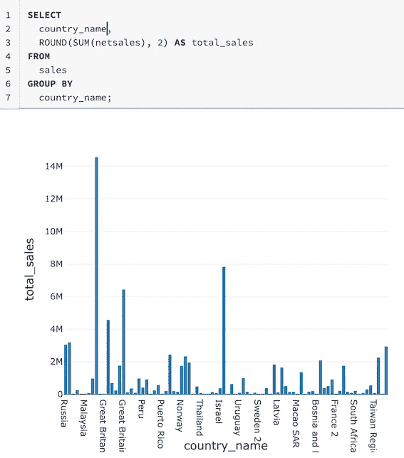

# 采用以数据为中心的机器学习项目

> 原文：<https://towardsdatascience.com/adopting-data-centric-machine-learning-projects-75a8aaec8f53?source=collection_archive---------37----------------------->

## 一旦为机器学习项目制定了商业案例，就该深入研究数据集了。通常，对数据的正确理解和使用可以带来重大的性能改进。这篇文章揭示了以数据为中心的机器学习。

照片由来自 [Pexels](https://www.pexels.com/photo/green-and-white-line-illustration-225769/?utm_content=attributionCopyText&utm_medium=referral&utm_source=pexels) 的 [Markus Spiske](https://www.pexels.com/@markusspiske?utm_content=attributionCopyText&utm_medium=referral&utm_source=pexels) 拍摄

成功的机器学习产品来自于在好的数据集上应用的好的算法和好的参数。机器学习库/框架正变得越来越标准化，围绕它们的最佳实践也广为人知。学习正确参数的机制和工具也越来越成熟。一旦组建了一个熟练的团队，整合一个可行的解决方案并不困难。虽然社区的大多数人都在寻找下一个最好的算法或策略，但他们并没有让业界更容易、更便宜或更快地推出 ML 产品。

这是因为找到正确的数据集不是一件容易的事。大多数方法都是基于高度校准的数据开发的，因此，在包含大量杂乱数据的现实世界部署中会失败很多。当这些方法被应用到杂乱数据的子集时，杂乱数据很有可能充满了虚假的相关性，并且没有足够的可变性。除非已经开发出一种复杂的建模技术来处理这种情况，或者已经开发出一种可扩展的框架来创建无垃圾的干净的复杂数据，否则我们只能使用自己的设备。我祈祷并希望解脱早日到来。

在此之前，我有一个不成熟的想法，就是在工业环境中朝这个方向努力。这个想法的方向是建立一支技术人员队伍，他们知道如何在缺乏可扩展的复杂工具的情况下以数据为中心。

# 在人工智能团队中引入数据专家

为组织引入更多数据专家。图片由作者提供。

行业新人太执着于方法。问题源于学术界、大学、课程、新兵训练营等。，它太注重学习数百种方法，而不是将一种方法实际应用于现实问题。这是一个文化问题，我们可以改变它。以下是一些可行的想法:

*   冠军团队中有经验的人，他们真正理解数据的意义，能够将数据中的模式与业务流程联系起来。如果我们想解决很多问题，我们需要很多。
*   如果你没有那些人，那就让他们成为一体。把 20%的空闲时间给那些不仅愿意发现数据的意义，而且愿意发现这些数据所讲述的故事的人。
*   创建允许人们分享和讨论数据意义和故事的论坛，从而激励更多人成为其中一员。
*   创建一个学术项目，允许许多人在数据分析和领域数据方面高效地提高技能。

开始时，它会很慢并且容易出错。然而，一旦足够多的人实现了飞跃，即专注于学习数据，这将是自我维持的。

# **敏捷数据探索**

使用 Databricks Workspace 进行敏捷数据探索。图片由作者提供。

避免每次都搜索完美的数据集。要有效率。找到一个足够小的数据集来捕捉一些有意义的见解。形成一个直观的假设，并围绕它建立精益分析解决方案。解决方案应该是可解释的，而不是黑箱。因此，它不需要成为一个复杂的 ML 方法，它可以是一个商业启发的数学公式或一个老派的 ML 方法。如果你不相信，稍微改变一下方法或者探索不同的数据区域。如果您确信找到了正确的数据区域，请停止探索，并发布您的发现以及定义数据区域的标记。

为了方便发布和发现感兴趣的数据集，请为大规模可搜索仪表板和数据集构建平台。要构建这样的功能，请关注一个引擎，它允许连接不同的数据集、对数据集运行查询、构建仪表板以及归档代码、仪表板和元数据。一旦您在开发平台方面取得了一些进展，就要努力提高平台的采用率。一个有机的方法是雇用平台成功专家，专注于创建一些令人敬畏的平台演示，一个教育计划，教导组织中的人如何在平台上工作，以及成功故事的定期演示。

# 系统的数据清理和注释

鼓励 ML 团队积极追求数据清理和注释的技术。*在这种情况下，干净的数据不仅意味着语法上正确的数据，还意味着语义上有用的数据。*这可能意味着删除只是以虚假相关的形式添加噪声的行，增加合成行以突出模糊但必要的模式。

不可能对所有数据都有一个明确的制胜策略。来自行业的数据，尤其是全球范围的数据是多方面的，并且有自己的清理和注释问题。因此，可能会出现过多的策略。让团队更容易发布这些技术，以便它们可以在相同/相似数据集的其他用途中重新应用。

例如，处理来自渠道的销售数据的团队可以发布清理和注释这些数据的方法，以库的形式提供示例数据和证明其有效性的文档。可以使用通用模板，以便以统一的方式实现和记录该库。这种统一的设计将为在这些库上构建搜索引擎铺平道路，从而为轻松发现铺平道路，并因此增加这些库的采用。最终，大众将决定一些获胜的策略，这将为一致的数据清理和注释策略铺平道路。

# 以数据为中心的数据科学

我完全意识到这个标题的无用。然而，我故意犯的错误应该会让人们更加关注那些走向错误方向的行业及其供应商。数据科学实践意味着大量关注数据。不幸的是，我们似乎支持复杂的方法，却牺牲了获取干净有用数据的时间。

避免用功能推出来压倒 ML 团队的时间表。相反，鼓励他们加入数据专家运动，开发获取干净数据的技术。没有人能比使用数据的团队做得更好。我们要做的就是选出一堆中的赢家。

数据科学是经验性的。然而，这并不一定是针对方法 A 和 b 运行实验，也可以是针对数据集 D 和 D*使用方法 A 运行实验。

在开发 ML 工作流时，选择稳定的艺术状态，易于执行的算法(以及一组众所周知的参数设置)。不要从处理万亿字节的数据开始。找到一个足够好的数据大小来覆盖足够的方差。一个很好的经验法则是尝试将数据放入一台正常大小的机器的内存中。如果解决方案给出了可接受的评估结果，通过更新其特征选择或参数选择方法，使该方法更复杂一些。重复，直到你觉得你已经很好地理解了数据。当你不能从你的解决方案中得到更多的果汁时，你会创造一个好的直觉，什么样的特征值和模型权重会导致一个好的结果。然后增加数据覆盖面，进入下一个层次。

因此，解决方案的一部分必须存在，以找到正确的数据集。它必须足够端到端，包括模型开发和评估，这样就可以很容易地选择更好的数据集。采用群体智慧的方法。当少数人开发解决方案时，评估解决方案的质量应该由整个团队来完成。这意味着，整个团队，最好是非常了解数据的团队，坐在一起通过确定已经选择了正确的数据集来训练模型，从而对正确的解决方案做出判断。

试着站在巨人的肩膀上。当来自敏捷数据探索或被广泛采用的数据清理库的流行见解存在时，在创建自己的见解或实现之前，首先考虑这些。至少验证一下它们的可用性。

# 评论

我对此很有经验吗？不。以数据为中心的模型开发不是一个受欢迎的想法。然而，我已经看到了足够多的其他方法失败的证据，可以把它作为一个补充的选择。我将鼓励我的团队更加以数据为中心，并定期评估方法的有效性。当有趣的事情发生时，我会随时通知你。