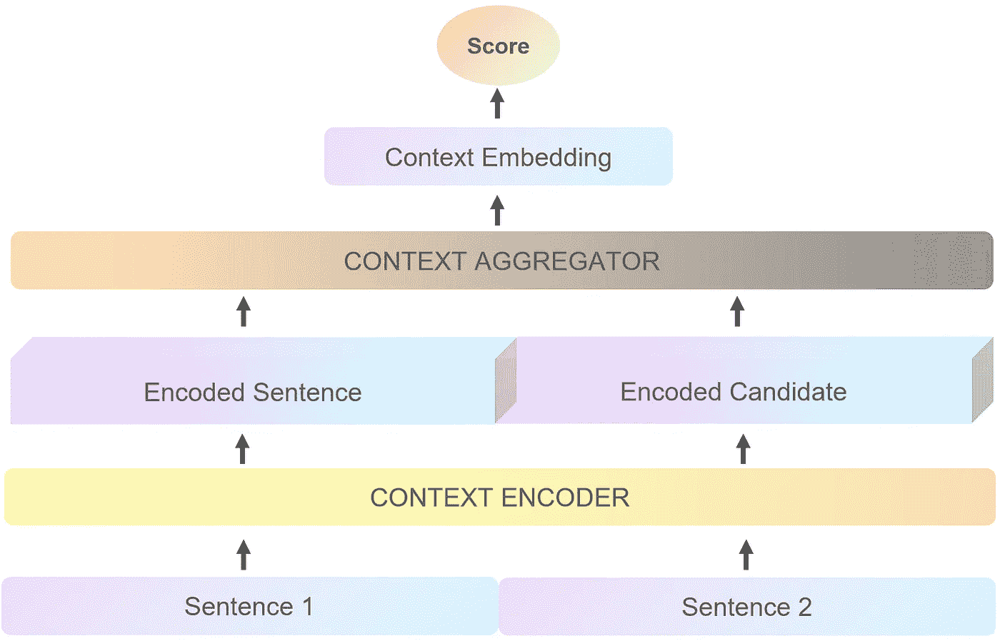
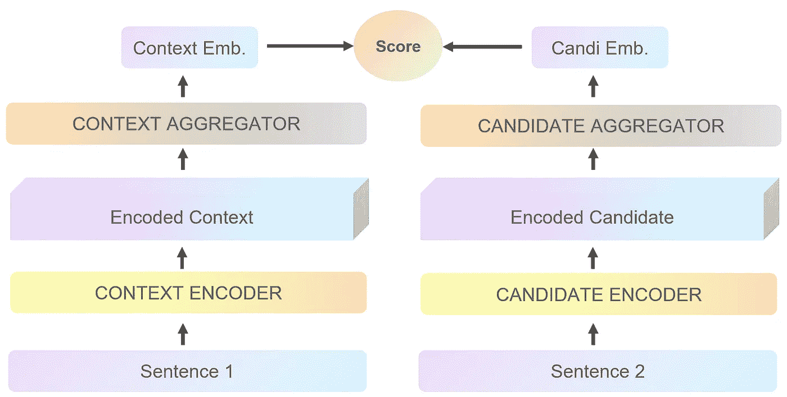
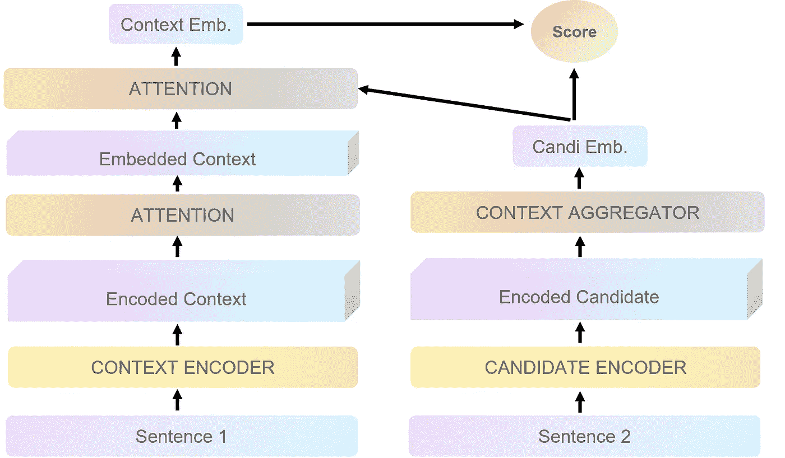
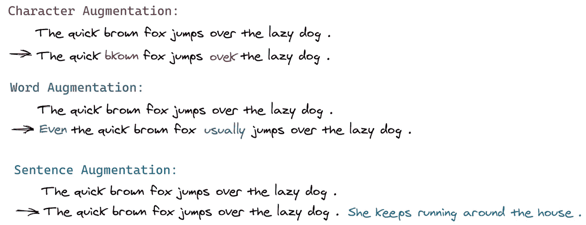
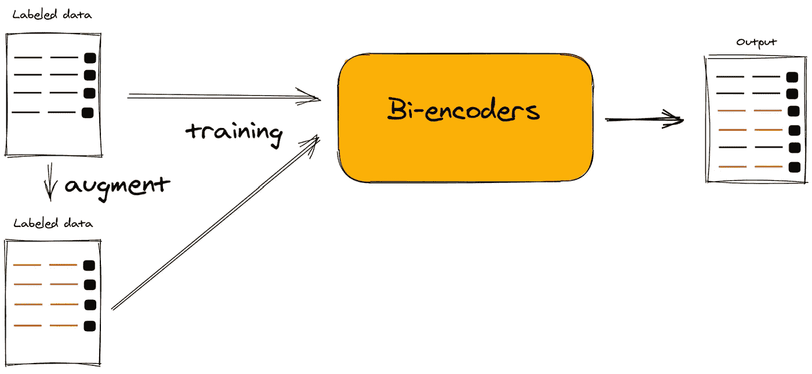
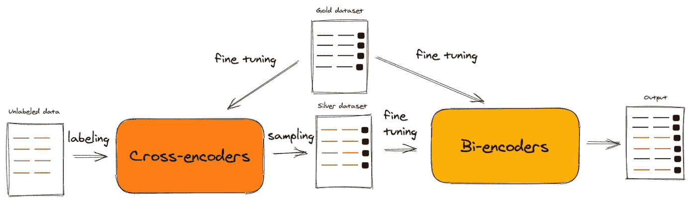
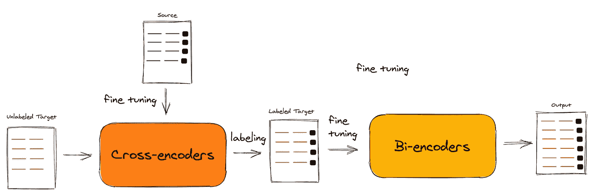

# 通过将知识从交叉编码器转移到双编码器来改进 BERT 模型

> 原文：<https://towardsdatascience.com/advance-nlp-model-via-transferring-knowledge-from-cross-encoders-to-bi-encoders-3e0fc564f554?source=collection_archive---------5----------------------->

## 改进用于成对句子评分任务(语义句子任务)的 SBERT 双编码器的数据扩充方法

蒂姆·莫斯霍尔德在 [Unsplash](https://unsplash.com?utm_source=medium&utm_medium=referral) 上的照片

# 📚背景和挑战

C 目前，最先进的自然语言处理架构模型通常重用 BERT 模型，该模型是在大型文本语料库(如维基百科和多伦多图书语料库)上预先训练的。通过微调深度预训练的 BERT，发明了许多替代架构，如 DeBERT、RetriBERT、RoBERTa……这些架构在各种语言理解任务上实现了基准的实质性改进。在 NLP 中的常见任务中，成对句子评分在信息检索、问题回答、重复问题检测或聚类中具有广泛的应用，...通常，有两种典型的方法被提出:**双编码器**和**交叉编码器**。

*   **交叉编码器[2]:** 对给定的输入和标签候选项执行完全(交叉)自我关注，并且倾向于获得比它们的对应物高得多的精确度。但是，它必须为每个输入和标签重新计算编码；结果，它们不可能检索端到端的信息，因为它们不能产生输入的独立表示，并且在测试时非常慢。例如，10，000 个句子的聚类具有二次复杂度，并且需要大约 65 个小时的训练[4]。

交叉编码器

*   **双编码器[3]:** 分别对输入和候选标签执行自我关注，将它们映射到一个密集的向量空间，然后在最后将它们组合在一起，形成最终的表示。因此，双编码器能够索引编码的候选，并比较每个输入的这些表示，从而导致快速的预测时间。在聚类 10，000 个句子的相同复杂度下，时间从 65 小时减少到大约 5 秒[4]。先进的双编码器 Bert 模型的性能由泛在知识处理实验室(UKP-TUDA)展示，它被称为**句子-BERT** (SBERT)。更多细节，本文指出使用 [**SBert 双编码器**](/a-complete-guide-to-transfer-learning-from-english-to-other-languages-using-sentence-embeddings-8c427f8804a9) 的手动教程。

双编码器

另一方面，没有一种方法在所有方面都是完美的，**双编码器**也不例外。与**交叉编码器**方法相比，**双编码器**方法通常实现较低的性能，并且需要大量的训练数据。原因是**交叉编码器**可以同时比较两个输入，而**双编码器**必须独立地将输入映射到一个有意义的向量空间，这需要足够数量的训练样本来进行微调。

为了解决这个问题，人们发明了**多编码器**。**多编码器**利用两个独立的变压器(类似于交叉编码器)，但是只在顶层的两个输入之间应用了注意力，从而比**双编码器**获得了更好的性能增益，比**交叉编码器获得了更大的速度增益。**然而，**多元编码器**仍然有一些缺点:由于非对称的得分函数，它们不能应用于具有对称相似关系的任务，并且**多元编码器**表示不能被有效地索引，导致具有大语料库大小的检索任务的问题。

多元编码器

在这篇文章中，我想介绍一种可以有效地使用交叉编码器和双编码器的新方法——数据扩充。这种策略被称为**增强 SBERT** (AugSBERT) [6]，它使用 **BERT 交叉编码器**来标记一组更大的输入对，以增强 **SBERT 双编码器**的训练数据。然后， **SBERT 双编码器**在这个更大的增强训练集上进行微调，这产生了显著的性能提高。其思路与计算机视觉中的 [**关系推理自监督学习**](/train-without-labeling-data-using-self-supervised-learning-by-relational-reasoning-b0298ad818f9) 非常相似。所以简单来说，可以认为是自然语言处理中的自监督学习。更多细节，将在下一节介绍。

# 📖技术亮点

对于成对句子回归或分类任务，扩展 SBERT 方法有三种主要情况。

## 场景 1:完整的带注释的数据集(所有带标签的句子对)

在这种情况下，应用直接数据扩充策略来准备和扩展标记数据集。最常见的有三个层次:字、词、句。

文本扩充级别

然而，单词级是最适合句子对任务的级别。基于训练双编码器的性能，有一些建议的方法:通过上下文单词嵌入来插入/替换单词(BERT、DistilBERT、RoBERTA 或 XLNet)或通过同义词来替换单词(WordNet、PPDB)。在创建了增强的文本数据之后，它将与原始文本数据相结合，并适合双编码器。

然而，在少数标记数据集或特殊情况下，所示的简单单词替换或增量策略对句子对任务中的数据扩充没有帮助，甚至导致与没有扩充的模型相比更差的性能。

简而言之，直截了当的数据扩充策略包括三个步骤:

*   步骤 1:准备了全标记语义文本相似性数据集(黄金数据)
*   第二步:替换配对句中的同义词(银色数据)
*   步骤 3:在扩展的(金+银)训练数据集上训练双编码器(SBERT)

用全注释数据集训练 SBert 双编码器

## 场景 2:有限或较小的带注释的数据集(少数带标记的句子对)

在这种情况下，由于有限的标记数据集(黄金数据集)，预训练的**交叉编码器**用于弱标记未标记数据(相同域)。然而，随机选择两个句子通常会导致不相似(否定)对；而阳性配对极其罕见。这使得银数据集的标签分布严重偏向负对。因此，建议采用两种适当的取样方法:

*   BM25 采样(BM25):该算法基于词汇重叠，通常被许多搜索引擎用作评分函数[7]。从唯一索引的句子中查询和检索前 k 个相似句子。
*   语义搜索采样(SS):预训练的**双编码器(SBERT)**【4】用于检索我们的集合中前 k 个最相似的句子。对于大的集合，像 Faiss 这样的近似最近邻搜索可以用来快速检索 k 个最相似的句子。它能够解决 BM25 在没有或很少词汇重叠的同义句上的缺点。

之后，被采样的句子对将被预训练的**交叉编码器**弱标记，并与黄金数据集合并。然后，**双编码器**在这个扩展的训练数据集上被训练。这个模型叫做**增广 SBERT (AugSBERT)。AugSBERT** 可能会提高现有**双编码器**的性能，并减少与**交叉编码器的差异。**

总之，针对有限数据集的 **AugSBERT** 包括三个步骤:

*   步骤 1:在小的(黄金数据集)上微调一个**交叉编码器** (BERT)
*   步骤 2.1:通过重组创建配对，并通过 BM25 或语义搜索减少配对
*   步骤 2.2:用**交叉编码器**弱标记新对(银数据集)
*   步骤 3:在扩展的(金+银)训练数据集上训练一个**双编码器** (SBERT)

用有限的标注数据集训练 SBert

## 场景 3:没有标注的数据集(只有未标注的句子对)

当我们希望 SBERT 在不同的领域数据(没有注释)中获得高性能时，就会出现这种情况。基本上，SBERT 无法将带有看不见的术语的句子映射到一个可感知的向量空间。因此，提出了相关的数据增强策略域适应:

*   第一步:在一个源数据集上从头开始训练一个**交叉编码器** (BERT ),我们为这个数据集添加了注释。
*   第二步:使用这些**交叉编码器** (BERT)来标记你的目标数据集，即未标记的句子对
*   步骤 3:最后，在标记的目标数据集上训练一个双编码器

一般来说，当源域相当一般而目标域相当具体时， **AugSBERT** 受益匪浅。反之亦然，当它从一个特定的领域到一个通用的目标领域，只有轻微的性能提升。

用无注释数据集训练 SBert 双编码器

# 📝实验评估

在这个实验中，我将介绍如何在不同的场景中应用 **AugSBERT** 的演示。首先，我们需要导入一些包

## 场景 1:完整的带注释的数据集(所有带标签的句子对)

此场景的主要目的是通过直接数据扩充策略扩展标记数据集，因此，我们将在语义文本相似性数据集([链接](https://sbert.net/datasets/stsbenchmark.tsv.gz))上准备训练、开发、测试数据集，并定义批量大小、时期和模型名称(您可以指定任何 Huggingface/transformers 预训练模型)

然后，我们将通过我们的 BERT 模型插入单词(您可以应用我在技术重点部分提到的另一种论证技术)来创建 silver 数据集。

接下来，我们用两个(金+银)STS 基准数据集的均值池来定义我们的**双编码器**。

最后，我们将在测试 STS 基准数据集中评估我们的模型。

## 场景 2:有限或较小的带注释的数据集(少数带标记的句子对)

在这种情况下，我们将使用在有限标记数据集(黄金数据集)上训练的**交叉编码器**来软标记域内未标记数据集(白银数据集)，并在两个数据集(白银+黄金)中训练**双编码器**。在这个模拟中，我也再次使用 STS 基准数据集，并通过预训练的 SBERT 模型创建新的句子对。首先，我们将定义**交叉编码器**和**双编码器。**

第一步，我们将像以前一样准备训练、开发、测试，并微调我们的**交叉编码器**

第二步，我们使用微调过的**交叉编码器**来标记未标记的数据集。

第三步，我们在黄金和白银数据集中训练我们的**双编码器**

最后，我们将在测试 STS 基准数据集中评估我们的模型。

## 场景 3:没有标注的数据集(只有未标注的句子对)

在这个场景中，所有步骤都与场景 2 非常相似，但是在不同的领域中。由于我们的**交叉编码器**的能力，我们将使用一个通用的源数据集(STS 基准数据集)并将知识转移到一个特定的目标数据集( [Quora 问题对](https://sbert.net/datasets/quora-IR-dataset.zip))

并训练我们的**交叉编码器。**

标注 Quora 问题对数据集(白银数据集)。在这种情况下，任务是分类，所以我们必须将我们的分数转换为二进制分数。

然后，训练我们的**双编码器**

最后，在测试 Quora 问题对数据集上进行评估

# 📕最后的想法

**AugSBERT** 是一个简单有效的数据扩充工具，用于改进**双编码器**的两两句子评分任务。这个想法是基于通过使用预先训练的**交叉编码器**来标记新的句子对，并将它们组合成训练集。为软标注选择正确的句子对是提高性能的关键和必要的。通过对目标领域的数据进行软标记，奥格斯贝尔特 T21 方法也可以用于领域适应。

如果你想进一步讨论，可以联系我。这里是我的 [Linkedin](https://www.linkedin.com/in/vumichien/)

尽情享受吧！！！👦🏻

# 参考

[1] Jacob Devlin、Chang Ming-Wei、Kenton Lee 和 Kristina Toutanova。Bert:用于语言理解的深度双向转换器的预训练。

[2]托马斯·沃尔夫、维克托·桑、朱利安·肖蒙德和克莱门特·德兰格。Transfertransfo:基于神经网络的对话代理的迁移学习方法。

[3] Pierre-Emmanuel Mazare、Samuel Humeau、Martin Raison 和 Antoine Bordes 培训数百万个性化对话代理。

[4]尼尔斯·雷默斯和伊琳娜·古雷维奇。句子嵌入使用暹罗伯特网络。

[5]塞缪尔·休莫、库尔特·舒斯特、玛丽-安妮·拉肖和杰森·韦斯顿。多编码器:快速准确的多句子评分的架构和预训练策略。

[6] Nandan Thakur、Nils Reimers、Johannes Daxenberge 和 Iryna Gurevych。增强 SBERT:用于改进成对句子评分任务的双编码器的数据增强方法。

[7]詹巴蒂斯塔·阿马蒂。BM25，斯普林格美国，波士顿，马萨诸塞州。