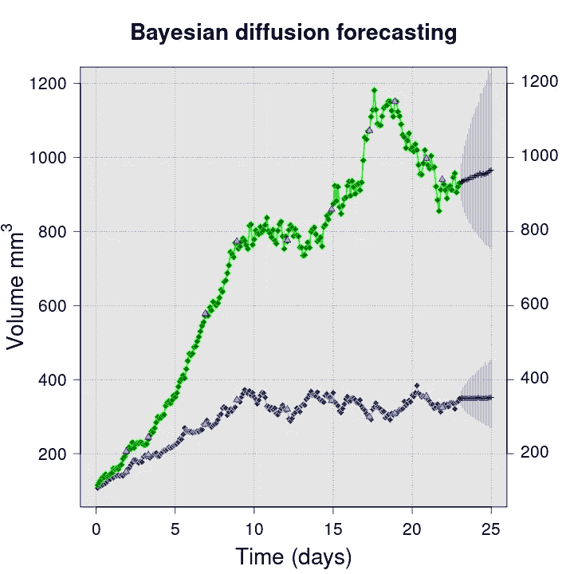
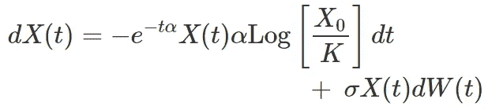
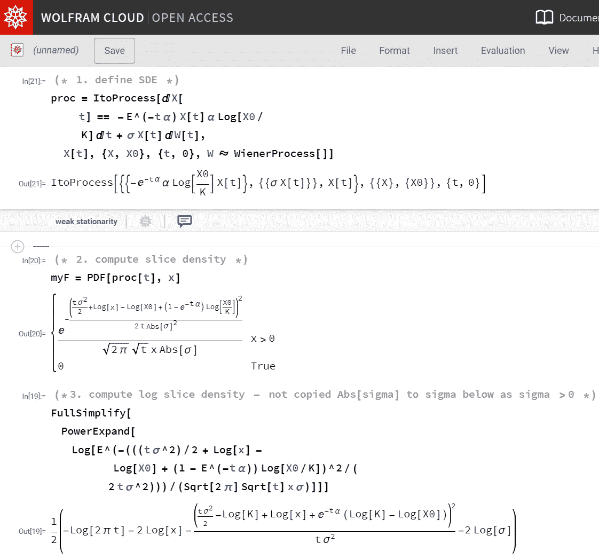
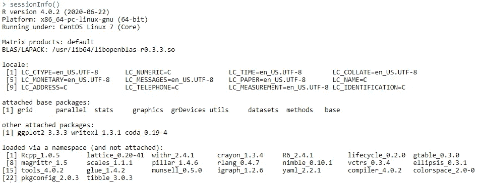
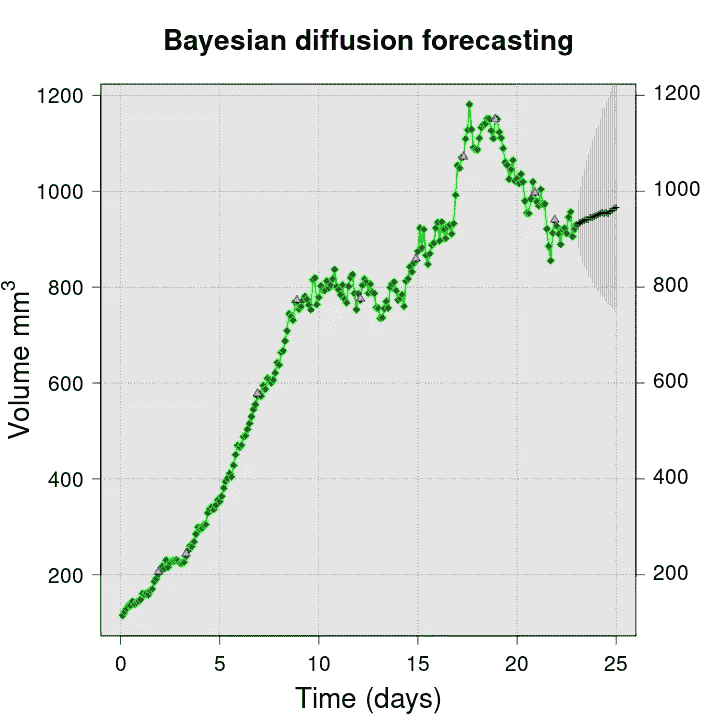
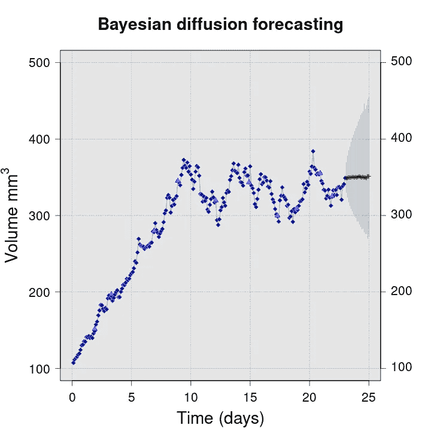
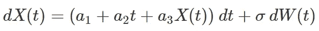
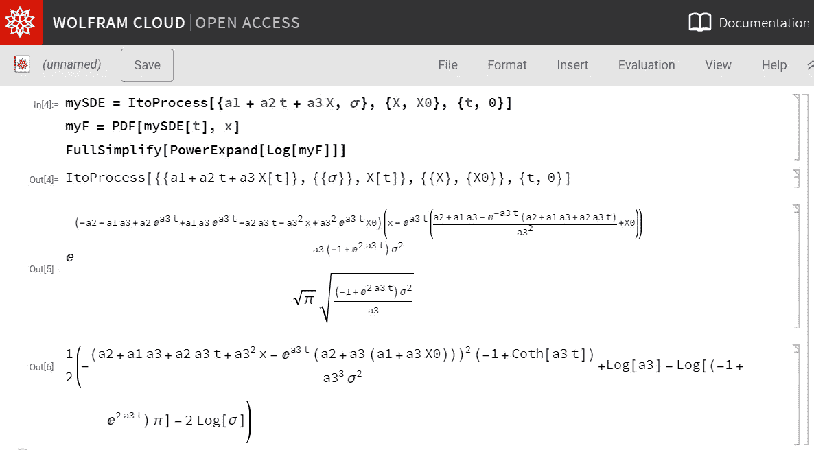
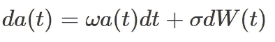

# 使用贝叶斯扩散模型的高级预测

> 原文：<https://towardsdatascience.com/advanced-forecasting-using-bayesian-diffusion-modeling-b155a3dc1d84?source=collection_archive---------8----------------------->

## [行业笔记](https://towardsdatascience.com/tagged/notes-from-industry)

## **在数据科学的所有领域，对旨在预测和阐明动态现象的创新建模解决方案有着巨大的需求**。

图一。绿色、蓝色=原始数据，粉色=选定的拟合值，黑色=从 23 到 25 的时间预测，灰色= 95%贝叶斯后验预测区间。图片作者。

动态现象建模和预测的高姿态用例包括:

*   **金融** —预测股价走势或商品价格波动
*   **生物医学** —预测生物轨迹，例如生长、进化、药物治疗影响的确定
*   **流行病学** —评估疫苗接种等干预策略对传染病流行的影响，例如新冠肺炎
*   **能源** —预测风力或波浪涡轮机的输出，电力需求预测
*   **制造** —优化连续工业过程的输出，如食品生产中的蒸发

**机器学习方法**，例如 [LSTM 网络](https://en.wikipedia.org/wiki/Long_short-term_memory)或[随机森林](https://en.wikipedia.org/wiki/Random_forest#:~:text=Random%20forests%20or%20random%20decision,average%20prediction%20(regression)%20of%20the)，已经被用于解决这些和类似的问题，但是这些方法并非没有[挑战](/how-not-to-use-machine-learning-for-time-series-forecasting-avoiding-the-pitfalls-19f9d7adf424)。本文介绍了一种不同的建模方法——**贝叶斯扩散建模**——这是一种白盒方法，仅使用几个参数就能够实现丰富的动态行为。这种方法有些先进，至少在数学意义上是如此，因为扩散过程涉及随机微积分，但是使用现有的 R/Python/Julia 库，加上一些编程知识，以及以前接触过的一点贝叶斯推理，现实世界的应用可能相对容易。

一个端到端的例子展示了贝叶斯扩散模型应用于开源数据集。使用了 [R](https://www.r-project.org/) ，特别是 [R-nimble](https://r-nimble.org/) 库，但是建模同样可以在 Python 中使用例如 [Stan](https://mc-stan.org/) 或 [Tensorflow probability](https://www.tensorflow.org/probability/overview) 来实现。R-nimble 是一个通用计算框架，在 google groups 上有一个活跃的社区。

希望这个简短的案例研究能激发人们对这种丰富而优雅的方法论的兴趣。它不是新的，但也不是许多数据科学家建模工具箱的一部分，可能是一个有价值的补充。特别是对于预测和预测用例，因为这是一种连续时间方法，所以处理不规则间隔的数据是内置的，这在其他方法中建模序列相关性方面可能相当困难。

# 1.贝叶斯扩散建模—构建模块

贝叶斯扩散建模由两个关键构件组成:

第一步，

*   **定义一个随机过程** **使得** **足够灵活来描述感兴趣的动态现象**——这被封装在一个**随机微分方程** (SDE)中。**存在许多标准配方。**

第二步，

*   **使用马尔可夫链蒙特卡罗(MCMC)****模拟，从数据中估计步骤 1 的 SDE 中的参数 **，如果适用，包括解决测量误差和分层随机效应结构等复杂性所需的附加参数。****

**随机微分方程是一种高度灵活和简洁的描述动态现象的方法，广泛应用于[量化金融](https://www.quantstart.com/articles/Stochastic-Differential-Equations/)，在[医学](https://pubmed.ncbi.nlm.nih.gov/33490877/)和[能源](https://onlinelibrary.wiley.com/doi/full/10.1002/we.1988)中有一些例子。可以使用 MCMC 从数据中估计模型的参数，MCMC 虽然计算量大，但是容易获得，并且具有无论模型复杂程度如何都几乎普遍适用的显著优势。**结合这两种方法给出了贝叶斯扩散建模**。**

**下面给出的用例示例有所简化，以使其尽可能容易理解，但是在更现实的情况下会出现相同的建模步骤。主要区别在于，这里的模型公式是先验选择的，而实际上，这应该由某种形式的模型选择过程来决定，以确保在给定可用数据的情况下，选择的模型是最佳参数化的。**

# **2.预测癌症肿瘤增长——案例研究**

**这包括三个部分:**

1.  ****数据；****
2.  ****型号** **配方**；**
3.  ****模型拟合和预测**。**

**下面提供了关键的建模代码片段作为要点。完整的数据集可从作者的 [GitHub repo](https://github.com/fraseriainlewis/towardsdatascience) 获得，以及重现结果和图表所需的完整代码。**

# **2.1 数据**

**数据包括乳腺癌肿瘤的单一生长轨迹，这些数据的片段在下面的要点中给出。原始数据在 Zenodo [这里](https://zenodo.org/record/3574531#.YGmSJjHisuU)中可用，但由于它们仅由 23 天内的 15 个时间点组成，模拟用于生成更密集的采样数据集，在同一时间段内给出 n=231 而不是 n=15。使用了几种不同的模拟数据集。关于数据格式需要特别注意的一点是，每一行都是一个过渡，即开始时间(时间 1)、停止时间(时间 2)以及起点(观察 1)和终点(观察 2)。这种格式是为了匹配如何指定模型可能性(见下文)。**

**要点 1。数据片段。作者的 GitHub 上有完整的数据集(链接见正文)**

# **2.2 模型制定**

**贝叶斯扩散从概率上描述了一个过程如何从一个给定的起始位置，例如(时间 1，观察值 1)发展到一个较晚的位置(时间 2，观察值 2)。这个过程用随机微分方程(SDE)来描述。下面的等式 1 给出了为该案例研究选择的 SDE。它是众所周知的 [Gompertz 函数](https://en.wikipedia.org/wiki/Gompertz_function)的随机形式，这里选择它是因为 Gompertz 模型已经被用于癌症肿瘤生长的建模(例如，参见这个[出版物](https://journals.plos.org/ploscompbiol/article?id=10.1371/journal.pcbi.1007178))。**

****

**等式 1。Gompertz 函数的随机微分方程。图片作者。**

**在等式 1 中，dt 项之前的乘法因子被称为**漂移**，dW 之前的项被称为**扩散**。dW 是一个布朗运动过程(或 [Wiener 过程](https://en.wikipedia.org/wiki/Wiener_process)，因此 dW 中的“W ”),它不断干扰过程 X(t)随时间的演化。特别考虑到肿瘤的生长，考虑到在任何复杂的动态生物系统中发生的自然涨落，例如由于肿瘤和其他生物体之间对必需营养物的竞争，这种扰动在直觉上是合理的。**

**在这个例子中，类似 Gompertz 的 SDE 是一个合理的先验选择。有许多标准的 SDE 模型，大多最初在金融建模环境中使用或开发。例如，[奥恩斯坦-乌伦贝克模型](https://en.wikipedia.org/wiki/Ornstein%E2%80%93Uhlenbeck_process)是一个均值回复过程，以及[瓦西切克模型](https://en.wikipedia.org/wiki/Vasicek_model)是为利率建模而开发的。一般来说，SDE 可以有任何漂移和扩散项，包括明确依赖于时间 t。多项式形式的漂移已在生物应用中用于模拟儿童生长轨迹(见[此处](https://gatesopenresearch.org/articles/4-71))。也就是说，一个主要的实际警告是，SDE 需要有一个易处理的切片密度(见下文),因此漂移和扩散项的选择通常要考虑到这一点。**

**对等式 1 中的模型的最后一点说明是，扩散过程(dW)由 X(t)缩放。这是一种方便的方法，以确保扩散过程不会干扰整个过程到导致 X(t)为负值的程度，这在这里没有生物学意义，因为 X(t)是肿瘤的大小。**

# **2.3 使用 MCMC 的模型拟合**

**为了理解如何使用 SDE 模型，可能有必要更详细地查看完整示例的代码。以下是要点的一个片段，但首先有必要完成等式 1 中模型的规范，并通过以下方式确定其可能性:**

1.  **确定 SDE 的**切片密度**(也称为转移概率密度)，以及**
2.  **定义模型中需要的任何**额外复杂性**，例如测量或观察误差。**

# **2.3.1 SDE 切片密度推导**

**使用 [Wolfram 语言沙箱](https://www.wolfram.com/resources/)(不需要登录)或者直接在 Mathematica 或 Wolfram 引擎(对开发者免费)中从等式 1 很容易得出切片密度。参见图 2，该图显示了如何在等式 1 中计算 SDE 的切片密度。这将在 R-nimble 后期的 MCMC 代码中使用。**

****

**图二。切片密度计算。图片作者。**

**切片密度定义了模型(随机过程)在未来通过特定点的可能性，这是基于对过程当前状态的了解。因此，该密度函数描述了任意两个时间点之间模型的所有路径或实现的概率“切片”。在图 2 中，还计算了对数切片密度的表达式，这是 R-nimble 模型规范所需要的。**

# **2 . 3 . 2 MCMC 中的附加模型特征**

**任何给定数据集的最佳模型可能仅包含 SDE-漂移和扩散部分，但是，通常还会希望在模型中包含额外的随机误差分量，例如独立同分布(iid)正态误差。这将考虑测量误差，例如，假设用于测量肿瘤体积的仪器遭受小的但不可忽略的测量误差。这将对应于 iid 正常误差，以及潜在动力系统中存在的随机可变性。**

**测量误差包含在以下要点给出的模型中。请注意，通过包括这种形式的额外随机误差，正在建模的动态现象现在仅被潜在地观察到——实际观察到的是 Y(t) = X(t) + Z(t)，其中 X(t)是真实的肿瘤生长，Z(t)是测量误差(比如说)。**

# **2 . 3 . 3 R-nimble 中的模型公式**

**下面的要点包含在 R-nimble 中定义贝叶斯扩散模型(带有测量误差)的关键代码片段。完整的代码可在[这里](https://github.com/fraseriainlewis/towardsdatascience)获得。一些评论:**

*   **完整的代码使用 CRAN **并行**库来提高效率，这稍微增加了复杂性(主要的建模代码需要打包到一个函数中)**
*   **定义****自定义概率分布**对于切片密度来说是必要的，这很简单——参见 R-nimble 手册****
*   ****要生成预测值/拟合值，输入数据集需要包含带有 NA 的虚拟记录，以便对预测值/拟合值进行估计****
*   ****按照目前的编码，完整的 MCMC 估计需要在 8 个内核(英特尔至强 2.2 Ghz)上花费 60 分钟，因此需要一些耐心(或者如果只是调试，则减少链的长度)。****

****要点 2。模型代码段。GitHub 上有完整的代码(链接见正文)。****

****为了完整起见，来自完整代码运行的 R 会话信息是:****

********

****图三。r 会话信息。图片作者。****

# ****结果****

****使用等式 1 中给出的 Gompertz 公式(加上根据上述要点添加的 iid 正态误差)的贝叶斯扩散模型适合两个不同的数据集。每个数据集由 n=231 个数据点组成，是原始癌症肿瘤数据集的不同实现(参见第 2.1 节)。图 4 和图 5 显示了使用模型的预测及其相关的不确定性，以及说明模型拟合的拟合值子集。****

********

****图 4。绿色=原始数据，粉色=一些拟合值，黑色=从时间=23 到 25 的预测，灰色= 95%贝叶斯后验预测区间。图片作者。****

****图 4 中的结果看起来直观合理——特别是对于这样一个简单的模型，Gompertz 只有两个参数——并且拟合值接近观察值。这些预测看起来也很合理，表现也像预测应该表现的那样，预测的未来越远，不确定性就越大。请注意，这些是**贝叶斯后验预测** **预测**，即来自后验预测分布的分位数，因此预测周围的不确定性估计也包括参数估计不确定性(与根据单个参数估计集进行预测相反，这是非贝叶斯建模中的典型情况)。****

********

****图五。蓝色=原始数据，粉色=一些拟合值，黑色=从时间=23 到 25 的预测，灰色= 95%贝叶斯后验预测区间。图片作者。****

****图 5 与图 4 相似，因为拟合值和预测的结果看起来都很合理。该轨迹的定性行为与图 4 中的截然不同，在图 4 中，肿瘤的生长最初呈线性增长，然后趋于平稳。这里使用了相同形式的随机 Gompertz 模型，但是参数估计值非常不同，反映了数据的不同形状。****

# ****3.贝叶斯扩散建模—构建模型****

****与任何建模方法一样，真正的技巧通常是如何构建和参数化模型，以便它对于特定的问题或数据集是最佳的(至少在某种意义上)。这对于贝叶斯扩散模型来说尤其如此，因为既有 SDE 公式本身，又有 MCMC 公式，它们中的每一个都可以定制。以下两节包含一些关于使用 SDE 构建模型的一般性建议和备注。****

# *******3.1 通用 SDE 公式*******

****第 2 节展示了基于 Gompertz 公式的贝叶斯扩散模型的应用。还有许多其他的可能性，例如等式 2 示出了在漂移项中是线性的，但也明显依赖于时间的 SDE。图 6 显示了如何在等式 2 中计算 SDE 的对数切片密度。同样，这是一个相对简单的过程(因为 Mathematica 在这里做了所有困难的工作！).****

********

****等式 2。SDE 的多项式形式。图片作者。****

********

****图六。多项式 SDE 的切片密度估计。图片作者。****

# ****3.2.转换和嵌套****

****布朗运动对动态过程的扰动假设被建模的过程可以增加和减少，这对于上面的肿瘤例子是合适的。然而，对于一些动态现象，扩散实际上只能在一个方向上发生。一个很好的例子是身高，儿童/动物/植物的身高增长是一个非递减的过程——身高增长可能会放缓或停止，但实体不会(至少通常)变小。这个问题的解决方案不是直接用 SDE/扩散模型来模拟动态过程，而是将扩散模型结合到模型的参数中，该模型确实实施非递减行为，****

*   ****考虑增长模型**Y(t)= a+b X(t)+c X(t)**——一个简单的多项式回归。现在，如果对一个非递减过程建模，那么只需包括参数的变换，例如****
*   ******Y(t)= exp(a)+exp(b)X(t)+exp(c)X(t)**—这现在是一个非线性模型，这对于 MCMC 估计来说不是问题，它强制模型无论 a，b，c 取正值还是负值都是非递减的。****

****如果被建模的过程是动态的，那么假设参数 a、b 和 c 随时间是静态的可能是不现实的，或者至少在模型选择过程中应该考虑这种可能性。为了允许回归参数随时间随机波动，可以使用贝叶斯扩散对这些参数单独或联合建模，例如参见等式 3，****

********

****等式 3。带有漂移参数ω的回归模型中参数“a”的简单 SDE。图片作者。****

****如果希望回归参数随时间相互关联，则可以将它们参数化为联合漂移和扩散过程(这将涉及 SDEs 系统和多个布朗运动过程)。这种方法可以提供极其丰富的建模框架。****

# ****3.3 易加工性****

****建模时的一个实际考虑是易处理性。从数学上来说，SDE 一般不易于分析，因此需要选择一个公式，它具有封闭形式的切片密度。严格地说，这是不正确的，因为有可能用数字来估计切片密度。可以使用模拟，有很多 [SDE 模拟库](https://cran.r-project.org/web/packages/Sim.DiffProc/vignettes/snssde.html)可供 R 使用，也有[茱莉亚](https://diffeq.sciml.ai/stable/tutorials/sde_example/)，或者通过数值求解[福克-普朗克](https://en.wikipedia.org/wiki/Fokker%E2%80%93Planck_equation)方程。但是这两种方法在技术和计算上都需要相当大的努力，因为这也需要嵌套在 MCMC 采样过程中。****

# ****4.结束语****

****本文简要介绍了贝叶斯扩散建模，并希望证明它可以成为解决具有挑战性的预测问题的有力工具。学习如何将贝叶斯扩散模型应用于实际问题的最佳方式是通过一个端到端的编码示例。这可以在 GitHub [这里](https://github.com/fraseriainlewis/towardsdatascience)找到。****

# ****关于作者****

****这是[我](https://www.linkedin.com/in/fraser-lewis-819a5080/)，我在[达能](https://www.danone.com/)的研发数据科学部门工作，在那里我管理着一个庞大的数据科学家团队，我也很幸运地做了一些建模工作。****