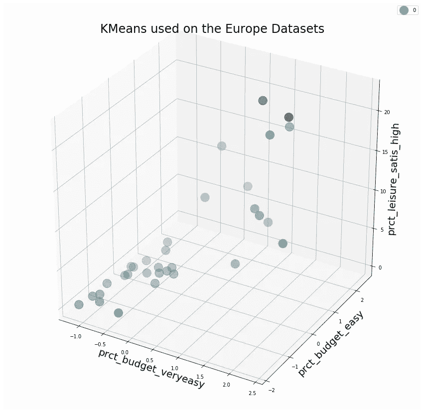

# 高级 K-Means:控制组大小和选择特征

> 原文：<https://towardsdatascience.com/advanced-k-means-controlling-groups-sizes-and-selecting-features-a998df7e6745?source=collection_archive---------3----------------------->

## K-Means 的一些有用的调整


Patrick Schneider 在 [Unsplash](https://unsplash.com/?utm_source=medium&utm_medium=referral) 上的照片

当使用 K-means 时，我们会面临两个问题:

*   我们最终得到大小非常不同的**星团**，一些包含数千个观测值，而另一些只有几个
*   我们的数据集有太多的变量，K-Means 算法很难找到一个最佳的聚类集

# 受约束的 K-Means:控制组大小

该算法基于 Bradley 等人的一篇论文，并由 Joshua Levy-Kramer:[https://github.com/joshlk/k-means-constrained](https://github.com/joshlk/k-means-constrained)使用优秀的 Google OR-Tools 库([https://developers.google.com/optimization/flow/mincostflow](https://developers.google.com/optimization/flow/mincostflow))实现

该算法使用线性规划的思想，特别是[网络模型](http://web.mit.edu/15.053/www/AMP-Chapter-08.pdf)。在物流中，网络模型被用于优化道路网络上的货物流动。


网络流模型示例(图片由作者提供)，示例取自[麻省理工学院的 AML](http://web.mit.edu/15.053/www/AMP-Chapter-08.pdf) 。

我们可以在上面的简单图形中看到，我们有 5 个节点，它们之间有有向弧(箭头)。每个结点都有一个需求(负)或供应(正)值，弧线有流量和成本值。例如，arc 2–4 的流量为 4，成本为 2 美元。类似地，节点 1 供应 20 个单位，节点 4 需要 5 个单位。

这些问题可以通过使用优化算法来解决，例如[单纯形算法](https://en.wikipedia.org/wiki/Simplex_algorithm)。

在一个非常高的层次上，我们可以用一个网络来表示这个受约束的 K-means 问题，其中我们希望最小化每个点与其聚类的质心之间的距离之和，并且对聚类大小有一些约束。

我们可以在下图中看到它的样子。每个点 x(i)都是一个值等于 1 的供应节点，并且是一条指向每个单个聚类 c 的有向弧。这些弧的成本是该点与相应聚类的质心之间的距离。C1、C2 等集群。值等于所需最小大小的需求群。最后，我们添加一个人工需求节点，以确保供应的总和等于需求的总和。


优化问题被视为一个网络(图片由作者提供)，例子取自[原始论文](http://web.mit.edu/15.053/www/AMP-Chapter-08.pdf)。

更详细的解释可以在[的原文中找到。](https://www.microsoft.com/en-us/research/wp-content/uploads/2016/02/tr-2000-65.pdf)

## Python 实现

Joshua Levy-Kramer 和其他人开发了一个包，可以在[这里](https://pypi.org/project/k-means-constrained/)获得。

它可以与 pip 一起安装

```
pip install k-means-constrained
```

然后很容易地应用于数据集，我们将重用以前文章中的那个，但是我们需要将我们的 pandas 数据帧转换成一个数组。

```
X=np.array(X).transpose()
```

然后，我们可以用我们想要的集群数量(n_clusters)、集群的最小和最大大小(size_min 和 size_max)来拟合 KMeansConstrained 方法

```
from k_means_constrained import KMeansConstrainedclf = KMeansConstrained(
     n_clusters=4,
     size_min=8,
     size_max=12,
     random_state=0
)
clf.fit_predict(X)print(clf.cluster_centers_)
print(clf.labels_)
```

然后我们可以用 *clf.cluster_centers_* 访问质心，用 *clf.labels_* 访问聚类

正如我们在下面看到的，我们获得了 4 个集群，每个集群有 8 个元素。


最小大小为 8 的 4 个聚类的结果(图片由作者提供)

在这个例子中，我们使用了一个具有两个特征的数据集，因此它可以很好地在 2D 散点图中可视化。在大多数情况下，我们将处理包含大量要素的数据集。下一节将讨论如何在集群环境中处理这些问题。

# K-均值的特征选择


照片由[edu·格兰德](https://unsplash.com/@edgr?utm_source=medium&utm_medium=referral)在 [Unsplash](https://unsplash.com?utm_source=medium&utm_medium=referral) 上拍摄

在这一节中，我们将看到在处理包含大量变量的数据集时如何选择变量。降维通常有助于找到更好的聚类。

当我们处理高维数据集时，我们可能会遇到聚类方法的问题。特征选择对于监督学习是一种众所周知的技术，但是对于非监督学习(如聚类)方法来说却很少。这里我们将开发一个相对简单的贪婪算法来对 Kaggle 上的[欧洲数据集](https://www.kaggle.com/roshansharma/europe-datasets)执行变量选择。

该算法将具有以下步骤:

0.确保变量是数值型的且经过缩放，例如使用 StandardScaler()及其 fit_transform()方法

1.  选择你要保留的变量的最大值( *maxvars* )，最小和最大的聚类数( *kmin* 和 *kmax* )，创建一个空列表: *selected_variables* 。
2.  从 kmin 到 kmax 循环。然后，依次使用每个变量，使用 K-Means 记录变量和聚类数的每个组合的轮廓值(从 kmin 到 kmax)。
3.  选择给出最大轮廓值的变量，将其添加到 *selected_variables* 中，并将其从测试变量列表中移除。
4.  通过使用 *selected_variables* 列表并依次添加每个剩余变量，重复 2 和 3 中的过程，直到达到某个停止标准(在这种情况下是要保留的变量数量， *maxvars* )。

因此，对于第一步，我们定义和初始化一些变量。

```
maxvars=3
kmin=2
kmax=8kmeans_kwargs = {"init": "random","n_init": 20,"max_iter": 1000,"random_state": 1984}
cut_off=0.5# We define a cols variables containing a list of all features:cols=list(df.columns)'''We set a list and a dictionary to store the silhouette values
for each number of clusters tested so we can choose the k value
maximising the silhouette score, with its corresponding features'''results_for_each_k=[]
vars_for_each_k={}
```

然后我们创建三个嵌套循环，外部的一个循环遍历集群数量 *k* 的值。然后我们有一个 while 循环来检查保留变量的数量是否低于由 *maxvars* 设置的阈值。 *selected_variables* 列表将保存保留的特征名称。*结果*列表将保存每个变量的轮廓值。

```
for k in range(kmin,kmax+1):
    selected_variables=[]
    while(len(selected_variables)<maxvars):
        results=[]    
        selected_variables=[]
    print(k)
    while(len(selected_variables)<maxvars):
        results=[]
```

内部循环逐一检查所有特征，将它们添加到已选择的变量中(如果有)，并评估轮廓值。然后选择获得最高值的变量，并将其添加到 *selected_variables* 列表中。

```
for col in cols:
    scols=[]
    scols.extend(selected_variables)
    scols.append(col) 
    kmeans = KMeans(n_clusters=k, **kmeans_kwargs)
    kmeans.fit(df[scols])
    results.append(silhouette_score(df[scols],   kmeans.predict(s)))''' We identify the best variable, add it to our list and remove it 
from the list of variables to be tested on the next iteration '''selected_var=cols[np.argmax(results)]
selected_variables.append(selected_var)
cols.remove(selected_var)
```

然后，我们可以在我们的循环中更新这个特定 k 值的变量列表和分数。

```
results_for_each_k.append(max(results))
vars_for_each_k[k]=selected_variables
```

最后，在三个循环运行之后，我们可以确定 k 和变量的最佳组合，拟合模型并绘制它。

```
best_k=np.argmax(results_for_each_k)+kmin
selected_variables=vars_for_each_k[best_k]
kmeans = KMeans(n_clusters=best_k, **kmeans_kwargs)
kmeans.fit(df_[selected_variables])
clusters=kmeans.predict(df[selected_variables])
```


基于人口、财富和犯罪率的 2 组国家的最终结果(图片由作者提供)

如果我们选择 3 个集群，我们会得到不同的选择



对于 3 个集群，我们有不同的变量选择(图片由作者提供)

每组国家的一些例子:

冰岛、瑞士、比利时、德国、卢森堡、荷兰、奥地利和英国

第二组:希腊、西班牙、法国、克罗地亚、意大利、塞浦路斯、拉脱维亚、立陶宛、匈牙利、马耳他、波兰、葡萄牙

第 3 组:挪威、丹麦、芬兰和瑞典

这是完整的代码，包括 3d 绘图。

我们当然可以将变量选择与受约束的 K-Means 算法相结合，以强制均匀聚类。

我希望这个教程是有帮助的，如果你有问题，请随意评论。

## **参考文献**

页（page 的缩写）S. Bradley，K. P. Bennett 和 A. Demiriz，[约束 K 均值聚类](https://www.microsoft.com/en-us/research/wp-content/uploads/2016/02/tr-2000-65.pdf) (2000 年)

布拉德利、哈克斯和马格南蒂，[应用数学编程](http://web.mit.edu/15.053/www/AMP.htm)，艾迪森-韦斯利(1977)