# 高级 NumPy:25 个图解练习掌握步幅技巧

> 原文：<https://towardsdatascience.com/advanced-numpy-master-stride-tricks-with-25-illustrated-exercises-923a9393ab20?source=collection_archive---------2----------------------->

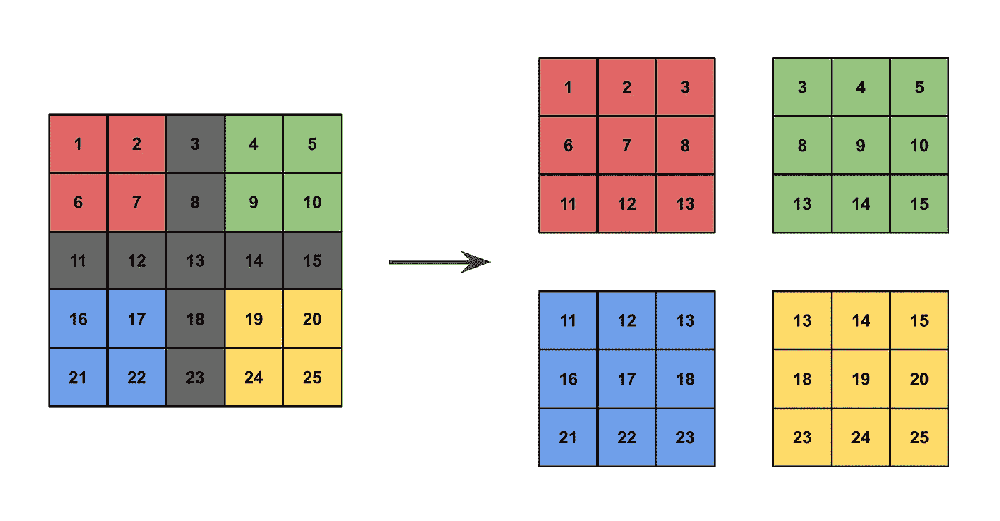

## 包括来自 StackOverflow 的代码、解释和问题

*在桌面上用 Chrome 浏览器观看效果最佳*

*变更日志:
2022 年 12 月 31 日:使用 Medium 的新代码块进行语法突出显示
2022 年 1 月 6 日:根据来自*[*Sirouan Nouriddine*](https://medium.com/u/6fb228d2ed8f?source=post_page-----923a9393ab20--------------------------------) *2022 年 1 月 5 日:修复错别字并提高清晰度
2021 年 12 月 30 日:从 NumPy 1.20.0 开始，有一个 sliding_window_view API，它也可以作为更高级别的 API 更多*见 [*此处*](https://numpy.org/doc/stable/reference/generated/numpy.lib.stride_tricks.sliding_window_view.html?highlight=as_strided#numpy-lib-stride-tricks-sliding-window-view)

**(此处跳转到习题*<#4838>**)***

**他可以被看作是访问和操作 NumPy `[ndarray](https://numpy.org/doc/stable/reference/arrays.ndarray.html)`的通常方式的扩展，给予用户更多的灵活性来控制最终的 NumPy [视图](https://numpy.org/doc/stable/reference/generated/numpy.ndarray.view.html)。虽然这是一个深奥的功能，但一个特别实用的用法是当涉及到*滑动窗口*或*滚动统计*时。在本文中，我们将完成使用该 API 的 25 个不同的练习(并与我们通常的做法进行比较)。**

**对于本文，建议读者具备 Python、NumPy、`[numpy.dtype](https://numpy.org/devdocs/user/basics.types.html)`、`[numpy.ndarray.strides](https://numpy.org/doc/stable/reference/generated/numpy.ndarray.strides.html)`和`[numpy.ndarray.itemsize](https://numpy.org/doc/stable/reference/generated/numpy.ndarray.itemsize.html)`的中级知识。有关 NumPy 数组和步长的快速介绍，请参见💡**下面一点背景**。**

**练习的难度逐渐增加，按以下顺序编排:**

*   **这个问题用一个图来说明，图中有 NumPy 数组输入和预期的输出，即 NumPy 视图。假设您读取元素的方式是连续的。`itemsize`因问题而异。**
*   **答案是——`strides`和`shape`将被用作`numpy.lib.stride_tricks.as_strided`中的参数，以获得最终的数字视图。**
*   **解释**
*   **代码，其中`as_strided`是从这个 import 语句导入的名称空间:
    `**from** numpy.lib.stride_tricks **import** as_strided`**

> *****💡一点背景*****
> 
> ***如何从一个固定大小的元素块中访问一个特定的项目，这些元素(I)是连续放置的，并且(ii)被组织成嵌套的子组？答案:* ***大踏步*** *。我刚才简单描述的是一个 NumPy 的 N 维数组(* `*ndarray*` *)数据结构，我们用一个叫做* [*的算法，步进索引方案*](https://numpy.org/doc/stable/reference/arrays.ndarray.html#internal-memory-layout-of-an-ndarray) *连同步距一起遍历它。***
> 
> **关于 NumPy 数组，这里有 4 个你应该知道的要点。**
> 
> ***1)NumPy 数组中的元素占用内存。NumPy 数组中的每个元素统一占用* n *个字节。例如，数据类型为* `*np.int64*` *的数组中的每个元素占用 8 个字节。* `*np.ndarray.itemsize*` *找出物品尺寸。***
> 
> ***2)NumPy 数组中的元素在内存中是连续存储的。这意味着它们是并排存储的(不像 Python 列表中的元素)。***
> 
> ***3)有一条信息叫做 shape，你可能已经知道了，它定义了这个数组对于每个维度有多大。要访问这些信息，请选择* `*np.ndarray.shape*` *。***
> 
> ***4)还有另一条信息叫做步幅，它表示要跳到维度中下一个值的字节数。要访问这些信息，请选择* `*np.ndarray.strides*` *。***
> 
> ***利用这 4 条信息，可以通过以跨距为系数的维度的线性组合来找到元素的存储位置。更深入的解释，参考我下面* *的参考文献* [*。*](#6c04)**

# **练习**

1.  **[切片前 3 个元素](#176a)**
2.  **[切片前 8 个元素](#9c37)**
3.  **[展平一个 2D 阵列](#306b)**
4.  **[每隔一个元素跳过一个](#cb6a)**
5.  **[切片第一列](#cbd9)**
6.  **[切一条对角线](#e7ad)**
7.  **[重复第一个元素](#233c)**
8.  **[简单的 2D 切片](#a323)**
9.  **[切成锯齿形](#7108)**
10.  **[稀疏切片](#12e7)**
11.  **[转置一个 2D 数组](#4651)**
12.  **[重复第一列 4 次](#93bc)**
13.  **[将 1D 阵列重塑为 2D 阵列](#0dd0)**
14.  **[滑动一个 1D 窗口](#4f4d)**
15.  **[滑动一扇 2D 窗，然后展平](#0dba)**
16.  **[从 3D 数组中折叠一个轴](#407e)**
17.  **[2 个角](#a4eb)**
18.  **[交错切片](#74c1)**
19.  **[重复一次 2D 阵列](#5b85)**
20.  **[3D 转置](#9e01)**
21.  **[滑动一个 2D 窗口](#a3f5)**
22.  **[将 1D 阵列重塑为 3D 阵列](#79a7)**
23.  **[载玻片 2D 感受野进行卷积](#1f28)**
24.  **[重复一个 3D 张量](#231a)**
25.  **[将 1D 阵重塑为 4D 阵](#345b)**

# **1D 演习**

## **1)切片前 3 个元素**

**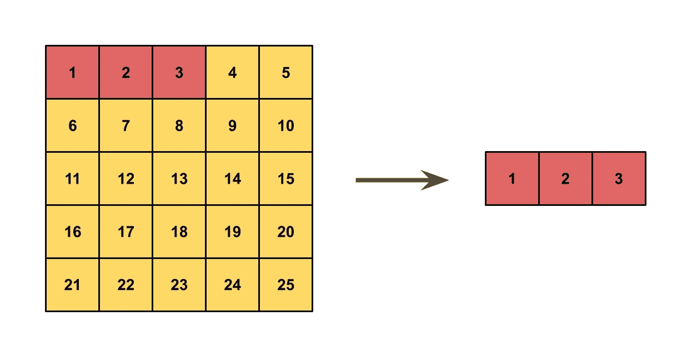**

**输入项大小: **1 字节** |输入步数:( **5** ， **1** )**

****回答****

```
**strides = (**1**,)
  shape = (**3**,)**
```

> ***💡* ***解释*** *输出中相邻的元素(即 1 → 2，2 → 3)原来都是* ***1*** *字节相隔(=1 元素相隔* × *1* *字节)输入中的。这个维度的形状是* ***3*** *。***

****代码****

```
**>>> x = np.asarray(range(1,26), np.int8).reshape(5,5)
>>> as_strided(x, shape=(3,), strides=(1,))
array([1, 2, 3], dtype=int8)**
```

**与…类似**

```
**>>> x[0,:3]
array([1, 2, 3], dtype=int8)**
```

## **2)切片前 8 个元素**

**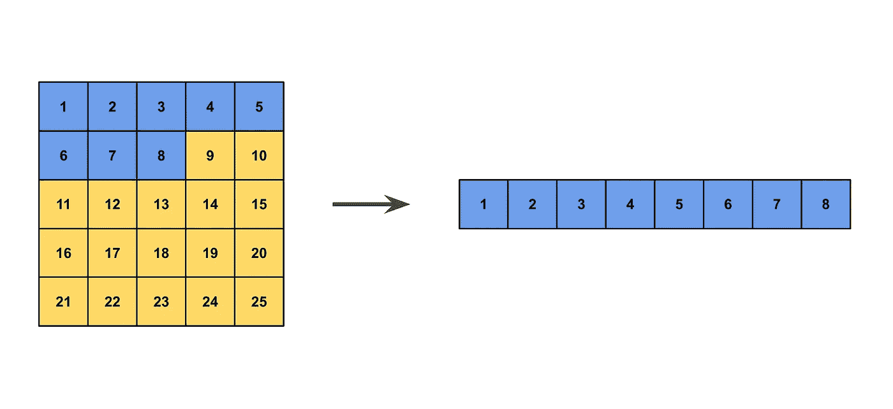**

**输入项大小: **1 字节** |输入步数:( **5** ， **1** )**

****回答****

```
**strides = (**1**,)
  shape = (**8**,)**
```

> ***💡* ***解释*** *输出中相邻的元素(如 1 → 2，2 → 3，6 → 7)原本是* ***输入中相隔 1*** *字节(=1 个元素相隔* × *1* *字节)。这个维度的形状是* ***8*** *。***

****代码****

```
**>>> x = np.asarray(range(1,26), np.int8).reshape(5,5)
>>> as_strided(x, shape=(8,), strides=(1,))
array([1, 2, 3, 4, 5, 6, 7, 8], dtype=int8)**
```

**与…类似**

```
**>>> x[0,:8]
array([1, 2, 3, 4, 5, 6, 7, 8], dtype=int8)**
```

## **3)展平 2D 阵列**

**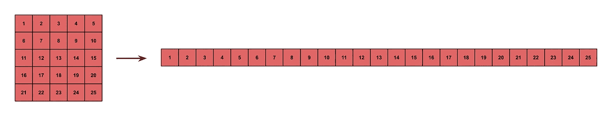**

**输入项大小: **2 字节** |输入步数:( **10** ， **2** )**

****回答****

```
**strides = (**2**,)
  shape = (**25**,)**
```

> ***💡* ***解释*** *输出中的相邻元素(如 1 → 2，2 → 3，23 → 24，24 → 25)原本是* ***2*** *字节相隔(=1 个元素相隔* × *2* *字节)输入中的。这个维度的形状是****25****。***

****代码****

```
**>>> x = np.asarray(range(1,26), np.int16).reshape(5,5)
>>> as_strided(x, shape=(25,), strides=(2,))
array([ 1,  2,  3,  4,  5,  6,  7,  8,  9, 10,
       11, 12, 13, 14, 15, 16, 17, 18, 19, 20,
       21, 22, 23, 24, 25], dtype=int16)**
```

**与…类似**

```
**>>> x.ravel()
array([ 1,  2,  3,  4,  5,  6,  7,  8,  9, 10,
       11, 12, 13, 14, 15, 16, 17, 18, 19, 20,
       21, 22, 23, 24, 25], dtype=int16)**
```

## **4)跳过所有其他元素**

**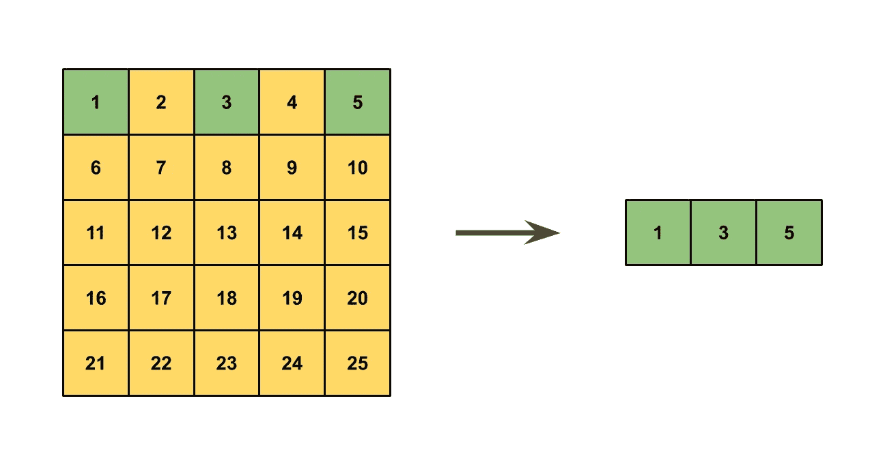**

**输入项大小: **1 字节** |输入步数:( **5** ， **1** )**

****回答****

```
**strides = (**2**,)
  shape = (**3**,)**
```

> ***💡* ***解释*** *输出中相邻的元素(即 1 → 3，3 → 5)原本是****2****字节相隔(=2 个元素相隔* × *1* *字节)的输入。这个尺寸的形状是****3****。***

****代码****

```
**>>> x = np.asarray(range(1,26), np.int8).reshape(5,5)
>>> as_strided(x, shape=(3,), strides=(2,))
array([1, 3, 5], dtype=int8)**
```

**与…类似**

```
**>>> x[0,::2]
array([1, 3, 5], dtype=int8)**
```

## **5)切片第一列**

**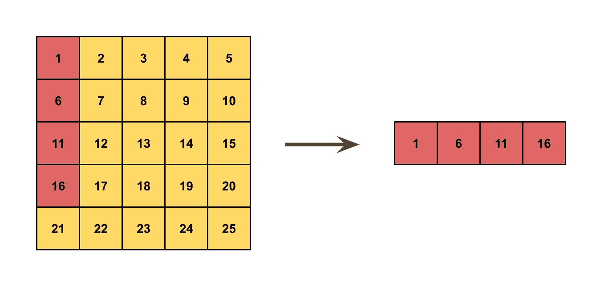**

**输入项大小: **8 字节** |输入步数:( **40** ， **8** )**

****回答****

```
**strides = (**40**,)
  shape = (**4**,)**
```

> ***💡* ***解释*** *输出中相邻的元素(即 1 → 6，6 → 11，11 → 16)被原本**40*字节相隔(=5 个元素相隔* × *8* *字节)输入中。这个维度的形状是* ***4*** *。****

*****代码*****

```
***>>> x = np.asarray(range(1,26), np.int64).reshape(5,5)
>>> as_strided(x, shape=(4,), strides=(40,))
array([ 1,  6, 11, 16])***
```

***与…类似***

```
***>>> x[:4,0]
array([ 1,  6, 11, 16])***
```

## ***6)切一条对角线***

***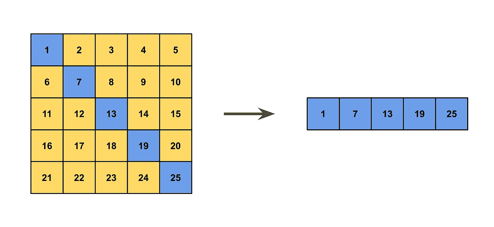***

***输入项大小: **8 字节** |输入步数:( **40** ， **8** )***

*****回答*****

```
***strides = (**48**,)
  shape = ( **5**,)***
```

> ****💡* ***解释*** *输出中相邻的元素(即 1 → 7，7 → 13，13 → 19，19 → 25)原本是* ***48*** *字节相隔(=6 个元素相隔* × *8 个字节)输入中的。这个尺寸的形状是* ***5*** *。****

*****代码*****

```
***>>> x = np.asarray(range(1,26), np.int64).reshape(5,5)
>>> as_strided(x, shape=(5,), strides=(48,))
array([ 1,  7, 13, 19, 25])***
```

***与…类似***

```
***>>> x.diagonal()
array([ 1,  7, 13, 19, 25])***
```

## ***7)重复第一个元素***

***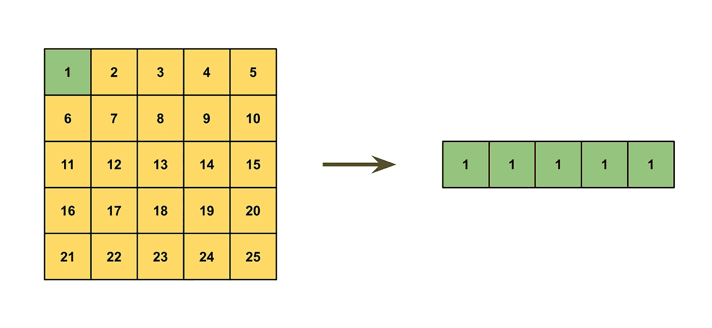***

***输入项大小: **8 字节** |输入步数:( **40** ， **8** )***

*****回答*****

```
***strides = (**0**,)
  shape = (**5**,)***
```

> ****💡* ***解释*** *输出中相邻的元素(即 1 → 1)原本是* ***0*** *字节相隔(=0 个元素相隔*×8*字节)输入中的。这个维度的形状是* ***5*** *。****

*****代码*****

```
***>>> x = np.asarray(range(1,26), np.int64).reshape(5,5)
>>> as_strided(x, shape=(5,), strides=(0,))
array([ 1, 1, 1, 1, 1])***
```

***与…类似***

```
***>>> np.broadcast_to(x[0,0], (5,))
array([1, 1, 1, 1, 1])***
```

# ***2D 演习***

## ***8)简单的 2D 切片***

***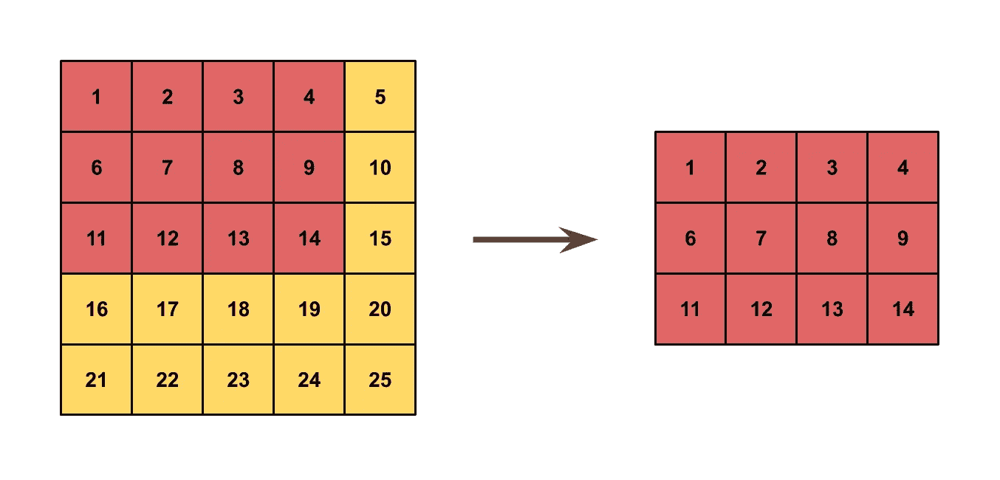***

***输入项大小: **8 字节** |输入步数:( **40** ， **8** )***

*****回答*****

```
***strides = (**40**,**8**)
  shape = ( **3**,**4**)***
```

> ****💡* ***解释******
> 
> ****输出的左右尺寸(axis=* `-1` *):
> 输出中相邻的元素(如 1 → 2，2 → 3，8 → 9)原本是输入中的****8****字节(=1 个元素之外的* × *8* *字节)。这个尺寸的形状是****4****。****
> 
> ****输出的左右维度(axis=* `-2` *):
> 输出中相邻的元素(如 1 → 6，2 → 7，9 → 14)原来在输入中相隔* ***40*** *字节(=5 个元素之外* × *8* *字节)。这个维度的形状是* ***3*** *。****

*****代码*****

```
***>>> x = np.asarray(range(1,26), np.int64).reshape(5,5)
>>> as_strided(x, shape=(3,4), strides=(40,8))
array([[ 1,  2,  3,  4],
       [ 6,  7,  8,  9],
       [11, 12, 13, 14]])***
```

***与…类似***

```
***>>> x[:3,:4]
array([[ 1,  2,  3,  4],
       [ 6,  7,  8,  9],
       [11, 12, 13, 14]])***
```

## ***9)切一个锯齿形***

***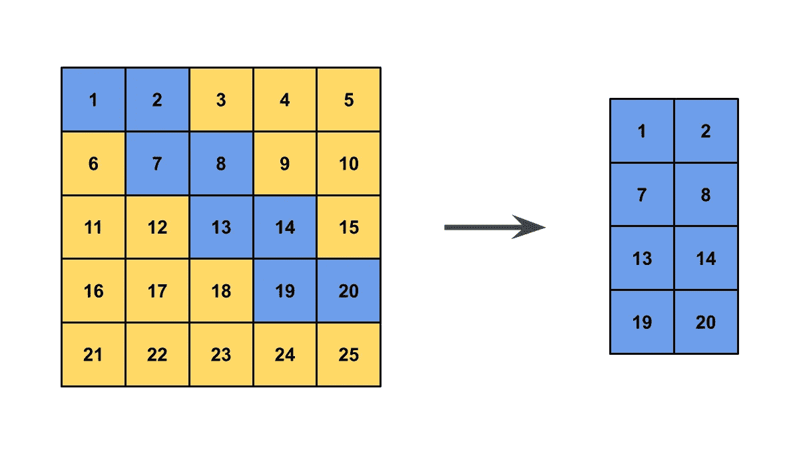***

***输入项大小: **8 字节** |输入步数:( **40** ， **8** )***

*****回答*****

```
***strides = (**48**,**8**)
  shape = ( **4**,**2**)***
```

> ****💡* ***解说******
> 
> ****输出的左右维度(axis=* `-1` *):
> 输出中相邻的元素(例如 1 → 2，7 → 8，13 → 14，19 → 20)原本是输入中* ***8*** *字节(=1 个元素之外* × *8* *字节)。这个维度的形状是* ***2*** *。****
> 
> ****输出的左右维度(axis=* `-2` *):
> 输出中相邻的元素(如 1 → 7，2 → 8，13 → 19)原本是输入中* ***48*** *字节(=6 个元素之外* × *8* *字节)。这个维度的形状是* ***4*** *。****

*****代码*****

```
***>>> x = np.asarray(range(1,26), np.int64).reshape(5,5)
>>> as_strided(x, shape=(4,2), strides=(48,8))
array([[ 1,  2],
       [ 7,  8],
       [13, 14],
       [19, 20]])***
```

***与…类似***

```
***>>> # this may not be achieved concisely***
```

## ***10)稀疏切片***

***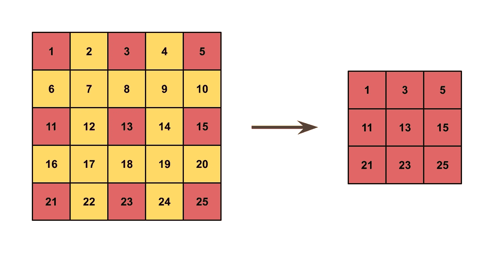***

***输入项大小: **8 字节** |输入步数:( **40** ， **8** )***

*****回答*****

```
***strides = (**80**,**16**)
  shape = ( **3**, **3**)***
```

> ****💡* ***解说******
> 
> ****输出的左右维度(axis=* `-1` *):
> 输出中相邻的元素(例如 1 → 3，21 → 23，13 → 15)原来是输入中****16****字节(=2 个元素之外* × *8* *字节)。这个维度的形状是****3****。****
> 
> ****输出的左右维度(axis=* `-2` *):
> 输出中相邻的元素(如 1 → 11，13 → 23，15 → 25)原来在输入中相隔* ***80*** *字节(=相隔 10 个元素* × *8* *字节)。这个维度的形状是* ***3*** *。****

*****代码*****

```
***>>> x = np.asarray(range(1,26), np.int64).reshape(5,5)
>>> as_strided(x, shape=(3,3), strides=(80,16))
array([[ 1,  3,  5],
       [11, 13, 15],
       [21, 23, 25]])***
```

***与…类似***

```
***>>> x[::2,::2]
array([[ 1,  3,  5],
       [11, 13, 15],
       [21, 23, 25]])***
```

## ***11)转置 2D 阵列***

***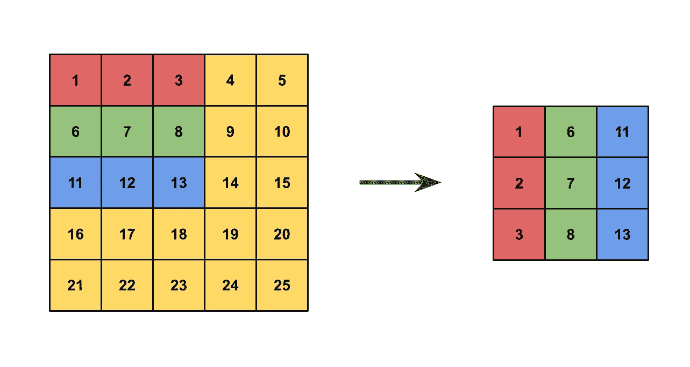***

***输入项大小: **1 字节** |输入步数:( **5** ， **1** )***

*****回答*****

```
***strides = (**1**,**5**)
  shape = (**3**,**3**)***
```

> ****💡* ***解说******
> 
> ****输出的左右维度(axis=* `-1` *):
> 输出中相邻的元素(如 1 → 6，7 → 12，3 → 8)原本是输入中***相隔 5 个字节(=5 个元素之外* × *1* *字节)。这个维度的形状是* ***3*** *。*****
> 
> ****输出的从上到下的维度(axis=* `-2` *):
> 输出中相邻的元素(如 1 → 2，2 → 3，11 → 12)原来在输入中是* ***1*** *字节(=1 个元素之外* × *1* *字节)。这个维度的形状是* ***3*** *。****

*****代码*****

```
***>>> x = np.asarray(range(1,26), np.int8).reshape(5,5)
>>> as_strided(x, shape=(3,3), strides=(1,5))
array([[ 1,  6, 11],
       [ 2,  7, 12],
       [ 3,  8, 13]], dtype=int8)***
```

***与…类似***

```
***>>> x[:3,:3].T
array([[ 1,  6, 11],
       [ 2,  7, 12],
       [ 3,  8, 13]], dtype=int8)***
```

## ***12)重复第一列 4 次***

***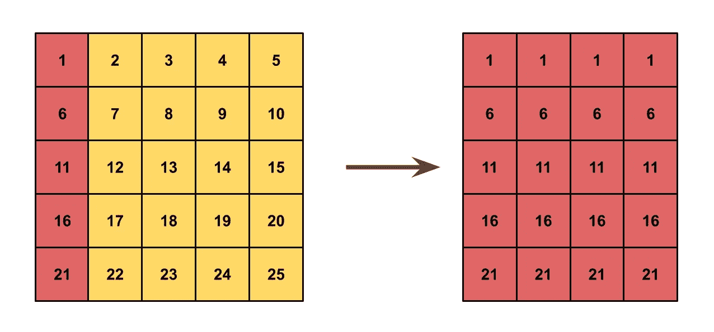***

***输入项大小: **4 字节** |输入步数:( **20** ， **4** )***

*****回答*****

```
***strides = (**20**,**0**)
  shape = ( **5**,**4**)***
```

> ****💡* ***解说******
> 
> ****输出的左右维度(axis=* `-1` *):
> 输出中相邻的元素(如 1 → 1，6 → 6，16 → 16)原来是输入中****0****字节(=0 个元素之外* × *4* *字节)。这个维度的形状是****4****。****
> 
> ****输出的上下维(axis=* `-2` *):
> 输出中相邻的元素(如 1 → 6，6 → 11，11 → 16)在输入中原本是* ***相隔 20*** *字节(=相隔 5 个元素* × *4 字节)。这个维度的形状是* ***5*** *。****

*****代码*****

```
***>>> x = np.asarray(range(1,26), np.int32).reshape(5,5)
>>> as_strided(x, shape=(5,4), strides=(20,0))
array([[ 1,  1,  1,  1],
       [ 6,  6,  6,  6],
       [11, 11, 11, 11],
       [16, 16, 16, 16],
       [21, 21, 21, 21]], dtype=int32)***
```

***与…类似***

```
***>>> np.broadcast_to(x[:,0,None], (5,4))
array([[ 1,  1,  1,  1],
       [ 6,  6,  6,  6],
       [11, 11, 11, 11],
       [16, 16, 16, 16],
       [21, 21, 21, 21]], dtype=int32)***
```

## ***13)将 1D 阵列重塑为 2D 阵列***

***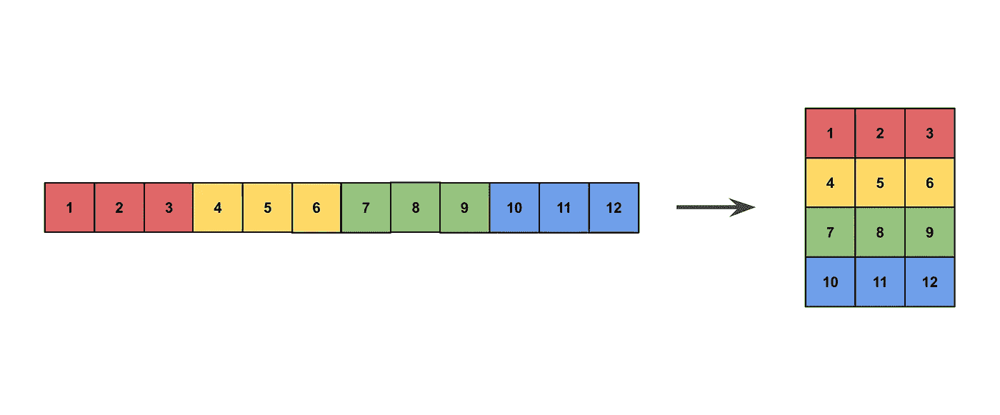***

***输入项大小: **8 字节** |输入步数:( **8** ，)***

*****回答*****

```
***strides = (**24**,**8**)
  shape = ( **4**,**3**)***
```

> ****💡* ***解说******
> 
> ****输出的左右尺寸(axis=* `-1` *):
> 输出中相邻的元素(如 1 → 2，2 → 3，7 → 8，11 → 12)原本是输入中* ***8*** *字节(=1 个元素之外* × *8* *字节)。这个维度的形状是* ***3*** *。****
> 
> ****输出的上下维(axis=* `-2` *):
> 输出中相邻的元素(如 1 → 4，4 → 7，7 → 10)原本在输入中相隔* ***24*** *字节(=3 个元素之外* × *8* *字节)。这个维度的形状是* ***4*** *。****

*****代码*****

```
***>>> x = np.asarray(range(1,13), np.int64)
>>> as_strided(x, shape=(4,3), strides=(24,8))
array([[ 1,  2,  3],
       [ 4,  5,  6],
       [ 7,  8,  9],
       [10, 11, 12]])***
```

***与…类似***

```
***>>> x.reshape(4,3)
array([[ 1,  2,  3],
       [ 4,  5,  6],
       [ 7,  8,  9],
       [10, 11, 12]])***
```

## ***14)滑动 1D 窗***

***改编自 StackOverflow 帖子[ [1](#6c04) ]。类似于[ [2](#6c04) 和[ [3](#6c04) ]。***

***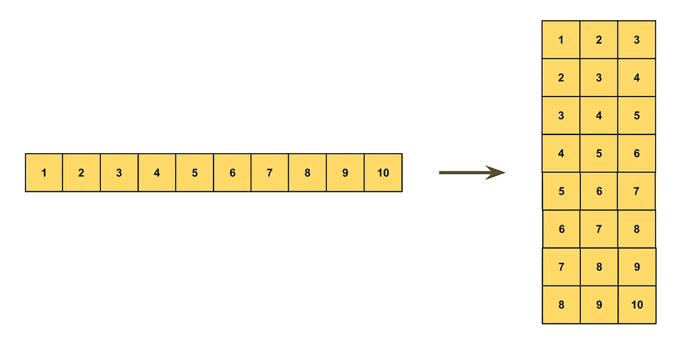***

***输入项大小: **1 字节** |输入步数:( **1** ，)***

*****回答*****

```
***strides = (**1**,**1**)
  shape = (**8**,**3**)***
```

> ****💡* ***解说******
> 
> ****输出的左右维度(axis=* `-1` *):
> 输出中相邻的元素(如 1 → 2，3 → 4，4 → 5)原来是输入中****1****字节(=1 个元素之外* × *1* *字节)。这个维度的形状是****3****。****
> 
> ****输出的上下维(axis=* `-2` *):
> 输出中相邻的元素(即 1 → 2，2 → 3，4 → 5，…，7 → 8)在输入中原本是* ***1*** *字节相隔(=1 个元素之外* × *1* *字节)。这个维度的形状是* ***8*** *。****

*****代码*****

```
***>>> x = np.asarray(range(1,26), np.int8)
>>> as_strided(x, shape=(8,3), strides=(1,1))
array([[ 1,  2,  3],
       [ 2,  3,  4],
       [ 3,  4,  5],
       [ 4,  5,  6],
       [ 5,  6,  7],
       [ 6,  7,  8],
       [ 7,  8,  9],
       [ 8,  9, 10]], dtype=int8)***
```

***与…类似***

```
***>>> # this may not be achieved concisely***
```

## ***15)滑动 2D 窗，然后将其压平***

***来自 StackOverflow 帖子[ [4](#6c04) ]的问题。***

***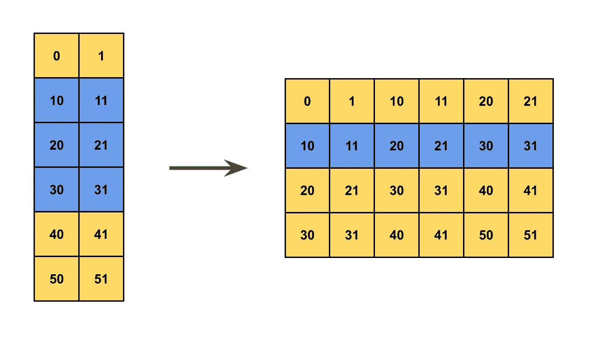***

***输入项大小: **1 字节** |输入步数:( **2** ， **1** )***

*****回答*****

```
***strides = (**2**,**1**)
  shape = (**4**,**6**)***
```

> ****💡* ***解说******
> 
> ****输出的左右尺寸(axis=* `-1` *):
> 输出中相邻的元素(如 0 → 1，1 → 10，31 → 40)原来是输入中* ***1*** *字节(=1 个元素之外* × *1* *字节)。这个维度的形状是* ***6*** *。****
> 
> ****输出的上下维(axis=* `-2` *):
> 输出中相邻的元素(如 0 → 10，10 → 20，41 → 51)原来在输入中是* ***2*** *字节(=2 个元素之外* × *1 字节)。这个维度的形状是* ***4*** *。****

*****代码*****

```
***>>> x = np.asarray(
...         [0,1,10,11,20,21,30,31,40,41,50,51],
...         np.int8).reshape(6,2)
>>> as_strided(x, shape=(4,6), strides=(2,1))
array([[ 0,  1, 10, 11, 20, 21],
       [10, 11, 20, 21, 30, 31],
       [20, 21, 30, 31, 40, 41],
       [30, 31, 40, 41, 50, 51]], dtype=int8)***
```

***与…类似***

```
***>>> # this may not be achieved concisely***
```

## ***16)从 3D 数组中折叠一个轴***

***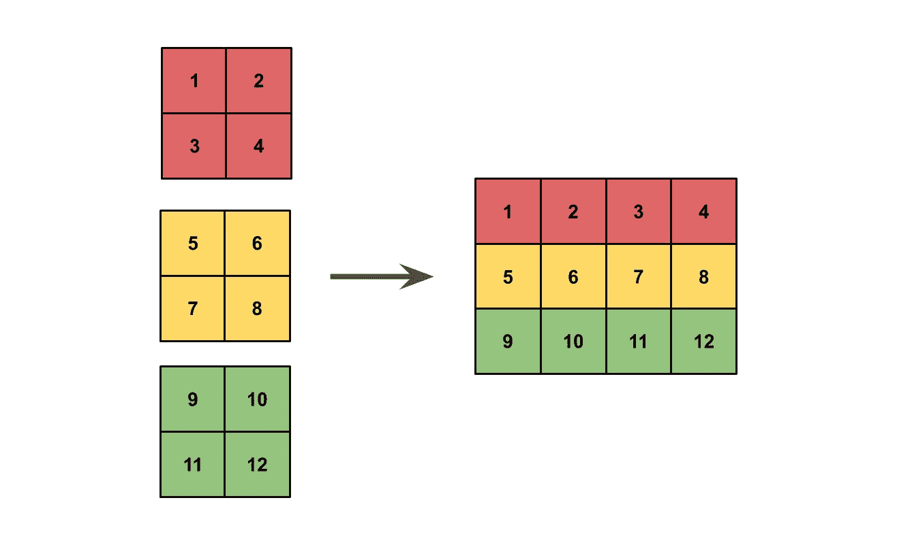***

***输入项大小: **1 字节** |输入步数:( **4** 、 **2** 、 **1** )***

*****回答*****

```
***strides = (**4**,**1**)
  shape = (**3**,**4**)***
```

> ****💡* ***解说******
> 
> ****输出的左右维度(axis=* `-1` *):
> 输出中相邻的元素(如 1 → 2，3 → 4，4 → 5)原来在输入中是****1****字节(=1 个元素之外* × *1* *字节)。这个尺寸的形状是****4****。****
> 
> ****输出的上下维(axis=* `-2` *):
> 输出中相邻的元素(即 1 → 5，5 → 9，2 → 6，6 → 10)原本在输入中相隔* ***4*** *字节(=相隔 4 个元素* × *1* *字节)。这个维度的形状是* ***3*** *。****

*****代码*****

```
***>>> x = np.asarray(range(1,13), np.int8).reshape(3,2,2)
>>> as_strided(x, shape=(3,4), strides=(4,1))
array([[ 1,  2,  3,  4],
       [ 5,  6,  7,  8],
       [ 9, 10, 11, 12]], dtype=int8)***
```

***与…类似***

```
***>>> x.reshape(3,4)
array([[ 1,  2,  3,  4],
       [ 5,  6,  7,  8],
       [ 9, 10, 11, 12]], dtype=int8)***
```

# ***3D 练习***

## ***17)两个角***

***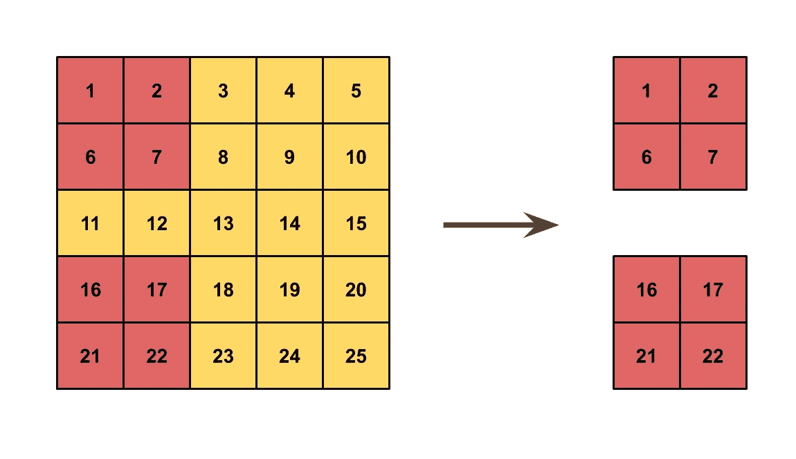***

***输入项大小: **2 字节** |输入步数:( **10** ， **2** )***

*****回答*****

```
***strides = (**30**,**10**, **2**)
  shape = ( **2**, **2**, **2**)***
```

> ****💡* ***解说******
> 
> ****输出的左右维度(axis=* `-1` *):
> 输出中相邻的元素(即 1 → 2，6 → 7，16 → 17，21 → 22)原来在输入中是* ***2*** *字节(=1 个元素之外* × *2* *字节)。这个维度的形状是* ***2*** *。****
> 
> ****输出的上下维度(axis=* `-2` *):
> 输出中的相邻元素(即 1 → 6，2 → 7，16 → 21，17 → 22)原本是* ***10*** *字节的间隔(=5 个元素之外* × *2* *字节)这个维度的形状是* ***2*** *。****
> 
> ****输出的框到框尺寸(axis=* `-3` *):
> 输出中的相邻元素(即 1 → 16，2 → 17，6 → 21，7 → 22)原本是输入中的* ***30*** *字节(=15 个元素之外的* × *2* *字节)。这个维度的形状是****2****。****

*****代码*****

```
***>>> x = np.asarray(range(1,26), np.int16).reshape(5,5)
>>> as_strided(x, shape=(2,2,2), strides=(30,10,2))
array([[[ 1,  2],
        [ 6,  7]],
       [[16, 17],
        [21, 22]]], dtype=int16)***
```

***与…类似***

```
***>>> # this may not be achieved concisely***
```

## ***18)交错切片***

***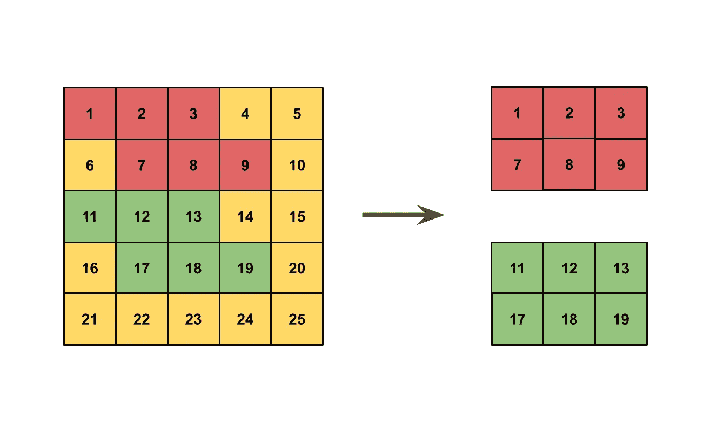***

***输入项大小: **1 字节** |输入步数:( **5** ， **1** )***

*****回答*****

```
***strides = (**10**,**6**,**1**)
  shape = ( **2**,**2**,**3**)***
```

> ****💡* ***解释******
> 
> ****输出的盒内从左到右维度(axis=* `-1` *):
> 输出中相邻的元素(如 1 → 2，2 → 3，17 → 18)原本是输入中* ***1*** *字节(=1 个元素之外* × *1* *字节)。这个维度的形状是* ***3*** *。****
> 
> ****输出的盒内上下维度(axis=* `-2` *):
> 输出中的相邻元素(如 1 → 7，11 → 17，12 → 18)原本是输入中的* ***6*** *字节(=6 个元素之外* × *1* *字节)。这个尺寸的形状是* ***2*** *。****
> 
> ****输出的左框到右框尺寸(axis=* `-3` *):
> 输出中的相邻元素(例如 1 → 11，8 → 18，9 → 19)原本是输入中的* ***10*** *字节(=10 个元素之外的* × *1* *字节)。这个尺寸的形状是* ***2*** *。****

*****代码*****

```
***>>> x = np.asarray(range(1,26), np.int8).reshape(5,5)
>>> as_strided(x, shape=(2,2,3), strides=(10,6,1))
array([[[ 1,  2,  3],
        [ 7,  8,  9]],
       [[11, 12, 13],
        [17, 18, 19]]], dtype=int8)***
```

***与…类似***

```
***>>> # this may not be achieved concisely***
```

## ***19)重复 2D 阵列***

***这个问题摘自 StackOverflow 在这里的一个帖子[ [5](#6c04) 。***

***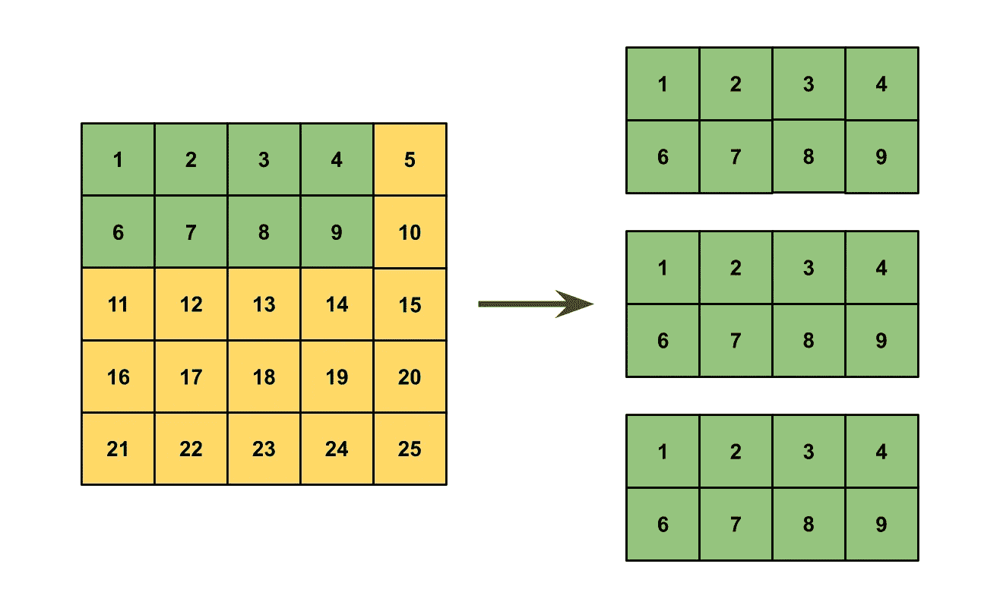***

***输入项大小: **2 字节** |输入步数:( **10** ， **2** )***

*****回答*****

```
***strides = (**0**,**10**,**2**)
  shape = (**3**, **2**,**4**)***
```

> ****💡* ***解说******
> 
> ****输出的盒内从左到右维度(axis=* `-1` *):
> 输出中的相邻元素(例如 1 → 2，2 → 3，6 → 7)原本是输入中的* ***2*** *字节(=1 个元素之外* × *2* *字节)。这个维度的形状是****4****。****
> 
> ****输出的盒内上下维度(axis=* `-2` *):
> 输出中相邻的元素(如 1 → 6，2 → 7，3 → 8)原本在输入中相隔****10****字节(=相隔 5 个元素* × *2* *字节)。这个尺寸的形状是****2****。****
> 
> ****输出的左框到右框尺寸(axis=* `-3` *):
> 输出中相邻的元素(如 1 → 1，3 → 3，7 → 7)原来是输入中* ***0*** *字节(=0 个元素之外* × *2* *字节)。这个维度的形状是* ***3*** *。****

*****代码*****

```
***>>> x = np.asarray(range(1,26), np.int16).reshape(5,5)
>>> as_strided(x, shape=(3,2,4), strides=(0,10,2))
array([[[1, 2, 3, 4],
        [6, 7, 8, 9]],
       [[1, 2, 3, 4],
        [6, 7, 8, 9]],
       [[1, 2, 3, 4],
        [6, 7, 8, 9]]], dtype=int16)***
```

***与…类似***

```
***>>> np.broadcast_to(x[0:2, 0:-1], (3, 2, 4))***
```

## ***20) 3D 转置***

***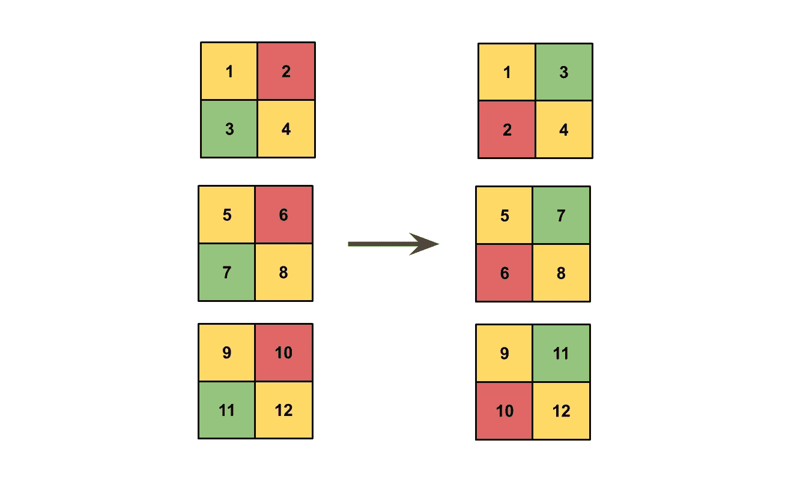***

***输入项大小: **4 字节** |输入步数:( **16** 、 **8** 、 **4** )***

*****回答*****

```
***strides = (**16**,**4**,**8**)
  shape = ( **3**,**2**,**2**)***
```

> ****💡* ***解说******
> 
> ****输出的左右尺寸(axis=* `-1` *):
> 输出中相邻的元素(如 1 → 3，2 → 4，10 → 12)原本是输入中* ***8*** *字节(=2 个元素之外* × *4* *字节)。这个维度的形状是* ***2*** *。****
> 
> ****输出的上下维(axis=* `-2` *):
> 输出中相邻的元素(如 1 → 2，3 → 4，9 → 10，11 → 12)原本在输入中相隔* ***4*** *字节(=1 个元素之外* × *4* *字节)。这个维度的形状是* ***2*** *。****
> 
> ****输出的左框到右框尺寸(axis=* `-3` *):
> 输出中相邻的元素(例如 1 → 5，5 → 9)原本是输入中* ***16*** *字节(=4 个元素之外* × *4* *字节)。这个维度的形状是****3****。****

*****代码*****

```
***>>> x = np.asarray(range(1,13), np.int32).reshape(3,2,2)
>>> as_strided(x, shape=(3,2,2), strides=(16,4,8))
array([[[ 1,  3],
        [ 2,  4]],
       [[ 5,  7],
        [ 6,  8]],
       [[ 9, 11],
        [10, 12]]], dtype=int32)***
```

***与…类似***

```
***>>> np.swapaxes(x,1,2)
array([[[ 1,  3],
        [ 2,  4]],
       [[ 5,  7],
        [ 6,  8]],
       [[ 9, 11],
        [10, 12]]], dtype=int32)***
```

## ***21)滑动 2D 窗***

***问题改编自 SciPy 2008 会议[ [6](#6c04) ]。***

***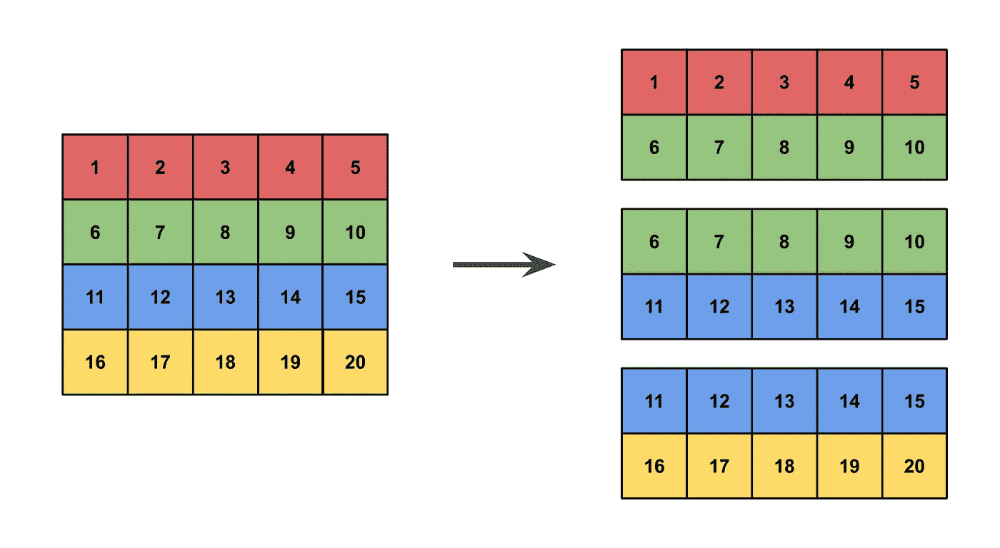***

***输入项大小: **8 字节** |输入步数:( **40** ， **8** )***

*****回答*****

```
***strides = (**40**,**40**,**8**)
  shape = ( **3**, **2**,**5**)***
```

> ****💡* ***解释******
> 
> ****输出的盒内从左到右维度(axis=* `-1` *):
> 输出中相邻的元素(如 1 → 2，12 → 13，16 → 17)原本在输入中相隔* ***8*** *字节(=1 个元素之外* × *8* *字节)。这个尺寸的形状是* ***5*** *。****
> 
> ****输出的盒内上下维度(axis=* `-2` *):
> 输出中的相邻元素(如 1 → 6，8 → 13，11 → 16)原本是输入中的* ***40*** *字节(=5 个元素之外* × *8* *字节)。这个尺寸的形状是* ***2*** *。****
> 
> ****输出的左框到右框尺寸(axis=* `-3` *):
> 输出中相邻的元素(如 9 → 14，14 → 19)原本在输入中相隔* ***40*** *字节(=5 个元素之外* × *8* *字节)。这个尺寸的形状是* ***3*** *。****

*****代码*****

```
***>>> x = np.asarray(range(1,21), np.int64).reshape(4,5)
>>> as_strided(x, shape=(3,2,5), strides=(40,40,8))
array([[[ 1,  2,  3,  4,  5],
        [ 6,  7,  8,  9, 10]],
       [[ 6,  7,  8,  9, 10],
        [11, 12, 13, 14, 15]],
       [[11, 12, 13, 14, 15],
        [16, 17, 18, 19, 20]]])***
```

***与…类似***

```
***>>> # this may not be achieved concisely***
```

## ***22)将 1D 阵列整形为 3D 阵列***

***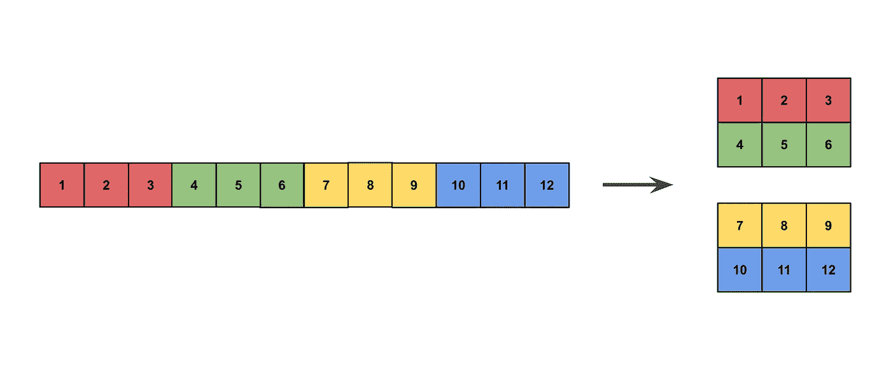***

***输入项大小: **1 字节** |输入步数:( **1** ，)***

*****回答*****

```
***strides = (**6**,**3**,**1**)
  shape = (**2**,**2**,**3**)***
```

> ****💡* ***解说******
> 
> ****输出的盒内从左到右维度(axis=* `-1` *):
> 输出中的相邻元素(例如 1 → 2，5 → 6，7 → 8，10 → 11)原本是输入中的* ***1*** *字节(=1 个元素之外* × *1* *字节)。这个尺寸的形状是****3****。****
> 
> ****输出的盒内上下维度(axis=* `-2` *):
> 输出中的相邻元素(如 1 → 4，2 → 5，8 → 11)原本是输入中的****3****字节(=3 个元素之外的* × *1* *字节)。这个尺寸的形状是****2****。****
> 
> ****输出的左框到右框尺寸(axis=* `-3` *):
> 输出中相邻的元素(如 1 → 7，2 → 8，3 → 9)原来是输入中的* ***6*** *字节(=6 个元素之外的* × *1* *字节)。这个维度的形状是* ***2*** *。****

*****代码*****

```
***>>> x = np.asarray(range(1,13), np.int8)
>>> as_strided(x, shape=(2,2,3), strides=(6,3,1))
array([[[ 1,  2,  3],
        [ 4,  5,  6]],
       [[ 7,  8,  9],
        [10, 11, 12]]], dtype=int8)***
```

***与…类似***

```
***>>> x.reshape(2,2,3)
array([[[ 1,  2,  3],
        [ 4,  5,  6]],
       [[ 7,  8,  9],
        [10, 11, 12]]], dtype=int8)***
```

# ***4D 演习***

## ***23)载玻片 2D 感受野进行卷积***

***改编自 StackOverflow 在 2D 卷积上的一篇帖子。***

******

***输入项大小: **1 字节** |输入步数:( **5** ， **1** )***

*****回答*****

```
***strides = (**10**,**2**,**5**,**1**)
  shape = ( **2**,**2**,**3**,**3**)***
```

> ****💡* ***解说******
> 
> ****输出的盒内从左到右尺寸(axis=* `-1` *):
> 输出中的相邻元素(例如 1 → 2，17 → 18，24 → 25)原本是输入中的* ***1*** *字节(=1 个元素之外* × *1* *字节)。这个尺寸的形状是* ***3*** *。****
> 
> ****输出的盒内上下维度(axis=* `-2` *):
> 输出中相邻的元素(如 1 → 6，2 → 7，3 → 8)原本在输入中相隔* ***5*** *字节(=5 个元素之外* × *1* *字节)。这个维度的形状是* ***3*** *。****
> 
> ****输出的左框到右框尺寸(axis=* `-3` *):
> 输出中相邻的元素(例如 1 → 3，6 → 8，21 → 23，23 → 25)在输入中原本是* ***2*** *字节(=2 个元素之外* × *1* *字节)。这个维度的形状是****2****。****
> 
> ****输出的顶框到底框尺寸(axis=* `-4` *):
> 输出中的相邻元素(如 1 → 11，2 → 12，15 → 25)原本是输入中的****10****字节(=10 个元素之外的* × *1* *字节)。该尺寸的形状为* **2** *。****

*****代码*****

```
***>>> x = np.asarray(range(1,26), np.int8).reshape(5,5)
>>> as_strided(x, shape=(2,2,3,3), strides=(10,2,5,1))
array([[[[ 1,  2,  3],
         [ 6,  7,  8],
         [11, 12, 13]],
        [[ 3,  4,  5],
         [ 8,  9, 10],
         [13, 14, 15]]],
       [[[11, 12, 13],
         [16, 17, 18],
         [21, 22, 23]],
        [[13, 14, 15],
         [18, 19, 20],
         [23, 24, 25]]]], dtype=int8)***
```

***与…类似***

```
***>>> # this may not be achieved concisely***
```

## ***24)重复 3D 张量***

***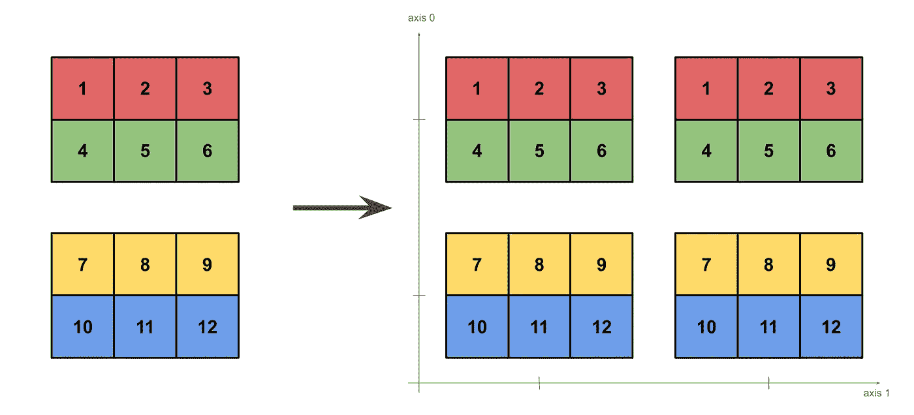***

***输入项大小: **8 字节** |输入步数:( **48** 、 **24** 、 **8** )***

*****回答*****

```
***strides = (**48**, **0**,**24**, **8**)
  shape = ( **2**, **2**, **2**, **3**)***
```

> ****💡* ***解释******
> 
> ****输出的盒内从左到右维度(axis=* `-1` *):
> 输出中相邻的元素(如 1 → 2，2 → 3，4 → 5)原本在输入中是* ***8*** *字节(=1 个元素之外* × *8* *字节)。这个尺寸的形状是* ***3*** *。****
> 
> ****输出的盒内上下维度(axis=* `-2` *):
> 输出中的相邻元素(如 1 → 4，7 → 10，8 → 11)原本是输入中的* ***24*** *字节(=3 个元素之外* × *8* *字节)。这个维度的形状是* ***2*** *。****
> 
> ****输出的左框到右框尺寸(axis=* `-3` *):
> 输出中相邻的元素(如 1 → 1，10 → 10，12 → 12)原来在输入中是* ***0*** *字节(=0 个元素之外* × *8* *字节)。这个维度的形状是* ***2*** *。****
> 
> ****输出的顶框到底框尺寸(axis=* `-4` *):
> 输出中的相邻元素(例如 1 → 7，2 → 8，3 → 9)最初在输入中是* ***48*** *字节(=6 个元素之外* × *8* *字节)。这个维度的形状是****2****。****

*****代码*****

```
***>>> x = np.asarray(range(1,13), np.int64).reshape(2,2,3)
>>> as_strided(x, shape=(2,2,2,3), strides=(48,0,24,8))
array([[[[ 1,  2,  3],
         [ 4,  5,  6]],
        [[ 1,  2,  3],
         [ 4,  5,  6]]],
       [[[ 7,  8,  9],
         [10, 11, 12]],
        [[ 7,  8,  9],
         [10, 11, 12]]]])***
```

***与…类似***

```
***>>> np.broadcast_to(x,(2,2,2,3)).swapaxes(0,1)
array([[[[ 1,  2,  3],
         [ 4,  5,  6]],
        [[ 1,  2,  3],
         [ 4,  5,  6]]],
       [[[ 7,  8,  9],
         [10, 11, 12]],
        [[ 7,  8,  9],
         [10, 11, 12]]]])***
```

## ***25)将 1D 阵列重塑为 4D 阵列***

***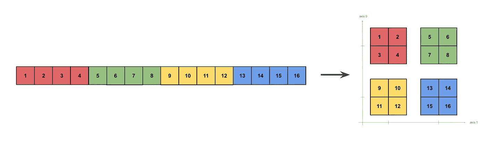***

***输入项大小: **8 字节** |输入步数:( **8** ，)***

*****回答*****

```
***strides = (**64**,**32**,**16**, **8**)
  shape = ( **2**, **2**, **2**, **2**)***
```

> ****💡* ***解释******
> 
> ****输出的盒内从左到右维度(axis=* `-1` *):
> 输出中相邻的元素(如 1 → 2，2 → 3，4 → 5)原本在输入中相隔* ***8*** *字节(=1 个元素之外* × *8* *字节)。这个尺寸的形状是* ***2*** *。****
> 
> ****输出的盒内上下维度(axis=* `-2` *):
> 输出中的相邻元素(如 1 → 4，7 → 10，8 → 11)原本是输入中的* ***16*** *字节(=2 个元素之外* × *8* *字节)。这个尺寸的形状是* ***2*** *。****
> 
> ****输出的左框到右框尺寸(axis=* `-3` *):
> 输出中的相邻元素(例如 1 → 1，10 → 10，12 → 12)原本是输入中的* ***32*** *字节(=4 个元素之外* × *8* 字节)。这个尺寸的形状是 ***2*** *。****
> 
> ****输出的顶框到底框尺寸(axis=* `-4` *):
> 输出中的相邻元素(如 1 → 7，2 → 8，3 → 9)原本是输入中的* ***64*** *字节(=8 个元素之外的* × *8* *字节)。这个维度的形状是* ***2*** *。****

*****代码*****

```
***>>> x = np.asarray(range(1,17), np.int64)
>>> as_strided(x, shape=(2,2,2,2), strides=(64,32,16,8))
array([[[[ 1,  2],
         [ 3,  4]],
        [[ 5,  6],
         [ 7,  8]]],
       [[[ 9, 10],
         [11, 12]],
        [[13, 14],
         [15, 16]]]])***
```

***与…类似***

```
***>>> x.reshape(2,2,2,2)
array([[[[ 1,  2],
         [ 3,  4]],
        [[ 5,  6],
         [ 7,  8]]],
       [[[ 9, 10],
         [11, 12]],
        [[13, 14],
         [15, 16]]]])***
```

***⚠️:虽然 stride 技巧可以让您对生成的 NumPy 视图进行更多的控制，但是该 API**不是内存安全的**——如果您错误地计算了 itemsize(老实说，我认为该 API 不应该允许客户端代码处理项目大小，因为我没有看到公开这一点的任何好处)或形状或现有的 strides，那么事情会变得非常糟糕，返回的数据实际上不是您创建的初始数组，而是来自您可能在几行之前定义的另一个数组😱。这被称为[缓冲区溢出](https://en.wikipedia.org/wiki/Buffer_overflow)，使用 stride tricks API 不难遇到这种情况。更糟糕的是当你决定*写*这个数据时😱😱。正是因为这个原因， [stride tricks 文档](https://numpy.org/doc/stable/reference/generated/numpy.lib.stride_tricks.as_strided.html)提醒用户在使用时要格外小心。***

***理解 stride tricks API 很有挑战性，我在这方面有问题。然而，诀窍(没有双关语)是从更小的维度开始，并且*可视化*张量的输出。玩得开心！***

****发现错误？请在评论中告诉我！:)大喊到*[*David Chong*](https://medium.com/u/f392dd76f846?source=post_page-----923a9393ab20--------------------------------)*对这篇文章进行点评。****

****如果你喜欢我的内容并且还没有订阅 Medium，请通过我的推荐链接* [*这里*](https://medium.com/@remykarem/membership) *订阅！注意:你的会员费的一部分将作为介绍费分配给我。****

# ***资源***

***[N 维数组(ndarray)](https://numpy.org/doc/stable/reference/arrays.ndarray.html)(numpy.org)***

***先进数字(scipy-lectures.org)***

***形状和步幅的图解指南(ajcr.net)***

***[使用 NumPy 的 stride 技巧](https://ipython-books.github.io/46-using-stride-tricks-with-numpy/) (ipython-books.github.io)***

***[1][https://stack overflow . com/questions/40084931/taking-sub arrays-from-numpy-array-with-given-stride-stepsize](https://stackoverflow.com/questions/40084931/taking-subarrays-from-numpy-array-with-given-stride-stepsize)***

***[2][https://stack overflow . com/questions/4923617/efficient-numpy-2d-array-construction-from-1d-array](https://stackoverflow.com/questions/4923617/efficient-numpy-2d-array-construction-from-1d-array)***

***[3][https://stack overflow . com/questions/47483579/how-to-use-numpy-as-strided-from-NP-stride-tricks-correctly](https://stackoverflow.com/questions/47483579/how-to-use-numpy-as-strided-from-np-stride-tricks-correctly)***

***[4][https://stack overflow . com/questions/15722324/sliding-window-of-m-by-n-shape-numpy-ndarray](https://stackoverflow.com/questions/15722324/sliding-window-of-m-by-n-shape-numpy-ndarray)***

***[5][https://stack overflow . com/questions/23695851/python-repeating-numpy-array-without-replication-data](https://stackoverflow.com/questions/23695851/python-repeating-numpy-array-without-replicating-data)***

***[https://mentat.za.net/numpy/numpy_advanced_slides/](https://mentat.za.net/numpy/numpy_advanced_slides/)***

***[7][https://stack overflow . com/questions/43086557/convolve2d-just-by-using-numpy](https://stackoverflow.com/questions/43086557/convolve2d-just-by-using-numpy)***