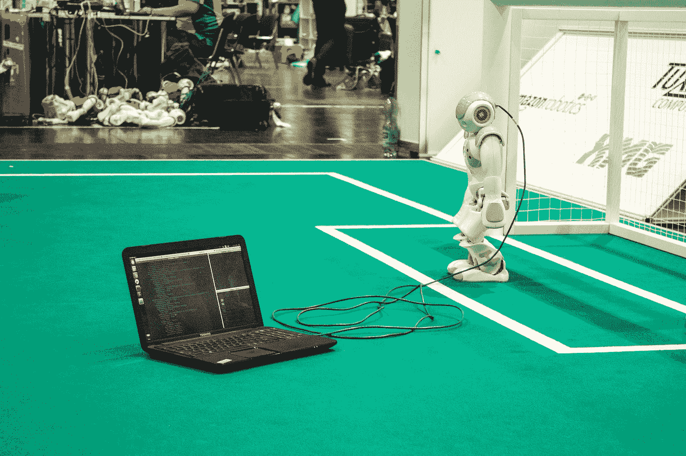
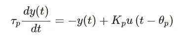
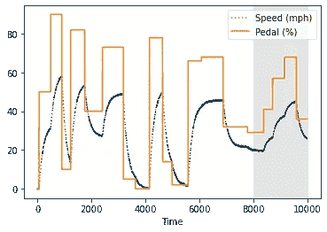
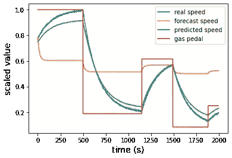
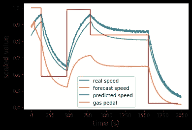
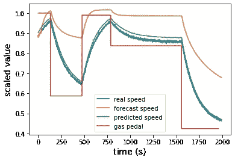
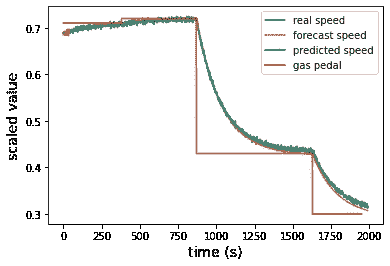
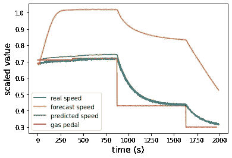

# 用于调整神经网络中超参数的 Hyperopt 高级选项

> 原文：<https://towardsdatascience.com/advanced-options-with-hyperopt-for-tuning-hyperparameters-in-neural-networks-d108cf7655d9?source=collection_archive---------8----------------------->

## [理解大数据](https://towardsdatascience.com/tagged/making-sense-of-big-data)



[C M](https://unsplash.com/@ubahnverleih?utm_source=medium&utm_medium=referral) 在 [Unsplash](https://unsplash.com?utm_source=medium&utm_medium=referral) 上拍照

如果你和我一样，你花了几个月的时间研究机器学习的应用，并想知道如何从模型中获得更好的性能。我会花上几个小时，甚至几天的时间，对模型进行细微的调整，希望能有更好的性能。我想，当然应该有比手动检查几十个超参数组合更好的方法来改进模型。

这时我看到了这篇关于 Python 包 Hyperopt 的[优秀文章](/an-introductory-example-of-bayesian-optimization-in-python-with-hyperopt-aae40fff4ff0)，它使用贝叶斯优化模型来确定机器学习模型的最佳超参数。在尝试将模型与数据相匹配时，随机猜测和耗时的反复试验的日子已经一去不复返了！使用贝叶斯优化来优化您的模型还有一个好处，那就是，虽然理解超参数控制什么很重要，但您不必成为使用模型的专家。相反，您可以尝试一种您以前从未使用过的全新类型的模型，通过一些简单的代码，您可以获得一些很好的结果。

在我们深入讨论一些例子之前，我想提一下其他几个包，它们实现了相似的目标，但是使用了不同的方法。Scikit-learn 有一个 [RandomizedSearchCV](https://scikit-learn.org/stable/modules/generated/sklearn.model_selection.RandomizedSearchCV.html) 和 [GridSearchCV](https://scikit-learn.org/stable/modules/generated/sklearn.model_selection.GridSearchCV.html) 方法，用于搜索超参数空间。如果您正在使用 Keras， [Hyperas](https://maxpumperla.com/hyperas/) 也为超参数优化提供了一个很好的包装器(然而，如果您试图做一些更高级的应用，您可能会遇到一些限制)。网格搜索和随机搜索选项要详尽得多，因此也更耗时，但优点是您不会陷入局部最小值的风险，而这在使用贝叶斯方法时是有可能的。缺点是你的搜索可能会花更多的时间去尝试无效的超参数。

# 问题表述和数据生成

对于我们的数据，我们将生成一些一阶加死区(FOPDT)模型数据。FOPDT 模型是强大而直接的模型，通常在工业中用于初步结果。它们是一种描述对变化的刺激做出反应时会发生什么的方式。例如，我们可以根据你踩油门的程度来模拟汽车的速度是如何变化的。



在上面的等式中，y(t)是输出变量，u(t)是输入变量，Kₚ、τₚ和θₚ是确定输出相对于输入的行为的过程常数。具体来说，想想你汽车上的油门踏板。你可以把踏板踩下一个给定的量(输入变量，或 u(t)，是踏板被踩下的百分比)，汽车的速度(输出变量，或 y(t))会相应增加。Kₚ描述了与你踩下踏板的程度相比，速度变化的程度；τₚ表示速度将增加多快(通常报告为汽车的加速度)；θₚ是死时间变量，并考虑了踩下油门踏板和速度实际开始变化之间的任何延迟。

用 Python 模拟 FOPDT 模型实际上非常简单。我们从一个函数开始，重新排列 FOPDT 方程以求解导数 dy/dt:

```
def fopdt(y,t,um,Km,taum):
    # arguments
    #  y      = output
    #  t      = time
    #  uf     = input linear function (for time shift)
    #  Km     = model gain
    #  taum   = model time constant
    # calculate derivative
    dydt = (-(y-yp0) + Km * (um-u0))/taum
    return dydt
```

一旦有了这个，我们就可以创建另一个函数来模拟对我们传递的任何输入的一阶响应。其中最关键的部分是使用来自`scipy`的`odeint`。

```
def sim_model(Km,taum):
    # array for model values
    ym = np.zeros(ns)
    # initial condition
    ym[0] = yp0
    # loop through time steps    
    for i in range(0,ns-1):
        ts = [t[i],t[i+1]]
        y1 = odeint(fopdt,ym[i],ts,args=(u[i],Km,taum))
        ym[i+1] = y1[-1]
    return ym
```

有了这些函数，我们就可以设置我们的模拟了。我们首先指定我们需要多少数据点，以及模型参数(您可以随意更改这些参数以查看不同的模型响应——也许您想要通过模拟快速加速来模拟赛车，或者通过增加增益来模拟更高的最大速度，或者 Kₚ).

```
# Parameters and time for FOPDT model
ns = 10000
t = np.linspace(0,ns-1,ns)
u = np.zeros(ns)# Additional FOPDT parameters
yp0 = 0.0
u0 = u[0]
Km = 0.67
taum = 160.0
```

我们现在将生成一些步长数据，我选择通过在 0 到 100 之间随机更改输入值(u 或油门%)来生成这些数据，并在 5 到 15 分钟的时间内保持该值。这使我们能够看到各种稳态和瞬态数据。

```
# Generate step data for u
end = 60 # leave 1st minute of u as 0
while end <= ns:
    start = end
    end += random.randint(300,900) # keep new Q1s value for anywhere                        
                                     from 5 to 15 minutes
    u[start:end] = random.randint(0,100)
```

现在，我们可以简单地调用前面的`sim_model`函数，我们将得到对刚刚生成的输入数据的一阶响应。

```
# Simulate FOPDT model
y = sim_model(Km,taum)
```

现在，这些数据看起来很漂亮，但并没有反映现实。我们的传感器中总会有一些噪声，因此为了获得更真实的数据，我们将生成一些人工噪声，并将其添加到模拟数据中。您还可以在自己的代码中更改噪声量，看看它如何改变最终结果。

```
# Add Gaussian noise
noise = np.random.normal(0,0.2,ns)
y += noise
```

最后，我们将继续将所有数据放在一起，并为我们的神经网络模型做一些预处理。在这一点上，它确实是直接的数据，但是当数据被缩放时，我们的模型将执行得更好。感谢 scikit-learn 的`MinMaxScaler`,这很简单:

```
# Scale data
data = np.vstack((u,y)).T
s = MinMaxScaler(feature_range=(0,1))
data_s = s.fit_transform(data)
```

现在我们有了一些 FOPDT 模型数据。我们先快速浏览一下，看看它是什么样子，然后再讨论我们想用它做什么机器学习应用。



由作者策划。

灰色表示我们将留待最终测试的数据。橙色线(踏板%)是输入，我们在代码中称之为`u`。蓝线(速度，带有人为添加的噪声)是过程变量(PV)或输出数据，我们用`y`表示。所以你可以看到，当我们踩下油门踏板时，速度逐渐上升，直到达到稳定状态，当我们把脚从油门上拿开时，速度下降。

那么现在，我们想用这些数据做什么呢？我们想创建一个模拟类似行为的机器学习模型，然后使用 Hyperopt 来获得最佳的超参数。如果你看看我的关于用 LSTM 神经网络仿真 PID 控制器的[系列，你会发现 LSTMs 在处理这类问题时表现得非常好。我们想要做的是训练一个 LSTM 模型，它将遵循 FOPDT 模型的行为。](https://towardsdatascience.com/tagged/lstm-control-emulation)

# 模型结构

Keras 是构建神经网络的优秀平台。我们可以保持这个非常基本的，做一些像下面这样的事情:

```
# Keras LSTM model
model = Sequential()

model.add(LSTM(units = 50, 
                input_shape = (Xtrain.shape[1],Xtrain.shape[2])
               )
          )
model.add(Dropout(rate = 0.1))
model.add(Dense(1))
model.compile(optimizer='adam', loss='mean_squared_error')

es = EarlyStopping(monitor='val_loss',mode='min',verbose=1,patience=15)result = model.fit(Xtrain, ytrain, verbose=0, validation_split=0.1,
                       batch_size=100,
                       epochs=200)
```

在上面的代码中，我们从 LSTM 层开始，指定`units`超参数，以及输入形状。我们添加了一个 Dropout 层，这有助于避免过度拟合数据，然后添加了一个 Dense 层，这是模型输出结果所需要的。然后，我们使用`adam`优化器和`mean_squared_error`损失指标编译模型，添加一行代码以在损失达到稳定水平时停止训练模型，然后拟合模型。很简单…直到我们看到它实际上是如何工作的:



作者的情节

上面的图显示了我们模拟的实际速度和油门踏板，以及预测和预报的速度。*预测速度*在将实际测量值输入模型的基础上进行预测，而*预测速度*采用之前的预测速度并将它们输入模型——因此导致了如此大的漂移以及无法从漂移中恢复。正如你所看到的，这个模型很难令人满意。好消息是我们有一些选择来改善它。我们可以生成更多的数据，或者让它训练更多的时期(或者更少，取决于我们是否过拟合或欠拟合)。当然值得检查一下。但是另一个选择是调整超参数，或者通过试错法，更深入地理解模型结构…或者 Hyperopt 包。

# 具有远视的模型结构

这篇文章的目的不是介绍远视，而是旨在扩展你想用远视做什么。查看上面的 Keras 代码块，我们可以挑选出几个超参数进行优化，例如 LSTM 层中的`units`，漏失层中的`rate`，以及拟合时的`batch_size`。寻找这些的最佳值将在介绍性远视教程中介绍。然而，我们可能会发现添加一些额外的 LSTM 和漏失层是有用的，甚至可以查看一个更优化的数据点窗口来馈入 LSTM。我们甚至会发现改变我们试图最小化的目标函数是有益的。

现在，使用远视对初学者是非常有益的，但它确实有助于了解每个超参数的用途和一个良好的范围。我们首先定义要搜索的值的范围。同样，这一步的语法在任何介绍性的远视教程中都有涉及，所以我的目的是展示一些细微差别。代码如下:

```
from hyperopt.pyll.base import scope 
#quniform returns float, some parameters require int; use this to force intspace = {'rate'       : hp.uniform('rate',0.01,0.5),
         'units'      : scope.int(hp.quniform('units',10,100,5)),
         'batch_size' :     
                    scope.int(hp.quniform('batch_size',100,250,25)),
         'layers'     : scope.int(hp.quniform('layers',1,6,1)),
         'window'     : scope.int(hp.quniform('window',10,50,5))
        }
```

大多数时候，你可以使用常规选项来选择`hp.uniform`、`hp.choice`、`hp.logchoice`等。然而，`hp.quniform`选项返回一个浮点数，即使它是一个整数，如 1.0 或 5.0。一些 Keras 超参数要求这是一个整数类型，所以我们通过包含`scope.int`来强制 Hyperopt 返回一个整数。

为了构建我们的模型，我们将所有内容都放在一个函数中，将可能的参数作为自变量:

```
def f_nn(params):
    # Generate data with given window
    Xtrain, ytrain, Xtest, ytest = 
                    format_data(window=params['window'])

    # Keras LSTM model
    model = Sequential()

    if params['layers'] == 1:
        model.add(LSTM(units=params['units'], 
                     input_shape=(Xtrain.shape[1],Xtrain.shape[2])))
        model.add(Dropout(rate=params['rate']))
    else:
        # First layer specifies input_shape and returns sequences
        model.add(LSTM(units=params['units'], 
                     return_sequences=True, 
                     input_shape=(Xtrain.shape[1],Xtrain.shape[2])))
        model.add(Dropout(rate=params['rate']))

        # Middle layers return sequences
        for i in range(params['layers']-2):
            model.add(LSTM(units=params['units'],
                           return_sequences=True))
            model.add(Dropout(rate=params['rate']))

        # Last layer doesn't return anything
        model.add(LSTM(units=params['units']))
        model.add(Dropout(rate=params['rate'])) model.add(Dense(1))
    model.compile(optimizer='adam', loss='mean_squared_error')

    es = EarlyStopping(monitor='val_loss',mode='min',
                       verbose=1,patience=15) result = model.fit(Xtrain, ytrain, 
                       verbose=0, 
                       validation_split=0.1,
                       batch_size=params['batch_size'],
                       epochs=200)

    # Get the lowest validation loss of the training epochs
    validation_loss = np.amin(result.history['val_loss']) 
    print('Best validation loss of epoch:', validation_loss)

    return {'loss': validation_loss, 
            'status': STATUS_OK, 
            'model': model, 
            'params': params}
```

您会注意到函数中的第一行将数据格式化为 Xtrain、ytrain、Xtest 和 ytest。这将我们的 X 和 y 数据格式化为 LSTM 要求的格式，重要的是*根据我们之前为`window`指定的范围调整输入点的窗口*。然后我们开始我们的 Keras 模型。它有和以前一样的元素，但是您会注意到，我们没有为一个超参数指定一个数值，比如`rate`，而是通过将它设置为`rate = params['rate']`来允许它在我们指定的范围内。我们还添加了一些逻辑，以支持多个 LSTM 和漏失层。最后，我们像以前一样编译和拟合模型，然后我们需要一个目标函数来最小化。首先，我们只需将验证损失作为我们的目标函数，这在大多数情况下就足够了(我们将在一分钟内探索一个可能需要其他东西的实例)。最后一步是返回我们稍后可能要在代码中使用的信息，比如目标函数的损失、Keras 模型和超参数值。

# 模型超参数优化

要运行实际的优化，请为一些长时间的运行做好准备。训练 LSTM 总是需要一点时间，我们正在做的是用不同的超参数集训练它几次。下一部分花了大约 12 个小时在我的个人电脑上运行。你可以通过使用 [Google Colab 的 GPU 资源](https://medium.com/deep-learning-turkey/google-colab-free-gpu-tutorial-e113627b9f5d)来显著加快这个过程。

您需要的实际代码很简单。我们设置了`trials`变量，这样我们就可以从优化中检索数据，然后使用`fmin()`函数来实际运行优化。我们传递之前提供的`f_nn`函数，包含超参数值范围的`space`，将`algo`定义为`tpe.suggest`，将`max_evals`指定为我们想要尝试的组数。通过更多的尝试，我们更有可能得到最优解，但是等待更多时间也有不好的一面。对于像快速训练数据的分类器这样的东西，很容易在几秒钟内获得数百次评估，但对于 LSTM，这里指定的 50 次评估需要几个小时。

```
trials = Trials()
best = fmin(f_nn, 
            space, 
            algo=tpe.suggest,
            max_evals=50,
            trials=trials)
```

运行之后，您可以查看一些结果。我使用一点列表理解来访问存储在`trials`中的数据。我们可以看到我们在最初的`f_nn`函数中返回的所有内容，包括`loss`、`model`和`params`。我们的最佳模型和参数集将与最低损失相关联，而最差的模型和参数集将具有最高损失。让我们继续把它们保存为变量，这样我们就可以画出结果。

```
best_model = trials.results[np.argmin([r['loss'] for r in 
    trials.results])]['model']best_params = trials.results[np.argmin([r['loss'] for r in 
    trials.results])]['params']worst_model = trials.results[np.argmax([r['loss'] for r in 
    trials.results])]['model']worst_params = trials.results[np.argmax([r['loss'] for r in 
    trials.results])]['params']
```

# 结果

现在我们已经运行了优化并保存了模型(为了更好地度量超参数集)，是时候看看模型看起来如何了。我们将研究两种不同的方法。第一种方法包括采用实际输入数据点(踏板%)的前一个窗口，并使用它来预测下一个输出(速度)。我们称之为“预测”这可以通过获取我们的测试数据并应用`model.predict()`函数很容易地找到。看起来是这样的:

```
# Best window
best_window = best_params['window']# Format data
Xtrain, ytrain, Xtest, ytest = format_data(window=best_window)Yp = best_model.predict(Xtest)
```

不过，我们还想看看另一个方面。假设我们试图在没有即时反馈的情况下预测速度的走向。我们使用 LSTM 预测来进行下一次预测，而不是采用实际的数据值。这是一个更加困难的问题，因为如果 LSTM 预测只是稍微有一点偏差，这个误差就会随着时间的推移而增加。我们将这种方法称为“预测”，表示我们正在使用 LSTM 预测来更新输入值并对某个时间范围进行预测。我把它放入一个函数`forecast()`:

```
def forecast(Xtest,ytest,model,window):
    Yf = ytest.copy()
    for i in range(len(Yf)):
        if i < window:
            pass
        else:
            Xu = Xtest[i,:,0]
            Xy = Yf[i-window:i]
            Xf = np.vstack((Xu,Xy)).T
            Xf = np.reshape(Xf, (1, Xf.shape[0], Xf.shape[1])) 
            Yf[i] = model.predict(Xf)[0] 

    return Yf
```

让我们看看这个是什么样子的:



作者的情节

好吧，其实也没那么糟。这其实是在用最坏的模型和超参数集。查看我们在 50 次迭代后得出的最佳集合如下所示:



作者的情节

“预测”相当接近，而“预报”要好得多。如果我们让它尝试更多的优化，我们可能会从预测中获得更好的结果。但是我们能在预测上做得更好吗？

# 改变目标函数

这就是目标函数发挥作用的地方。你可以非常聪明地使用你正在最小化的目标函数来考虑你想要看到更好结果的所有类型的情况。例如，如果我们还想考虑模型训练需要多长时间呢？我们可以改变我们的`loss`分数，加入一个时间因素——比如乘以花费的时间，这样快速的训练时间就会得到奖励。

在我们的例子中，我们想要奖励具有良好预测的模型。这实际上很简单，因为我们已经有了`forecast()`函数。像以前一样设置好我们的`f_nn()`函数后，我们可以再添加几行来改变我们的目标函数。回想一下，之前，我们简单地将`loss`设置为`validation_loss`值。现在，我们实际上在我们的`f_nn`模型中运行预测，如下所示:

```
# Get validation set
val_length = int(0.2*len(ytest))
Xval, yval = Xtrain[-val_length:], ytrain[-val_length:]# Evaluate forecast
Yr, Yp, Yf = forecast(Xval,yval,model,params['window'])
mse = np.mean((Yr - Yf)**2)
```

注意，我们必须分离出我们的验证集——我们不能使用我们的测试集，因为那会使结果有偏差。然后，我们简单地计算预测值和实际值之间的均方误差(`mse`)。然后将它保存为`return`行中的损失函数，如下所示:

```
return {'loss': mse, 
        'status': STATUS_OK, 
        'model': model, 
        'params': params}
```

这就是全部了。再次运行后，我们得到以下结果:



作者的情节

我们也可以看看最坏的结果，只是为了证明远视确实为我们做了一些事情:



作者的情节

使用最好的模型看起来棒极了！正如我们所讨论的，预测对小错误非常敏感，所以考虑到我们预测的时间范围，这看起来真的令人印象深刻。我们期望看到漂移在更长的时间内变得更加明显，但是使用更新的目标函数是一个重大的改进。我们还可以对 50 次以上的评估进行优化，我们可能会得到更好的结果。

# 最后的想法

这些只是几个例子，说明如何利用 Hyperopt 从机器学习模型中获得更高的性能。虽然这里使用的确切方法可能不会用在你的特殊情况下，但我希望一些想法被激发出来，你可以看到远视的更多潜在用途。我已经在我的 [Github repo](https://github.com/nrlewis929/advanced_hyperopt_FOPDT) 上包含了不同模拟的代码。

你还能怎么做？如果您想找到最省时、最准确的模型，可以很容易地在目标函数中添加时间元素。这里的原则很容易应用于任何其他具有超参数的机器学习模型，并且您可能会发现在分类器上使用它要快得多。最后，你可以通过使用 GPU 来显著加快这个过程——如果你的电脑没有 GPU 的话， [Google Colab](https://medium.com/deep-learning-turkey/google-colab-free-gpu-tutorial-e113627b9f5d) 是一个很好的资源。让我知道你的想法，并随时在 [LinkedIn](https://www.linkedin.com/in/nicholas-lewis-0366146b/) 上与我联系。