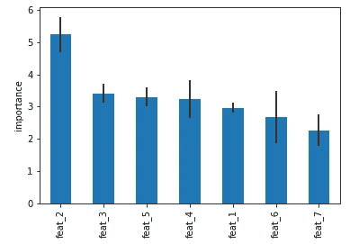
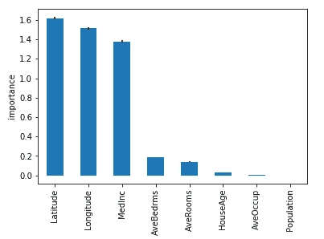
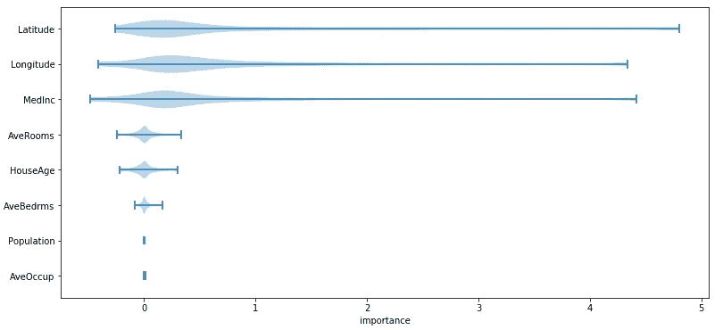
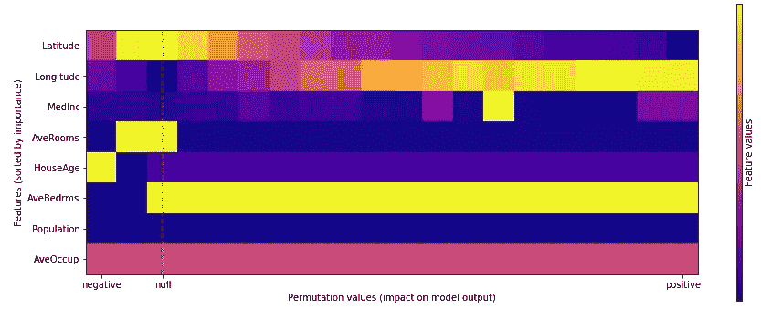
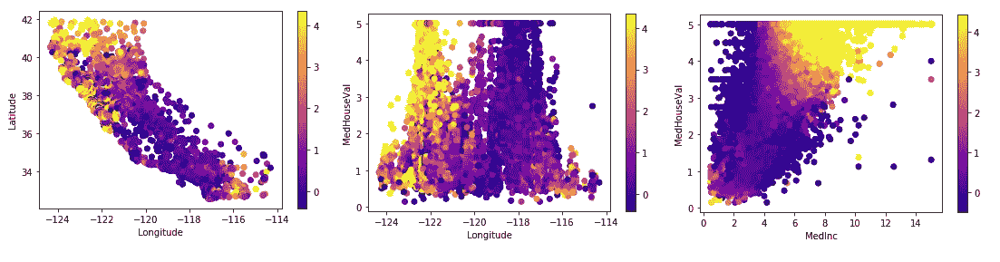
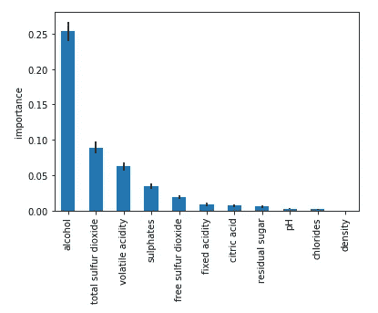
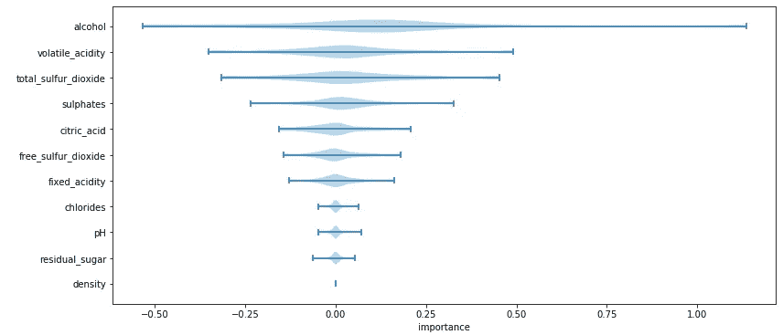
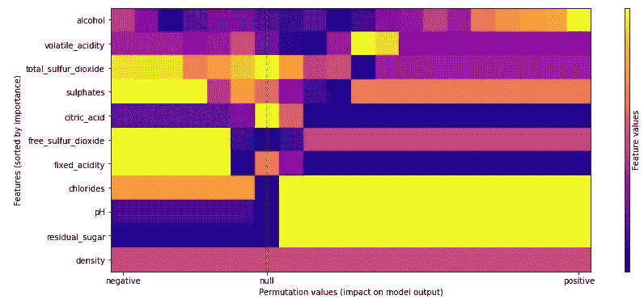
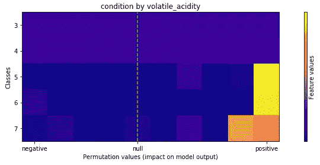

# 高级排列对解释预测的重要性

> 原文：<https://towardsdatascience.com/advanced-permutation-importance-to-explain-predictions-ead7de26eed4?source=collection_archive---------19----------------------->

## 保持简单性，将可解释性带到下一个层次

哈维·卡夫雷拉在 [Unsplash](https://unsplash.com?utm_source=medium&utm_medium=referral) 上的照片

机器学习的可解释性是一个活跃的研究领域，涉及所有有助于提供更多信息预测的技术。预测模型被认为是黑盒工具，只是为了最大化性能而优化。准确性很重要，但在大多数商业案例中，考察为什么机器学习模型会做出一个决定是至关重要的。

因此，一个好的权衡包括提供良好的性能和一个检验预测的工具。我们感兴趣的是显示某些特征对预测值有多大影响的框架。实际上，我们是在我们的模型上做推理，遵循一些启发法，然后我们试图把所有的信息放入一个表中，或者更好地放入一个令人敬畏的图中。

当我们试图解释任何机器学习模型的输出时，我们应该考虑一个至关重要的方面。**可解释性不一定导致可解释性。如果人们没有足够的知识来理解，那么采用该领域的最新技术或制作最酷的图表可能是无用的。如果我们必须向业务部门展示结果，就会出现这种情况。过载的图表或一些复杂索引的使用，不是所有人都能理解的，使得我们的工作无法解释。**

在这篇文章中，我们提供了一些图形报告来解释机器学习模型的输出。我们利用排列重要性的简单性和适应性来提供不同的图形报告，这也可以与 SHAP 方法获得的结果进行比较。

# 排列重要性:基本用法

排列重要性是每个数据科学家都必须知道的特征重要性计算的常用程序。该技术旨在改变目标和特征之间的关系。置换意味着模型性能的下降，这表明模型对特征的依赖程度。

具体而言，排列重要性计算如下。首先，拟合一个模型，并根据一些数据计算基线指标。接下来，来自相同数据的特征被置换，并且度量被再次评估。**排列重要性被定义为排列度量和基线度量之间的差异**。对数据集中的所有列计算这些步骤，以获得所有特征的重要性。高值意味着该特征对模型很重要。在这种情况下，值的混排破坏了与目标的关系，并导致低质量的预测(高误差)。相反，低值意味着置换度量接近原始置换度量，即低预测能力。作为一般的提醒，强调排列重要性也可以假设为负值是很重要的。当我们在特征洗牌后获得更好的分数时就是这种情况。对于该特征，观察值是无用的(即，它们对预测有负面影响)。

特征评估的排列重要性示例(图片由作者提供)

在计算排列重要性时，上图非常常见。我们以降序报告了平均排列分数(通过几次排列运行获得)以及误差棒形式的相对标准偏差。大多数时候，排列重要性的用法到此为止，显示前面的条形图。这个图表太棒了，它告诉了我们很多信息，所有人都很容易理解。我们能更进一步吗？我们能利用排列重要性的简单性来为我们的预测提供更详细的解释吗？

我们现在尝试做的是为我们感兴趣的观察提供一个**排列重要性分数**。通过这种方式，我们对模型做出的决策有了更详细的了解。我们利用排列重要性的简单性来显示特征如何有助于每个样本的预测。这种分析对于每一种监督任务(回归或分类)来说都是容易实现的，并导致产生一些令人敬畏的图表。

# 排列重要性:高级用法

让我们从回归场景开始。我们正在执行一项回归任务，我们有兴趣在给定一些外部数字特征的情况下预测房价。在拟合我们选择的模型之后，我们容易地计算条形格式的排列重要性(出于演示的目的，特征重要性是在训练数据上计算的)。

回归任务中特征评估的排列重要性(图片由作者提供)

在这种情况下，重要性被计算为与均方误差的偏差。我们重复相同的方法，但不对各列的得分进行平均。我们简单地将原始预测的平方误差与置换每个样本的特征所获得的平方误差进行比较。在这种情况下，我们总结从多次重复中获得的样本分数，取中间值。按照这个过程，我们以每一列中每个观察的重要性分数结束。我们观察下面样本分数的分布。

回归任务中样本评估的排列重要性(图片由作者提供)

样本分数现在很容易访问和使用，以提供任何解释情节。例如，我们可以逐个样本地检查每个特性的影响。在下面的热图中，我们显示了每个特性对一些随机实例的预测值的影响程度。

单个样本的排列重要性(图片由作者提供)

为了获得一个更全面的视图，我们可以绘制出所需特性对整个数据的影响。例如，纬度的低值和经度的高值对预测值有很大的影响。

总结所有功能的效果(图片由作者提供)

可以在 2D 中计算相同的表示，以便也可视化特征之间或者特征和目标之间的相互作用。

样本和多个特征的排列重要性(图片由作者提供)

对于分类任务，我们操作相同的推理和图形表示。假设我们对给定一些外部数字特征来预测葡萄酒的质量感兴趣。在拟合我们选择的模型后，我们很容易计算排列的重要性。我们不能使用均方差作为排列重要性的评分函数。在这种情况下，一个有价值的替代方法是对数损失(处理多个类的分类交叉熵)。之前介绍的内容在这个场景中仍然很有价值。

分类任务中特征评估的排列重要性(图片由作者提供)

我们像以前一样检索每个样本的重要性分数。这里一些观察的负面影响比前一种情况更明显。

分类任务中样本评估的排列重要性(图片由作者提供)

同样，可以以热图格式显示每个样本和每个特征中所有样本的重要性。

总结所有功能的效果(图片由作者提供)

保持相同的可视化格式，可以显示要素对预测类的影响。

总结一个特性对所有类的影响(图片由作者提供)

例如，挥发性酸度的低值对标签 3 和 4 有很大影响，而对于标签 7、6 和 5，酸度的高值有很大影响。

# 摘要

在这篇文章中，我们介绍了排列重要性的基本概念，作为计算特性重要性的过程。然后，我们试图利用它的简单性，对其进行调整，以更好地解释我们的模型输出。结果，我们获得了有用的见解，并以图形格式显示出来，为非技术人员保留了可解释性。

[**查看我的 GITHUB 回购**](https://github.com/cerlymarco/MEDIUM_NoteBook)

保持联系: [Linkedin](https://www.linkedin.com/in/marco-cerliani-b0bba714b/)